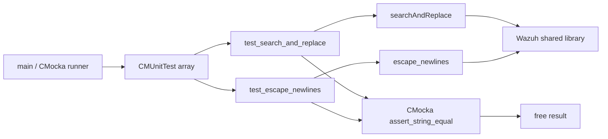
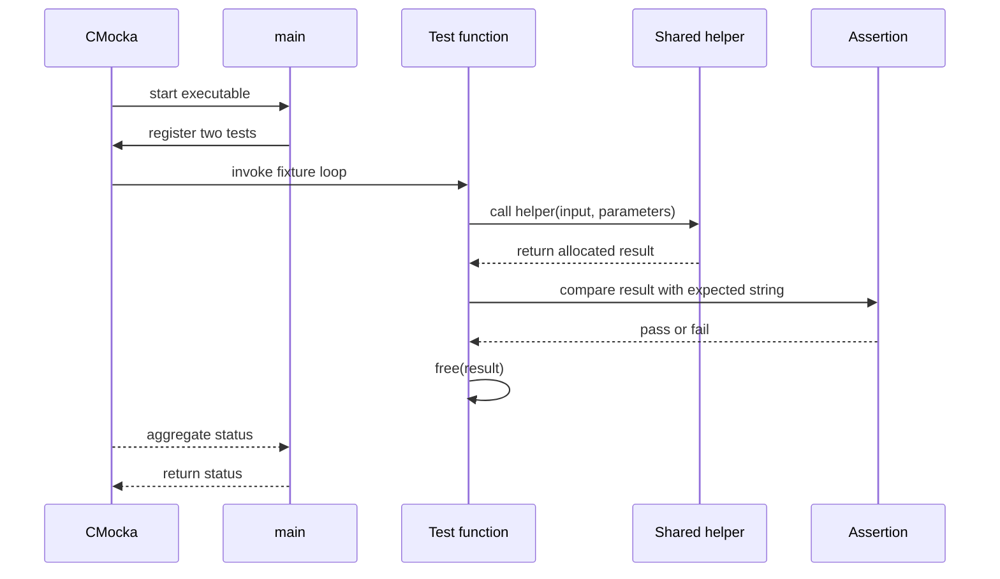
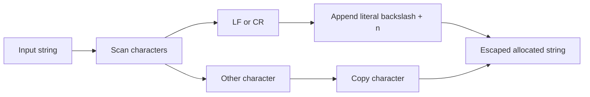
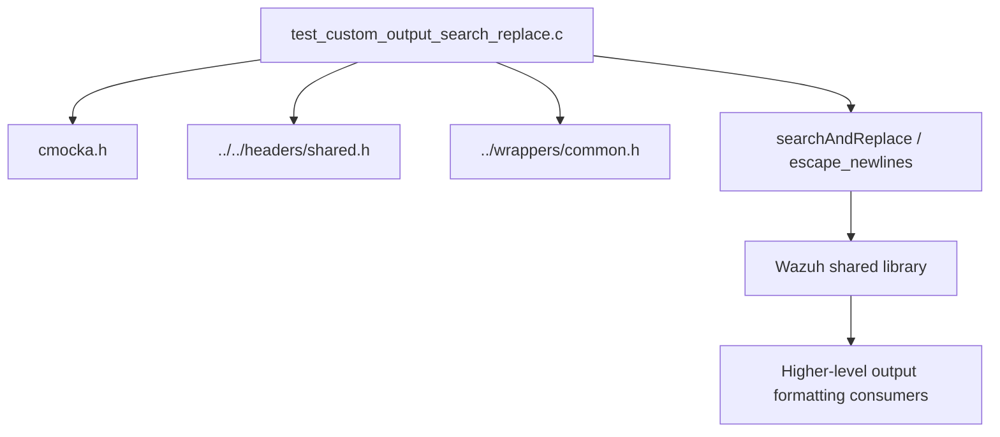

# `test_custom_output_search_replace_shared`

This module is a focused CMocka test executable for two shared string-formatting helpers: `searchAndReplace` and `escape_newlines`. It verifies replacement semantics and newline normalization through table-driven assertions, and returns CMocka's aggregate test status from `main`.

The test belongs to Wazuh's shared C support layer. Shared-library architecture and common string-validation responsibilities are documented in [shared_lib.md](shared_lib.md) and [shared_lib_string_validation.md](shared_lib_string_validation.md).

## Purpose and scope

The module validates two independent contracts:

| Area | Helper under test | Contract exercised |
| --- | --- | --- |
| Literal text replacement | `searchAndReplace` | Replace every matching occurrence of a search string, preserve unmatched text, and support mixed case and punctuation as literal content. |
| Newline escaping | `escape_newlines` | Convert line-feed and carriage-return characters to the two-character sequence `\\n`. |

This file is test code, not a runtime service. It does not expose an API endpoint, own persistent state, perform I/O, or coordinate with Wazuh daemons. Its architectural role is to protect shared-library behavior used by higher-level output and formatting code.

## Source layout

The complete module is contained in:

`src/unit_tests/shared/test_custom_output_search_replace.c`

The source has three logical parts:

- `test_search_and_replace`: iterates over replacement fixtures.
- `test_escape_newlines`: iterates over newline fixtures.
- `main`: registers both functions with CMocka and runs the test group.

The test includes Wazuh shared declarations through `../../headers/shared.h`, CMocka for assertions and registration, and `../wrappers/common.h` for the unit-test wrapper environment.

## Architecture

The module follows the standard unit-test boundary: a CMocka runner calls test functions, each test calls one production helper, and the helper returns a heap-allocated string owned by the test until it is released.



### Component responsibilities

| Component | Responsibility |
| --- | --- |
| `main` | Creates the two-entry `CMUnitTest` array and delegates execution to `cmocka_run_group_tests`. |
| `CMUnitTest` registration | Associates each test function with the CMocka framework. No setup or teardown callbacks are supplied. |
| `test_search_and_replace` | Supplies replacement input, expected output, compares returned text, and frees the result. |
| `test_escape_newlines` | Supplies newline-containing input, compares escaped output, and frees the result. |
| `shared.h` declarations | Provides the production helper declarations from the Wazuh shared layer. |
| `common.h` | Provides common unit-test wrapper definitions used by the test build. |

## Test execution flow



No fixture-level setup or teardown is configured: `cmocka_run_group_tests(tests, NULL, NULL)` passes `NULL` for both callbacks. The test functions accept CMocka's `void **state` parameter but do not use shared test state.

## `searchAndReplace` contract

`test_search_and_replace` uses a four-column fixture table:

`{ input, search, replacement, expected }`

The cases establish the following behavior:

- A missing search value leaves the input unchanged (`"nomatch"` in `"testMe"`).
- Matching is case-sensitive: `"ME"` does not match `"me"`, while `"me"` does.
- Matches can occur at the beginning, middle, or end of the input.
- Multiple occurrences are replaced, including adjacent occurrences.
- Search strings containing punctuation such as `"TeSt++"` are treated as literal text.
- Replacement text may be longer than the search text and may itself contain punctuation.

Representative transformations include:

```text
test me                         -- search "me" -> "ME"       --> test ME
TeStA B CTeStD E F              -- search "TeSt" -> "tEsT"   --> tEsTA B CtEsTD E F
TeSt++ TeSt++A B CTeSt++D E F   -- search "TeSt++" -> "tEsT" --> tEsT tEsTA B CtEsTD E F
```

The test does not specify behavior for `NULL` inputs, an empty search string, overlapping matches, or allocation failure. Those cases are outside this module's evidenced contract and should not be inferred from these tests.

```mermaid
flowchart TD
    Start[Read next replacement fixture]
    Call[searchAndReplace(input, search, replacement)]
    Compare[assert returned string equals expected]
    Release[free returned buffer]
    More{More fixtures?}
    Pass[Continue]
    End[Return to CMocka]

    Start --> Call --> Compare --> Release --> More
    More -- yes --> Pass --> Start
    More -- no --> End
```

## `escape_newlines` contract

`test_escape_newlines` uses a two-column fixture table:

`{ input, expected }`

The tested mappings are:

| Input | Expected output |
| --- | --- |
| `hello\n` | `hello\\n` |
| `hello\r` | `hello\\n` |
| `hello\r\n` | `hello\\n\\n` |
| empty string | empty string |

The carriage-return/newline case is intentionally expected to produce two escaped newline markers. This test therefore verifies character-by-character conversion rather than treating CRLF as one logical newline sequence.



## Memory ownership and failure behavior

Both test functions assume the helper returns a valid `char *` suitable for `assert_string_equal` and `free`. Each fixture result is freed immediately after its assertion, including the empty-string cases. The tests do not explicitly check for `NULL`; a `NULL` return would be handled as an assertion/runtime failure rather than as a separately documented branch.

The executable's process-level result is the value returned by `cmocka_run_group_tests`. A successful run requires both registered tests and all of their fixture assertions to pass.

## Dependencies and system placement



The module's direct dependencies are limited to the test framework, standard C headers, Wazuh shared declarations, and common unit-test wrappers. It has no direct dependency on agents, managers, databases, sockets, configuration parsers, or native daemons. Those broader relationships belong to the shared library and its consumers; see [shared_lib.md](shared_lib.md) for the shared-library overview.

## Maintenance guidance

When changing either helper, update the fixture tables here for every intentional contract change. Preserve the explicit `free(result)` calls when adding cases. New edge cases should be added only when the production API's behavior is defined—for example, `NULL` handling or empty search patterns—so the test remains a reliable specification rather than an accidental description of undefined behavior.

## References

- [Shared library](shared_lib.md)
- [Shared string and validation utilities](shared_lib_string_validation.md)
- Source: `src/unit_tests/shared/test_custom_output_search_replace.c`
