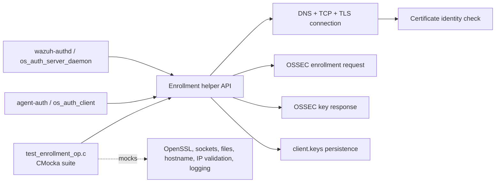
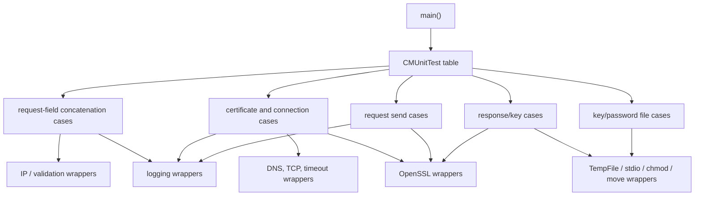
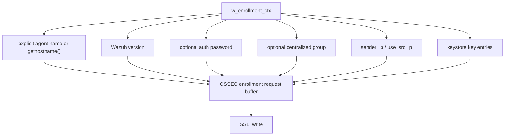
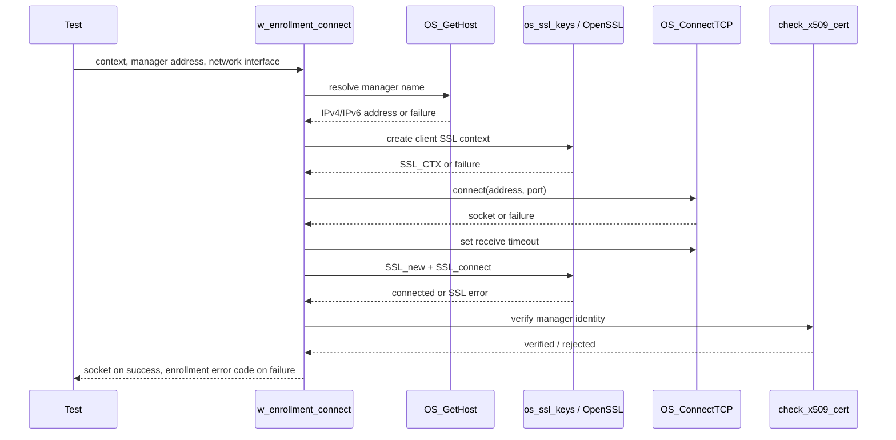
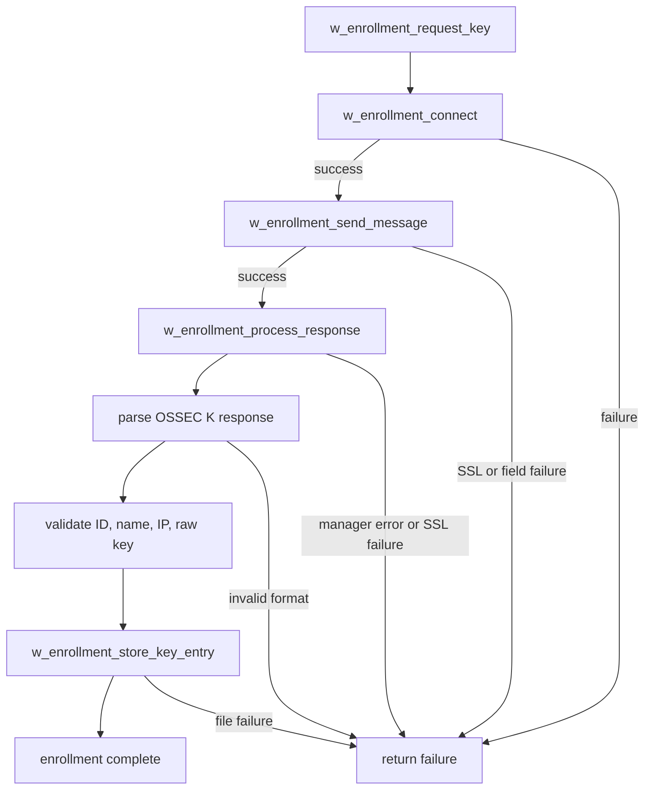
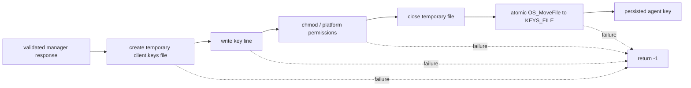
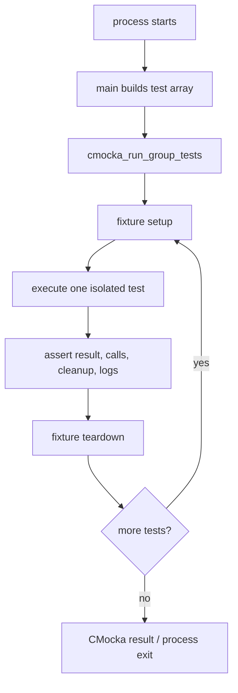
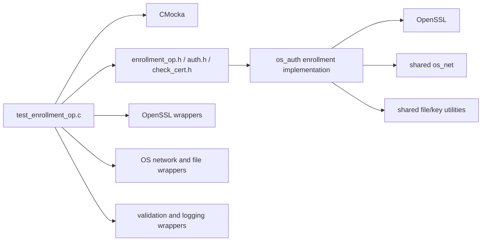

# `test_enrollment_op_shared`

`test_enrollment_op_shared` is the CMocka unit-test module for Wazuh’s native agent-enrollment client helpers. It exercises request construction, TLS connection setup, manager certificate verification, enrollment-response parsing, key persistence, hostname selection, and authentication-password loading. The test source is `src/unit_tests/shared/test_enrollment_op.c`; the production APIs are implemented by the `os_auth` enrollment and certificate components.

The suite is intentionally a boundary test: it drives real enrollment control flow while replacing sockets, OpenSSL, filesystem operations, hostname lookup, IP validation, and logging with deterministic wrappers.

## Purpose and system position

The tested helpers are used by `agent-auth` to enroll an endpoint with `wazuh-authd`. A typical operation connects to the manager over TCP/TLS, sends an `OSSEC` enrollment request, receives a generated agent key, and atomically stores it in `client.keys`.

The client/server roles and daemon lifecycle are documented in [os_auth_client.md](os_auth_client.md), [os_auth_server_daemon.md](os_auth_server_daemon.md), and [os_auth_enrollment_core.md](os_auth_enrollment_core.md). Certificate-chain and hostname validation details belong to [os_auth_ssl_certificates.md](os_auth_ssl_certificates.md).

## Architecture

### Test components

| Component | Responsibility |
|---|---|
| `main` and `CMUnitTest` | Register the test inventory and run the CMocka group. |
| `test_setup_*` / `test_teardown_*` | Build and release enrollment contexts, SSL objects, key entries, buffers, and certificate configurations. |
| `keyentry_init` / `free_keyentry` | Create and destroy synthetic keystore entries used when adding a key hash to a request. |
| `__wrap_TempFile` | Controls temporary-file creation on POSIX platforms. |
| OpenSSL wrappers | Script `SSL_new`, `SSL_connect`, `SSL_read`, `SSL_write`, `SSL_get_error`, and related lifecycle calls. |
| Network and hostname wrappers | Control `OS_GetHost`, `OS_ConnectTCP`, socket timeouts, socket closure, and `gethostname`. |
| Validation/auth wrappers | Control `OS_IsValidIP`, `check_x509_cert`, and agent-name normalization behavior. |
| File/logging wrappers | Model `client.keys`, `authd.pass`, permissions, atomic moves, and expected diagnostics. |

The wrappers are test seams, not additional production dependencies. CMocka `expect_*` and `will_return` calls make arguments, return values, out-parameters, and log messages observable.

## Enrollment request construction

The request is assembled from optional fields. The tests establish the wire fragments used by the enrollment protocol:

| Helper | Observable output |
|---|---|
| `w_enrollment_concat_src_ip` | Empty by default; ` IP:'src'` when source-IP mode is enabled; or a validated literal IP. |
| `w_enrollment_concat_group` | ` G:'<centralized_group>'`. |
| `w_enrollment_concat_key` | ` K:'<SHA-1 key hash>'`, derived from the key entry’s raw key. |
| `w_enrollment_send_message` | A complete `OSSEC PASS: ... OSSEC A:'...' V:'...'` request with optional group, IP, and key fields. |

`w_enrollment_concat_src_ip` is tested for invalid addresses, incompatible `sender_ip` and source-IP options, empty input, truncation with a small remaining buffer, and the default no-field case. The tests also require assertion failures for null buffers or null groups/keys, documenting the helpers’ precondition contract.

## Connection and certificate flow

`w_enrollment_connect` performs hostname resolution, creates an SSL context with the configured certificate/key/CA material, opens TCP, applies a receive timeout, performs `SSL_connect`, and verifies the manager certificate. The test suite covers each failure boundary and the successful socket return.

The certificate helper is tested for null SSL input, absent CA verification (accepted as an explicitly unverified manager), invalid certificates, and valid certificates. The detailed certificate identity algorithm is maintained in [os_auth_ssl_certificates.md](os_auth_ssl_certificates.md).

Failure branches include unresolved hostnames, SSL-context creation failure, TCP failure, timeout failure, and TLS handshake failure. Tests assert both the return category (`ENROLLMENT_WRONG_CONFIGURATION` or `ENROLLMENT_CONNECTION_FAILURE`) and the diagnostic explaining the failed stage.

## Sending and receiving enrollment data

`w_enrollment_send_message` selects or derives the agent name, normalizes invalid hostnames where supported, builds the request, and sends it with `SSL_write`. The suite covers missing hostnames, invalid names, source-IP configuration errors, SSL write errors, requests with and without key/group fields, and successful writes.

`w_enrollment_process_response` reads the manager response. A valid `OSSEC K:'...'` response is passed to `w_enrollment_process_agent_key`; an `ERROR:` response is converted into an enrollment failure; SSL read errors and connection closure are reported. Short buffers, malformed key prefixes, invalid IP fields, and valid key records are all covered.

## Key persistence and password loading

On POSIX systems, key updates use a temporary file, permission adjustment, close, and atomic move to `KEYS_FILE`. Windows uses the corresponding direct file wrapper path. This design is tested without modifying the repository or a real agent key store.

`w_enrollment_store_key_entry` is tested for null input, inability to create the target, POSIX `chmod` failure, and success. `w_enrollment_load_pass` reads `AUTHD_PASS`; an empty or missing line leaves `authpass` unset, while a content line becomes the configured authentication password.

## Test lifecycle and fixtures

Fixtures create three main context variants: a minimal target/certificate context, a fully populated context with password/group/source IP, and a context containing an intentionally invalid agent name. SSL fixtures create a real OpenSSL object while wrapper calls control handshake and I/O results. File fixtures enable `test_mode` so file wrappers can provide synthetic handles and paths.

Teardown is part of the test contract. It frees target strings, certificate configuration, keystore storage, SSL objects, temporary buffers, and synthetic key entries. When changing fixture ownership, preserve the distinction between resources owned by the context and resources explicitly installed by an individual test.

## Coverage matrix

| Area | Representative cases | Contract exercised |
|---|---|---|
| Field concatenation | `concat_src_ip_*`, `concat_group`, `concat_key` | Optional fields, validation, truncation, null preconditions, key hashing. |
| Certificate verification | `verify_ca_certificate_*` | Null checks, unverified mode, valid and invalid manager identity. |
| Connection setup | `connect_*` | DNS, SSL context, TCP, timeout, handshake, cleanup, error codes. |
| Request sending | `send_message_*` | Hostname selection/normalization, request formatting, optional fields, SSL writes. |
| Key persistence | `store_key_entry_*` | Temporary file, permissions, close, atomic move, failure cleanup. |
| Response parsing | `process_agent_key_*`, `process_response_*` | Protocol format, IP/key validation, manager errors, SSL reads, connection close. |
| Full workflow | `request_key` | Connect → send → read → validate → persist orchestration. |
| Agent identity | `extract_agent_name_*` | Explicit hostname, localhost policy, hostname failure. |
| Password configuration | `load_pass_*` | Empty password file and password-file content. |

## Dependencies and limits

The suite validates control flow and observable contracts; it does not prove interoperability with a live `wazuh-authd`, real certificate chains, DNS, IPv6 network interfaces, or actual concurrent key-store updates. It also does not replace the broader authentication tests in [os_auth_test_auth.md](os_auth_test_auth.md), [os_auth_test_auth_add.md](os_auth_test_auth_add.md), and [os_auth_test_ssl.md](os_auth_test_ssl.md).

## Maintenance guidance

When changing enrollment request fields, update the expected wire strings in the concatenation and send-message cases. When changing TLS setup, update the wrapper expectations in the connection and full-request tests, especially resource cleanup after `SSL_connect` failure. When changing key-file persistence, preserve atomic replacement and restrictive permissions, and add platform-specific expectations for both POSIX and Windows branches.

Related lower-level behavior is documented in [shared_lib_networking.md](shared_lib_networking.md), [shared_lib_file_io.md](shared_lib_file_io.md), and [Configuration_Data_Structures_(C_Headers).md](Configuration_Data_Structures_(C_Headers).md).
