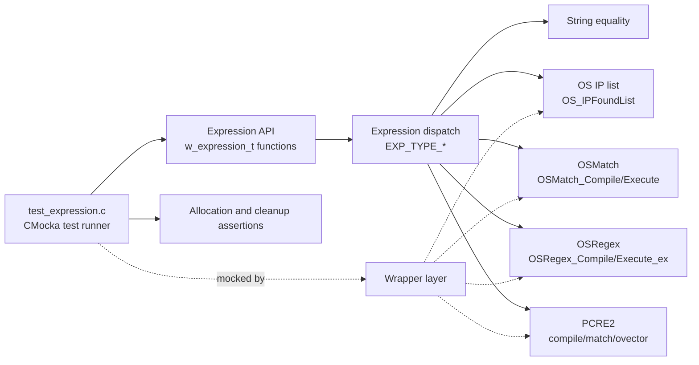
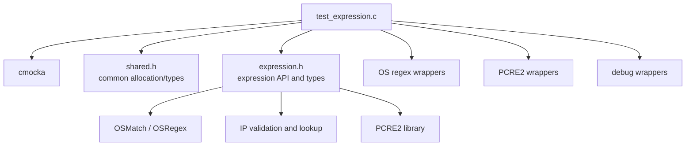
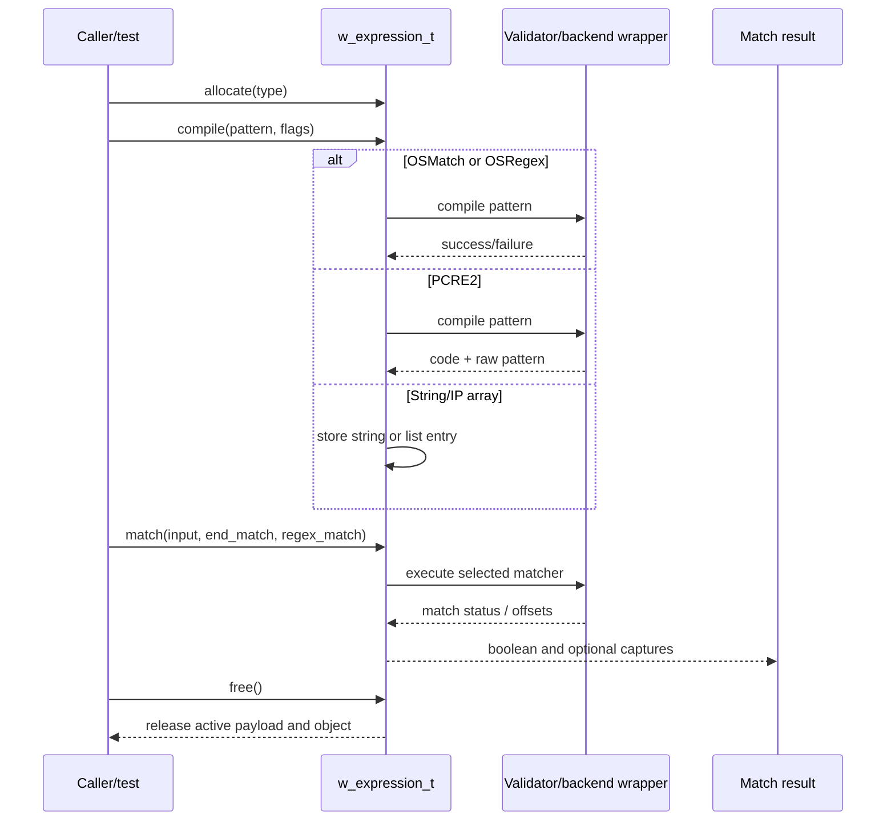
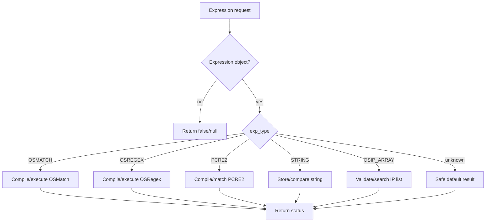
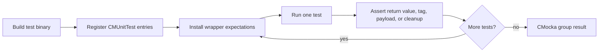

# `test_expression` module

`test_expression` is the CMocka unit-test module for Wazuh's shared expression abstraction. It verifies construction, compilation, matching, metadata access, PCRE2 capture extraction, IP-list growth, and cleanup for the expression types exposed by `w_expression_t`.

The tests do not exercise the full production regex engines. External behavior is isolated with wrappers for Wazuh's OS match/regex implementations, PCRE2, IP validation, and logging-related helpers. This makes the suite deterministic and suitable for validating dispatch and ownership decisions in the shared expression layer.

## Scope and role in Wazuh

The module belongs to the shared-library test area and is consumed by code that needs configurable string, wildcard, regular-expression, PCRE2, or IP-list matching. The production implementation is represented by the functions declared in the test file:

- `w_calloc_expression_t`
- `w_expression_add_osip`
- `w_expression_compile`
- `w_expression_match`
- `w_expression_PCRE2_fill_regex_match`
- `w_expression_get_regex_pattern`
- `w_expression_get_regex_type`
- `w_free_expression_t`

The same expression facilities are used by higher-level components such as log collection and SCA processing. Their broader behavior is documented in [logcollector](logcollector.md) and [wm_sca_tests](wm_sca_tests.md); this document covers only the shared expression contract tested here.

## Architecture



At the center is a tagged expression object. `exp_type` selects the active payload and determines which backend is initialized, invoked, inspected, or freed. The suite deliberately tests valid and unknown tags to protect the dispatch default behavior.

## Expression representation

The tested payload variants are:

| Type | Payload / backend | Tested behavior |
| --- | --- | --- |
| `EXP_TYPE_STRING` | `expression->string` | Exact string comparison and string compilation |
| `EXP_TYPE_OSMATCH` | `expression->match` (`OSMatch`) | Wazuh wildcard/match compilation and execution |
| `EXP_TYPE_OSREGEX` | `expression->regex` (`OSRegex`) | Wazuh regex compilation and extended execution |
| `EXP_TYPE_PCRE2` | `expression->pcre2` (`w_pcre2_code_t`) | PCRE2 compilation, matching, and capture extraction |
| `EXP_TYPE_OSIP_ARRAY` | `expression->ips` (`os_ip **`) | Validated IP insertion and IP-list lookup |
| Unknown value | No recognized payload | Safe false/null/default behavior |

The expression object is therefore a tagged union by convention: callers must keep `exp_type` and its corresponding payload consistent. Cleanup tests cover both populated and null payloads.

## Dependencies



The test uses CMocka expectations such as `expect_string`, `expect_any`, `will_return`, and `assert_*`. Wrapper symbols replace backend calls so tests can force success, failure, null allocation, and match-result scenarios without relying on host configuration.

Related infrastructure is shared with the broader wrapper and test-infrastructure modules; see [test_infrastructure](test_infrastructure.md) for the common test conventions.

## Functional behavior under test

### Allocation and initialization

`w_calloc_expression_t` is tested for `OSMATCH`, `OSREGEX`, `STRING`, `OSIP_ARRAY`, and `PCRE2`. Each test verifies that an object is allocated and that the type tag is preserved. Backend-specific payload allocation is checked for OS match, OS regex, and PCRE2; string and IP-array objects begin with their type-specific empty state.

### IP expression construction

`w_expression_add_osip` supports both an initially empty list and an existing list. Before insertion, the IP is passed through `OS_IsValidIP` (mocked in the suite). A valid input creates or appends an `os_ip` entry and maintains a null terminator. An invalid input returns false and releases the partially built list, leaving the caller's pointer null. The test names use a null IP argument because the validator is mocked; production callers should provide the intended address value.

### Compilation

`w_expression_compile` dispatches by expression type:

1. `OSREGEX` calls `OSRegex_Compile`; both success and compilation failure are covered.
2. `OSMATCH` calls `OSMatch_Compile`; both success and failure are covered.
3. `PCRE2` stores a compiled pattern and raw pattern metadata; the success path is covered.
4. `STRING` stores a copy of the supplied pattern.
5. `OSIP_ARRAY` and unknown types take the non-regex/default path and are expected to return successfully in this suite.

The tests set `test_mode` where required so wrappers return controlled values rather than invoking production side effects.

### Matching and result propagation

`w_expression_match` is tested for all dispatch branches:

- null expression returns false;
- OS match delegates to `OSMatch_Execute`;
- OS regex delegates to `OSRegex_Execute_ex`;
- PCRE2 handles match-data allocation failure, no-match, successful match, and optional `regex_matching` output;
- string matching and IP-list matching are exercised with non-matching fixtures;
- unknown types return false;
- a null `end_match` output pointer does not prevent a successful PCRE2 match.

For PCRE2, the match path obtains the ovector and can populate the optional `regex_matching` structure. The suite distinguishes no captured groups from captured groups and verifies that a caller may omit the output structure by passing `NULL`.

### PCRE2 capture extraction

`w_expression_PCRE2_fill_regex_match` has defensive tests for zero capture groups, null input string, null match data, and null output structure. The complete-path test supplies a mocked ovector and verifies that allocated substring storage can be released. This protects the boundary between PCRE2 offsets and Wazuh's `regex_matching.sub_strings` representation.

### Metadata helpers

`w_expression_get_regex_pattern` returns the original pattern for OS regex, OS match, PCRE2, and string expressions. It returns null for IP-array, unknown, and null-expression inputs.

`w_expression_get_regex_type` returns the stable labels `"osregex"`, `"osmatch"`, `"pcre2"`, and `"string"`; unsupported and null expressions return null.

### Cleanup

`w_free_expression_t` is tested with a null object, every supported payload, a null IP array, a populated IP array, a compiled PCRE2 object, and an unknown type. These cases establish that cleanup is type-directed and safe when optional allocations are absent.

## Data flow



The important invariant is that compilation and matching use the same `exp_type`. A backend failure becomes a false return rather than an apparently usable expression; cleanup remains callable after either successful or partial initialization.

## Test component interaction

```mermaid
flowchart TB
    Main[main()] --> Suite[CMUnitTest array]
    Suite --> Alloc[Allocation tests]
    Suite --> IPTests[IP append tests]
    Suite --> Compile[Compile tests]
    Suite --> Match[Match tests]
    Suite --> Capture[PCRE2 capture tests]
    Suite --> Meta[Pattern/type metadata tests]
    Suite --> Free[Free tests]
    Compile --> MockCompile[OSMatch / OSRegex / PCRE2 wrappers]
    Match --> MockExecute[OSMatch / OSRegex / PCRE2 wrappers]
    IPTests --> MockIP[OS_IsValidIP wrapper]
    Capture --> MockVector[pcre2_get_ovector_pointer wrapper]
    Alloc --> Assertions[CMocka assertions]
    Free --> Assertions
```

`main` registers the tests with `cmocka_unit_test` and runs them as one group. There is no fixture setup or teardown callback at group level; individual tests allocate their own objects and explicitly release them, or call `w_free_expression_t` to validate production cleanup.

## Process flows

### Compile and match dispatch



### Unit-test execution



## Coverage map

The registered suite contains 55 tests, grouped as follows:

| Group | Focus |
| --- | --- |
| Allocation | Five expression types and payload initialization |
| IP append | Empty/non-empty lists; validator success/failure |
| Free | Null, supported payloads, populated/empty IP lists, unknown type |
| Compile | OS regex/match success and failure, PCRE2, string, IP array, default |
| Match | Null, all expression types, PCRE2 allocation/match/capture paths, null output |
| PCRE2 capture helper | Guard clauses and complete capture extraction |
| Pattern metadata | Pattern extraction for supported types and null for unsupported types |
| Type metadata | Type labels for supported types and null for unsupported types |

The suite is strongest at dispatch and defensive behavior. It intentionally mocks most backend operations, so backend algorithm correctness belongs to the dedicated OS regex, PCRE2, and integration tests rather than this module.

## Maintainer notes

- Add a test whenever a new `EXP_TYPE_*` value is introduced; allocation, compile, match, metadata, and cleanup dispatch should remain aligned.
- Preserve null-termination when extending `ips`; the existing tests explicitly check the terminator after insertion.
- Keep wrapper expectations synchronized with backend signatures. The suite relies on wrappers to model both success and failure deterministically.
- When changing PCRE2 capture handling, update both `w_expression_match` tests and `w_expression_PCRE2_fill_regex_match` guard-case tests.
- Treat the expression payload as owned by the expression object after successful compilation or insertion; callers must use the matching cleanup path.

## Source and related references

- Test source: `src/unit_tests/shared/test_expression.c`
- Expression API include: `src/headers/expression.h`
- Shared allocation/types include: `src/headers/shared.h`
- OS regex wrappers: `src/unit_tests/wrappers/wazuh/os_regex/os_regex_wrappers.c` and header
- PCRE2 wrappers: `src/unit_tests/wrappers/externals/pcre2/pcre2_wrappers.c` and header
- Related shared test infrastructure: [test_infrastructure](test_infrastructure.md)
