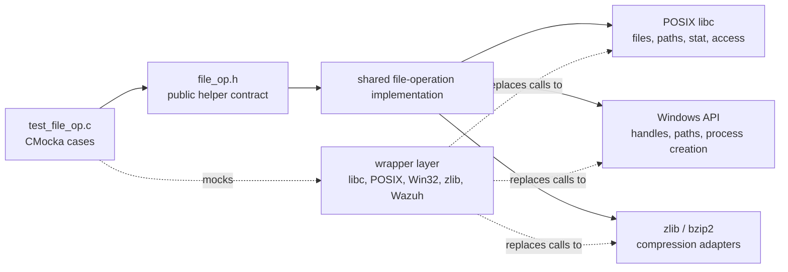
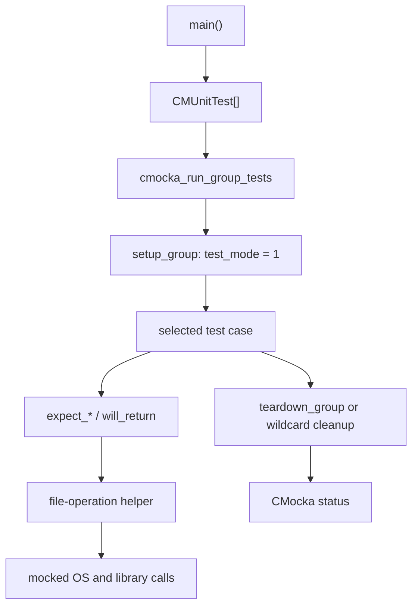
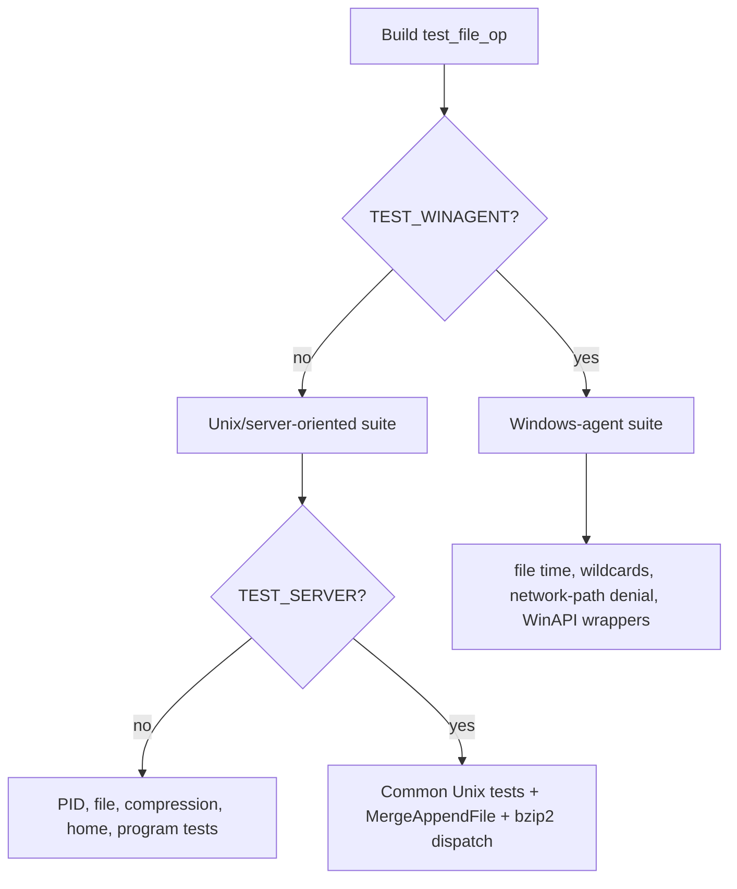
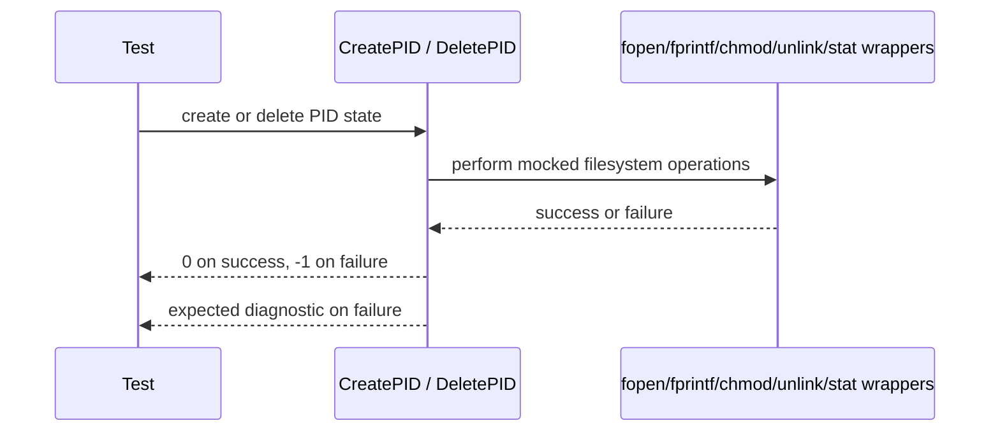
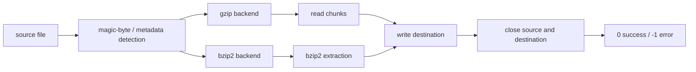
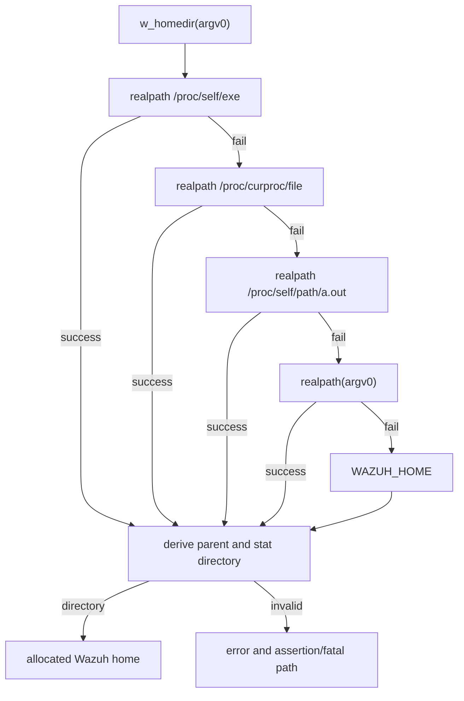
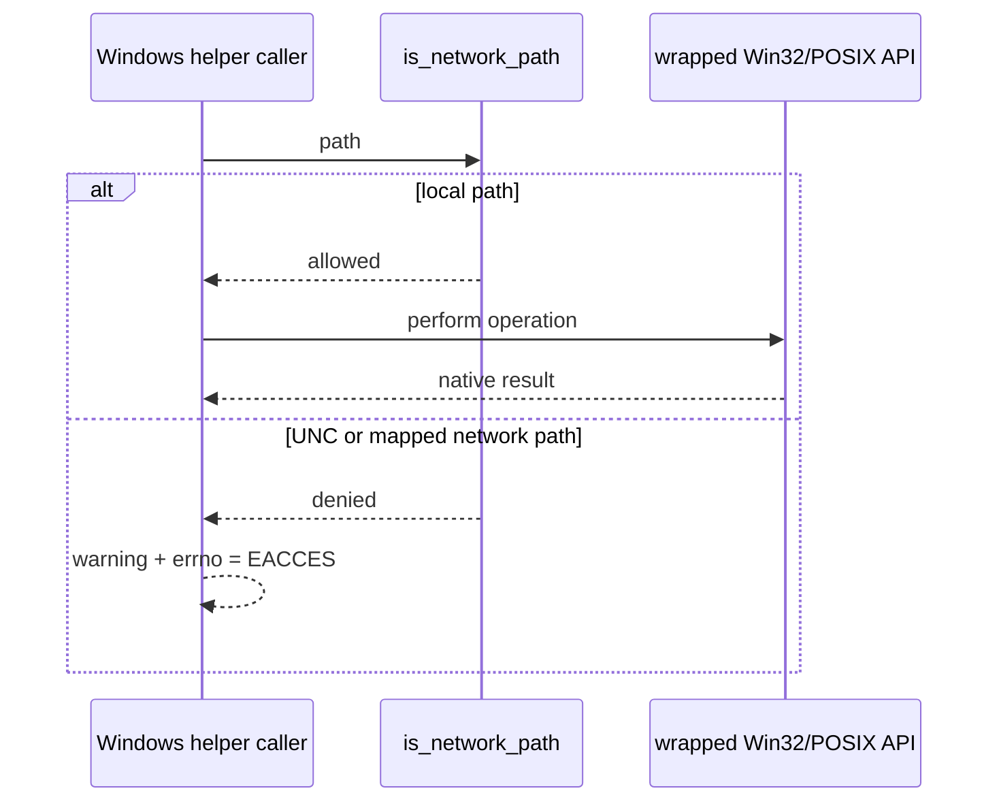
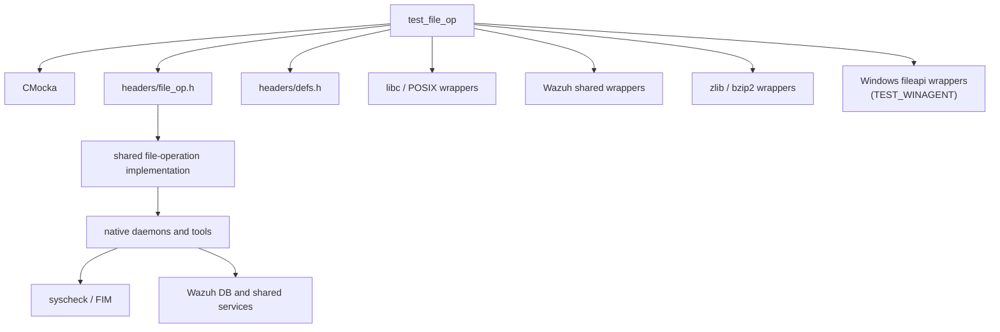

# `test_file_op`

`test_file_op` is the CMocka unit-test module for Wazuh’s shared file-operation helpers. It verifies file creation and cleanup, file reading, compression and decompression, executable discovery, Wazuh home-directory resolution, and Windows-specific path and filesystem protections. The tests isolate production code from the filesystem, operating system, and zlib through wrapper functions, so failures can be reproduced without relying on the host environment.

The test source is `src/unit_tests/shared/test_file_op.c`. Its production boundary is declared by `src/headers/file_op.h` and implemented by the shared file-operation code. Broader shared-library layering is described in [shared_lib.md](shared_lib.md), while the lower-level file/OS helper family is covered by [shared_lib_file_io.md](shared_lib_file_io.md).

## Purpose and system position

The file-operation helpers are foundational native utilities. They are used by daemons and services that need predictable file access, path validation, PID files, compressed artifacts, installation paths, or platform-specific file metadata. The test module validates those contracts without testing higher-level consumers such as FIM itself; see [syscheckd_file.md](syscheckd_file.md) and [wazuh_db_fim_syscollector.md](wazuh_db_fim_syscollector.md) for those consumers.

The module is a verification boundary, not a runtime service. It supplies controlled return values and asserts that helpers select the expected API calls, error messages, return codes, and cleanup operations.

## Architecture

### Test harness components

| Component | Responsibility |
|---|---|
| `CMUnitTest` | CMocka descriptor used to register each test case. |
| `main` | Builds the platform-specific test table and calls `cmocka_run_group_tests`. |
| `setup_group` | Enables Wazuh `test_mode`, which activates deterministic wrapper behavior. |
| `teardown_group` | Disables `test_mode` after the group completes. |
| `teardown_win32_wildcards` | Frees the dynamically allocated result vector returned by wildcard expansion tests. |
| CMocka expectations | Verify arguments passed to wrappers and provide mocked return values. |
| Wazuh wrapper headers | Intercept file, path, logging, UTF-8 WinAPI, zlib, and related helper calls. |

### Wrapper dependency groups

The source includes wrappers for:

- standard I/O and process/runtime calls (`fopen`, `fclose`, `fread`, `fwrite`, `fseek`, `ftell`, `fprintf`, `getenv`, and related functions);
- POSIX path and metadata calls (`stat`, `lstat`, `chmod`, `unlink`, `access`, `opendir`);
- Wazuh file-operation helpers, logging, and time/UTF-8 adapters;
- zlib and bzip2 entry points (`gzopen`, `gzread`, `gzwrite`, `gzeof`, `gzerror`, `gzclose`, and bzip2 decompression);
- Windows file, process, handle, wildcard, and file-time APIs when `TEST_WINAGENT` is enabled.

This arrangement lets a test assert both the result and the interaction protocol. For example, `test_CreatePID_success` checks the PID path, append mode, written text, permission update, and close operation—not only the final return value.

## Test execution variants

Compilation flags select distinct contracts:

`setup_group` and `teardown_group` are used for both variants. On Windows, wildcard tests use per-test teardown because the helper returns a heap-allocated NULL-terminated vector.

## Functional coverage

### PID lifecycle

`CreatePID` is tested for:

- successful creation of `var/run/<name>-<pid>.pid`, writing `<pid>\n`, applying permissions, and closing the file;
- failure to open the PID file;
- failure to apply `chmod`, including the expected error log.

`DeletePID` is tested for successful unlinking and for an unlink failure. The tests also mock the follow-up `stat` operation, demonstrating that deletion behavior includes post-delete verification/error handling.

### File access and content

The Unix suite covers:

- `w_get_file_pointer(NULL)`, invalid paths, and successful `fopen` forwarding;
- `w_get_file_content`, including file-size discovery using `ftell`/`fseek`, bounded content reading, and cleanup;
- `is_program_available`, including a missing `PATH`, a NULL program, a found executable, and a program absent from every PATH entry.

The test expectations show that executable discovery iterates colon-separated PATH directories and checks each candidate with `X_OK`.

### Compression and decompression

The module checks gzip and bzip2 detection by reading magic bytes. A bzip2 file is recognized by the `BZh` signature; a file with a `.gz` suffix is not treated as compressed unless its content satisfies the gzip detector’s contract.

`w_compress_gzfile` covers source-open failure, destination `gzopen` failure, write/compression failure, and a successful read/write/close loop. `w_uncompress_gzfile` covers source metadata failure, destination-open failure, source `gzopen` failure, read/error handling, and successful extraction. Under `TEST_SERVER`, `w_uncompress_bz2_gz_file` additionally dispatches bzip2 input to the bzip2 backend.

`MergeAppendFile`, also server-only, is tested for source-open and seek failures, empty files, source mutation during copying, and successful append. Its success protocol writes a `!<offset> <path>\n` marker to the destination and then copies the source while confirming that the final offset is unchanged.

Related compression infrastructure is documented in [compression_archive.md](compression_archive.md) and [test_os_zlib.md](test_os_zlib.md); those pages describe adjacent compression abstractions rather than duplicating this module’s file-wrapper tests.

### Wazuh home directory resolution

`w_homedir` is tested through its fallback sequence:

1. resolve `/proc/self/exe`;
2. fall back to `/proc/curproc/file`;
3. fall back to `/proc/self/path/a.out`;
4. resolve the supplied `argv[0]`;
5. use `WAZUH_HOME` when executable resolution fails;
6. validate the candidate with `stat` and require a directory.

The failure case asserts the fatal diagnostic instructing operators to export `WAZUH_HOME`. Successful cases return a newly allocated install-directory string, which the tests free.

### Windows path policy and platform helpers

When `TEST_WINAGENT` is enabled, the suite validates a security policy that rejects network paths for sensitive file operations. UNC paths and mapped drives such as `Z:\...` are identified by `is_network_path`; local `C:\...` paths are allowed.

The policy is applied consistently to `wfopen`, `waccess`, `wCreateFile`, `wCreateProcessW`, `wopendir`, `w_stat`, and `w_stat64`. Rejected network paths return the operation-specific failure value, set `errno` to `EACCES`, and emit the network-path warning.

Other Windows coverage includes:

- UTC modification time conversion from `FILETIME`, including handle and `GetFileTime` failures;
- wildcard expansion for ordinary directories, ignored files, back-links (`.` and `..`), reparse points, invalid handles, and multiple wildcard segments;
- local-path forwarding for UTF-8 file creation, process creation, `stat64`, and directory operations.

## Dependencies and component relationships

The test depends on shared utility code but not on a live daemon, database, or network service. Its use of wrapper seams follows the common unit-test approach described in [test_infrastructure.md](test_infrastructure.md). The broader C shared-library responsibilities are split into focused pages such as [shared_lib_file_io.md](shared_lib_file_io.md), [shared_lib_string_validation.md](shared_lib_string_validation.md), and [shared_lib_system_utils.md](shared_lib_system_utils.md).

## Error and resource-handling contract

Across the cases, the helpers are expected to:

- return `0` or a valid handle/pointer on success, and `-1`, `NULL`, `INVALID_HANDLE_VALUE`, or `0` as appropriate on failure;
- preserve meaningful `errno` behavior for Windows network-path rejection;
- log failures through Wazuh logging wrappers;
- close opened `FILE*`, gzip handles, and Windows handles on both success and failure paths;
- reject unsafe or unsupported paths before invoking the underlying OS operation;
- detect source mutation during merge/copy rather than silently producing an inconsistent artifact.

The tests primarily assert externally visible behavior and mocked interactions. They do not measure performance, test real filesystem permissions, validate actual compression ratios, or prove thread safety.

## Test organization summary

| Build mode | Main responsibilities covered |
|---|---|
| Unix, non-server | PID lifecycle, compression detection, program lookup, gzip compression/decompression, home resolution, file opening/content reading |
| Unix, `TEST_SERVER` | Unix coverage plus bzip2 dispatch and `MergeAppendFile` behavior |
| `TEST_WINAGENT` | UTC file times, wildcard expansion, network-path rejection, local-path forwarding, Windows file/process/directory operations |

The source contains additional negative-path cases for gzip writes and invalid file pointers; the registered test table is the authoritative definition for a given compile-time configuration.

## Summary

`test_file_op` protects a low-level portability and security boundary. Its most important guarantees are that Wazuh file helpers clean up correctly, report failures consistently, identify compressed inputs, resolve installation paths through controlled fallbacks, and prevent Windows network-path use where local files are required. Changes to `src/headers/file_op.h`, shared file-operation implementations, wrapper signatures, or platform path policy should be accompanied by updates to this test module and its platform-specific build variant.
