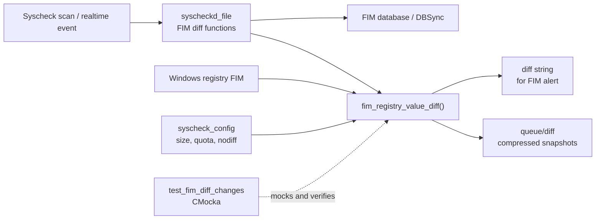
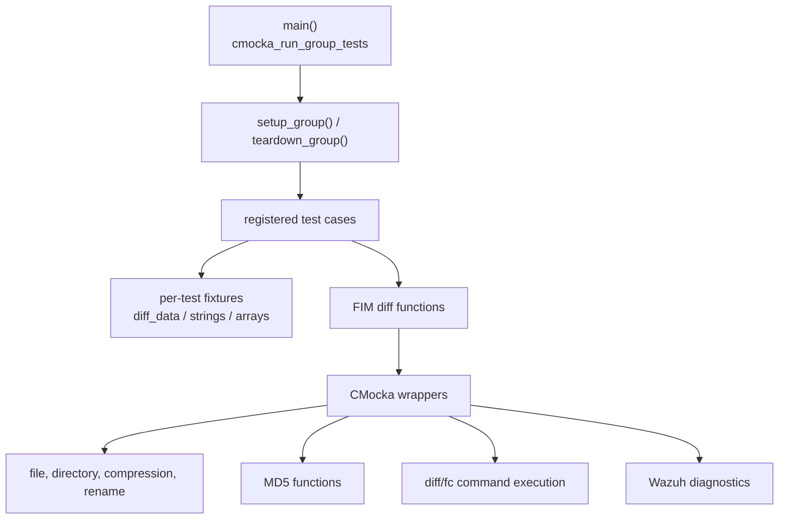
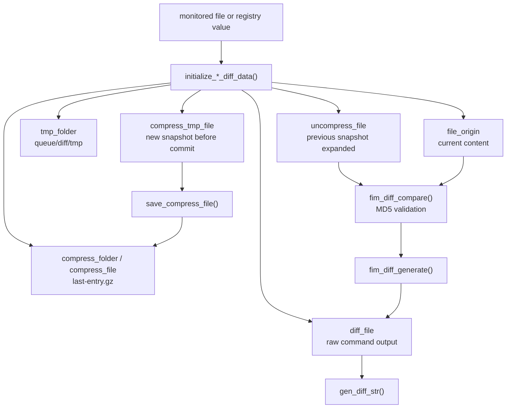
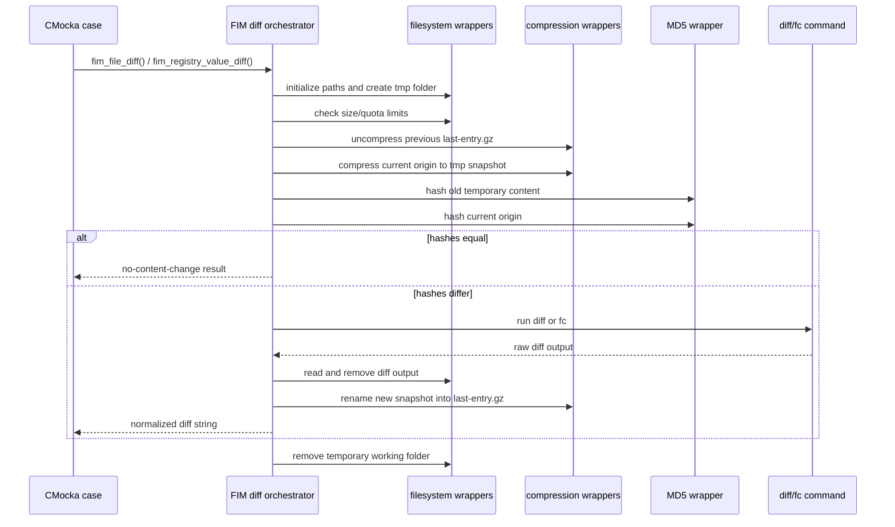
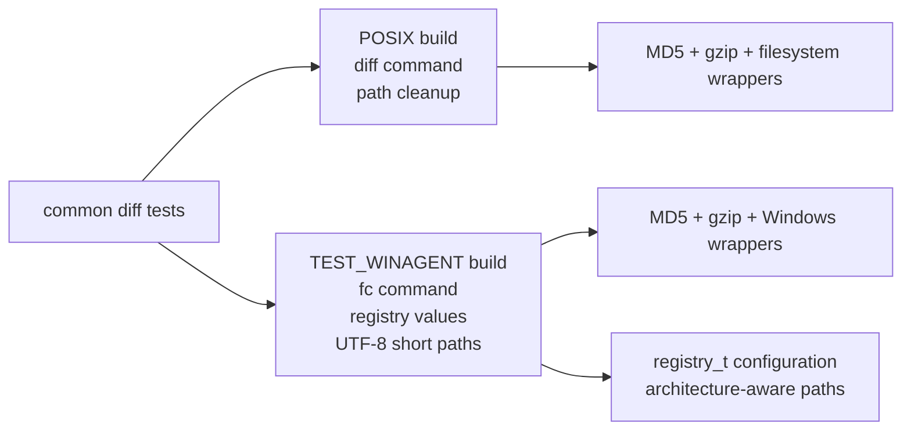
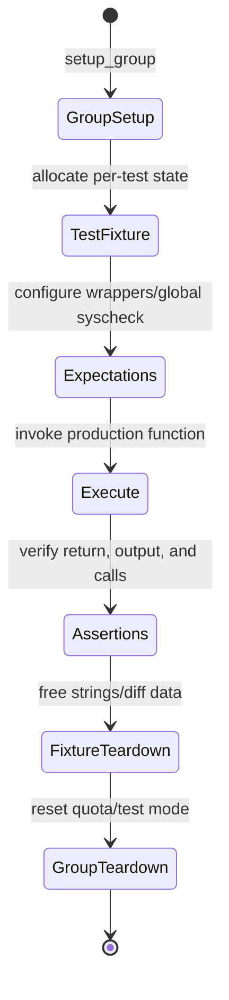

# `test_fim_diff_changes`

## Introduction

`test_fim_diff_changes` is the CMocka unit-test module for Wazuh’s FIM content-diff subsystem. It validates the orchestration around creating snapshots, comparing old and new content, generating textual diffs, storing compressed snapshots, enforcing file-size and disk-quota limits, honoring `nodiff` rules, and removing obsolete diff data.

The test file does not implement FIM. The production functions under test are declared by `src/syscheckd/include/syscheck.h` and are primarily implemented in the Syscheck file/diff layer. See [syscheckd_file.md](syscheckd_file.md) for the runtime file-scanning context, [syscheckd_core_scan_engine.md](syscheckd_core_scan_engine.md) for scan-level quota and diff state, and [syscheckd_registry.md](syscheckd_registry.md) for the Windows registry caller.

## System position

The module exercises a lower-level service used after FIM detects a file or registry change. A previous compressed snapshot is restored to a temporary file, the current object is materialized or copied, and the two contents are compared. When content differs, an OS diff command produces a bounded alert string and the new snapshot is committed for the next comparison.



## Test architecture

The test is a single CMocka executable. `main()` registers platform-independent tests and, when compiled with `TEST_WINAGENT`, adds Windows-specific tests for `fc.exe`, UTF-8 short paths, registry value serialization, and registry diff cleanup.



### Components and responsibilities

| Component | Responsibility |
|---|---|
| `test_fim_diff_changes.c` | Defines fixtures, expectations, test cases, and the test runner. |
| `diff_data` | Production working structure populated by the initialization functions; contains origin, temporary, compressed, and diff paths plus limits. |
| `gen_diff_struct` | Test-only aggregate containing a `diff_data` object and expected raw/normalized diff strings. |
| `setup_group()` | Compiles the file `nodiff` regex and, on Windows, registry ignore/nodiff regexes; installs them into global `syscheck`. |
| `setup_diff_data()` / teardown | Allocates and releases a `diff_data` fixture. |
| `setup_gen_diff_str()` / teardown | Creates representative POSIX `diff` or Windows `fc` output and its normalized expected result. |
| `expect_fim_diff_changes.c` | Optional shared expectation helper for compressed-diff directory cleanup; see [expect_fim_diff_changes.md](expect_fim_diff_changes.md). |
| CMocka wrappers | Replace filesystem, compression, hashing, process, logging, and platform APIs with deterministic expectations. |

## Data model and paths

Each diff operation uses a `diff_data` path set. File paths are hashed to create stable per-object storage directories; Windows registry paths additionally include architecture and hashed key/value names.



Typical POSIX paths used by the fixture are:

```text
queue/diff/file/<hashed-file>/last-entry.gz
queue/diff/tmp/tmp-entry
queue/diff/tmp/tmp-entry.gz
queue/diff/tmp/diff-file
```

On Windows registry tests, the persisted location is conceptually:

```text
queue/diff/registry/[x64] <hashed-key>/<hashed-value>/last-entry.gz
```

The exact hash values are test constants, not part of the public API. Their purpose is to verify deterministic path construction.

## End-to-end diff process

`fim_file_diff()` and `fim_registry_value_diff()` are tested as orchestrators. The expected happy path is:



The test deliberately distinguishes two MD5 outcomes: a wrapper failure is treated as an inability to compare, while equal hashes produce the “no content changes” path. A successful comparison with different hashes proceeds to diff generation.

## Functional areas covered

### Initialization and path safety

`test_initialize_file_diff_data` verifies absolute-path resolution and construction of all working paths. The failure case verifies that an `abspath` failure returns `NULL` and logs an error. Windows registry initialization additionally checks architecture-qualified, hashed key/value paths.

`filter()` normalizes paths for the platform and rejects unsafe formatting characters on Windows. Windows tests also cover `adapt_win_fc_output()`, converting `fc`’s report format into the common `<`, `---`, and `>` representation; identical files yield an empty normalized string.

### Limits, quota, and compression estimation

The limit tests cover three decisions from `fim_diff_check_limits()`:

| Result | Condition represented by the tests | Caller-visible behavior |
|---:|---|---|
| `0` | Current file is within the configured size/quota policy | Continue diff processing. |
| `1` | Per-file size limit is exceeded | Return a file-size limit message and clean temporary state. |
| `2` | Estimated compressed size would exceed disk quota | Return a disk-quota message and clean temporary state. |

`fim_diff_estimate_compression()` is tested at both “does not fit” and “fits” boundaries. `fim_diff_modify_compress_estimation()` verifies that the rolling compression estimate is adjusted when compression is good, remains unchanged when the rate is poor, and is bounded by the minimum estimate.

### Snapshot creation and persistence

`fim_diff_create_compress_file()` covers successful gzip creation, compression failure, and quota exhaustion after the compressed size is measured. `save_compress_file()` verifies atomic-style promotion by renaming the temporary gzip file and updating `syscheck.diff_folder_size`; rename failure must preserve the existing accounting and emit an error.

### Comparison and diff extraction

`fim_diff_compare()` hashes the expanded old snapshot and the current object. Tests cover failure hashing either side, equal content, and changed content. `fim_diff_generate()` checks command failure, command success, and reading the generated output through `gen_diff_str()`.

`gen_diff_str()` covers file-open failure, read failure, successful read, cleanup of the raw diff file on POSIX, and truncation behavior. The long-output tests verify that the final alert remains bounded and ends with `More changes...` when the command output exceeds the alert limit.

### No-diff configuration

`is_file_nodiff()` checks literal and regular-expression exclusions and a non-match. The end-to-end file tests confirm that a changed file configured as `nodiff` still refreshes its stored snapshot but returns a truncated-diff status rather than exposing content.

Windows adds equivalent registry checks through `is_registry_nodiff()` and exercises `fim_registry_value_diff()` across registry types (`REG_SZ`, `REG_MULTI_SZ`, `REG_DWORD`, big-endian DWORD, and QWORD). Registry values are serialized into a temporary textual representation before entering the common snapshot/compare/generate pipeline.

### Deletion cleanup

`fim_diff_process_delete_file()` and the Windows `fim_diff_process_delete_value()` tests verify removal of the hashed compressed-diff directory. Covered outcomes include successful removal, a missing directory, removal failure, and failure while removing empty parent folders. The reusable setup in [expect_fim_diff_changes.md](expect_fim_diff_changes.md) documents the directory-cleanup expectation helper used by the wider test suite.

## Platform variants



The compile-time `TEST_WINAGENT` branch changes both the registered test set and the expected command/output format. It does not create a second test architecture: both variants use the same fixture lifecycle and common diff orchestration.

## Fixture lifecycle and isolation



Important global state includes `syscheck.nodiff`, `syscheck.nodiff_regex`, Windows registry configuration, `syscheck.diff_folder_size`, disk-quota flags, compression estimation, `syscheck.disk_quota_full_msg`, and `test_mode`. Teardown functions reset the state that can affect later tests, while per-test teardown frees allocated `diff_data`, strings, and arrays.

## Failure semantics used by the tests

The module asserts both return values and externally visible diagnostics. This is important because several failures are intentionally non-fatal to the daemon’s scan loop:

- Missing previous snapshot: report that no previous data is available, while creating the new snapshot for future scans.
- Equal old/new MD5: report that no content changes were found.
- File-size or quota limit: return a specific explanatory string after temporary cleanup.
- Compression failure: log a warning and return `NULL`.
- Diff command failure or invalid output: log an error and return `NULL`.
- `nodiff` match: suppress content and return a configuration-specific truncation message.

These assertions make the test a contract for error handling as well as for the successful diff string.

## Dependencies

| Dependency | Usage |
|---|---|
| `syscheck.h` | `diff_data`, global Syscheck state, and production FIM-diff declarations. |
| `syscheck-config.h` | `directory_t`, `registry_t`, registry data types, and check flags. |
| CMocka | Test registration, fixtures, call expectations, and assertions. |
| MD5 wrappers | Deterministic old/new snapshot comparison. |
| File-operation wrappers | Paths, sizes, gzip operations, rename, directory removal, and cleanup. |
| stdio/stdlib/stat wrappers | File I/O, allocation/process behavior, directory and filesystem results. |
| `expect_fim_diff_changes` helper | Reusable compressed-diff cleanup expectations; documented separately. |

The test is linked against the Syscheck/FIM production objects and wrapper library. It does not access a real monitored filesystem, invoke a real diff command, or require a running `syscheckd` daemon.

## Maintenance guidance

When the diff implementation changes, update this module if any of the following contracts change:

- `diff_data` path construction or hash naming;
- wrapper call order or argument names;
- return-code meanings from limit, compression, or comparison helpers;
- command output normalization or maximum alert length;
- temporary snapshot cleanup and quota accounting;
- Windows registry serialization or `fc` output parsing.

Prefer adding a focused test beside the relevant functional-area group. Keep filesystem and process interactions mocked so failures remain deterministic and platform-specific behavior remains explicit.

## Related documentation

- [syscheckd_file.md](syscheckd_file.md) — file scanning and the runtime caller of `fim_file_diff()`.
- [syscheckd_core_scan_engine.md](syscheckd_core_scan_engine.md) — scan orchestration, diff-folder sizing, and quota state.
- [syscheckd_registry.md](syscheckd_registry.md) — Windows registry scanning and registry-value diff integration.
- [Syscheck___FIM_Daemon_(C_C++).md](Syscheck___FIM_Daemon_(C_C++).md) — overall FIM daemon architecture.
- [expect_fim_diff_changes.md](expect_fim_diff_changes.md) — shared compressed-diff cleanup expectations.
- [test_file_op.md](test_file_op.md) — related filesystem-wrapper testing patterns.
