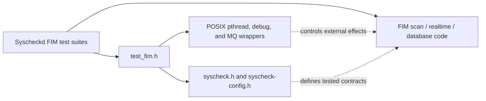
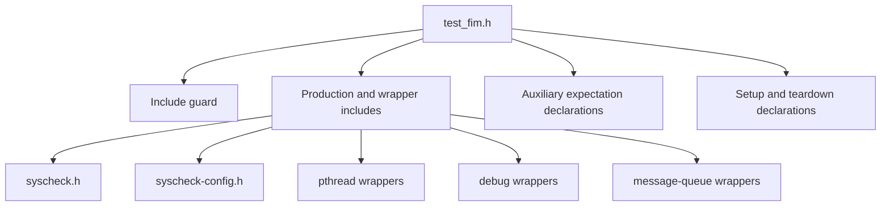
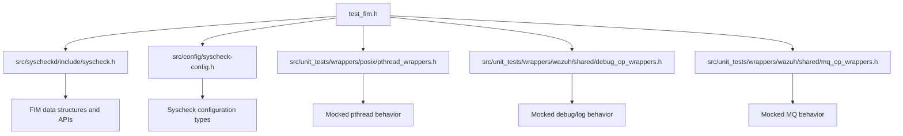
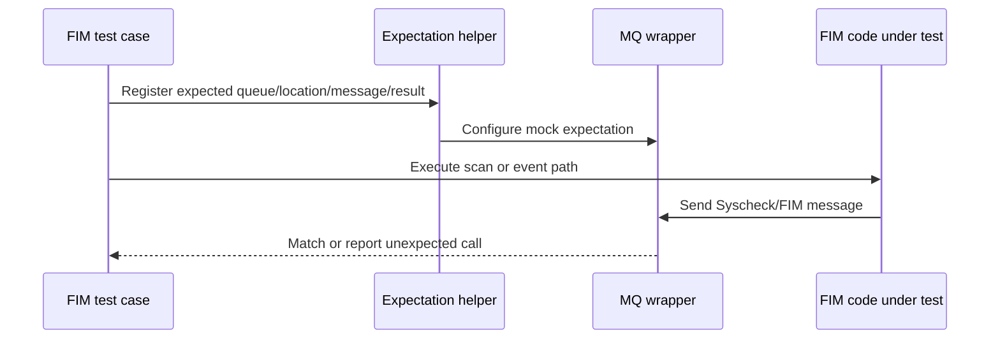
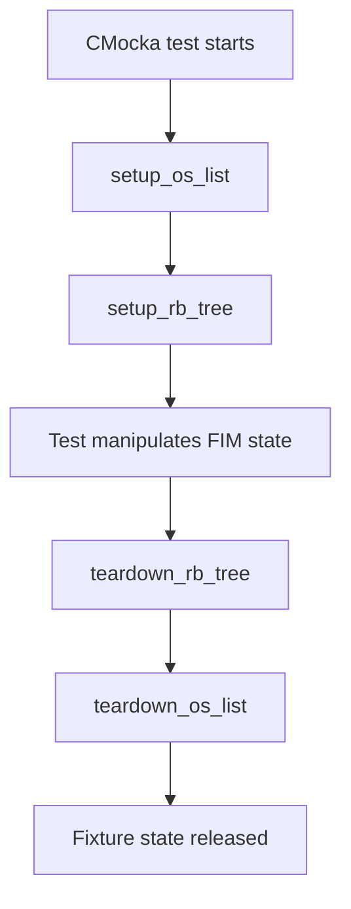
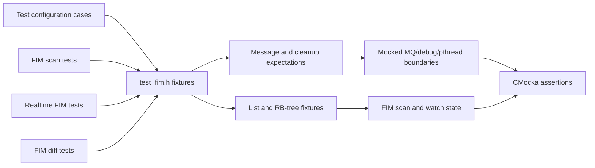

# `test_fim_header`

`test_fim_header` is the shared declaration header for Wazuh Syscheck/File Integrity Monitoring (FIM) unit tests. It does not contain test cases or production logic; it defines the helper API used by FIM test translation units to express message expectations, construct platform-specific data, and manage reusable data-structure fixtures.

The source is `src/unit_tests/syscheckd/test_fim.h`. Runtime scanning, realtime monitoring, database persistence, and configuration behavior are documented in [syscheckd_core.md](syscheckd_core.md), [syscheckd_core_scan_engine.md](syscheckd_core_scan_engine.md), [syscheckd_core_realtime.md](syscheckd_core_realtime.md), [syscheckd_db.md](syscheckd_db.md), and [test_config.md](test_config.md).

## Purpose and system position

The header is the test-support boundary between FIM unit tests and the components they isolate. It centralizes declarations so individual suites can share the same expectation helpers and fixture lifecycle without duplicating prototypes.

## File structure

| Section | Declarations | Responsibility |
|---|---|---|
| Include guard | `__TEST_FIM_H` | Prevents duplicate declarations when several test helpers include the header. |
| Production contracts | `syscheck.h`, `syscheck-config.h` | Supplies FIM structures, configuration types, and function contracts used by the tests. |
| Wrapper contracts | pthread, debug, and MQ wrapper headers | Exposes controlled seams for synchronization, logging, and message transport. |
| Auxiliary expectations | `expect_fim_send_msg`, `expect_send_syscheck_msg`, `expect_fim_diff_delete_compress_folder`, `create_win_permissions_object` | Declares reusable assertions and test-data builders. |
| Fixture lifecycle | `setup_os_list`, `teardown_os_list`, `setup_rb_tree`, `teardown_rb_tree` | Initializes and releases common list/tree state passed through CMocka's `void **state`. |

## Dependencies

The header therefore depends on both production declarations and test-only wrappers. It is not a production dependency: it belongs exclusively to the unit-test build and should not be included by daemon implementation files.

## Auxiliary expectation API

### Message expectations

`expect_fim_send_msg(char mq, const char *location, const char *msg, int retval)` describes an expected FIM message send. The parameters identify the message queue, destination/location, payload, and expected return value. It is useful for asserting both successful and failed outbound FIM notifications.

`expect_send_syscheck_msg(const char *msg)` provides the narrower expectation used when a test only needs to verify the Syscheck payload. These helpers pair with the message-queue wrappers included from `mq_wrappers.h`; they define expectations, while the wrapper implementation performs the interception.

### Diff cleanup expectation

`expect_fim_diff_delete_compress_folder(struct dirent *dir)` declares an expectation for deleting a compressed FIM-diff directory entry. The `struct dirent` parameter ties the expectation to directory traversal data and allows tests to verify cleanup behavior without depending on a real directory scan.

This helper belongs to the FIM diff test boundary; the broader diff lifecycle is part of the scan engine and should be followed through [syscheckd_core_scan_engine.md](syscheckd_core_scan_engine.md).

### Windows permissions data builder

`create_win_permissions_object()` returns a `cJSON *` representing Windows permissions data. It gives tests a reusable JSON fixture for permission/ACL serialization paths while keeping platform-specific object construction out of individual test cases. Ownership of the returned JSON object is governed by the implementation and the consuming test; callers should release it using the repository's normal cJSON cleanup convention.

## Fixture lifecycle

The four setup/teardown declarations support tests that exercise the shared list and red-black-tree containers used by FIM scans and watch/configuration state.

| Function | Role |
|---|---|
| `setup_os_list(void **state)` | Creates or initializes the list fixture and stores it in the test state. |
| `teardown_os_list(void **state)` | Releases the list fixture and associated nodes. |
| `setup_rb_tree(void **state)` | Creates or initializes the red-black-tree fixture. |
| `teardown_rb_tree(void **state)` | Releases tree nodes and the tree fixture. |

The exact allocation policy is implemented in the corresponding test utility source, not in this header. The declarations establish the CMocka-compatible lifecycle signature and allow suites to compose these helpers with additional setup functions.

## Component interaction

The header supports several neighboring test areas but does not define their behavior. Use the existing module documentation for those details instead of duplicating them here:

- FIM scanning and transaction callbacks: [syscheckd_core_scan_engine.md](syscheckd_core_scan_engine.md).
- Realtime watches and event processing: [syscheckd_core_realtime.md](syscheckd_core_realtime.md).
- FIM persistence and database operations: [syscheckd_db.md](syscheckd_db.md).
- Syscheck configuration parsing and validation: [test_config.md](test_config.md).

## Maintenance guidance

When adding a reusable FIM test boundary:

1. Add only declarations to this header; keep implementations in the relevant test utility or wrapper source.
2. Prefer expectation helpers for external effects such as queues, logs, filesystem traversal, and cleanup.
3. Preserve the `void **state` signatures so setup and teardown functions remain directly usable by CMocka.
4. Include production headers only for contracts required by the test support API; avoid turning this header into a general FIM umbrella header.
5. Update the linked module documentation when a helper changes the observable contract of scanning, diff handling, realtime events, or persistence.

The unusual symbol reported for this component, `dirent`, is a type used by `expect_fim_diff_delete_compress_folder`; it is not a standalone function defined by `test_fim.h`.
