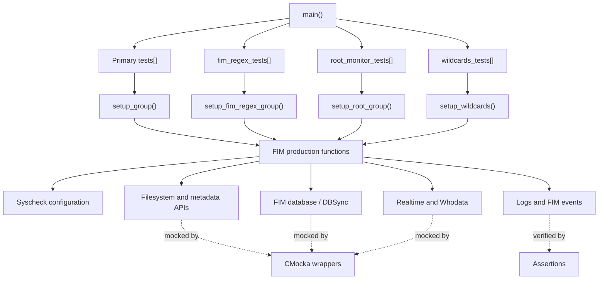
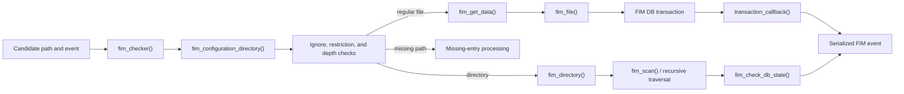

# `test_fim_scan`

## Purpose

`test_fim_scan` is the CMocka unit-test suite for Wazuh’s File Integrity Monitoring (FIM) scan pipeline, implemented in [`src/unit_tests/syscheckd/test_fim_scan.c`](src/unit_tests/syscheckd/test_fim_scan.c).

It validates:

- FIM path configuration, ignore, restriction, and recursion-depth checks.
- File and directory scanning, metadata collection, hashing, and missing-entry handling.
- Scheduled, realtime, and Whodata event processing.
- FIM database capacity states, transactions, callbacks, and DBSync serialization.
- Wildcard configuration refresh and diff-folder accounting.
- Cross-platform behavior through mocked filesystem, database, realtime, hashing, locking, and logging interfaces.

The suite runs four CMocka groups: the primary FIM tests, regex/ignore tests, root-monitor tests, and wildcard-configuration tests.

## Architecture



The primary scan path is exercised as follows:



Fixtures establish global `syscheck` state and per-test FIM data. Wrappers make external effects deterministic, allowing tests to verify return values, state transitions, database operations, log messages, event JSON, and synchronization behavior without using a live filesystem or database.

## Repo structure

```text
Unit_Tests_-_Syscheck_FIM/
└── test_fim_scan
    ├── test_fim_scan_test_infrastructure
    ├── fim_check_db_state_tests
    ├── fim_checker_tests
    ├── fim_check_validation_tests
    ├── fim_directory_tests
    ├── fim_file_tests
    ├── fim_get_data_checksum_tests
    ├── fim_missing_entry_tests
    ├── fim_realtime_whodata_tests
    ├── transaction_callback_tests
    ├── dbsync_attributes_tests
    ├── wildcards_config_tests
    ├── fim_configuration_directory_tests
    └── fim_diff_and_init_tests
```

## Core component references

- [Syscheck / FIM daemon](Syscheck___FIM_Daemon_(C_C++).md)
- [FIM scan engine](syscheckd_core_scan_engine.md)
- [FIM core lifecycle](syscheckd_core_lifecycle.md)
- [FIM file handling](syscheckd_file.md)
- [FIM database](syscheckd_db.md)
- [FIM database core](syscheckd_db_core.md)
- [FIM realtime monitoring](syscheckd_core_realtime.md)
- [FIM Whodata](syscheckd_whodata.md)
- [Syscheck configuration](Syscheck_Config.md)
- [DBSync shared module](dbsync.md)
- [Wazuh DB FIM/Syscollector integration](wazuh_db_fim_syscollector.md)

## Child test documentation

- [Test infrastructure](test_fim_scan_test_infrastructure.md)
- [Database-state tests](fim_check_db_state_tests.md)
- [Checker tests](fim_checker_tests.md)
- [Validation tests](fim_check_validation_tests.md)
- [Directory tests](fim_directory_tests.md)
- [File tests](fim_file_tests.md)
- [Checksum tests](fim_get_data_checksum_tests.md)
- [Missing-entry tests](fim_missing_entry_tests.md)
- [Realtime and Whodata tests](fim_realtime_whodata_tests.md)
- [Transaction callback tests](transaction_callback_tests.md)
- [DBSync attribute tests](dbsync_attributes_tests.md)
- [Wildcard configuration tests](wildcards_config_tests.md)
- [Configuration-directory tests](fim_configuration_directory_tests.md)
- [Diff and initialization tests](fim_diff_and_init_tests.md)