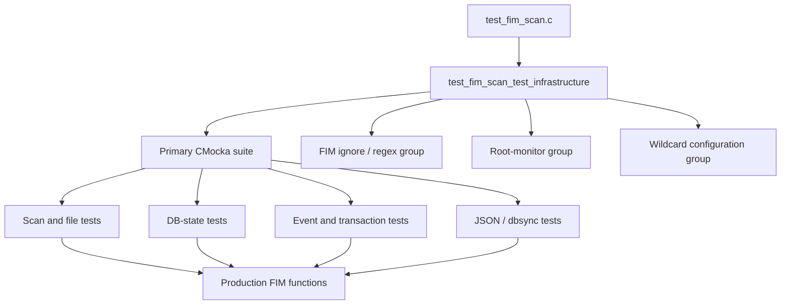
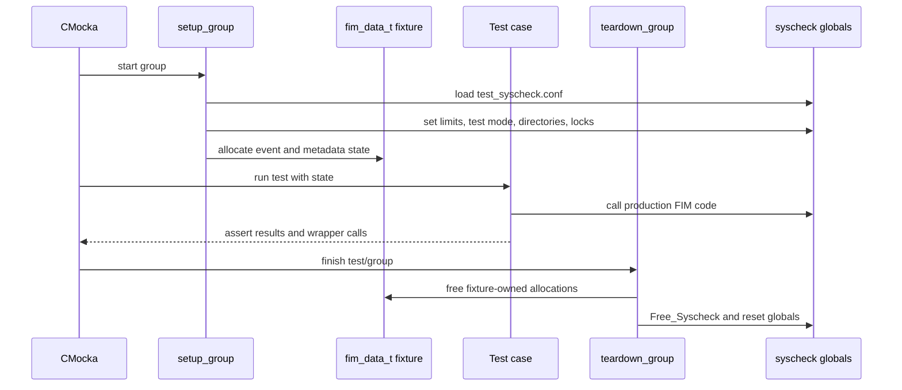
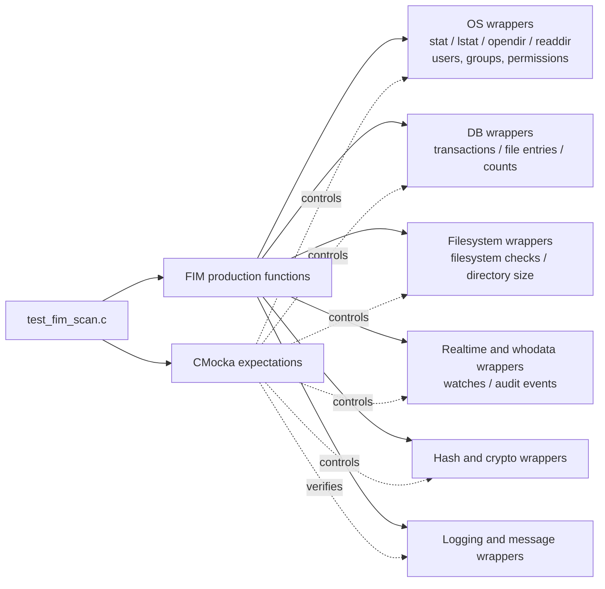
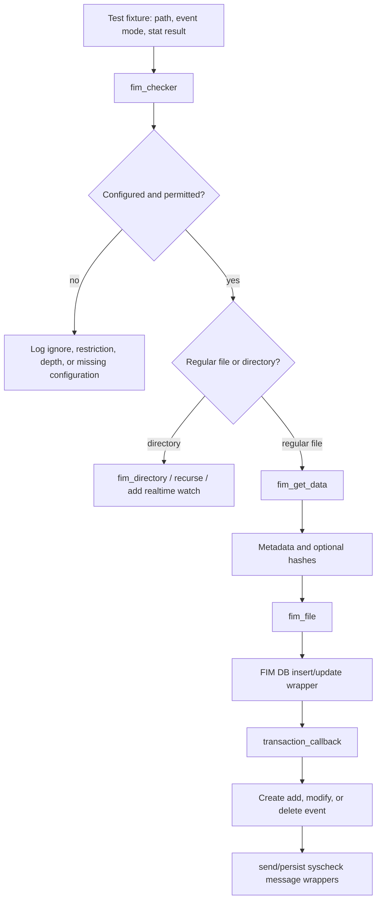
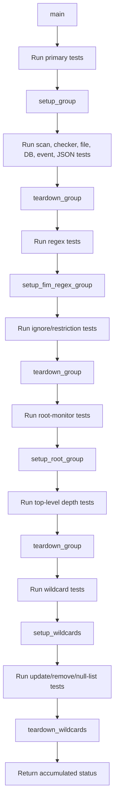

# `test_fim_scan_test_infrastructure`

`test_fim_scan_test_infrastructure` documents the shared test harness in `src/unit_tests/syscheckd/test_fim_scan.c`. The harness does not implement production FIM behavior; it constructs deterministic CMocka fixtures, replaces operating-system and Wazuh service boundaries with wrappers, and runs the grouped tests that exercise scanning, file metadata collection, database state, event generation, and transaction callbacks.

The production behavior under test is described in [the FIM daemon documentation](Syscheck___FIM_Daemon_(C_C++).md), [the scan engine](syscheckd_core_scan_engine.md), [the FIM database](syscheckd_db.md), and [the realtime implementation](syscheckd_core_realtime.md).

## Position in the test hierarchy

The file is the infrastructure child of the `test_fim_scan` module. Its fixture helpers are shared by several functional test groups in the same translation unit.

The harness therefore has two responsibilities:

1. Establish and clean up process-wide `syscheck` state for each suite.
2. Make external effects observable and repeatable through CMocka expectations and wrapper return values.

## Core infrastructure components

| Component | Responsibility |
|---|---|
| `CMUnitTest` | Describes an individual CMocka test and, where needed, its setup and teardown callbacks. |
| `main` | Builds the four test arrays, runs them in a fixed order, and returns the sum of their failures. |
| `setup_group` | Initializes the standard FIM configuration, global state, limits, locks, lists, and a baseline configured directory. |
| `teardown_group` | Disables test mode, releases the FIM configuration and fixture allocations, and resets platform-specific globals. |
| `__fim_data_s` / `fim_data_t` | Aggregates event, whodata, FIM entry, old/new metadata, JSON, directory-entry, list, and tree state used by tests. |
| `dirent` / `stat` | Supplies synthetic directory listings and file metadata to directory and scan paths. |
| `setup_struct_dirent` / `teardown_struct_dirent` | Allocates and releases the synthetic directory-entry object used by `readdir` wrappers. |
| `setup_root_group` | Loads the top-level/root-monitor configuration used to verify depth and root-path behavior. |

Additional helpers in the file specialize the same infrastructure for regex, wildcard, file-limit, realtime, transaction-callback, and JSON tests.

## Fixture lifecycle

The standard group uses a process-wide `syscheck` configuration, but each test receives an independent `fim_data_t` object through CMocka state. The setup and teardown pairing is essential because production FIM code uses global lists, locks, database state, and platform resources.

### Standard fixture

`setup_group` establishes the normal configuration and calls the fixture initializer. The fixture contains representative values for:

- scheduled, realtime, and whodata event contexts;
- a FIM file entry and local/old/new metadata;
- ownership, permissions, timestamps, inode/device values, and MD5/SHA-1/SHA-256 hashes;
- a directory entry used by directory traversal tests;
- JSON and transaction callback state where the specialized setup requires it.

`teardown_group` is intentionally broader than ordinary heap cleanup: it turns off test mode, destroys `syscheck` state, and clears Windows audit/key-ignore fields when compiled for the Windows agent.

### Specialized groups

- `setup_fim_regex_group` loads `test_syscheck4.conf` for ignore and restriction matching.
- `setup_root_group` loads `test_syscheck_top_level.conf` for root-level recursion behavior.
- `setup_wildcards` creates wildcard and resolved-directory lists; its teardown releases those lists.
- `setup_fim_scan_realtime` installs a synthetic realtime state, including queue-overflow and watch-map data.
- `setup_transaction_callback` creates a callback context and event; its teardown deletes JSON and callback allocations.
- `setup_struct_dirent` provides the `readdir` payload for directory traversal.

## Wrapper and dependency architecture

The test file calls production functions directly, while wrappers intercept the side effects that would otherwise depend on the host machine, filesystem, database, or daemon runtime.

The wrapper boundary makes tests independent of actual paths such as `/etc`, `/media`, or Windows system directories. It also lets a single test force error paths such as `ENOENT`, permission failures, hash failures, database-full conditions, and unavailable filesystems.

Relevant implementation references are [syscheckd file handling](syscheckd_file.md), [syscheckd database internals](syscheckd_db_core.md), [whodata](syscheckd_whodata.md), [dbsync](dbsync.md), and [FIM diff tests](test_fim_diff_changes.md).

## Data flow exercised by the harness

The most common path begins with a configured path and ends with a database update or a generated FIM event.

The scan tests add the periodic path: `fim_scan` opens a database transaction, scans configured directories, removes stale rows, checks the configured database limit, and reports scan start/end. The tests verify both ordinary operation and state transitions at 80%, 90%, and 100% capacity.

## Test execution process

The primary suite is organized by behavior rather than by implementation file: serialization, validation, collection, scanning, database capacity, events, missing entries, and callbacks are all tested against the same fixture contract. This keeps setup logic centralized while allowing each test to focus on one observable result.

## Platform-specific behavior

The same CMocka infrastructure supports Unix-like agents and `TEST_WINAGENT` builds through conditional compilation.

| Concern | Unix-like build | Windows build |
|---|---|---|
| File metadata | `lstat`, POSIX `stat`, user/group lookup | `utf8_stat64`, Windows user and ACL helpers |
| Permissions | Text permissions such as `r--r--r--` | JSON ACL/permission representation |
| Realtime monitoring | inotify/watch and audit-related paths | Windows realtime and registry/ACL paths |
| Paths | `/etc`, `/media`, wildcard expansion with `realpath` | Environment expansion such as `%WINDIR%`, lower-cased paths |
| Hashing | `OS_MD5_SHA1_SHA256_File` with configured prefilter | Same logical contract through Windows wrappers |
| Whodata | Unix audit/process/group fields | Windows event and security-attribute fields |

Tests preserve the production contract across platforms by asserting the logical result while substituting platform-specific boundary calls.

## Extension and maintenance guidance

When adding a test to this module:

1. Use the narrowest setup callback that supplies the required global state.
2. Add wrapper expectations for every external call whose result affects the branch under test.
3. Pair allocated JSON, `fim_entry`, metadata, directory-entry, and callback objects with teardown logic.
4. Guard Unix- and Windows-only expectations with the same compile-time conditions used by the production code.
5. Avoid relying on test ordering: reset `_files_db_state`, file limits, realtime state, and modified directory options in teardown or in the test itself.
6. Prefer asserting observable events, database operations, logs, and state transitions over internal call order unless ordering is the behavior being tested.

The most common failure mode when extending this file is leaked global `syscheck` state: a test may pass alone but fail after a preceding group changes directory options, database limits, wildcard lists, or realtime state.

## Related documentation

- [Syscheck module](syscheck_module.md)
- [Syscheck/FIM daemon](Syscheck___FIM_Daemon_(C_C++).md)
- [FIM scan engine](syscheckd_core_scan_engine.md)
- [FIM core lifecycle](syscheckd_core_lifecycle.md)
- [FIM database](syscheckd_db.md)
- [FIM database core](syscheckd_db_core.md)
- [FIM realtime implementation](syscheckd_core_realtime.md)
- [FIM whodata](syscheckd_whodata.md)
- [FIM file handling](syscheckd_file.md)
- [dbsync](dbsync.md)
- [FIM diff tests](test_fim_diff_changes.md)
