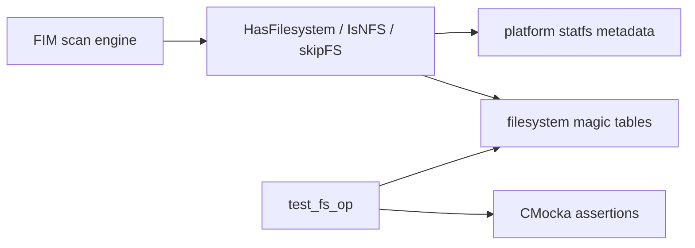
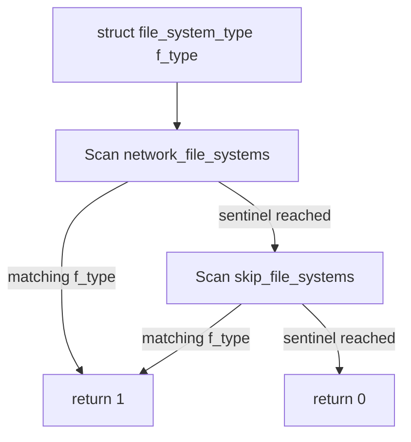
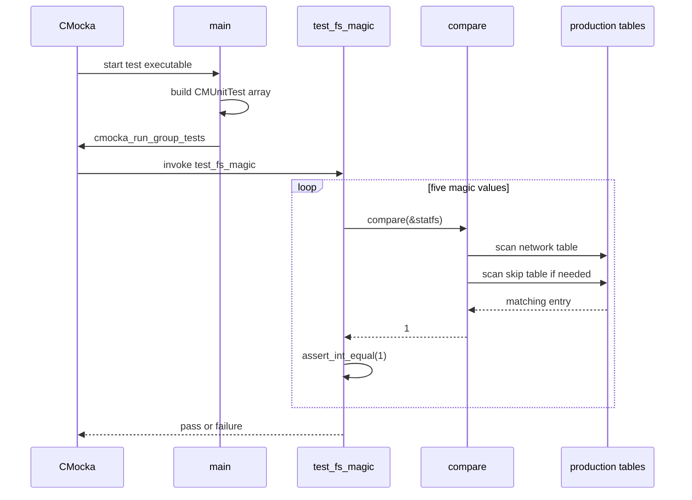
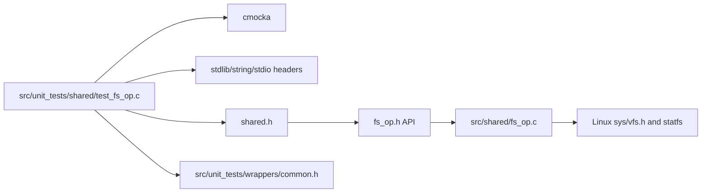

# `test_fs_op`

`test_fs_op` is a small CMocka unit-test module that protects Wazuh’s filesystem-type magic-number catalog. It verifies that representative network and special filesystem identifiers are recognized by the same table-based classification logic used by the test. The production filesystem API is declared in `src/headers/fs_op.h` and implemented in `src/shared/fs_op.c`.

The test is intentionally narrower than the complete filesystem API: it does not call `IsNFS`, `skipFS`, or `HasFilesystem`, and it does not exercise a real mount or `statfs(2)` call. FIM uses `HasFilesystem` while scanning paths; see [syscheckd_core_scan_engine.md](syscheckd_core_scan_engine.md) for that consumer’s broader behavior. Shared filesystem and file-I/O responsibilities are covered in [shared_lib_file_io.md](shared_lib_file_io.md) and [file_os_helpers.md](file_os_helpers.md).

## Purpose and system position

The filesystem adapter translates platform filesystem metadata into Wazuh decisions such as “network filesystem” or “skip link-count checking.” `test_fs_op` validates the stable identifiers behind those decisions through a direct table lookup.



## Components

| Component | Location or symbol | Responsibility |
|---|---|---|
| Test runner | `main` in `src/unit_tests/shared/test_fs_op.c` | Registers the test and invokes `cmocka_run_group_tests`. |
| Test case type | `CMUnitTest` | CMocka’s test descriptor type; one descriptor is created for `test_fs_magic`. |
| Classification helper | `compare` | Scans `network_file_systems` and then `skip_file_systems`; returns `1` on a matching `f_type`, otherwise `0`. |
| Test case | `test_fs_magic` | Supplies five filesystem magic values and asserts that each is recognized. |
| Data model | `struct file_system_type` | Stores a filesystem name, numeric magic value, and classification flag. |
| Production tables | `network_file_systems[]`, `skip_file_systems[]` | Null-terminated catalogs exported by `fs_op.h`. |
| Test support include | `src/unit_tests/wrappers/common.h` | Common unit-test support included by the source; no wrapper behavior is used by this test case. |

The arrays are terminated by an entry whose `name` is `NULL`. The helper relies on that sentinel rather than a separately maintained array length.

## Architecture

```mermaid
graph TD
    Main[main] --> Suite[CMUnitTest table]
    Suite --> Case[test_fs_magic]
    Case --> Compare[compare]
    Compare --> Network[network_file_systems[]]
    Compare --> Skip[skip_file_systems[]]
    Network --> Header[fs_op.h declarations]
    Skip --> Header
    Header --> Impl[src/shared/fs_op.c definitions]
    Case --> Assert[assert_int_equal]
```

The test links against the production table definitions. It does not duplicate the table contents, which means a missing or changed production entry is detected by the assertions.

## Data model and classification

`struct file_system_type` has three fields:

| Field | Meaning |
|---|---|
| `name` | Human-readable filesystem label and the loop’s termination sentinel when `NULL`. |
| `f_type` | Platform filesystem magic number, normally obtained from `statfs`. |
| `flag` | Classification result stored in the production tables; current test logic only compares `f_type`. |

On Linux, `src/shared/fs_op.c` defines representative constants including NFS (`0x6969`), CIFS (`0xFF534D42`), BTRFS (`0x9123683E`), AUFS (`0x61756673`), and overlayfs (`0x794c7630`). NFS and CIFS are in `network_file_systems`; BTRFS, AUFS, overlayfs, and V9FS are in `skip_file_systems`.



The helper does not distinguish which table produced the match. That is appropriate for this regression test because its concern is that known magic numbers remain present in at least one production catalog.

## Test execution flow



There is no suite setup or teardown callback. The test uses a stack-allocated `struct file_system_type`, mutates only its `f_type`, and has no filesystem, network, temporary-file, or process lifecycle.

## Covered cases

| Magic value | Expected source table | Filesystem represented |
|---:|---|---|
| `0x6969` | `network_file_systems` | NFS |
| `0xFF534D42` | `network_file_systems` | CIFS |
| `0x9123683E` | `skip_file_systems` | BTRFS |
| `0x61756673` | `skip_file_systems` | AUFS |
| `0x794c7630` | `skip_file_systems` | overlayfs |

Each value is assigned to `statfs.f_type` and passed to `compare`; the expected result is `1`.

## Relationship to production APIs

The production functions use `statfs` to obtain a path’s filesystem type and then scan the same catalogs:

```mermaid
flowchart LR
    Path[filesystem path] --> Syscall[statfs(path, &stfs)]
    Syscall --> Type[stfs.f_type]
    Type --> IsNFS[IsNFS]
    Type --> SkipFS[skipFS]
    Type --> HasFS[HasFilesystem]
    IsNFS --> Network[network_file_systems]
    SkipFS --> Skip[skip_file_systems]
    HasFS --> Flags[fs_set: nfs/dev/sys/proc]
```

`IsNFS` recognizes network mounts and returns the table flag. `skipFS` recognizes filesystems for which the link-count test should be skipped. `HasFilesystem` handles a separate flag-driven set of Linux filesystem cases, including device, NFS/CIFS, procfs, tmpfs, and sysfs. The current test validates only the catalog identifiers, not these path-based return contracts.

## Dependencies



The included standard headers provide C types and assertions’ supporting declarations. `shared.h` exposes the production filesystem data through Wazuh’s common header chain. `common.h` is included for common test infrastructure, but the provided test does not configure or invoke a mock dependency.

## Build and invocation

The test is registered as `test_fs_op` in `src/unit_tests/shared/CMakeLists.txt`. It is built with the shared-library unit-test target and executes as a standalone CMocka binary. A normal test run is expected to report one test case, `test_fs_magic`, with all five assertions passing.

## Maintenance guidance

When adding or changing a filesystem magic entry:

- Keep both production arrays null-terminated.
- Add a representative assertion to `test_fs_magic` for every identifier whose presence is a compatibility requirement.
- Preserve platform guards in `fs_op.c`; Linux magic values should not be assumed valid on FreeBSD, macOS, or Windows.
- Add negative coverage for an unknown magic value if the lookup helper’s “not found” behavior changes.
- Add tests around `IsNFS`, `skipFS`, or `HasFilesystem` separately when changing path lookup, `statfs` errors, logging, or `fs_set` semantics; those behaviors are outside this module’s present scope.

The main risk this test catches is accidental removal or alteration of a known magic number from the exported catalogs. It does not catch incorrect `statfs` error handling, platform-specific syscall behavior, or mismatches between a table’s `flag` and a caller’s interpretation.

## Related documentation

- [shared_lib.md](shared_lib.md) — shared native-library organization.
- [shared_lib_file_io.md](shared_lib_file_io.md) — neighboring file-I/O abstractions.
- [file_os_helpers.md](file_os_helpers.md) — higher-level filesystem helpers.
- [syscheckd_core_scan_engine.md](syscheckd_core_scan_engine.md) — FIM path scanning and its `HasFilesystem` integration.
