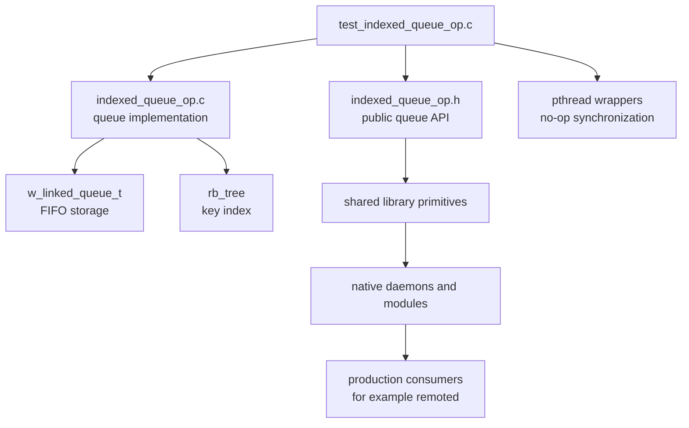
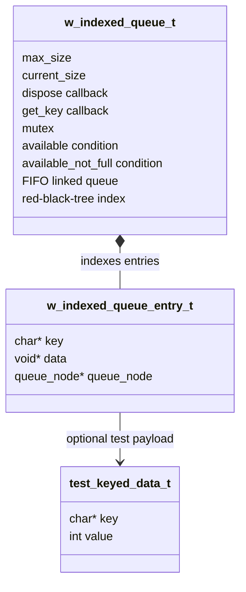
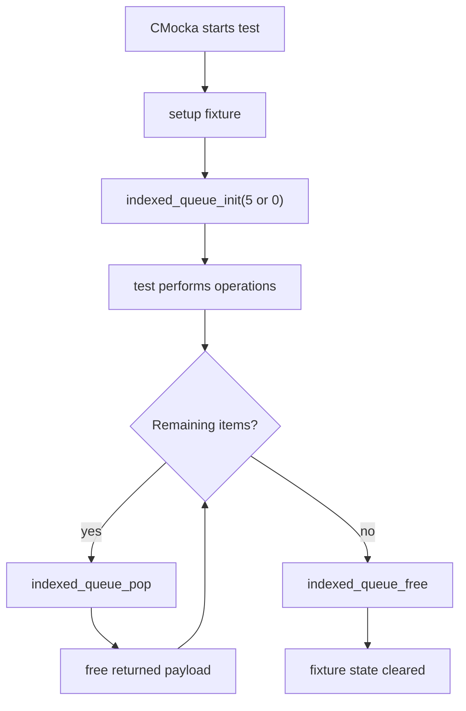
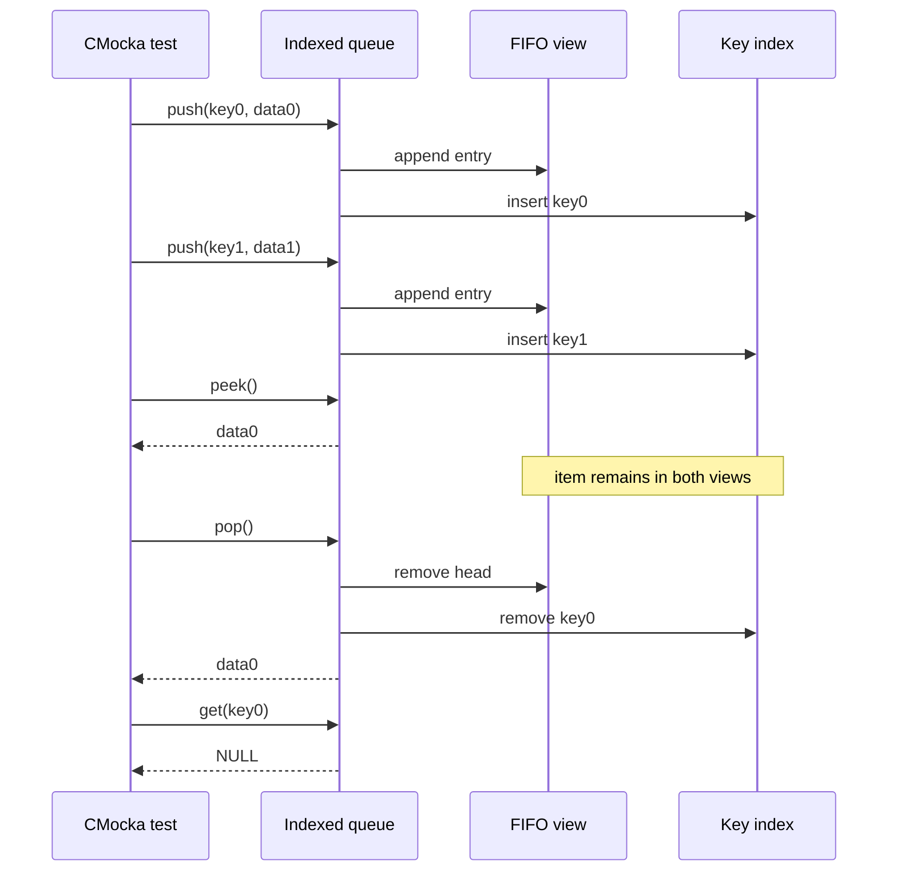
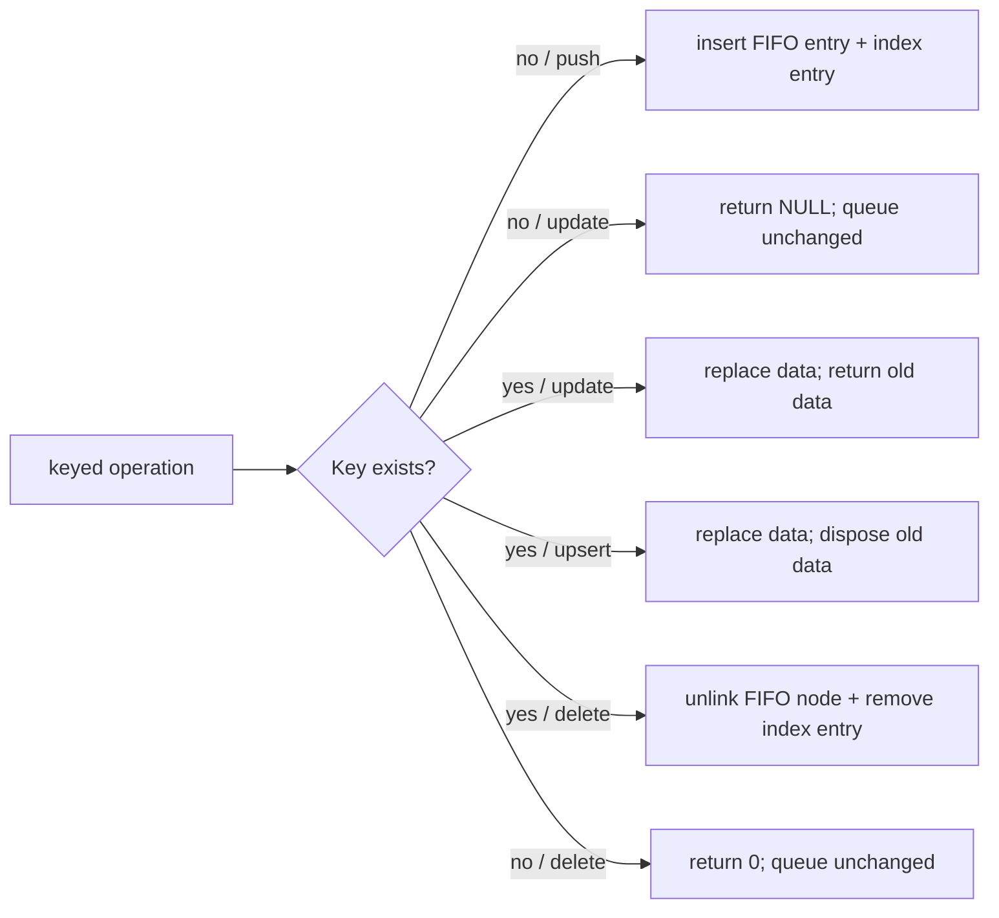
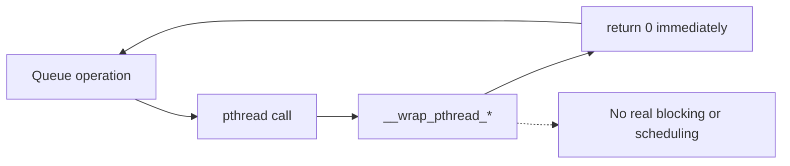
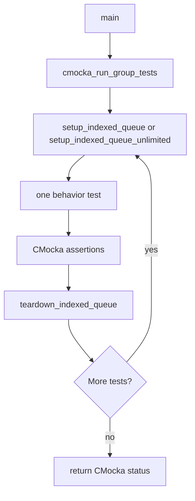

# `test_indexed_queue_op`

`test_indexed_queue_op` is the CMocka unit-test module for Wazuh's indexed queue primitive. It verifies that `w_indexed_queue_t` combines FIFO draining with key-based lookup and mutation, enforces bounded capacity, supports unlimited queues, handles ownership callbacks, and remains safe for invalid inputs.

The implementation and data-structure design are documented in [shared_lib_data_structures.md](shared_lib_data_structures.md) and [headers_concurrency.md](headers_concurrency.md). This page documents the test module itself and avoids duplicating those implementation details.

## Location and scope

| Item | Value |
|---|---|
| Test source | `src/unit_tests/shared/test_indexed_queue_op.c` |
| Test framework | CMocka (`CMUnitTest`) |
| Production header | `src/headers/indexed_queue_op.h` |
| Production implementation | `src/shared/indexed_queue_op.c` |
| Shared support | `shared.h`, linked-queue and red-black-tree primitives |
| Test target | `test_indexed_queue_op` under the shared-library unit-test suite |

## Position in the system

The test sits at the shared-library boundary. It does not exercise a daemon, socket, database, or API endpoint. Instead, it validates the reusable queue abstraction consumed by native daemons and higher-level producer/consumer paths. For an example of production use, see [remoted_secure_connection.md](remoted_secure_connection.md), where keyed control messages are coalesced and later drained.

## Architecture under test

The queue maintains two views of the same logical item: a FIFO node for ordered processing and an indexed entry for key lookup. The entry stores the user data and a reference to its queue node, allowing keyed deletion to remove an item from the middle without rebuilding the queue.

The queue's API contract is summarized in the shared implementation documentation. In this test, the relevant operations are:

- Initialization and state: `indexed_queue_init`, `indexed_queue_free`, `indexed_queue_size`, `indexed_queue_empty`, and `indexed_queue_full`.
- FIFO operations: `indexed_queue_push`, `indexed_queue_pop`, and `indexed_queue_peek`.
- Key operations: `indexed_queue_get`, `indexed_queue_update`, `indexed_queue_delete`, and `indexed_queue_upsert`.
- Ownership/customization: `indexed_queue_set_dispose` and `indexed_queue_set_get_key`.

The test source only calls non-`_ex` operations. The pthread wrappers make the synchronization layer deterministic; blocking behavior of the `_ex` family is covered by the broader shared-library implementation and wrapper tests.

## Test fixture lifecycle

Two setup functions create the two capacity modes used by the suite:

| Fixture | Configuration | Used to verify |
|---|---:|---|
| `setup_indexed_queue` | `indexed_queue_init(5)` | bounded insertion and full-queue rejection |
| `setup_indexed_queue_unlimited` | `indexed_queue_init(0)` | unlimited insertion and FIFO sequences |

`teardown_indexed_queue` repeatedly pops remaining data, frees each returned payload, then calls `indexed_queue_free`. This is important because the tests intentionally use both queue-managed disposal and caller-managed disposal.

## Coverage by behavior

### Initialization and capacity

`test_indexed_queue_init` checks that a bounded queue starts empty, has size zero, and is not full. `test_indexed_queue_init_unlimited` checks the same invariants for `max_size == 0` and explicitly confirms that an empty unlimited queue is never reported full.

`test_indexed_queue_push_full` inserts five distinct keys into the bounded fixture, verifies `indexed_queue_full`, then confirms that a sixth insertion fails and does not alter the queue. `test_indexed_queue_push` additionally confirms that duplicate keys are rejected without changing size.

### Lookup and FIFO behavior

`test_indexed_queue_get` verifies successful lookup by key and a NULL result for a missing key. `test_indexed_queue_peek` verifies that peeking an empty queue returns NULL and that peeking a populated queue returns the head without removing it.

`test_indexed_queue_pop` and `test_indexed_queue_fifo_order` verify oldest-first removal, size decrementing, empty-pop behavior, and index cleanup after dequeue. The tests therefore check both observable views of the queue: the returned order and the disappearance of the corresponding key.

### Update, upsert, and keyed deletion

`test_indexed_queue_update` distinguishes replacement from insertion: an existing key returns its old payload and exposes the new payload through `indexed_queue_get`; an unknown key returns NULL. The test manually frees the old and rejected replacement payloads because no dispose callback is configured for that case.

`test_indexed_queue_upsert` verifies insert-or-replace semantics. The first call creates an item; after installing `test_data_dispose`, the second call replaces the item under the same key, keeps size at one, and makes the new value retrievable. The dispose callback owns cleanup of the replaced value.

`test_indexed_queue_delete` removes a middle item by key, checks the size and index, and confirms that deleting a missing key is a no-op returning zero. `test_indexed_queue_mixed_operations` combines insertion, keyed lookup, middle deletion, and FIFO popping to ensure deleted entries are skipped while surviving entries retain order.

### Callback-based key extraction and disposal

The callback tests use `test_keyed_data_t`, whose key is embedded in the payload:

- `test_get_key_callback` returns the embedded key or NULL for a NULL payload.
- `test_keyed_data_dispose` frees both the embedded string and the structure.
- `test_data_dispose` frees integer payloads.

`test_indexed_queue_get_key_callback` configures both callbacks, pushes two keyed structures, pops the first, and confirms that callback-based removal deletes only the first key from the index. It then cleans both returned structures explicitly before clearing callbacks.

`test_indexed_queue_callback_null_key` supplies a payload whose callback returns NULL. The explicit insertion key still permits insertion and FIFO pop; the pop must not crash when callback extraction cannot produce a key.

`test_indexed_queue_callback_fallback` leaves the key callback unset and verifies that pop still removes the correct indexed entry through the implementation's fallback search path. This covers the slower compatibility path as well as the optimized callback path.

### Invalid parameters and defensive behavior

`test_indexed_queue_null_parameters` verifies:

- NULL queue causes push to return `-1`, get to return NULL, and delete to return `0`.
- NULL key or NULL data is rejected by push.
- NULL lookup key returns NULL.

`test_indexed_queue_set_callbacks_null_queue` confirms that setting callbacks on a NULL queue is harmless. These assertions document defensive behavior expected by callers and prevent regressions in error paths.

## Synchronization isolation

The test defines no-op wrappers for `pthread_mutex_lock`, `pthread_mutex_unlock`, `pthread_cond_wait`, `pthread_cond_signal`, and `pthread_cond_timedwait`. Each wrapper consumes its arguments and returns success immediately.

This isolates data-structure semantics from operating-system scheduling. It does not prove mutual exclusion, wake-up ordering, timeout behavior, or contention behavior. Those concerns belong to the implementation-level queue tests and integration tests that exercise the `_ex` variants with the shared wrapper infrastructure.

## Test execution flow

`main` builds a `CMUnitTest` array and invokes `cmocka_run_group_tests`. Tests that need a queue use setup/teardown registration; initialization-only and NULL-parameter tests manage their own queue where appropriate.

## Test inventory

| Area | Tests |
|---|---|
| Lifecycle/state | `test_indexed_queue_init`, `test_indexed_queue_init_unlimited` |
| Insertion/capacity | `test_indexed_queue_push`, `test_indexed_queue_push_full` |
| Lookup/read | `test_indexed_queue_get`, `test_indexed_queue_peek` |
| Removal/order | `test_indexed_queue_pop`, `test_indexed_queue_fifo_order`, `test_indexed_queue_delete` |
| Replacement | `test_indexed_queue_update`, `test_indexed_queue_upsert` |
| Combined behavior | `test_indexed_queue_mixed_operations` |
| Callback paths | `test_indexed_queue_get_key_callback`, `test_indexed_queue_callback_fallback`, `test_indexed_queue_callback_null_key` |
| Defensive behavior | `test_indexed_queue_null_parameters`, `test_indexed_queue_set_callbacks_null_queue` |

## Ownership notes for maintainers

The test intentionally demonstrates both ownership models:

1. Without a dispose callback, the caller frees data returned by `pop` and any rejected or replaced payloads that the API does not consume.
2. With a dispose callback, keyed deletion and upsert can release old payloads inside the queue implementation.
3. `pop` returns the payload to the caller; the test then frees it, even when a dispose callback was previously configured.
4. Teardown drains the queue before destroying the container, preventing payload leaks while avoiding double disposal by resetting callbacks in callback-focused tests.

When adding tests, make ownership explicit. A failure in this area can appear as a queue assertion failure but actually be a double-free, leak, or stale index entry.

## Related documentation

- [headers_concurrency.md](headers_concurrency.md) — public queue contract, callback configuration, concurrency model, and operation semantics.
- [shared_lib_data_structures.md](shared_lib_data_structures.md) — linked-queue/red-black-tree composition and complexity model.
- [shared_lib.md](shared_lib.md) — shared-library role and neighboring primitives.
- [remoted_secure_connection.md](remoted_secure_connection.md) — production keyed-queue usage and control-message flow.
- [Agent_&_Manager_Native_Daemons_(C).md](Agent_%26_Manager_Native_Daemons_%28C%29.md) — native daemon collection that links the shared primitives.
