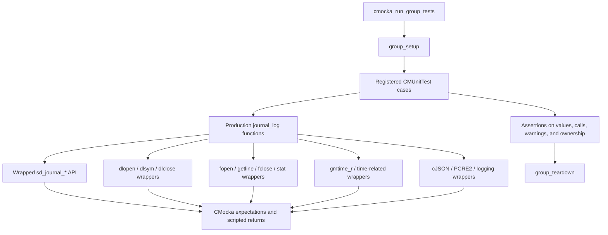
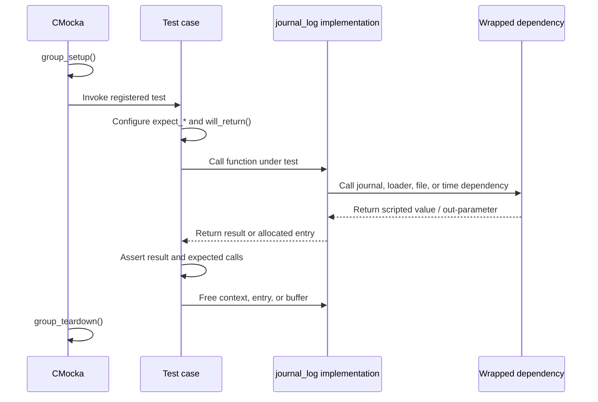
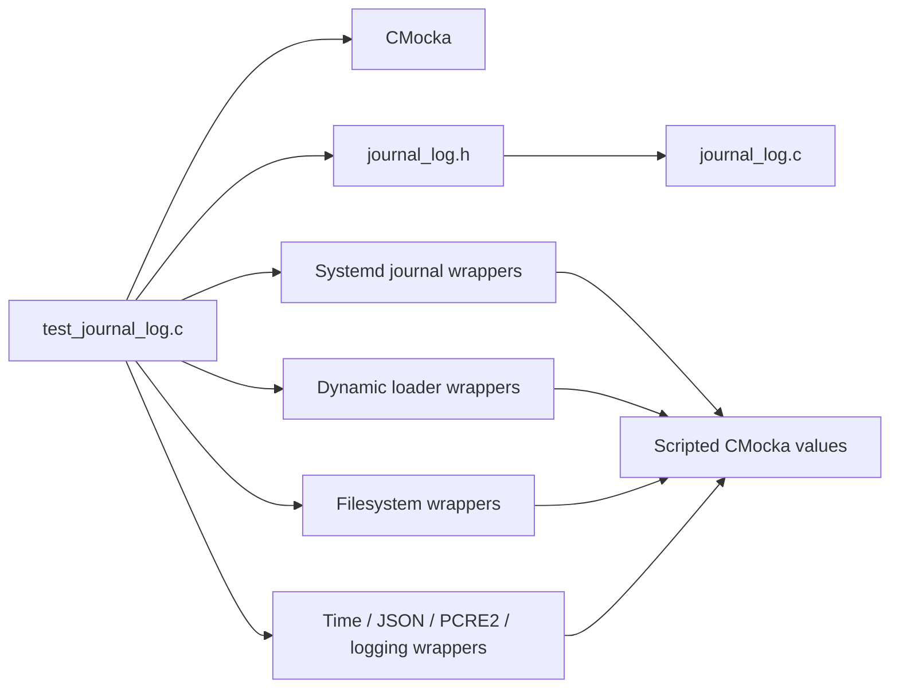
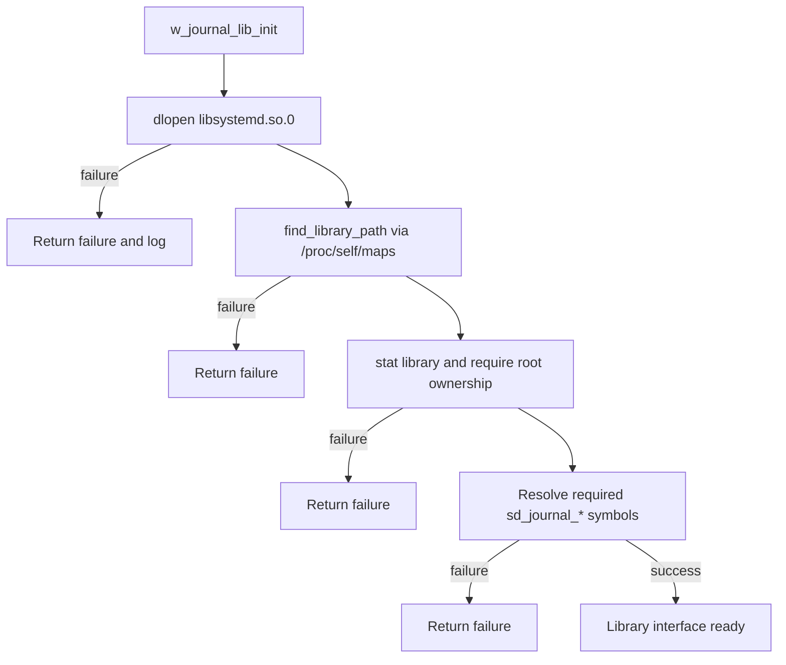
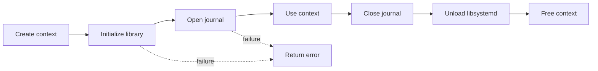
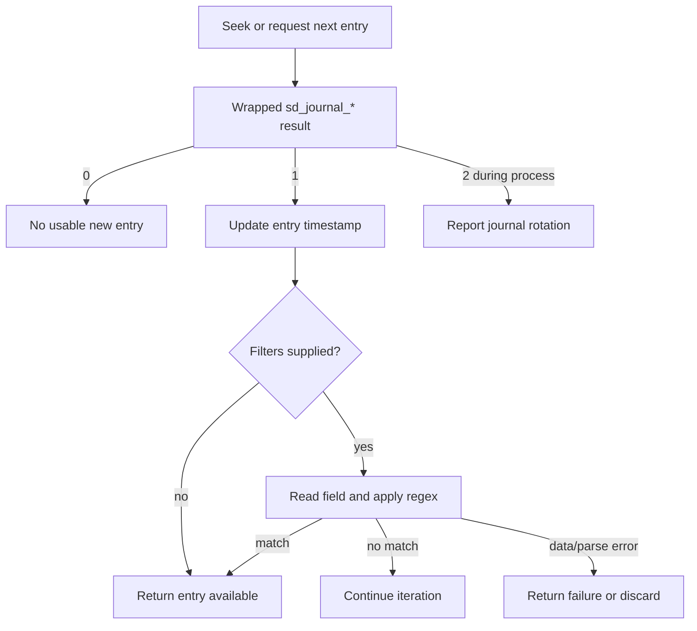
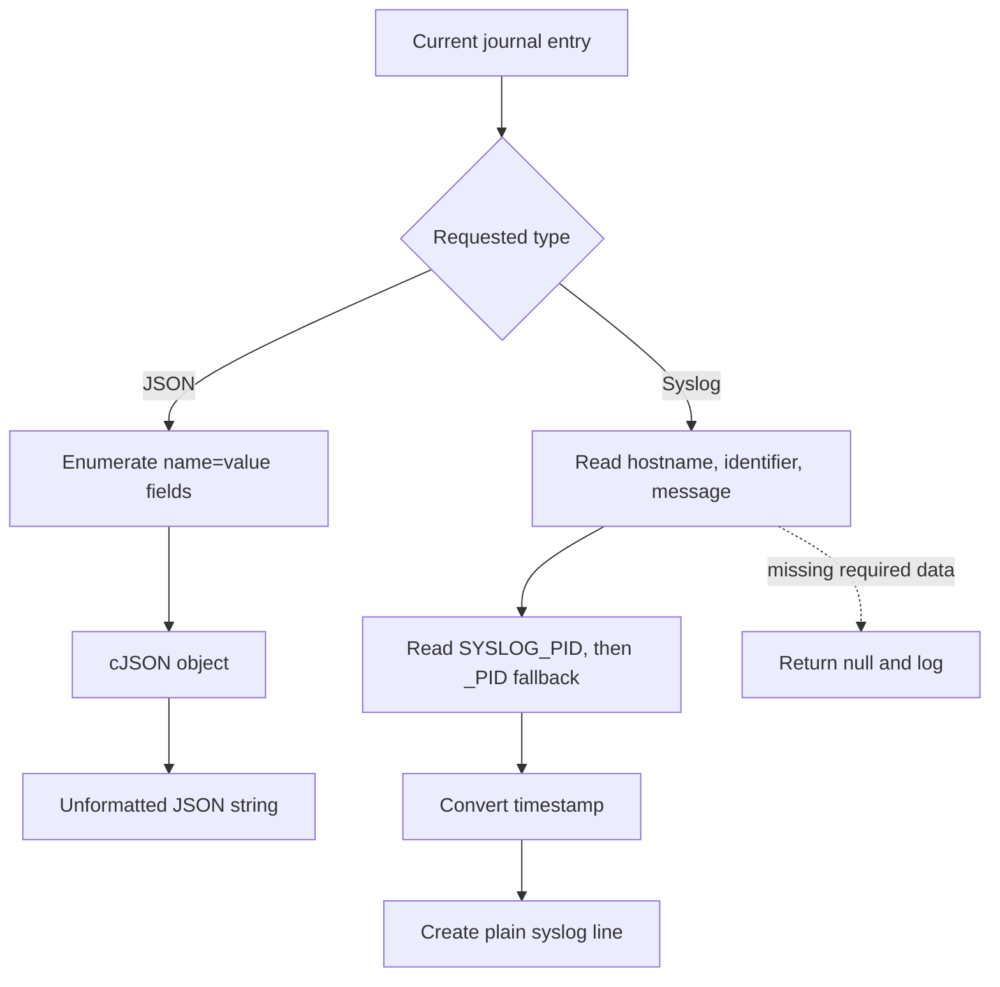

# Test infrastructure for `logcollector/journal_log`

`test_infrastructure` is the deterministic CMocka test harness for the journald reader implementation. It is centered on [`src/unit_tests/logcollector/test_journal_log.c`](src/unit_tests/logcollector/test_journal_log.c) and verifies library loading, journal navigation, filtering, entry conversion, resource cleanup, and journal rotation handling without requiring a live systemd journal.

The module is a leaf of the logcollector journal-test area. Production behavior is described in [`logcollector_journald.md`](logcollector_journald.md); broader logcollector responsibilities are covered by [`logcollector.md`](logcollector.md) and [`logcollector_core.md`](logcollector_core.md). This document focuses on how the tests isolate and exercise that behavior.

## Scope and role

The test file supplies four related capabilities:

- A CMocka runner that registers the complete test inventory and provides suite setup and teardown.
- Linker/runtime wrappers for systemd journal functions, dynamic loading, filesystem access, time conversion, logging, JSON, and regular-expression seams.
- Scripted interaction tests for the journald implementation exposed by `journal_log.h`.
- Assertions for both normal results and failure contracts, including return values, null results, warnings, and cleanup calls.

It is not a production journald implementation and does not replace integration tests against the real `libsystemd` API. Its value is precise control over each external result and repeatable coverage of error branches.

## Architecture

The harness sits between the test cases and the production code. Tests call the real journald functions under test, while external dependencies are intercepted at the wrapper boundary. This preserves production control flow while removing environmental variability.

## Components

| Component | Location or symbol | Responsibility |
|---|---|---|
| Test suite | `test_journal_log.c` | Declares fixtures, wrappers, tests, and `main`. |
| Suite setup | `group_setup` | Enables test mode and disables live PCRE2 wrappers. |
| Suite teardown | `group_teardown` | Restores global test mode and re-enables PCRE2 wrappers. |
| Test runner | `main` | Builds the `CMUnitTest` array and invokes CMocka. |
| Journal API seams | `__wrap_sd_journal_*` | Script calls and out-parameters for journal open, seek, iteration, field access, timestamps, file descriptors, and rotation processing. |
| Loader seams | `__wrap_dlopen`, `__wrap_dlsym`, `__wrap_dlclose`, `__wrap_dlerror` | Simulate secure library discovery, symbol resolution, and unloading. |
| Filesystem seams | `__wrap_fopen`, `__wrap_getline`, `__wrap_fclose`, `__wrap_stat` | Model `/proc/self/maps`, library ownership, and path-discovery failures. |
| Conversion seams | `__wrap_gmtime_r`, JSON and logging wrappers | Control timestamp conversion, JSON construction, output formatting, and diagnostic assertions. |

The extracted `stat`, `timeval`, and `tm` components are test seams or C library data types rather than independent modules.

## Test execution lifecycle

Most tests that need a journal context repeat the same controlled initialization: load `libsystemd.so.0`, inspect a mocked `/proc/self/maps` line, verify root ownership, resolve the required symbols, and open the journal. The corresponding teardown verifies journal close and dynamic-library unload.

## Dependency and isolation model

The tests validate the production implementation through its public or test-visible function contracts. They do not invoke actual journal sockets, `dlopen`, `/proc` parsing, or host-specific timestamp behavior. This makes branch-level tests reproducible, but it also means deployment and ABI compatibility still require higher-level testing.

## Mocking strategy

### Dynamic loading and library discovery

`w_journal_lib_init` is tested as a staged pipeline:

Tests explicitly cover `dlopen` failure, map-file failure, non-root ownership, symbol-resolution failure, and successful initialization. The success path expects all journal symbols used by the implementation, so adding a new external symbol should be accompanied by a wrapper expectation and a failure-path test.

### Journal operations

The `__wrap_sd_journal_*` functions use CMocka return queues. Functions that write through pointers copy the scripted value into the supplied output, including journal timestamps, field payloads, enumerated entry data, cutoff timestamps, and realtime timestamps. This allows tests to distinguish:

- no entry (`0`), new entry (`1`), and rotation (`2`) results;
- successful field retrieval versus `-1` failure;
- valid `name=value` payloads versus malformed payloads;
- unchanged, changed, and rotated journal state.

### Other seams

- `fopen`, `getline`, `fclose`, and `stat` control `/proc/self/maps` parsing and ownership checks.
- `gmtime_r` controls valid and failed timestamp conversion.
- `isDebug` controls diagnostic-only filtering behavior.
- cJSON wrappers verify object creation, field insertion, printing, and deletion.
- PCRE2 wrappers are disabled for the suite so regex behavior can be tested without live wrapper side effects.
- Logging wrappers verify warnings and debug messages where failure behavior is observable.

## Functional coverage

| Area | Functions exercised | Representative scenarios |
|---|---|---|
| Ownership and symbol loading | `is_owned_by_root`, `load_and_validate_function`, `find_library_path`, `w_journal_lib_init` | Root/non-root files, `stat` failure, missing symbols, loader failure, successful symbol table creation. |
| Time conversion | `w_get_epoch_time`, `w_timestamp_to_string`, `w_timestamp_to_journalctl_since` | Valid timestamps, exact formatted output, failed `gmtime_r`. |
| Context lifecycle | `w_journal_context_create`, `w_journal_context_free`, `w_journal_context_update_timestamp` | Null arguments, open failure, timestamp failure fallback, close and unload. |
| Journal navigation | `w_journal_context_seek_most_recent`, `w_journal_context_seek_timestamp`, `w_journal_context_next_newest` | Tail seek failure, old/future timestamps, end of journal, timestamp updates, new entries. |
| Filtering | `w_journal_filter_apply`, `w_journal_context_next_newest_filtered` | Missing fields, ignored fields, malformed fields, empty values, regex match/non-match, debug logging. |
| JSON conversion | `entry_as_json`, `get_field_ptr` | Empty entries, malformed data, empty values, successful key/value extraction, cleanup after failure. |
| Syslog conversion | `create_plain_syslog`, `entry_as_syslog` | PID, system PID fallback, no PID, missing hostname/message, unknown tag, timestamp failure. |
| Entry abstraction | `w_journal_entry_dump`, `w_journal_entry_to_string` | JSON and syslog variants, invalid type, null input, failed conversion, serialized output. |
| Rotation detection | `w_journal_rotation_detected` | Null context, missing descriptor, no change, file change, rotation result. |

The test suite intentionally asserts the implementation’s conventions rather than assuming one universal return convention. For example, `0` can mean “no new entry” or successful completion depending on the function, while `1` represents a matching/new condition in several navigation and filtering paths.

## Key process flows

### Context initialization and cleanup

Tests verify that failure before ownership of a resource does not trigger an invalid cleanup, while successful paths always close the journal and unload the library.

### Navigation and filtering

### Entry serialization

For syslog output, a missing identifier becomes `unknown`; PID is optional, and `_PID` is used when `SYSLOG_PID` is unavailable. Missing hostname, message, or timestamp causes the entry to be discarded.

## Maintainer guidance

When changing the journald implementation or adding a systemd call:

1. Add or update the corresponding wrapper in `test_journal_log.c`.
2. Add the symbol to the successful initialization expectations and test the resolution failure path if it changes initialization requirements.
3. Script every out-parameter explicitly; implicit mock values make failures order-dependent.
4. Preserve the resource pattern: successful contexts close the journal and unload the library, and allocated JSON/string/entry values are freed.
5. Keep setup and teardown global-state changes balanced, especially `test_mode` and PCRE2 wrapper enablement.
6. Add both the success case and the relevant null, malformed-input, dependency-failure, or cleanup case.

The repeated context bootstrap code is verbose but documents the exact external interactions required by each scenario. Refactoring it should retain the same expectation visibility and should not hide which dependency failure a test is exercising.

## Limitations

- The suite is primarily unit and interaction testing; it does not validate a real systemd journal, installed library ABI, permissions, or host journal rotation.
- Tests depend on linker wrapping and Linux-style `/proc/self/maps` behavior.
- CMocka return queues are order-sensitive. Adding a production call can invalidate several tests even when the final result is unchanged.
- The source file is the authoritative test inventory; this document groups cases by behavior instead of duplicating every test name.

## Related documentation

- [`logcollector_journald.md`](logcollector_journald.md) — production journald reader behavior.
- [`logcollector.md`](logcollector.md) — logcollector module context.
- [`logcollector_core.md`](logcollector_core.md) — shared logcollector lifecycle and infrastructure.
- [`Localfile_Config_journald.md`](Localfile_Config_journald.md) — journald configuration and configuration-facing behavior.
