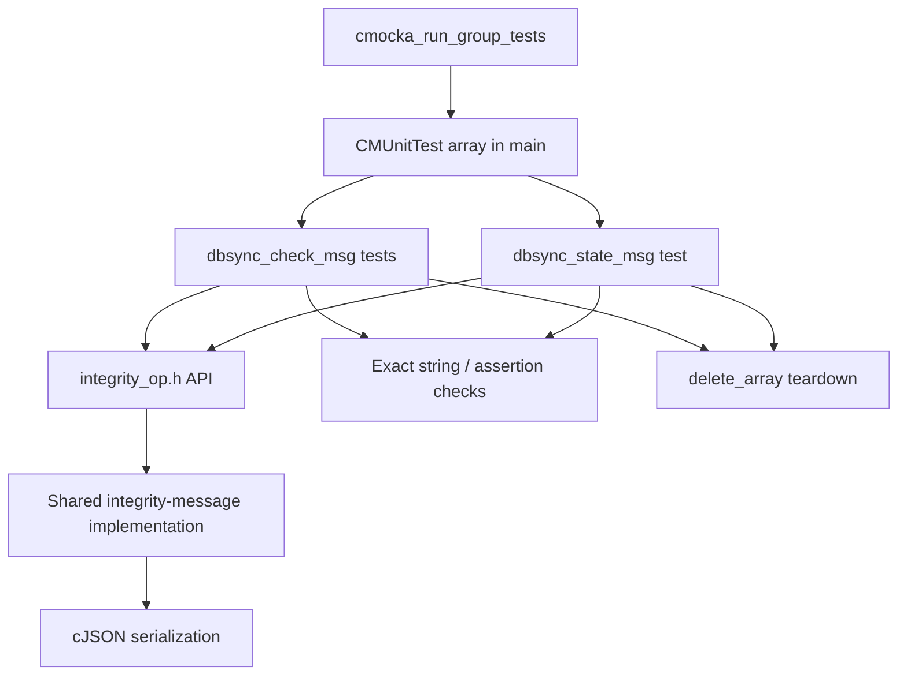
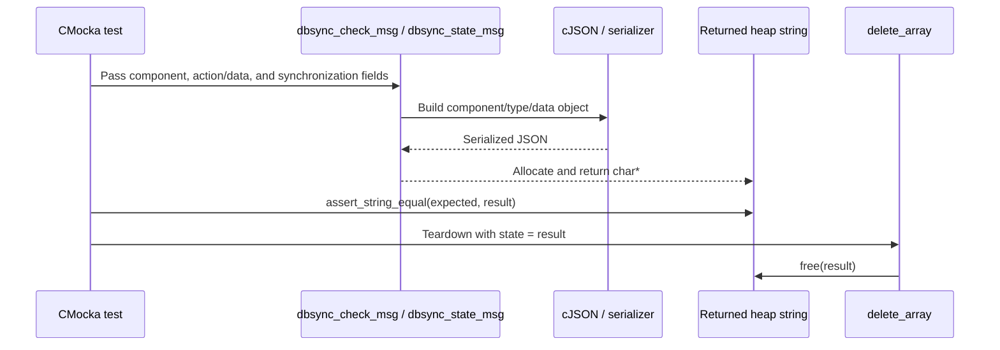
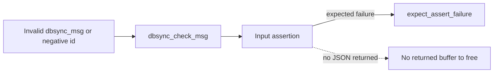
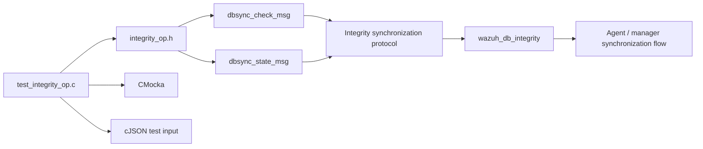

# `test_integrity_op` Test Module

## Introduction

`test_integrity_op` is a focused CMocka unit-test suite for the shared integrity-message helpers declared by `integrity_op.h`. It verifies that DB synchronization control messages are serialized into the exact JSON wire format expected by Wazuh components, and that invalid message types and identifiers are rejected through assertions.

The test file does not implement synchronization or checksum calculation. Those production responsibilities are documented in [`wazuh_db_integrity.md`](wazuh_db_integrity.md). This document explains how the unit test protects the message-construction boundary used by that subsystem.

## Scope and responsibilities

The suite covers two production helpers:

| Helper | Tested behavior |
|---|---|
| `dbsync_check_msg()` | Builds `integrity_check_left`, `integrity_check_right`, `integrity_check_global`, and `integrity_clear` JSON messages. |
| `dbsync_state_msg()` | Wraps a caller-supplied `cJSON` object in a `state` message. |

The test fixture also owns returned heap strings. `delete_array()` is registered as the CMocka teardown for tests that allocate a result, ensuring each successful serialization test releases the returned buffer.

## Architecture



The dependency direction is deliberately narrow: test cases call the message API, compare its serialized output, and clean up returned memory. Database connections, sockets, agents, and synchronization workers are outside this unit’s scope.

## Test components

### `main`

`main()` registers seven test entries and passes them to `cmocka_run_group_tests()`:

- four normal `dbsync_check_msg()` serialization cases;
- two assertion-failure cases;
- one `dbsync_state_msg()` serialization case.

The normal serialization tests use `cmocka_unit_test_teardown()` so the returned string is freed after each test. Assertion tests do not retain a result because the call is expected to abort through CMocka’s assertion interception.

### `delete_array`

`delete_array(void **state)` treats the CMocka state value as a heap-allocated `char *` and calls `free()`. Each successful message test stores its returned JSON string in `*state` before asserting its contents.

Despite its historical name, the callback releases one serialized message string; it does not traverse or delete an array.

### `test_dbsync_check_msg_*`

All check-message tests use the same representative values:

```text
component = "wazuh-testing"
id        = 1569926892
begin     = "start"
end       = "top"
tail      = "tail"
checksum  = "51ABB9636078DEFBF888D8457A7C76F85C8F114C"
```

The tests distinguish message-specific fields:

| Test | Action | Expected `data` fields |
|---|---|---|
| `test_dbsync_check_msg_left` | `INTEGRITY_CHECK_LEFT` | `id`, `version`, `begin`, `end`, `tail`, `checksum` |
| `test_dbsync_check_msg_right` | `INTEGRITY_CHECK_RIGHT` | `id`, `version`, `begin`, `end`, `checksum` |
| `test_dbsync_check_msg_global` | `INTEGRITY_CHECK_GLOBAL` | `id`, `version`, `begin`, `end`, `checksum` |
| `test_dbsync_check_msg_clear` | `INTEGRITY_CLEAR` | `id`, `version` only |

Each test compares the complete JSON string with `assert_string_equal()`. This intentionally checks field names, action mapping, version value, omission of irrelevant parameters, and ordering produced by the serializer—not merely whether the result parses as JSON.

### `test_dbsync_check_msg_msg_out_of_bounds`

Passes enum value `6`, which is outside the supported `dbsync_msg` action range, and expects `dbsync_check_msg()` to fail an assertion. This protects the production switch/table lookup from silently producing an invalid protocol message.

### `test_dbsync_check_msg_invalid_id`

Passes `-2` as the message identifier and expects an assertion failure. The test documents that integrity message IDs must satisfy the helper’s non-negative input contract.

### `test_dbsync_state_msg`

Creates a `cJSON` object containing `{ "test": "test" }`, passes it to `dbsync_state_msg()`, and verifies:

```json
{"component":"wazuh-testing","type":"state","data":{"test":"test"}}
```

The returned serialized string is freed by `delete_array()`. The test also exercises the helper’s handling of a caller-supplied `cJSON` payload; ownership and destruction of that payload follow the production helper’s contract.

## Message data flow



For assertion-failure cases, the flow stops inside the helper and CMocka records the expected failure:



## Component relationships



The production protocol consumer is the integrity subsystem. Its broader checksum, deletion, sync-state, and router interactions are intentionally referenced rather than duplicated here; see [`wazuh_db_integrity.md`](wazuh_db_integrity.md), especially its message flow and relationship sections.

## Verification matrix

| Category | Tests | Contract verified |
|---|---|---|
| Left-range message | `test_dbsync_check_msg_left` | Includes `tail` and checksum range metadata. |
| Right/global messages | `test_dbsync_check_msg_right`, `test_dbsync_check_msg_global` | Uses the correct action type and excludes `tail`. |
| Clear message | `test_dbsync_check_msg_clear` | Emits only identity/version data. |
| Invalid enum | `test_dbsync_check_msg_msg_out_of_bounds` | Unsupported action is rejected. |
| Invalid identifier | `test_dbsync_check_msg_invalid_id` | Negative ID is rejected. |
| State message | `test_dbsync_state_msg` | Arbitrary cJSON state is wrapped with component and `state` type. |
| Memory cleanup | Teardown on all successful tests | Returned strings are released after assertions. |

## Maintenance guidance

When changing the integrity-message schema or enum values:

1. Update the expected complete JSON strings in this file’s test source.
2. Preserve tests for omitted fields; omission is part of the action-specific protocol contract.
3. Extend the out-of-range assertion if the valid enum interval changes.
4. Keep ownership explicit: any newly returned heap string must be assigned to CMocka state and released by a teardown.
5. If the production helper changes from assertion-based validation to error returns, replace `expect_assert_failure()` with return-code and cleanup assertions.

## Related documentation

- [`wazuh_db_integrity.md`](wazuh_db_integrity.md) — production checksum, deletion, synchronization-status, and global-group-integrity logic.
- [`dbsync_public_api.md`](dbsync_public_api.md) — shared DB synchronization API concepts.
- [`dbsync.md`](dbsync.md) — DB synchronization subsystem overview.
- [`test_infrastructure.md`](test_infrastructure.md) — CMocka test-harness conventions used elsewhere in the repository.
