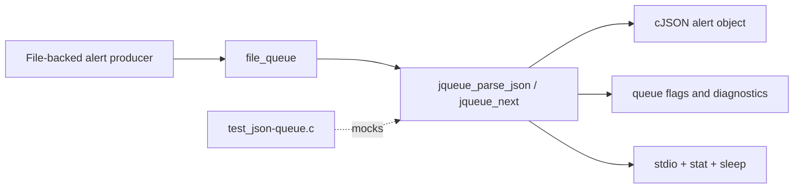
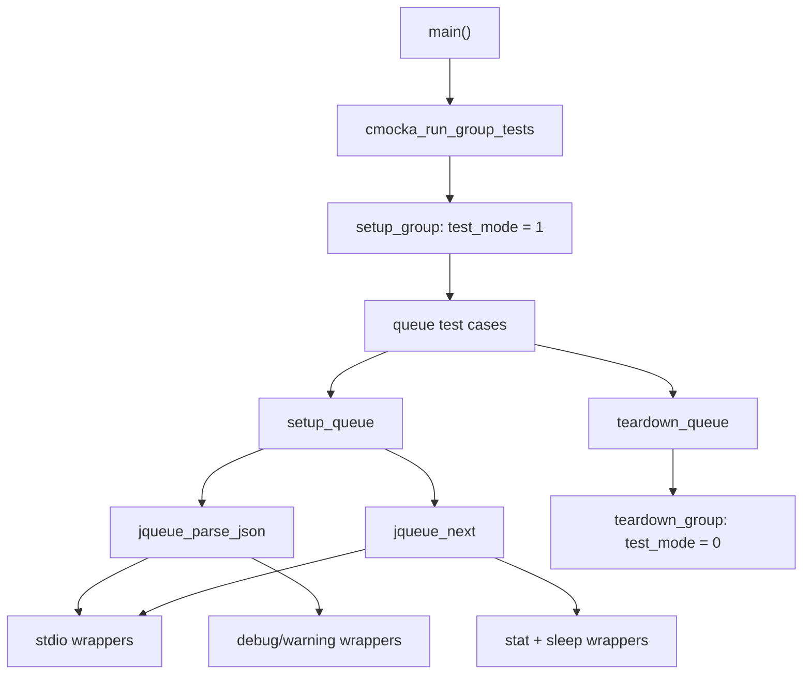
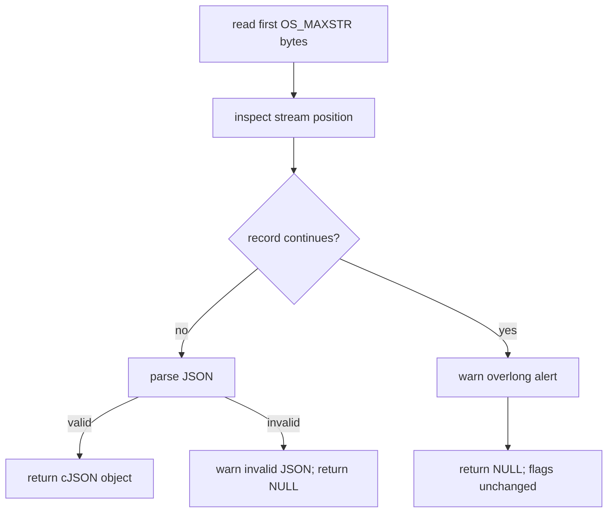
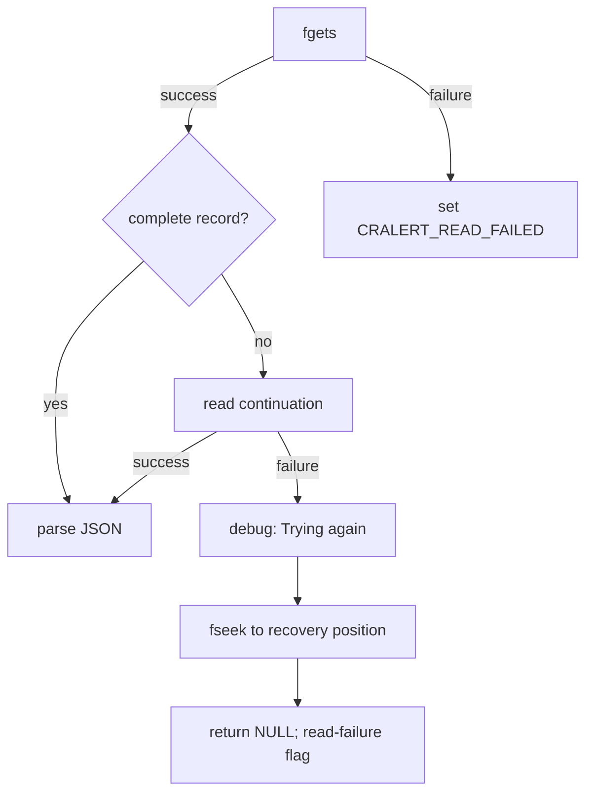
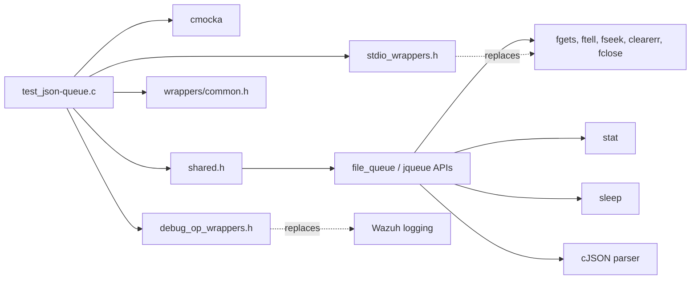
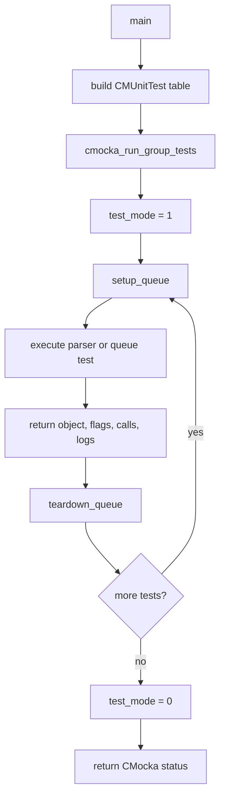

# `test_json-queue`

`test_json-queue` is the CMocka unit-test module for Wazuh’s native JSON file-queue reader. It verifies how a queue reads newline-delimited JSON alerts, rejects malformed or overlong records, marks stream-read failures, retries a partial read, and handles a file-stat failure while advancing the queue.

The test source is `src/unit_tests/shared/test_json-queue.c`. The production queue is part of the shared native library and is exposed through the queue/file-queue interfaces. This document describes the contract visible through the test; details of common file operations and shared-library conventions are documented in [shared_lib_file_io.md](shared_lib_file_io.md), [shared_lib.md](shared_lib.md), and [test_infrastructure.md](test_infrastructure.md).

## Purpose and system position

The JSON queue is a persistence boundary between file-backed alert producers and consumers. A queue entry is read from a `FILE *`, parsed into a `cJSON` object, and returned to the caller. The queue also owns operational state such as the current stream position, the backing file name, and read-error flags.



The test is not an alert processor. It isolates the queue reader from the real filesystem, libc I/O, timing, and logging so that parsing and recovery behavior can be checked deterministically.

## Architecture

| Component | Responsibility |
|---|---|
| `CMUnitTest` | CMocka test descriptor used to register each test. |
| `main` | Registers the queue tests and runs the CMocka group. |
| `setup_group` / `teardown_group` | Enables and restores global `test_mode` for wrapper-controlled behavior. |
| `setup_queue` | Allocates a zeroed `file_queue`, assigns a synthetic open stream `(FILE *)1`, and passes it as test state. |
| `teardown_queue` | Releases the per-test queue fixture. |
| `jqueue_parse_json` | Reads and parses a single JSON alert, enforcing record-size and read-error behavior. |
| `jqueue_next` | Higher-level queue advancement path exercised by the stat-failure test; it closes an unusable stream. |
| stdio/stat wrappers | Simulate `fgets`, `ftell`, `fseek`, `clearerr`, `fclose`, `sleep`, and `stat`. |
| debug wrappers | Assert warning/debug messages without emitting real logs. |



## Queue data and state

The fixture initializes only the fields needed by the tested paths:

- `fp` is a synthetic non-null stream. Wrapper expectations match this pointer exactly.
- `flags` starts at zero and is checked after every operation.
- `file_name` is populated only for cases that assert diagnostics or file metadata behavior.
- The parser uses `ftell` values as observable positions. The tests model the initial position, the end of the first buffer, and subsequent positions when a record spans multiple reads.

The important flag is `CRALERT_READ_FAILED`. A direct `fgets` failure sets this flag. A retry attempt that also fails leaves the flag set. Malformed JSON and overlong alerts return `NULL` without setting this read-failure flag because the stream was readable but the content was unusable.

```mermaid
stateDiagram-v2
    [*] --> Ready: setup_queue
    Ready --> Parsed: readable valid JSON
    Ready --> Invalid: readable malformed JSON
    Ready --> Overlong: record exceeds limit
    Ready --> ReadFailed: fgets returns NULL
    ReadFailed --> ReadFailed: retry/fseek path also fails
    Ready --> StatRecovery: jqueue_next sees stat failure
    StatRecovery --> Closed: retry stat fails; fclose(fp)
    Parsed --> [*]
    Invalid --> [*]
    Overlong --> [*]
    ReadFailed --> [*]
    Closed --> [*]
```



## JSON parsing flow

`jqueue_parse_json` begins by recording the current position and reading a bounded line into a buffer of `OS_MAXSTR + 1` bytes. A valid newline-terminated JSON object is parsed with cJSON and returned. The test expects the queue flags to remain unchanged on success.

```mermaid
sequenceDiagram
    participant Test
    participant Queue as jqueue_parse_json
    participant IO as ftell/fgets/fseek
    participant JSON as cJSON
    participant Log as Wazuh logging
    Test->>Queue: queue with fp and flags
    Queue->>IO: ftell(fp)
    Queue->>IO: fgets(buffer, OS_MAXSTR, fp)
    alt valid JSON
        IO-->>Queue: newline-terminated record
        Queue->>JSON: parse record
        JSON-->>Queue: cJSON object
        Queue-->>Test: object; flags unchanged
    else malformed JSON
        IO-->>Queue: readable invalid record
        Queue->>JSON: parse fails
        Queue->>Log: warn invalid JSON with file and payload
        Queue-->>Test: NULL; flags unchanged
    else read failure
        IO-->>Queue: NULL
        Queue->>Queue: set CRALERT_READ_FAILED
        Queue-->>Test: NULL
    end
```

### Valid input

`test_jqueue_parse_json_valid` supplies `{"test":"valid_json"}` followed by a newline. It models `ftell` returning `1` before the read and `23` afterward, expects `fgets` to use the queue’s stream, and compares the returned object’s unformatted representation with the original JSON.

### Malformed input

The supplied source also contains `test_jqueue_parse_json_invalid`, which is not listed in the provided core-component inventory. It supplies an unterminated JSON value, expects `NULL`, preserves `queue->flags == 0`, and verifies the warning:

```text
Invalid JSON alert read from '/home/test': '{"test":"invalid_value'
```

This case establishes that syntax errors are content errors, not transport/read errors.

### Overlong input

`test_jqueue_parse_json_overlong_alert` returns a full `OS_MAXSTR`-byte buffer, then models additional stream positions and a trailing short buffer. The queue must reject the logical alert, emit `Overlong JSON alert read from '/home/test'`, return `NULL`, and leave `flags` unchanged.



## Read failure and retry behavior

`test_jqueue_parse_json_fgets_fail` models an immediate `fgets` failure after an initial position check. The expected result is `NULL` with `CRALERT_READ_FAILED` set.

`test_jqueue_parse_json_fgets_fail_and_retry` models a full first buffer followed by a failed continuation read. The queue must log:

```text
Can't read from '/home/test'. Trying again
```

and invoke `fseek` as part of recovery. Because the retry still cannot produce a complete alert, the final result is `NULL` and `CRALERT_READ_FAILED` remains set.



The test verifies the recovery call, not a successful replay. It therefore protects the retry contract without depending on actual file rotation or filesystem timing.

## Queue advancement and stat recovery

`test_jqueue_parse_json_stat_fail_and_retry` exercises `jqueue_next`, rather than calling the parser directly. It models an empty read at position zero, clears the stream error, and then returns `-1` from `stat` twice for `/home/test`. The queue sleeps for one second between attempts, warns with the `(1118)` diagnostic, closes the synthetic stream, sets `queue->fp` to `NULL`, and returns `NULL` with flags still zero.

```mermaid
sequenceDiagram
    participant Test
    participant Next as jqueue_next
    participant IO as clearerr/fgets/stat/sleep/fclose
    participant Log as warning logger
    Test->>Next: queue with fp and file_name
    Next->>IO: clearerr(fp)
    Next->>IO: ftell(fp), fgets(...)
    IO-->>Next: no record; errno = ENOENT
    Next->>IO: stat('/home/test')
    IO-->>Next: failure
    Next->>IO: sleep(1)
    Next->>IO: stat('/home/test')
    IO-->>Next: failure
    Next->>Log: warn (1118) with errno details
    Next->>IO: fclose(fp)
    Next-->>Test: NULL; fp = NULL; flags = 0
```

This path is important because a queue can encounter a missing or rotated backing file while reading. The test checks cleanup and diagnostic behavior, but does not model a successful file replacement or reopen.

## Dependency and mocking boundaries



The wrappers make the tests deterministic:

- `__wrap_fgets` controls whether a complete line, a full-size fragment, or `NULL` is returned.
- `__wrap_w_ftell` supplies exact stream positions used for continuation and retry decisions.
- `__wrap_fseek` confirms that the retry path seeks back to a recovery position.
- `__wrap_clearerr`, `__wrap_stat`, `__wrap_sleep`, and `__wrap_fclose` model queue recovery and cleanup.
- `__wrap__mwarn` and `__wrap__mdebug2` assert diagnostic text and file-name interpolation.

These are test-only substitutions. Runtime callers depend on the real shared-library implementations; see [shared_lib_file_io.md](shared_lib_file_io.md) for the surrounding file-I/O boundary.

## Test lifecycle and registration



The source registers six tests in `main`: valid JSON, malformed JSON, overlong input, immediate `fgets` failure, failed continuation with retry, and stat failure with retry. The provided core-component list names the setup/teardown functions and five parser-related cases but omits `test_jqueue_parse_json_invalid`; the source content shows that it is part of the executed test table.

## Coverage matrix

| Behavior | Test | Expected result |
|---|---|---|
| Valid newline-delimited JSON | `test_jqueue_parse_json_valid` | cJSON object; flags remain zero |
| Malformed JSON | `test_jqueue_parse_json_invalid` | `NULL`; invalid-content warning; flags remain zero |
| Alert exceeds `OS_MAXSTR` | `test_jqueue_parse_json_overlong_alert` | `NULL`; overlong warning; flags remain zero |
| Immediate stream read failure | `test_jqueue_parse_json_fgets_fail` | `NULL`; `CRALERT_READ_FAILED` |
| Continuation read fails | `test_jqueue_parse_json_fgets_fail_and_retry` | debug retry message, `fseek`, `NULL`, read-failure flag |
| Backing file metadata unavailable | `test_jqueue_parse_json_stat_fail_and_retry` | retry delay, warning, stream closed, `fp == NULL` |

## Limitations and maintenance notes

The suite does not establish behavior for valid JSON arrays/scalars, multiple alerts in one call, partial valid records completed after a successful retry, successful reopen after rotation, `fseek` failure semantics, `stat` succeeding on the second attempt, cJSON allocation failure, or exact handling of `errno` values other than `ENOENT`. Those cases should be added if they are part of the production contract.

When changing queue parsing, preserve the distinction between transport failures and content failures: malformed or overlong data must not be mislabeled as `CRALERT_READ_FAILED`. Preserve cleanup on `jqueue_next` failure as well; the stat-failure test explicitly requires the stream to be closed and cleared.

## Related documentation

- [shared_lib.md](shared_lib.md) — shared native-library role and neighboring utilities.
- [shared_lib_file_io.md](shared_lib_file_io.md) — file and stream helpers surrounding the queue.
- [shared_lib_data_structures.md](shared_lib_data_structures.md) — shared C data-structure conventions.
- [test_infrastructure.md](test_infrastructure.md) — common test harness and wrapper patterns.
