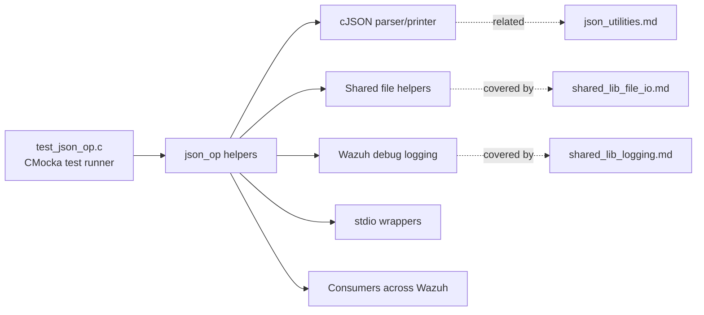
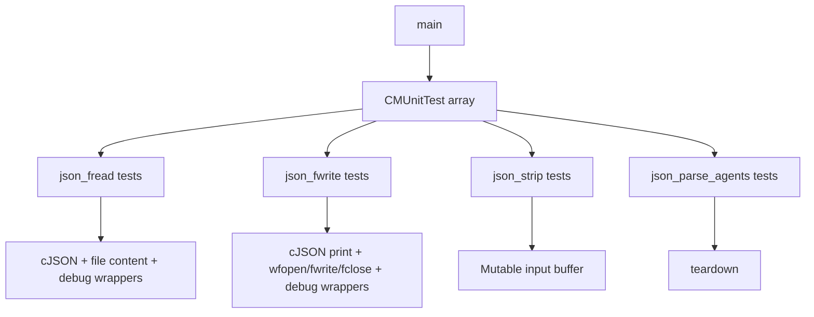
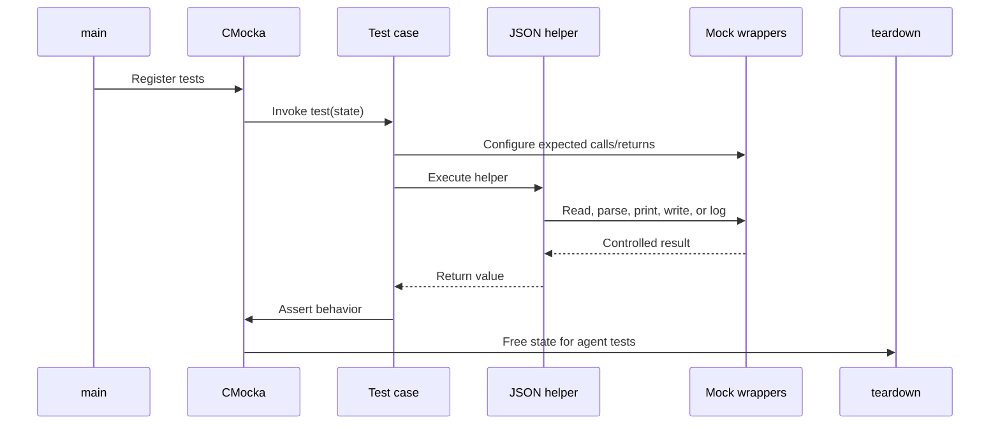
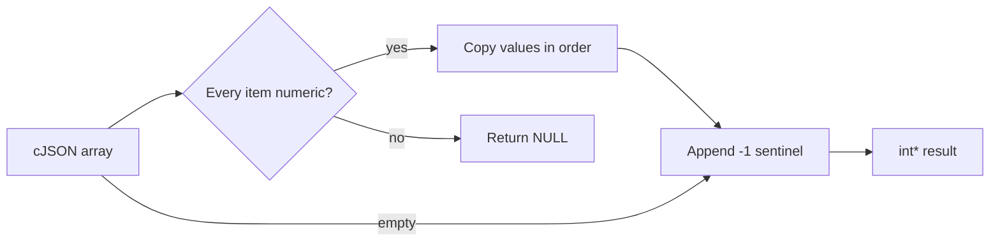

# `test_json_op`

`test_json_op` is the unit-test module for Wazuh's shared JSON helper operations. It validates file-backed JSON loading and saving, removal of C/C++-style comments from JSON text, and conversion of a JSON array of agent identifiers into a sentinel-terminated C integer array.

The module does not implement JSON behavior itself. It isolates the contract of the helpers declared by `../../headers/json_op.h` by replacing file, cJSON, logging, and standard-I/O calls with CMocka-controlled wrappers.

## Scope and position in the system

The test belongs to the shared-library test layer. The helpers it exercises are reused by higher-level daemons and modules that read configuration or exchange JSON messages. Related concerns are documented in [shared library file I/O](shared_lib_file_io.md), [shared library logging](shared_lib_logging.md), [JSON utilities](json_utilities.md), and the neighboring [JSON queue tests](test_json-queue.md).



## Architecture

The suite has four logical test areas:

| Area | Helpers under test | Main contract |
|---|---|---|
| File read | `json_fread` | Read file contents, parse JSON, optionally retry after stripping comments |
| File write | `json_fwrite` | Serialize JSON, open the destination, write the complete buffer, and close the file |
| Comment cleanup | `json_strip` | Remove `//...` and `/*...*/` comments in-place |
| Agent IDs | `json_parse_agents` | Convert numeric array elements to `int[]` terminated by `-1` |



## Test lifecycle

`main` registers all tests and invokes `cmocka_run_group_tests`. Most tests own their temporary strings and release them locally. The agent-array tests register `teardown`, which frees the returned integer array stored in `state[0]`.

The `state` parameter is intentionally unused by file and comment tests. For agent parsing tests, it is used as cleanup state:

1. Build a cJSON array.
2. Call `json_parse_agents`.
3. Delete the cJSON input.
4. Store the returned array in `state[0]`.
5. Let `teardown` call `os_free` after the assertion.



## `json_fread` coverage

`json_fread(path, retry)` is tested as a read-and-parse operation. `w_get_file_content` supplies the file buffer, while `cJSON_ParseWithOpts` is mocked to control parse success or failure.

### Successful reads

- `test_json_fread_successfully` supplies `//This is a comment` and returns a non-null cJSON pointer (`0x8`), proving that a successful parse is returned unchanged.
- `test_json_fread_no_retry` also returns a parsed object (`0x1`) with retry disabled.

### Missing file content

`test_json_fread_buffer_null` makes `w_get_file_content` return `NULL`. The helper must return `NULL` and emit a debug message identifying the path:

```text
Cannot get the content of the file: /home/test
```

### Retry after parse failure

`test_json_fread_with_retry` makes both initial parse attempts fail. With retry enabled, the helper is expected to:

1. Log that it will try to clear comments.
2. Run comment cleanup and attempt parsing again.
3. Return `NULL` when the second parse also fails.
4. Log the final parse failure.

Expected diagnostic messages are:

```text
Couldn't parse JSON file '/home/test'. Trying to clear comments.
Couldn't parse JSON file '/home/test'.
```

The test therefore verifies both the retry decision and its observable logging, not only the final return value.

## `json_fwrite` coverage

`json_fwrite(path, item)` serializes a cJSON item with `cJSON_PrintUnformatted`, opens the target with mode `"w"`, writes the complete serialized buffer, and closes the stream.

```mermaid
flowchart TD
    Start[json_fwrite] --> Print[cJSON_PrintUnformatted]
    Print -->|NULL buffer| ErrBuffer[Log internal dump error\nreturn -1]
    Print --> Open[wfopen(path, "w")]
    Open -->|failure| ErrOpen[Log open error\nreturn -1]
    Open --> Write[fwrite serialized buffer]
    Write -->|short write| ErrWrite[Log write error\nfclose\nreturn -1]
    Write -->|complete write| Close[fclose]
    Close --> Done[return 0]
```

The tests cover:

- `test_json_fwrite_buffer_null`: serialization returns `NULL`; no file should be opened and `-1` is returned.
- `test_json_fwrite_fail_open`: serialization succeeds but `wfopen` fails; the helper logs the open failure and returns `-1`.
- `test_json_fwrite_fail_write`: `fwrite` writes fewer bytes than requested; the helper logs the short write, closes the stream, and returns `-1`.
- `test_json_fwrite_successfully`: the complete buffer is written and the stream is closed; the helper returns `0`.

The test fixture uses `test_mode` to activate failure behavior in wrappers. This keeps failure paths deterministic without touching the real filesystem.

## `json_strip` coverage

`json_strip` mutates its input buffer in place. It removes:

- C-style block comments (`/* ... */`), including a comment at the beginning of the document.
- C++-style line comments (`// ...`) while preserving the following newline.

The expected transformations are:

```text
/*This is a comment*/{"fruit": [...]} 
=> {"fruit": [...]}

//This is a comment \n{"fruit": [...]} 
=> \n{"fruit": [...]}
```

`test_json_strip_file_without_json_content` confirms that a buffer containing only a block comment becomes a single blank space. This establishes the behavior for comment-only files rather than treating the operation as a JSON parser.

## `json_parse_agents` coverage

The helper accepts a cJSON array and produces a heap-allocated integer array. The valid result is terminated with `-1`, allowing callers to iterate without a separate count.



Observed contracts:

- `test_json_parse_agents_success`: `[15, 23, 8]` becomes `[15, 23, 8, -1]`.
- `test_json_parse_agents_empty`: an empty array becomes `[-1]`.
- `test_json_parse_agents_type_error`: an array containing a string among numbers returns `NULL`.

The source's core-component summary omits `test_json_parse_agents_type_error`, but the supplied file content and `main` register it; this documentation includes it because it is part of the executable suite.

## Mocked dependency boundaries

The suite deliberately tests helper decisions at dependency boundaries:

| Wrapper group | Purpose in this module |
|---|---|
| `cJSON_wrappers.h` | Control parse and serialization results |
| `file_op_wrappers.h` | Supply file content and control file-related behavior |
| `debug_op_wrappers.h` | Verify exact diagnostic messages |
| `stdio_wrappers.h` | Control `wfopen`, `fwrite`, and `fclose` |
| `common.h` | Shared test controls such as `test_mode` and wrapper support |

This follows the broader wrapper organization described in [unit-test infrastructure](test_infrastructure.md). The neighboring [JSON queue tests](test_json-queue.md) use the same general strategy but validate queue-oriented JSON ingestion rather than direct file read/write helpers.

## Failure and resource-management expectations

The suite verifies that failures are visible and that resources are handled consistently:

- Null input buffers produce an error return and a debug message.
- Open and write failures do not appear as successful persistence.
- A short write closes the already-open stream before returning.
- Parse retry is explicit and observable through logging.
- Returned agent arrays are freed by the registered teardown.
- Input cJSON arrays are deleted by each agent parsing test.

## Running and extending the tests

The file is a standalone CMocka test executable in the repository's shared-library unit-test collection. Run it through the project's normal unit-test build and test target; the test entry point is:

```text
src/unit_tests/shared/test_json_op.c::main
```

When adding coverage, preserve the existing pattern: configure wrapper expectations before invoking the helper, assert both return values and relevant logging/resource behavior, and register cleanup with `cmocka_unit_test_teardown` when a test stores heap data in `state`.

Potential extensions include malformed JSON with retry enabled, comment markers inside JSON string literals, very large agent arrays, negative or out-of-range agent IDs, and explicit `fclose` failure handling if the production helper exposes a distinct contract for it.

## Related documentation

- [shared library](shared_lib.md)
- [shared library file I/O](shared_lib_file_io.md)
- [shared library logging](shared_lib_logging.md)
- [JSON utilities](json_utilities.md)
- [JSON utility file I/O](json_utilities_file_io.md)
- [JSON queue tests](test_json-queue.md)
- [unit-test infrastructure](test_infrastructure.md)
