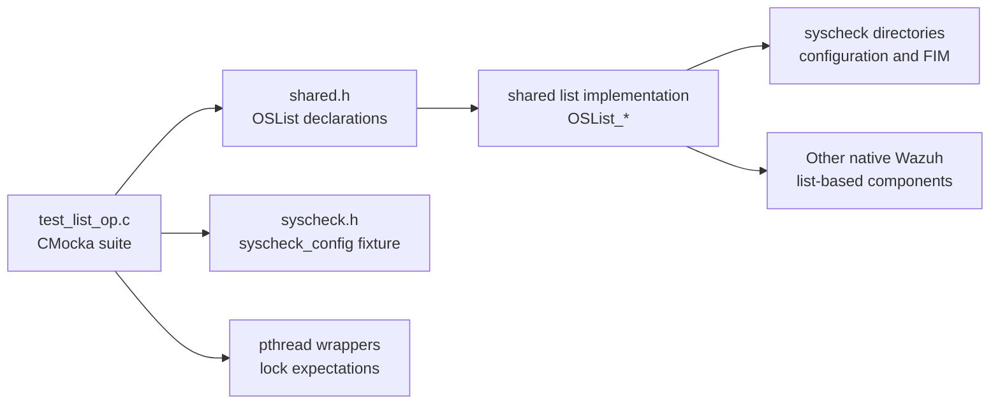
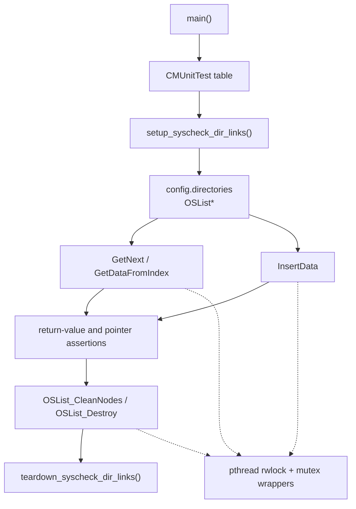
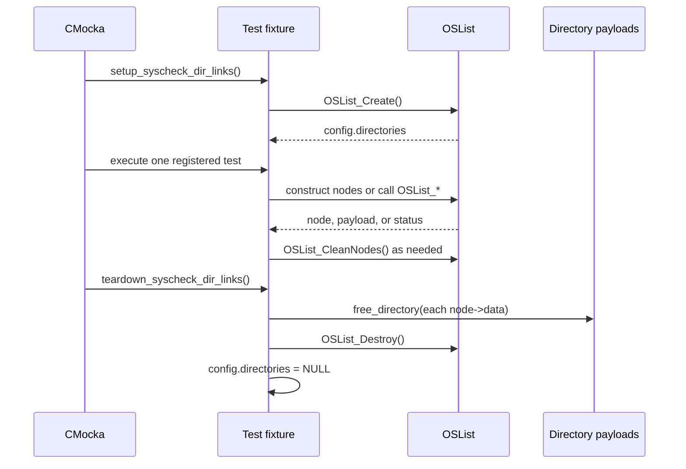
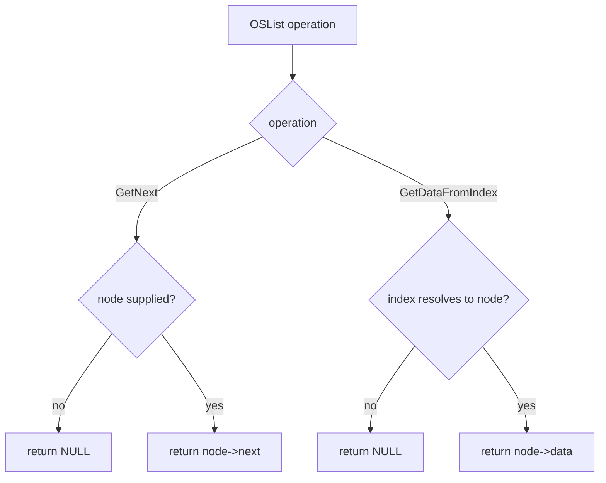
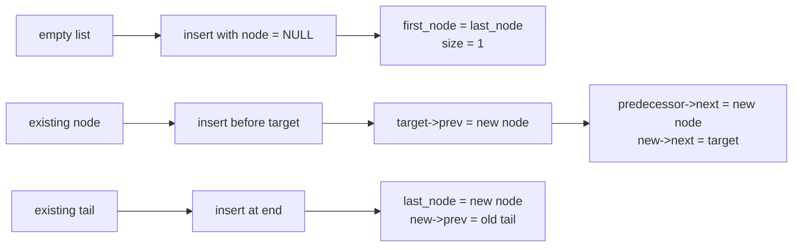
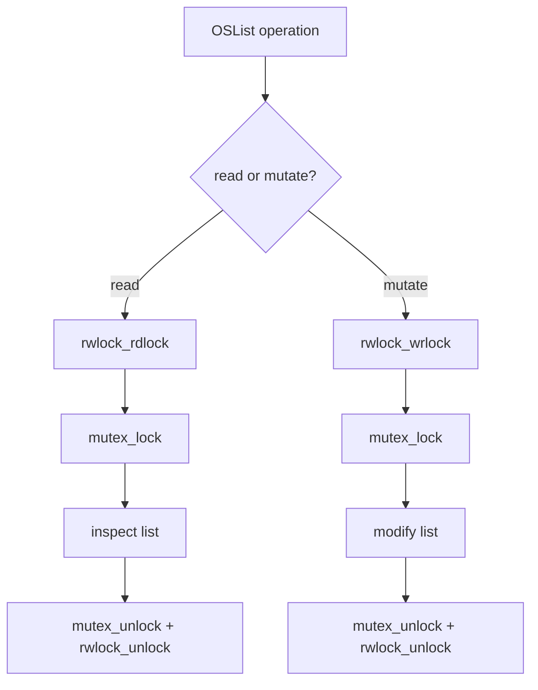
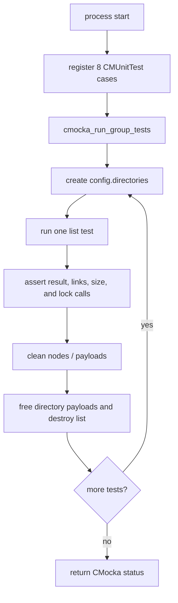

# `test_list_op`

`test_list_op` is the CMocka unit-test module for Wazuh’s shared doubly linked-list abstraction, `OSList`. It verifies list traversal, indexed lookup, insertion at the beginning and end of a list, insertion before an existing node, size accounting, and cleanup of owned data.

The test source is [`src/unit_tests/shared/test_list_op.c`](src/unit_tests/shared/test_list_op.c). The production list implementation belongs to the shared library and is described in [shared_lib_data_structures.md](shared_lib_data_structures.md). The list is also used by syscheck configuration and FIM workflows; see [Syscheck_Config.md](Syscheck_Config.md) and [syscheckd_core.md](syscheckd_core.md) for those higher-level consumers.

## Purpose and system position

The module protects a low-level collection primitive used throughout native Wazuh code. `OSList` stores opaque `void *` payloads in `OSListNode` links and provides synchronized operations for reading, traversing, inserting, cleaning, and destroying nodes. The tests do not exercise a production daemon or scan; they validate the container contract in isolation while using a syscheck-shaped fixture because `syscheck_config.directories` is an existing real-world `OSList` consumer.



## Architecture



### Components

| Component | Responsibility |
|---|---|
| `CMUnitTest` | CMocka’s test descriptor type used to register the eight cases. |
| `main` | Builds the test table and runs it with shared setup and teardown callbacks. |
| `setup_syscheck_dir_links` | Allocates `config.directories` with `OSList_Create`; aborts the group if allocation fails. |
| `teardown_syscheck_dir_links` | Frees every directory payload with `free_directory`, destroys the list, and resets the global pointer. |
| `free_data_function` | Generic `free` callback installed for payload-ownership testing in indexed lookup. |
| `config` | Global `syscheck_config` fixture whose `directories` member supplies the list under test. |
| `__wrap_pthread_*` expectations | Verify that list operations acquire and release the expected read/write and mutex synchronization primitives. |

The test suite intentionally calls the real `OSList_*` implementation. CMocka wrappers are used only to observe synchronization and to make lock behavior deterministic. The suite therefore checks both externally visible results and an important internal integration contract: list operations must balance their synchronization calls.

## Fixture lifecycle



`setup_syscheck_dir_links` creates an empty list for every test. Individual tests then manually build nodes when they need a precise topology. This keeps cases focused on a single operation instead of depending on insertion order established by another test.

Teardown expects the lock and mutex calls made by `OSList_Destroy`. It walks the list first and invokes `free_directory` for each payload because the syscheck fixture represents `directory_t` entries. Tests that allocate plain strings clean their nodes explicitly with `OSList_CleanNodes` and free any payload that the list does not own.

## List behavior under test

### Traversal and indexed lookup

`OSList_GetNext` is tested with two boundary conditions:

- `test_OSList_GetNext_null_return` passes a null node and expects a null result.
- `test_OSList_GetNext_node_return` creates a first node followed by a second node and expects traversal from the first node to return the next node.

`OSList_GetDataFromIndex` is tested at index `0`:

- `test_OSList_GetDataFromIndex_null_return` uses an empty list and expects no payload.
- `test_OSList_GetDataFromIndex_data_return` adds one node containing the string `"data"`, installs `free_data_function`, and asserts that the returned pointer is exactly the node payload.

These cases distinguish “no node exists” from “a node exists and its opaque payload is returned.” The pointer identity assertion is significant: the list is not expected to copy or transform stored data.



### Insertion and topology

All insertion tests expect a return code of `0`. They verify that `first_node`, `last_node`, and `currently_size` reflect the resulting topology.

| Test | Initial topology | Expected behavior |
|---|---|---|
| `test_OSList_InsertData_insert_at_first_position` | Empty list | Creates both first and last nodes; size becomes one. |
| `test_OSList_InsertData_insert_at_last_position` | Two manually linked nodes, with a null insertion node | Appends the supplied `data`; the new last node owns the inserted pointer for the test’s topology assertion. |
| `test_OSList_InsertData_insert_at_first_position_before_node` | One node; insertion target is the current first node | Places a new node before the target and updates the first-node relationship. |
| `test_OSList_InsertData_insert_at_n_position_before_node` | Two linked nodes; insertion target is the second node | Places a new node immediately before the target and preserves the predecessor relationship. |

The tests use hand-built nodes to isolate the insertion position. They validate links through `first_node`, `last_node`, `next`, and `prev`, rather than relying only on list length.



## Synchronization contract

The test cases set expectations for wrappers such as `__wrap_pthread_rwlock_rdlock`, `__wrap_pthread_rwlock_wrlock`, `__wrap_pthread_mutex_lock`, `__wrap_pthread_mutex_unlock`, and the corresponding unlock functions. Read-oriented operations are expected to take a read lock and mutex; insertion takes a write lock and mutex; cleanup and destruction are also expected to synchronize.



The exact implementation details of locking belong in [shared_lib_data_structures.md](shared_lib_data_structures.md). This module’s role is to detect regressions in lock acquisition/release while asserting that the public operation still returns the expected result.

## Test registration and execution flow

`main` registers eight tests and invokes:

```c
cmocka_run_group_tests(tests,
                       setup_syscheck_dir_links,
                       teardown_syscheck_dir_links);
```

The execution flow is:



## Coverage summary

The module covers:

- null and non-null traversal results;
- empty-list and populated-list indexed lookup;
- payload pointer identity and custom payload cleanup;
- insertion into an empty list;
- append insertion;
- insertion before the first node;
- insertion before an interior/tail node;
- first/last node maintenance and `currently_size` updates;
- read/write lock and mutex expectations;
- teardown of syscheck directory entries and list storage.

The suite is intentionally not a performance, concurrency-stress, or memory-sanitizer test. It also does not validate every list API. Broader list implementation behavior should be documented and tested with the shared data-structure module referenced above; syscheck-specific ownership and directory semantics belong to [Syscheck_Config.md](Syscheck_Config.md).

## Maintenance notes

When changing `OSList` internals, update this suite if any of the following contracts change: return-code conventions, `first_node`/`last_node` maintenance, `prev`/`next` topology, size accounting, payload ownership callbacks, or lock ordering. If lock expectations change, update the wrapper expectations together with the implementation so failures remain attributable to a specific operation.

One test, `test_OSList_GetNext_null_return`, declares its `OSList *list` local without assigning it before calling `OSList_GetNext`. The intended scenario is clearly a null-node traversal, but the list pointer itself should be initialized to a valid list (for example, `config.directories`) or explicitly to `NULL`, depending on the production API contract. Maintainers should review this case before relying on it as a stable regression test, since passing an indeterminate pointer can make the test undefined and platform-dependent.
