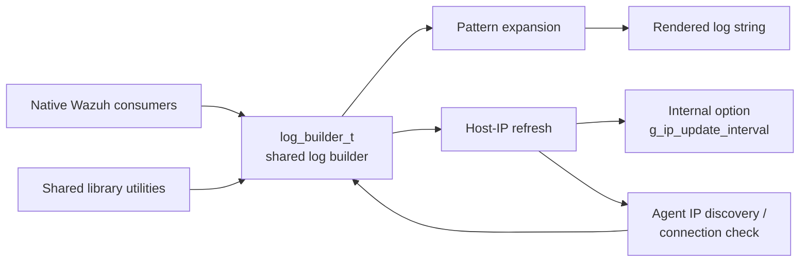
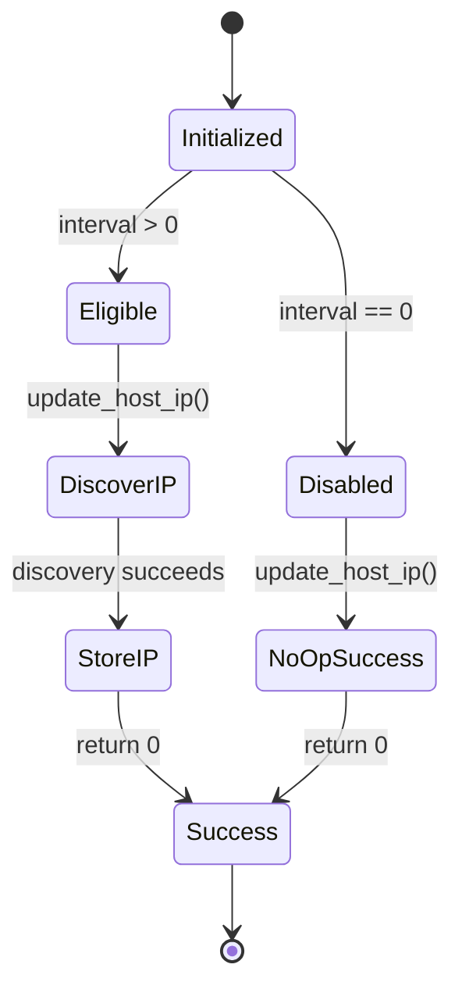
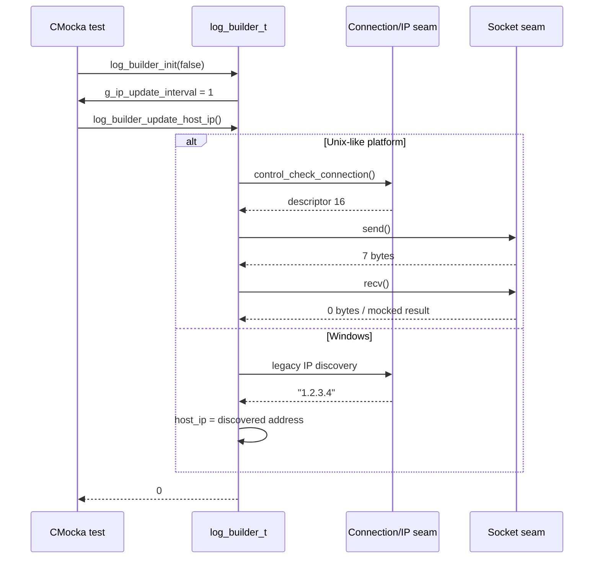
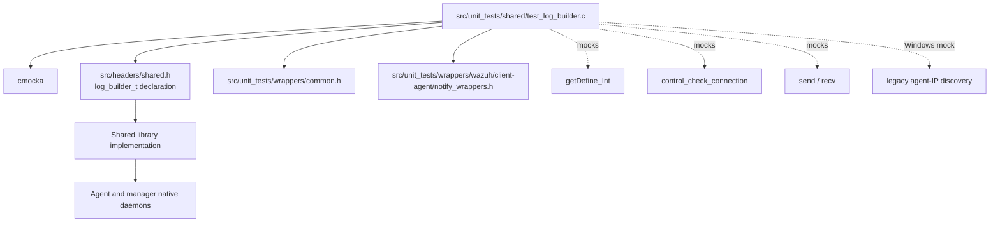

# `test_log_builder`

`test_log_builder` is the CMocka unit-test module for Wazuh's shared log-builder utility. It verifies two responsibilities exposed by `log_builder_t`: expanding a log pattern into a rendered string and refreshing the host IP used by a builder. The test is intentionally small, but it sits at the boundary between shared formatting code, agent connectivity, platform-specific IP discovery, and configurable timing.

The test source is `src/unit_tests/shared/test_log_builder.c`; the production type is declared through `src/headers/shared.h`, with the implementation supplied by the shared library. Related lower-level behavior is documented in [shared_lib.md](shared_lib.md), [shared_lib_logging.md](shared_lib_logging.md), [client_agent_native_communication.md](client_agent_native_communication.md), and [test_infrastructure.md](test_infrastructure.md).

## Scope and responsibilities

The module covers three observable contracts:

| Area | Test | Contract |
|---|---|---|
| Pattern rendering | `test_log_builder` | Expands `$(location)`, `$(log)`, and `$(json_escaped_log)` and preserves both raw and JSON-escaped forms. |
| Enabled IP refresh | `test_log_builder_update` | Reads the configured interval, updates the builder successfully, and returns `0`. |
| Disabled IP refresh | `test_log_builder_not_update` | An interval of `0` disables refresh; the operation remains a successful no-op. |

The test does not exercise daemon lifecycle, queue delivery, file persistence, or a complete agent connection. Those concerns belong to the surrounding shared and client-agent modules.

## Architectural position

The utility is a shared-library service used by native Wazuh components that need structured, templated messages. Its formatting path is local and deterministic. Its host-IP path is conditional: configuration determines whether a platform adapter is consulted.



### Components and relationships

| Component | Role in this module |
|---|---|
| `log_builder_t` | Stateful builder object created by `log_builder_init(false)` and released by `log_builder_destroy`. The update test directly inspects its `host_ip` field on Windows. |
| `log_builder_init` | Allocates and initializes the builder; it also reads the internal integer option through the mocked `getDefine_Int` path. |
| `log_builder_build` | Applies the supplied pattern to `LOG` and `LOCATION`, returning a heap-allocated output owned by the caller. |
| `log_builder_update_host_ip` | Refreshes host IP when the configured interval permits it; returns `0` for both an update and a disabled/no-op path. |
| `g_ip_update_interval` | Shared configuration state asserted by the tests after initialization. |
| `__wrap_getDefine_Int` | CMocka configuration seam that supplies interval values `60`, `1`, or `0`. |
| `__wrap_control_check_connection`, `__wrap_send`, `__wrap_recv` | Linux/macOS/BSD/Solaris seams used to isolate connection-based IP discovery. |
| `wrap_get_agent_ip_legacy_win32` | Windows seam returning the test IP `1.2.3.4`. |

## Pattern-building behavior

The primary test uses:

```text
Pattern:  location: $(location), log: $(log), escaped: $(json_escaped_log)
Log:      Hello "World"
Location: test
Output:   location: test, log: Hello "World", escaped: Hello \"World\"
```

The important distinction is that `$(log)` retains the original text, while `$(json_escaped_log)` escapes the embedded quote for JSON output. The returned buffer is dynamically allocated, so the test frees it before destroying the builder. This establishes ownership semantics for callers: the result of `log_builder_build` is not borrowed from the builder or input strings.

```mermaid
flowchart TD
    Inputs[Pattern + log + location] --> Scan[Scan placeholder tokens]
    Scan --> Location[Replace $(location)]
    Scan --> Raw[Replace $(log) with original log]
    Scan --> Escape[JSON-escape log]
    Escape --> Escaped[Replace $(json_escaped_log)]
    Location --> Compose[Compose output buffer]
    Raw --> Compose
    Escaped --> Compose
    Compose --> Result[Heap-allocated rendered string]
```

## Host-IP update behavior

Initialization reads an integer option using `getDefine_Int` and stores it in the global `g_ip_update_interval`. The tests define the following state machine:



For the enabled path, the platform-specific interaction is mocked rather than performed against a live host:



The source explicitly verifies `builder->host_ip == "1.2.3.4"` only under `WIN32`; Unix-like tests verify the return code and isolate system calls with wrappers. This reflects a portability boundary rather than different public success semantics.

## Test execution flow

`main` constructs a static `CMUnitTest` array, registers the three test functions with `cmocka_unit_test`, and runs them as a group. There are no group setup or teardown callbacks.

```mermaid
flowchart TD
    Main[main()] --> Register[Register 3 CMUnitTest entries]
    Register --> Runner[cmocka_run_group_tests]
    Runner --> Render[test_log_builder]
    Runner --> Update[test_log_builder_update]
    Runner --> NoUpdate[test_log_builder_not_update]
    Render --> Assert1[Assert rendered string]
    Update --> Assert2[Assert interval, builder, return code]
    NoUpdate --> Assert3[Assert disabled interval and return code]
    Assert1 --> Cleanup1[free output; destroy builder]
    Assert2 --> Cleanup2[destroy builder]
    Assert3 --> Cleanup3[destroy builder]
```

## Detailed test cases

### `test_log_builder`

1. Programs `__wrap_getDefine_Int` to return `60`.
2. Creates a builder with `log_builder_init(false)`.
3. Builds a pattern containing raw and escaped log placeholders.
4. Compares the result with the exact expected string.
5. Frees the returned string and destroys the builder.

This is the only test that validates substitution output and escaping. It also indirectly verifies that initialization tolerates a nonzero refresh interval without requiring an immediate IP update.

### `test_log_builder_update`

1. Programs the interval to `1` and confirms `g_ip_update_interval`.
2. Creates the builder and confirms allocation succeeded.
3. Supplies platform-specific network mocks.
4. Calls `log_builder_update_host_ip` and expects `0`.
5. On Windows, verifies the discovered address was copied into `host_ip`.

### `test_log_builder_not_update`

1. Programs the interval to `0`.
2. Confirms the global interval and builder allocation.
3. Calls the update function.
4. Expects a successful no-op (`0`) and destroys the builder.

## Dependencies and isolation



The wrapper strategy keeps tests deterministic and avoids dependence on host networking, current machine addresses, timers, or platform APIs. `will_return` supplies values consumed by CMocka wrappers; it is therefore part of the test fixture contract, not production configuration.

## Ownership, state, and invariants

- `log_builder_init(false)` must return a non-null builder for the tested configurations.
- `g_ip_update_interval` reflects the configured integer after initialization.
- An interval of `0` disables host-IP refresh without making the operation an error.
- A successful update returns `0`.
- `log_builder_build` returns caller-owned memory; callers must release it with `free`.
- The builder must be destroyed with `log_builder_destroy` after use.
- Raw log text and JSON-escaped log text are distinct substitutions.
- The test suite does not assert a specific non-Windows `host_ip` value because discovery is platform-dependent and mocked at a lower boundary.

## Failure interpretation

| Failure | Likely area |
|---|---|
| Exact output mismatch | Placeholder parsing, escaping, or output-buffer construction in the shared log builder. |
| `g_ip_update_interval` mismatch | Internal-option lookup or initialization state. |
| Null builder | Allocation or initialization failure. |
| Nonzero update return | Host-IP refresh control flow or platform adapter contract. |
| Windows `host_ip` mismatch | Legacy Windows IP discovery or copying into builder state. |
| Unexpected wrapper call | Changed production control flow, stale mock expectations, or an incorrect test fixture. |

## Maintenance guidance

When adding a placeholder, extend `test_log_builder` with both a representative input and an exact expected output. Include quote, backslash, empty, and boundary cases for escaping. When changing IP-refresh policy, update both the positive interval and zero-interval tests; the latter protects the no-op contract. Platform-specific behavior should remain behind wrappers, following the isolation approach described in [test_infrastructure.md](test_infrastructure.md).

For related concerns, consult [shared_lib.md](shared_lib.md) for the shared C library boundary, [shared_lib_logging.md](shared_lib_logging.md) for logging utilities, [client_agent_native_communication.md](client_agent_native_communication.md) for agent communication, and [test_list_op.md](test_list_op.md) for a comparable shared-library CMocka test structure.

## Source reference

- `src/unit_tests/shared/test_log_builder.c`
- `src/headers/shared.h`
- `src/headers/notify_op.h`
- `src/unit_tests/wrappers/common.h`
- `src/unit_tests/wrappers/wazuh/client-agent/notify_wrappers.h`
