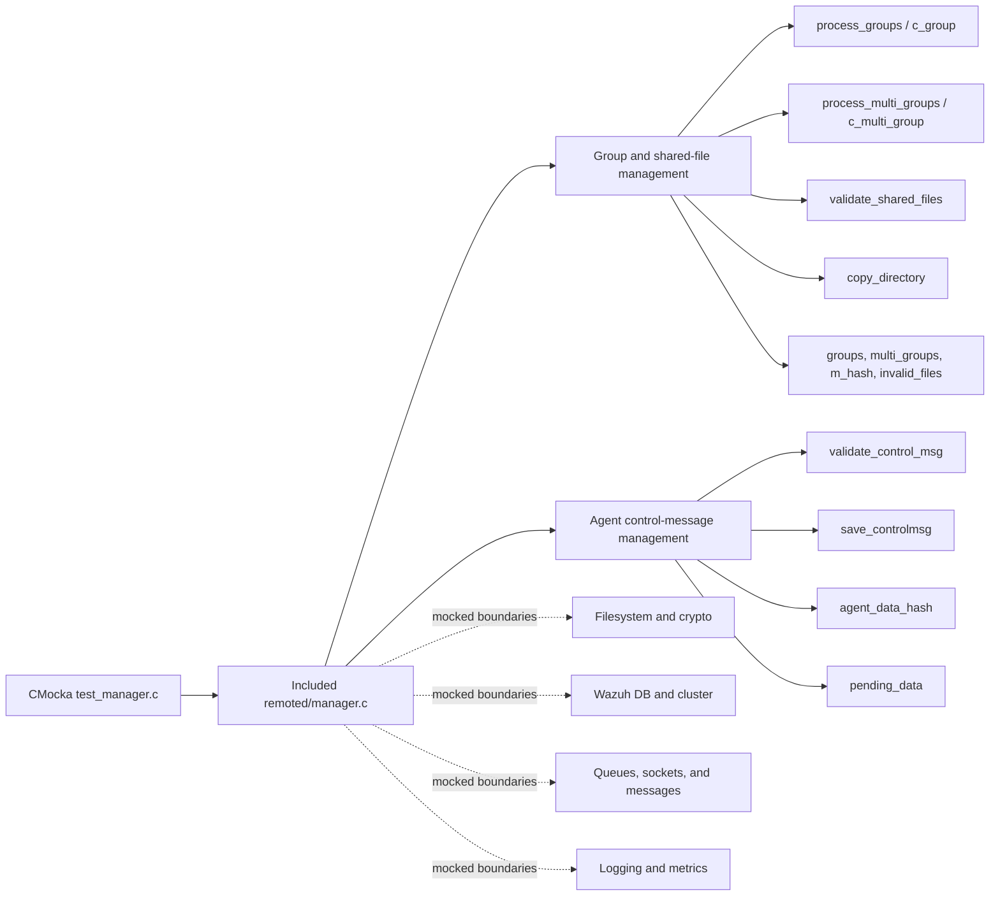
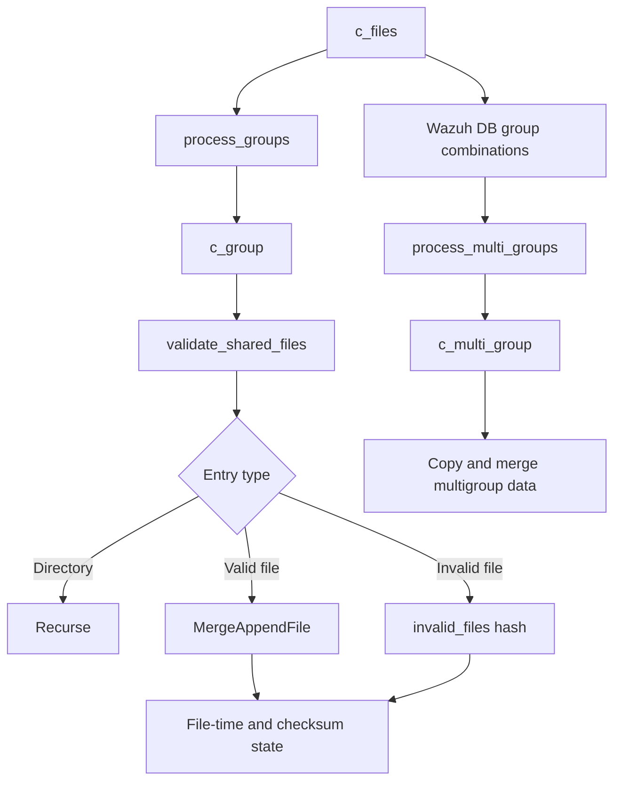
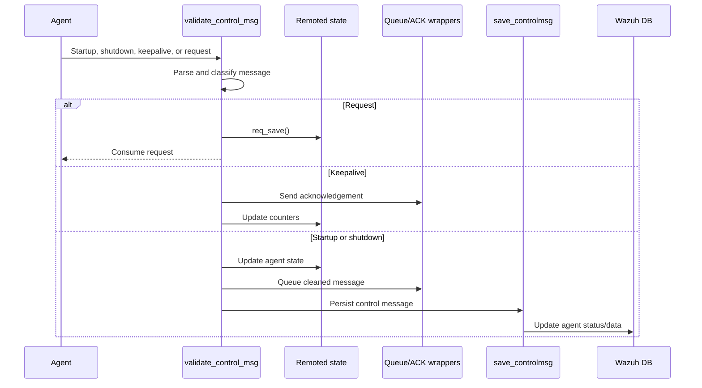

# `test_manager_remoted`

## Purpose

`test_manager_remoted` is a CMocka white-box unit-test module for Wazuh Remoted manager logic, implemented in [`src/unit_tests/remoted/test_manager.c`](../../src/unit_tests/remoted/test_manager.c).

The test file directly includes `src/remoted/manager.c`, allowing private functions and global state to be tested. It validates two main areas:

- Shared-file and agent-group management, including group discovery, multigroup processing, file validation, merging, checksums, timestamps, and stale-group cleanup.
- Agent control-message handling, including startup, shutdown, keepalive, requests, acknowledgements, pending data, version checks, and Wazuh DB updates.

External dependencies such as the filesystem, hashes, networking, queues, cluster services, Wazuh DB, logging, and metrics are replaced with deterministic CMocka wrappers.

## Architecture

### Shared-file processing

### Control-message processing

## Test organization

The module is organized around the following child components:

- [`test_manager_remoted_test_infrastructure`](test_manager_remoted_test_infrastructure.md) — shared fixtures, wrappers, lifecycle, and mocking strategy.
- [`c_files_tests`](c_files_tests.md) — top-level shared-file update orchestration.
- [`c_group_tests`](c_group_tests.md) — processing of individual agent groups.
- [`c_multi_group_tests`](c_multi_group_tests.md) — processing of multigroup combinations.
- [`copy_directory_tests`](copy_directory_tests.md) — recursive directory copying.
- [`find_group_tests`](find_group_tests.md) — lookup of groups by checksum.
- [`ftime_changed_tests`](ftime_changed_tests.md) — file timestamp and change detection.
- [`group_changed_tests`](group_changed_tests.md) — detection of changed or missing groups.
- [`lookfor_agent_group_tests`](lookfor_agent_group_tests.md) — resolving an agent’s group membership.
- [`process_deleted_groups_tests`](process_deleted_groups_tests.md) — removal of obsolete groups.
- [`process_groups_tests`](process_groups_tests.md) — discovery and refresh of ordinary groups.
- [`process_multi_groups_tests`](process_multi_groups_tests.md) — discovery and refresh of multigroups.
- [`save_controlmsg_tests`](save_controlmsg_tests.md) — persistence and processing of control messages.
- [`validate_control_msg_tests`](validate_control_msg_tests.md) — control-message classification and acknowledgement.
- [`validate_shared_files_tests`](validate_shared_files_tests.md) — validation, filtering, recursion, and merging of shared files.

## Core component references

- [`remoted`](remoted.md) — Remoted daemon lifecycle, networking, state, and communication responsibilities.
- [`remoted group management`](remoted_group_management.md) — production group, multigroup, and shared-file behavior.
- [`Wazuh DB`](wazuh_db.md) — agent, group, status, and synchronization persistence.
- [`shared library`](shared_lib.md) — hash tables, filesystem helpers, logging, and common utilities.
- [`test infrastructure`](test_infrastructure.md) — common CMocka fixtures, wrappers, and test conventions.
- [`Remote configuration`](Remote_Config.md) — configuration structures consumed by Remoted.