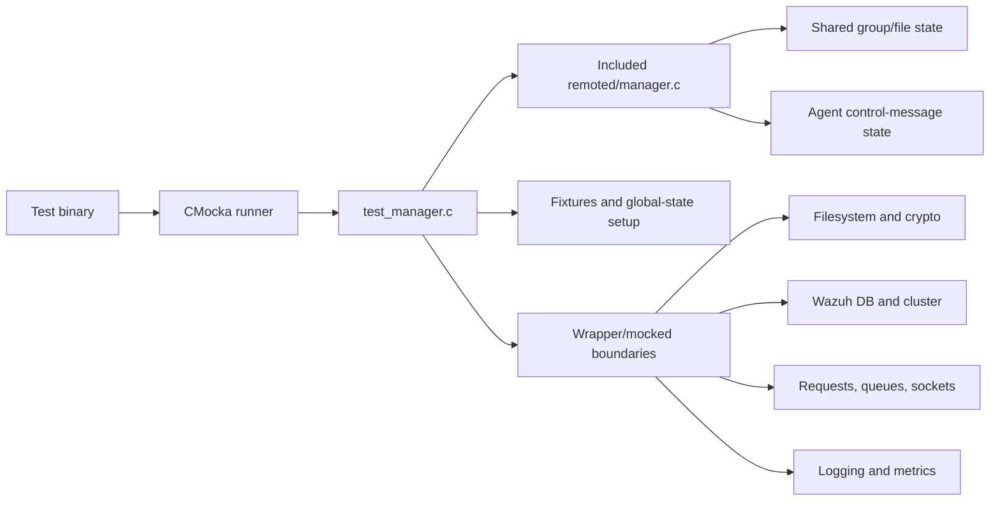
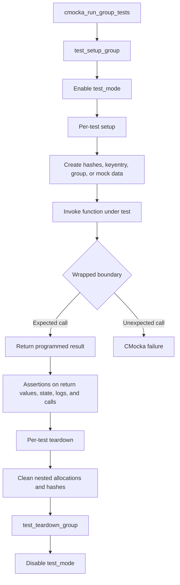
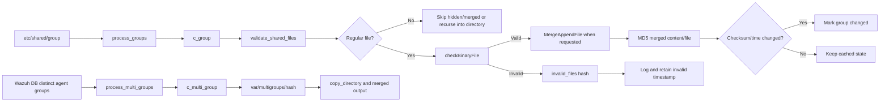
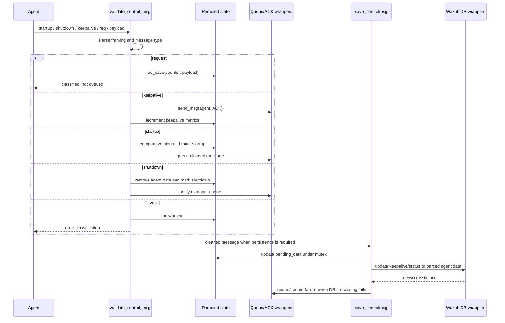

# `test_manager_remoted_test_infrastructure`

This module is the CMocka white-box test harness for Wazuh Remoted’s manager logic. It compiles the production implementation in `src/remoted/manager.c` into the test translation unit, builds controlled global state, and replaces filesystem, hashing, networking, cluster, Wazuh DB, logging, and metric boundaries with CMocka wrappers. The suite therefore verifies manager behavior without requiring a running remoted daemon, agents, network services, or a populated Wazuh installation.

For production behavior, see [remoted](remoted.md), [remoted group management](remoted_group_management.md), and [Wazuh DB](wazuh_db.md). For common wrapper and fixture conventions, see [test infrastructure](test_infrastructure.md) and [shared library](shared_lib.md).

## Role in the system

The test binary exercises two closely related responsibilities:

- Shared-file and group management: discovering agent groups, validating files under `etc/shared`, producing `merged.mg`, tracking MD5/SHA-256 state, handling multi-groups, copying directories, and removing stale group data.
- Agent control-message management: validating startup, shutdown, keepalive, and request messages; acknowledging agents; persisting pending data; checking versions; updating Wazuh DB state; and queuing failures.

The test is intentionally coupled to implementation details. Including `manager.c` exposes static functions and production globals so that individual branches can be tested directly.

## Architecture and dependency boundaries

`test_manager.c` is the orchestration layer. It does not provide remoted functionality itself; it supplies inputs, expectations, and lifecycle management around the production manager.

| Boundary | Representative wrapped operations | What the tests control |
| --- | --- | --- |
| Filesystem | `wreaddir`, `opendir`, `stat`, `mkdir`, `wfopen`, `w_copy_file`, `rmdir_ex` | Missing directories, path limits, file types, copy failures, and deletion |
| Hashing and files | `OSHash_*`, `OS_MD5_*`, `OS_SHA256_String`, `MergeAppendFile`, `checkBinaryFile` | Cache contents, checksums, invalid-file tracking, and merge outcomes |
| Wazuh DB / cluster | `wdb_get_agent_group`, `wdb_get_distinct_agent_groups`, `wdb_update_agent_*`, `w_send_clustered_message` | Group lookup, status updates, worker/master behavior, and DB failures |
| Agent messaging | `send_msg`, `req_save`, `parse_agent_update_msg` | ACKs, request persistence, malformed payloads, and update parsing |
| Observability | `__wrap__mdebug*`, `__wrap__merror`, `__wrap__mwarn`, `__wrap_rem_inc_*` | Error paths, diagnostics, and metric increments |
| Synchronization | pthread mutex wrappers | Pending-data and group-state locking behavior |

The production dependencies are deliberately not duplicated here. The remoted module documents daemon lifecycle, networking, and state ownership; this page documents how those boundaries are simulated in tests.

## Fixture lifecycle

The suite uses a global CMocka setup/teardown pair plus narrower fixtures for hashes and group objects.

Important fixture patterns:

- `test_setup_group` and `test_teardown_group` establish suite-wide test mode.
- `setup_globals` creates `agent_data_hash` using the real hash constructor; its teardown cleans it with the production data cleaner.
- `setup_globals_no_test_mode` covers production-mode behavior, while `setup_test_mode` isolates tests that only need the mode flag.
- `keyentry_init` allocates the nested IP and identity strings required by remoted agent records. `free_keyentry` owns their cleanup.
- Group fixtures allocate `group_t` objects and file-time hashes. `free_group` and `free_group_c_group` provide different cleanup scopes for tests that own or borrow the file-time map.

Because production globals are shared by the included implementation, every test that mutates a hash, mode flag, socket state, or group record must use the matching fixture and teardown.

## Shared-file and group-management flow

The group tests model the manager’s polling/update cycle. A directory listing is converted into a group or multi-group representation, validated files are merged, and checksums determine whether downstream state changed.

The suite covers the normal and failure edges around this flow: absent directories, `.`/`..` and hidden entries, nested folders, `merged.mg` exclusion, invalid files becoming valid, append/truncate errors, checksum changes, externally modified multi-group output, path-length warnings, and stale directory removal.

### Group state and cleanup

The principal state maps are:

- `groups`: named single-group records and their file-time/checksum state.
- `multi_groups`: comma-separated group names mapped to multi-group records.
- `m_hash`: the current distinct-agent multi-group/hash view returned by Wazuh DB.
- `invalid_files`: files that remain invalid across scans.
- `agent_data_hash`: connected-agent data used by control-message tests.

`find_group_from_sum` and `find_multi_group_from_sum` verify checksum-to-name lookup. `ftime_changed` compares file-time maps and checksums; `group_changed` resolves all component groups in a multi-group and reports missing or changed members. `process_deleted_groups` and `process_deleted_multi_groups` remove stale entries and, for multi-groups, clean the hash-derived directory.

## Agent control-message flow

Control-message tests verify both classification and the persistence/update phase.

`validate_control_msg` is tested for:

- `req <counter> <payload>` request saving and malformed request rejection.
- `HC_SHUTDOWN`, including agent-hash removal and failed queue reconnect behavior.
- Startup messages with compatible, incompatible, or missing versions.
- Keepalive ACK generation and metric updates.
- Invalid messages with and without the expected framing/newline.

`save_controlmsg` then exercises pending-data insertion, duplicate/update handling, group resolution, `parse_agent_update_msg`, global DB updates, startup pending status, shutdown disconnected status, incompatible-version responses, and DB failure logging.

## Test organization

The `main` function registers CMocka tests in behavior-oriented groups:

1. Agent group lookup: `lookfor_agent_group`.
2. Single and multi-group generation: `c_group`, `c_multi_group`, `c_files`.
3. Checksum/time lookup and change detection.
4. Deleted group and multi-group processing.
5. Directory scanning: `process_groups`, `process_multi_groups`.
6. File validation and recursive copying.
7. Control-message classification and persistence.

Most tests assert more than a return code. They also verify exact wrapper arguments, expected log text, hash mutations, output flags (`is_startup`, `is_shutdown`), cleaned messages, and cleanup calls. This makes the suite useful for regression detection in error handling as well as successful behavior.

## Maintenance guidance

- Keep filesystem, network, cluster, DB, and crypto interactions wrapped; the test should remain deterministic and offline.
- When adding a new production branch, add both a success case and the relevant boundary-failure case.
- Match every allocation with the fixture’s cleanup convention, especially nested `keyentry`, `group_t`, hash, and pending-data members.
- If a test changes a production global, isolate it with a setup/teardown fixture rather than depending on test order.
- Preserve exact CMocka expectations for paths, agent IDs, queue messages, and error logs; these are part of the observable contract being tested.
- Update cross-references when the production remoted or Wazuh DB documentation is renamed.

## Running the tests

Build and invoke the project’s unit-test target for `test_manager_remoted` (the target name may be supplied by the repository’s test build system). Run this suite with its normal test environment; it should not need a live remoted process, agent, Wazuh DB server, or external network. When diagnosing a failure, first identify whether it is a fixture leak, an unmet wrapper expectation, or a changed production branch before changing the test’s mocked return values.
