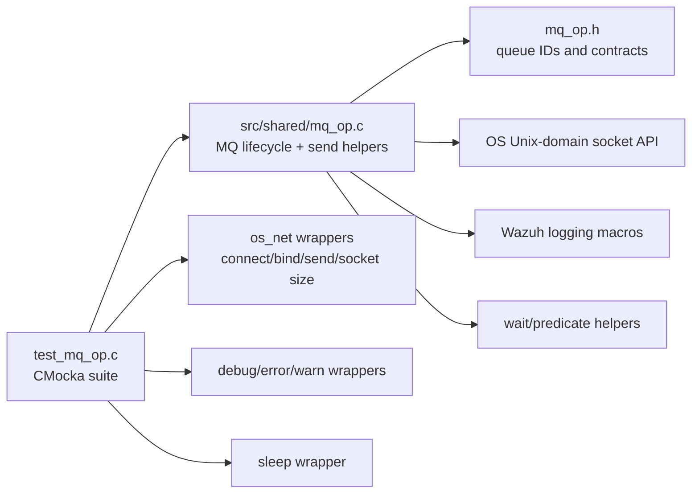
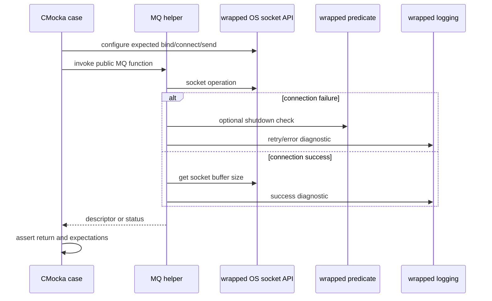
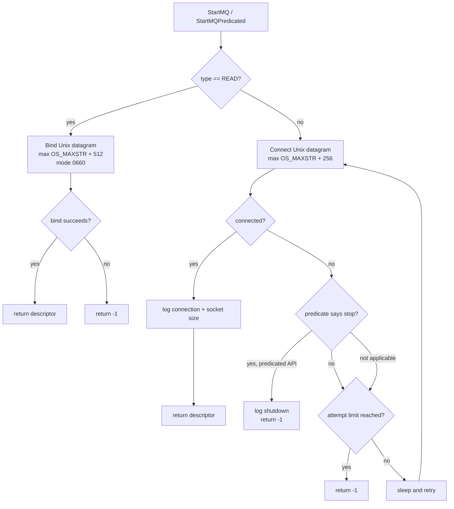
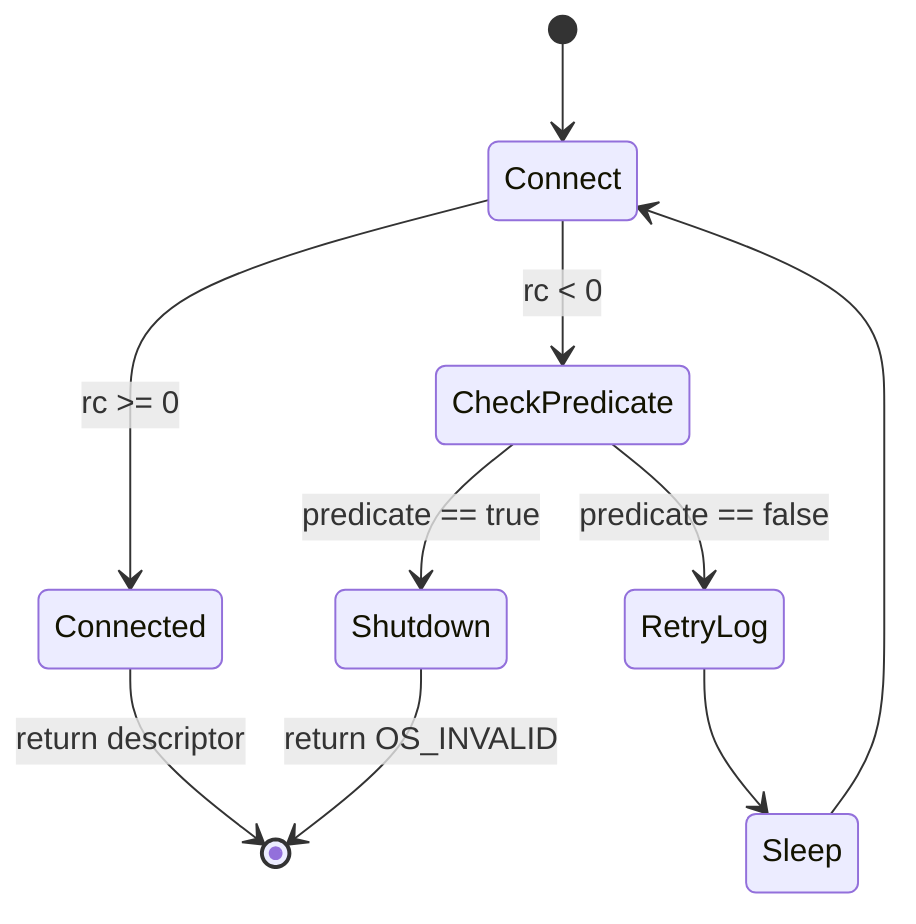
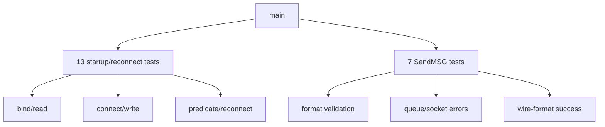

# `test_mq_op`

## Introduction

`test_mq_op` is the CMocka unit-test module for Wazuh's shared message-queue helpers in `src/shared/mq_op.c`. It verifies Unix-domain datagram queue creation, bounded and infinite reconnection, shutdown-predicate cancellation, and the formatting/error policy used when messages are sent to internal Wazuh queues.

The suite tests the shared MQ contract without opening real sockets or sleeping. Socket operations, socket-buffer sizing, delays, and logging are replaced with expectations and controlled return values.

## Module position

The test is part of the shared-library unit tests and is built from `src/unit_tests/shared/CMakeLists.txt` as `test_mq_op`. The production helpers are consumed by daemons and modules that communicate through Wazuh queues; see [shared_lib_networking.md](shared_lib_networking.md) for the broader shared networking layer and [shared_lib_logging.md](shared_lib_logging.md) for logging behavior.



## Responsibilities and API boundaries

| Production function | Responsibility | Covered by |
|---|---|---|
| `StartMQWithSpecificOwnerAndPerms` | Bind a `READ` queue with owner/mode, or connect a `WRITE` queue with retry limits. | `test_start_mq_read_*`, `test_start_mq_write_*` |
| `StartMQ` | Convenience wrapper using the current UID/GID and mode `0660`. | Indirectly covered through the startup behavior; the suite primarily exercises the underlying path. |
| `StartMQPredicated` | Same startup behavior, but checks a shutdown predicate between failed connection attempts. | `test_start_mq_predicated_write_*` |
| `MQReconnectPredicated` | Reconnect indefinitely until success or predicate termination. | `test_reconnect_mq_*` |
| `SendMSGAction` | Escape the location, construct secure/non-secure wire format, send through `OS_SendUnix`, and classify failures. | `test_SendMSGAction_*` |
| `SendMSG` | Wait for global locks, then delegate to `SendMSGAction`. | Send tests through the public wrapper. |

The queue identifiers are defined in `mq_op.h`: `SYSLOG_MQ` is `'2'`, `SECURE_MQ` is `'4'`, and `INFINITE_OPENQ_ATTEMPTS` is `0`. On Unix, successful startup returns a socket descriptor; failure returns `OS_INVALID`/`-1` as appropriate.

## Test harness architecture

`main` registers the CMocka cases and invokes `cmocka_run_group_tests`. The test file defines three local controls:

* `__wrap_OS_getsocketsize` always returns `1`, making the socket-size log deterministic.
* `__wrap_sleep` is a no-op, so retry loops execute immediately.
* `ptr_function` toggles a Boolean and acts as the simulated shutdown predicate.

The build wraps `OS_BindUnixDomainWithPerms`, `OS_ConnectUnixDomain`, `OS_SendUnix`, `OS_getsocketsize`, `sleep`, and debug/error/warning logging. Wrapper expectations validate arguments such as path, datagram type, maximum message size, credentials, permissions, and wire payload.



## Queue startup and retry flow

For `READ`, startup calls `OS_BindUnixDomainWithPerms` once with `SOCK_DGRAM`, `OS_MAXSTR + 512`, the current UID/GID, and mode `0660`. A bind failure is returned immediately.

For `WRITE`, startup repeatedly calls `OS_ConnectUnixDomain` with `SOCK_DGRAM` and `OS_MAXSTR + 256`. Attempts are counted after failure. A positive `n_attempts` stops after that many failures; `0` means infinite attempts. The real five-second incremental sleeps are mocked out by the test.



### Startup cases

| Test | Scenario | Expected contract |
|---|---|---|
| `test_start_mq_read_success` | Read bind succeeds | Return `0`; exact bind parameters are checked. |
| `test_start_mq_read_fail` | Read bind fails | Return `-1`. |
| `test_start_mq_write_simple_success` | First write connection succeeds | Return `0`; log attempt `0` and buffer size `1`. |
| `test_start_mq_write_simple_fail` | One allowed attempt fails | Return `-1`; log the OS error and attempt number. |
| `test_start_mq_write_multiple_success` | Several failures then success | Retry until the fourth attempt and return success. |
| `test_start_mq_write_multiple_fail` | All finite attempts fail | Return `-1` after exactly ten attempts. |
| `test_start_mq_write_inf_success` | Infinite mode eventually succeeds | Keep retrying until the mocked success at attempt 100. |
| `test_start_mq_write_inf_fail` | Infinite mode repeatedly fails | Demonstrates the loop; injects a final success only to terminate the test harness. |

## Predicate-controlled startup and reconnect

`StartMQPredicated` invokes the supplied predicate after a failed connect and before another retry. If it returns true, it logs `FIM_SHUTDOWN_DETECTED` and returns `OS_INVALID`.

`MQReconnectPredicated` has the same stop condition but always uses the reconnect loop. On failure it logs `UNABLE_TO_RECONNECT`, sleeps, and retries. On success it logs `SUCCESSFULLY_RECONNECTED_SOCKET` and the socket size.



`test_start_mq_predicated_write_success` verifies ordinary success. `test_start_mq_predicated_write_fail` verifies predicate-driven termination. The reconnect tests cover immediate success, a single failure followed by success, and a failed reconnect where the predicate permits the retry.

## Message formatting and send policy

`SendMSG` first waits for the shared lock predicate, then calls the internal `SendMSGAction`. The location is escaped so `|` becomes `:`-safe for the queue protocol.

For a non-secure message, the wire form is:

```text
<queue-location>:<escaped-location>:<message>
```

For a secure message, the first character of `message` is the queue type and the remainder must begin with `:`. The wire form is:

```text
<message-type>:<escaped-location>-><secure-payload>
```

The special secure payload `keepalive` is consumed locally and is not sent to the socket.

```mermaid
flowchart TD
    CALL[SendMSG(queue, message, locmsg, loc)] --> ESC[Escape locmsg]
    ESC --> SEC{loc == SECURE_MQ?}
    SEC -->|no| NORMAL[Build loc:escaped-location:message]
    SEC -->|yes| VALID{message has type + colon?}
    VALID -->|no| FORMAT[Log format error\nreturn 0]
    VALID -->|yes| KEEP{payload is keepalive?}
    KEEP -->|yes| DROP[Return 0 without send]
    KEEP -->|no| SECURE[Build type:location->payload]
    NORMAL --> QUEUE{queue < 0?}
    SECURE --> QUEUE
    QUEUE -->|yes| UNAVAILABLE[Return -1]
    QUEUE -->|no| SEND[OS_SendUnix(queue, wire message, 0)]
    SEND --> RESULT{send result}
    RESULT -->|success| OK[Return 0]
    RESULT -->|OS_SOCKTERR| CLOSE[Log error, close queue\nreturn -1]
    RESULT -->|other negative| BUSY[Debug + one warning\nreturn 0]
```

### Send cases

| Test | Input/condition | Expected result |
|---|---|---|
| `test_SendMSGAction_format_error` | Malformed secure message (`"message"`) | Format error is logged; return `0`. |
| `test_SendMSGAction_queue_not_available` | Queue descriptor `-1` | Return `-1` without calling the socket sender. |
| `test_SendMSGAction_socket_error` | `OS_SendUnix` returns `OS_SOCKTERR` | Log unavailable socket, close it, return `-1`. |
| `test_SendMSGAction_socket_busy` | `OS_SendUnix` returns `OS_INVALID` | Log discard at debug/warn levels; return `0`. |
| `test_SendMSGAction_non_secure_msg` | `SYSLOG_MQ`, message `message` | Send `2:location:message`; return `0`. |
| `test_SendMSGAction_secure_msg` | `SECURE_MQ`, message `4:message:` | Send `4:location->message:`; return `0`. |
| `test_SendMSGAction_secure_msg_keepalive` | `4:keepalive` | Return `0` without socket I/O. |

The static `reported` flag in `SendMSGAction` ensures the busy-socket warning is emitted only once during a process lifetime. The busy test validates the first-warning behavior.

## Test inventory and execution



The current source registers 20 tests: eight finite/infinite startup tests, three reconnect/predicate tests, and seven send-policy tests, plus the two predicate startup cases. The test file supplied to the documentation generator lists the same behavioral families; names may differ slightly between source revisions (for example, `test_SendMSGAction_format_error` versus a generic format-error name).

## Failure semantics captured by the suite

* Bind or exhausted connect attempts return `-1`.
* Infinite retry mode continues until the operation or predicate ends it.
* A predicate can terminate a reconnect before another sleep.
* A missing queue descriptor is an immediate send failure.
* A hard socket error closes the descriptor and returns `-1`.
* A busy socket discards the message but returns `0`, with diagnostic logging.
* Malformed secure messages and keepalives are handled locally and do not reach `OS_SendUnix`.

These return-code distinctions are important to callers: a busy queue is treated as a recoverable discard, while a socket error requires queue restoration through a later startup/reconnect path.

## Related documentation

* [shared_lib_networking.md](shared_lib_networking.md) — shared socket primitives used by MQ operations.
* [shared_lib_logging.md](shared_lib_logging.md) — Wazuh logging macros and diagnostics.
* [test_netbuffer_remoted.md](test_netbuffer_remoted.md) — a separate CMocka suite for framed remoted networking and buffering.
* [test_sendmsg_remoted.md](test_sendmsg_remoted.md) — remoted message-send behavior, where available in this documentation set.
