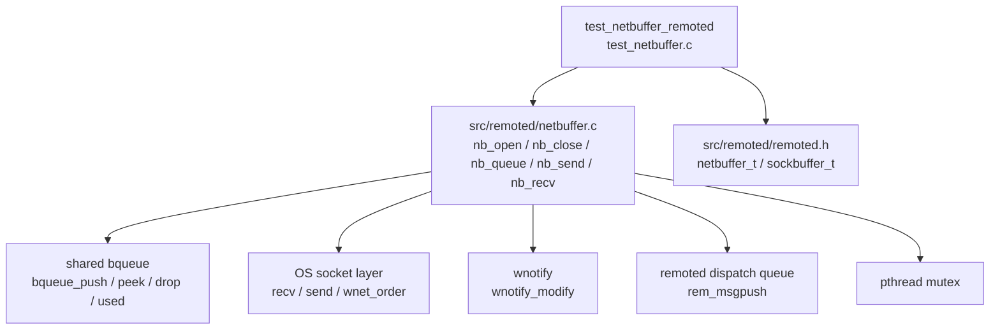
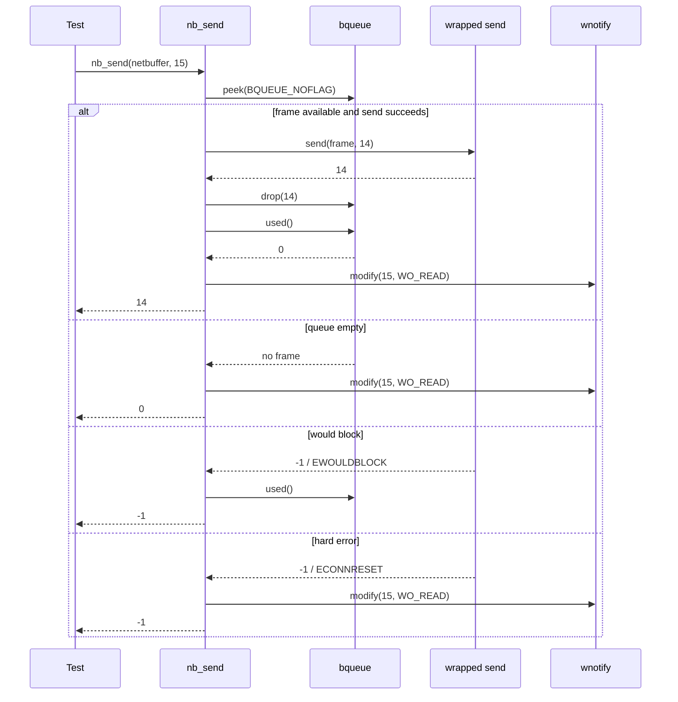
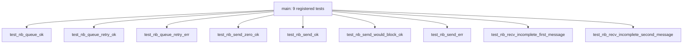

# `test_netbuffer_remoted`

## Introduction

`test_netbuffer_remoted` is the CMocka unit-test module for Wazuh `remoted`'s TCP network-buffer layer. It validates the behavior of `nb_open`, `nb_close`, `nb_queue`, `nb_send`, and `nb_recv` through the test entry point `src/unit_tests/remoted/test_netbuffer.c`.

The tests isolate transport behavior from the operating system and the rest of the daemon by replacing socket I/O, synchronization, buffering, notification, logging, counters, and queue operations with CMocka wrappers. The production responsibilities and data structures are documented in [remoted_networking.md](remoted_networking.md); this document describes how this test module verifies those contracts.

## Module position

The test belongs to the **Unit Tests – Remoted** collection and targets the `remoted_networking` partition of the native `remoted` daemon.



### Relationship to neighboring documentation

| Reference | Why it matters |
|---|---|
| [remoted_networking.md](remoted_networking.md) | Production architecture, buffer lifecycle, framing rules, and event-loop integration. |
| [remoted.md](remoted.md) | How the networking layer fits into the complete `wazuh-remoted` daemon. |
| [test_manager_remoted_test_infrastructure.md](test_manager_remoted_test_infrastructure.md) | Shared conventions used by the remoted unit-test suite. |
| [remoted_secure_connection.md](remoted_secure_connection.md) | Consumer of received messages and driver of read/write socket events. |

## Test harness architecture

`test_setup` enables test mode, configures a 100-byte send buffer, allocates a zeroed `netbuffer_t`, opens socket descriptor `15`, allocates the global `wnotify` object, and sets `send_chunk` to `14`. `test_teardown` closes the socket buffer and releases the allocated receive/send state.

```mermaid
flowchart LR
    SETUP[test_setup] --> NBOPEN[nb_open(netbuffer, 15, peer_info)]
    NBOPEN --> SLOT[netbuffer->buffers[15]]
    SLOT --> BQUEUE[bqueue_t outbound queue]
    SETUP --> NOTIFY[global wnotify_t]
    CASE[one CMocka test] --> SLOT
    CASE --> WRAP[expected wrapper calls]
    WRAP --> ASSERT[return value and state assertions]
    ASSERT --> TEARDOWN[test_teardown]
    TEARDOWN --> NBCLOSE[nb_close]
```

The test uses a single synthetic peer and a fixed descriptor so expectations can precisely match the queue pointer, descriptor, payload, length, notification operation, and mutex ordering.

## Components and mocked boundaries

| Component | Test-visible role |
|---|---|
| `CMUnitTest` / `main` | Registers nine setup/teardown tests and runs them with `cmocka_run_group_tests`. |
| `test_setup` / `test_teardown` | Establish and destroy the per-test `netbuffer_t` state. |
| `sockaddr_storage` | Represents the peer address retained by the socket buffer and passed to `rem_msgpush`. |
| `test_nb_queue_*` | Verifies framing, queue capacity retry, notification enablement, and discard behavior. |
| `test_nb_send_*` | Verifies queue draining, empty-queue handling, would-block handling, and hard send errors. |
| `test_nb_recv_*` | Verifies length-prefixed receive framing with an incomplete first or second message. |
| `netbuffer_wrappers.c` | Provides wrapped netbuffer calls where required by the test build. |
| Socket wrappers | Control `send`, `recv`, `sleep`, and network-order conversion outcomes. |
| Bqueue wrappers | Control push/peek/drop/used results and validate exact buffer interactions. |
| Notification wrappers | Validate `WO_READ` and `WO_READ | WO_WRITE` transitions. |
| Remoted queue wrappers | Validate delivery of complete received frames to `rem_msgpush`. |

## Outbound queue behavior

`nb_queue` adds a four-byte network-order length prefix to the payload before pushing it into the per-socket byte queue. The tests use payload `abcdefghi`, agent id `001`, and expect the final bytes `4321abcdefghi`.

```mermaid
flowchart TD
    CALL[nb_queue(msg, size=9, agent_id=001)] --> ORDER[wnet_order(9)\nmocked as 1234]
    ORDER --> FRAME[4-byte length prefix + payload\n14 bytes total]
    FRAME --> PUSH{bqueue_push succeeds?}
    PUSH -->|yes| USED[bqueue_used confirms queued bytes]
    USED --> ENABLE[wnotify_modify(fd=15,\nWO_READ | WO_WRITE)]
    ENABLE --> OK[return 0]
    PUSH -->|no, retry enabled| SLEEP[sleep(send_timeout_to_retry)]
    SLEEP --> RETRY[bqueue_push again]
    RETRY -->|success| USED
    RETRY -->|failure| DISCARD[rem_inc_send_discarded + warning]
    DISCARD --> ERR[return -1]
```

The three queue tests cover:

* `test_nb_queue_ok`: first push succeeds and write notification is enabled.
* `test_nb_queue_retry_ok`: the first push fails, the function sleeps for five seconds, retries, and succeeds.
* `test_nb_queue_retry_err`: both pushes fail; the message is counted as discarded, a warning is logged, and `-1` is returned.

## Outbound send behavior

`nb_send` peeks at the next queued frame and calls non-blocking `send`. A successful send drops the transmitted bytes. If the queue becomes empty, write notification is removed.



The corresponding tests are `test_nb_send_ok`, `test_nb_send_zero_ok`, `test_nb_send_would_block_ok`, and `test_nb_send_err`. The hard-error case also verifies the formatted error log for descriptor `15`; the would-block case confirms the queued data remains available for a later write event.

## Receive framing behavior

`nb_recv` appends bytes from `recv` to the per-socket receive buffer and interprets each message as a four-byte network-order length followed by payload bytes. It may emit complete messages while preserving an incomplete trailing frame.

```mermaid
flowchart TD
    READ[recv into sockbuffer.data] --> DECODE[decode first 4-byte length]
    DECODE --> COMPLETE{complete frame available?}
    COMPLETE -->|yes| PUSH[rem_msgpush(payload, length, peer_info, sock)]
    PUSH --> NEXT{more bytes remain?}
    NEXT -->|yes| DECODE
    NEXT -->|no| CLEAR[data_len = 0]
    COMPLETE -->|no| RETAIN[retain partial bytes in receive buffer]
    RETAIN --> RETURN[return bytes read]
```

The receive cases intentionally use binary-looking test data rather than human-readable text:

* `test_nb_recv_incomplete_first_message` supplies 14 bytes that contain an incomplete first frame. No complete message is dispatched; the function returns `14`.
* `test_nb_recv_incomplete_second_message` supplies a complete 8-byte frame followed by a 14-byte partial frame. The first frame is passed to `rem_msgpush`, the remaining 14 bytes stay in the buffer, and the decoded next length is asserted as `1019`.

These tests establish the important invariant that a partial network read is not treated as a complete application message and that multiple frames in one `recv` result are processed independently.

## Test inventory



| Test | Contract verified | Expected result |
|---|---|---|
| `test_nb_queue_ok` | Prefix and enqueue a message; enable write events | `0` |
| `test_nb_queue_retry_ok` | Retry after temporary buffer exhaustion | `0` |
| `test_nb_queue_retry_err` | Drop after persistent exhaustion and count it | `-1` |
| `test_nb_send_zero_ok` | Empty outbound queue is harmless | `0` |
| `test_nb_send_ok` | Send and remove all queued bytes | `14` |
| `test_nb_send_would_block_ok` | Preserve data when the socket would block | `-1` |
| `test_nb_send_err` | Log hard socket failure and reset notification state | `-1` |
| `test_nb_recv_incomplete_first_message` | Retain an incomplete first frame | `14` |
| `test_nb_recv_incomplete_second_message` | Dispatch complete frame and retain trailing partial frame | `26` |

## Execution and maintenance notes

The suite is a unit test, not an integration test: it does not require a live agent, real socket, epoll instance, or running `wazuh-remoted` daemon. CMocka expectations are part of the specification. When changing netbuffer behavior, update both the return/state assertions and the ordered wrapper expectations for mutexes, queue operations, sleeps, logging, and `wnotify` transitions.

The most important regression risks are:

1. Sending a length prefix in host byte order.
2. Enabling write notifications when a queue was already non-empty or failing to disable them after draining.
3. Losing partial receive data between calls.
4. Dropping queued data on `EWOULDBLOCK`.
5. Retrying indefinitely or failing to report a permanently full outbound buffer.

