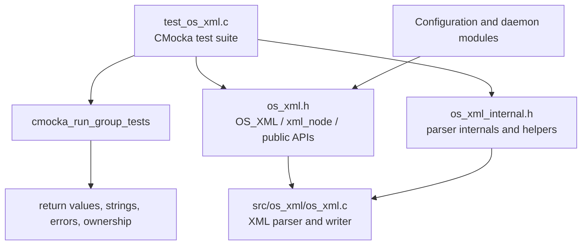
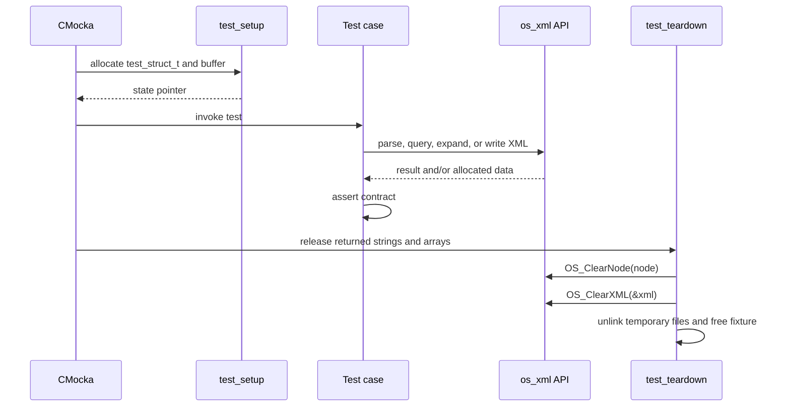
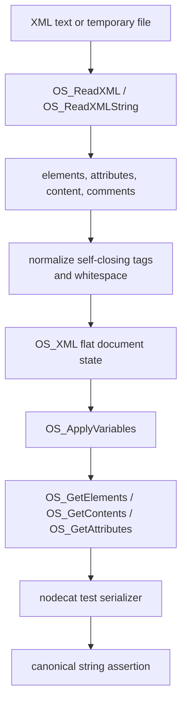
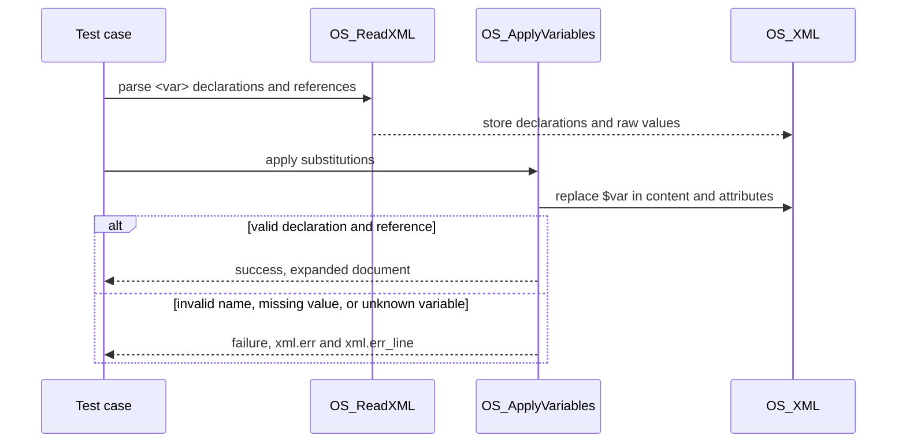

# `test_os_xml` — XML parser and writer unit tests

`test_os_xml` is the CMocka unit-test suite for Wazuh’s native XML support. It validates parsing from files and strings, XML node/attribute accessors, variable expansion, XML rewriting, line tracking, malformed-input diagnostics, and bounded-buffer behavior.

The suite tests the contract of `src/os_xml/`; the parser’s data model and production consumers are documented in [`os_xml.md`](os_xml.md). This page describes how the tests exercise that contract.

## Scope and system position

The test source is `src/unit_tests/os_xml/test_os_xml.c`. In the module tree it is the `test_os_xml` leaf under **Unit Tests – Networking, Regex, XML, and Zlib**. The suite sits between CMocka and the production XML library, with the XML wrapper layer available to dependent tests that need mocks.



Related documentation:

- [`os_xml.md`](os_xml.md) — parser architecture, `OS_XML` storage, public API, and production consumers.
- [`test_infrastructure.md`](test_infrastructure.md) — an example of the CMocka fixture and wrapper conventions used by native unit tests.
- [`shared_lib.md`](shared_lib.md) — common allocation and utility facilities used by the parser and tests.

## Test harness architecture

```mermaid
flowchart LR
    Main[main()] --> Table[CMUnitTest table]
    Table --> CMocka[CMocka runner]
    CMocka --> Fixtures[test_setup / test_teardown]
    CMocka --> Cases[behavioral test cases]
    Cases --> Read[OS_ReadXML / OS_ReadXMLString]
    Cases --> Query[OS_Get* / OS_RootElementExist]
    Cases --> Vars[OS_ApplyVariables]
    Cases --> Write[OS_WriteXML]
    Cases --> Helper[w_get_attr_val_by_name]
    Read & Query & Vars & Write & Helper --> Library[os_xml implementation]
    Library --> State[OS_XML and XML_NODE state]
    Cases --> Checks[CMocka assertions]
```

`main()` constructs the test table and invokes `cmocka_run_group_tests(tests, NULL, NULL)`. Tests that need document state use `cmocka_unit_test_setup_teardown`; the small attribute helper tests do not require a fixture. The suite does not install a group-level setup or teardown callback.

## Fixture and resource lifecycle

The `test_struct_t` fixture groups the parser context, a temporary node view, temporary file names, a 6144-byte serialization buffer, and dynamically returned content arrays.



`test_setup` initializes the fixture with `os_calloc`, clears the serialization buffer, and stores it in CMocka state. `test_teardown` frees single strings (`content1`–`content4`), null-terminated string arrays (`content5` and `content6`), node/document structures, temporary files, and the fixture itself. This is important because the accessor API returns owned memory rather than borrowed pointers in several cases.

The helper `create_xml_file()` writes test input to a `mkstemp` file. Tests therefore exercise the same file entry point used by production configuration readers, while remaining isolated from repository configuration files.

## Parsing and normalization coverage

The basic parser tests establish the normalized representation expected from `OS_ReadXML`:

| Area | Cases covered | Expected behavior |
|---|---|---|
| Empty and simple nodes | empty input, paired tags, self-closing tags | Empty input yields no nodes; `<root/>` is normalized to `<root></root>`. |
| Multiple roots | three sibling root elements | Multiple top-level elements are retained in input order. |
| Children | nested and sibling children | Parent/child relationships are preserved and can be traversed. |
| Content | text before and after a child | The suite captures the implementation’s content-selection behavior (`value2` in the mixed-content case). |
| Attributes | quoted values, whitespace/newlines, slash-containing values | Attribute ordering and values survive normalization; whitespace is removed from syntax. |
| Comments | legacy and `<!-- ... -->` forms | Comments are ignored and do not appear in serialized nodes. |
| Special characters | backslash-containing content | Parser content is retained without treating the backslash as XML syntax. |
| Line tracking | three root nodes on three lines | `OS_XML.ln[]` records source line numbers. |



The local `nodecat()` helper is a test-side serializer. It walks `OS_GetElementsbyNode`, emits element names, attributes, content, recursively emits children, and closes each tag. The tests compare this canonical form to expected strings rather than comparing internal pointer layouts.

## Variables

`test_variables` verifies `<var name="...">value</var>` declarations and substitution in both element content and attribute values. Substitution supports a variable embedded in surrounding text and multiple variables in one value.

The negative cases define the error boundary:

- an attribute other than `name` on `<var>` is rejected;
- variable names beyond `XML_VARIABLE_MAXSIZE` are rejected;
- references to an undeclared variable report `Unknown variable`;
- a variable declaration without a usable name/value reports `No value set for variable`;
- ordinary unknown-looking text is preserved when it is not interpreted as a valid declaration/reference in the tested context.



## Error handling and malformed input

The suite asserts both a non-success return and the exact human-readable error stored in `OS_XML.err`, together with `OS_XML.err_line`. Covered parser failures include:

- missing input file;
- malformed self-closing syntax;
- unclosed elements, mismatched closing elements, and closing tags without an opener;
- unclosed comments;
- unquoted, empty, incomplete, or improperly closed attributes;
- duplicate attributes and attributes without values;
- invalid variable declarations and references.

These tests protect diagnostics as part of the public operational contract: configuration loaders can report the parser’s message and line number instead of only a generic failure.

## Accessor behavior

The accessor tests validate path-based navigation and allocation conventions:

| API | Verified behavior |
|---|---|
| `OS_RootElementExist` | Counts matching top-level elements and returns zero for missing or null names. |
| `OS_GetOneContentforElement` | Returns the first matching content value and null for a missing path. |
| `OS_GetAttributeContent` | Returns an attribute value, an empty string for a missing/null attribute name, and null for an invalid path. |
| `OS_GetContents` | Returns all matching content values in a null-terminated array. |
| `OS_GetElementContent` | Returns content for one path; rejects paths beyond the supported maximum depth. |
| `OS_GetElements` | Returns child names or root names; rejects null/invalid paths and excessive depth. |
| `OS_GetAttributes` | Returns attribute names in source order. |
| `w_get_attr_val_by_name` | Safely returns a matching `xml_node` value, or null for a null attribute array/name or missing name. |

The depth tests deliberately construct a 17-level path. The expected null result documents the accessor’s depth guard even though the parser itself can represent the input.

## XML writing and round-trip behavior

`test_os_write_xml_success1` through `test_os_write_xml_success5` exercise `OS_WriteXML` by creating an input file, writing a modified output file, reparsing it, applying variables, and comparing the resulting canonical XML. The cases cover:

- an unchanged/absent target path;
- replacing an existing value with the same or a new value;
- adding a missing root/child path;
- removing comments as part of the rewritten output.

```mermaid
flowchart LR
    Old[Input XML file] --> W[OS_WriteXML(path, oldval, newval)]
    W --> New[Output XML file]
    New --> R[OS_ReadXML]
    R --> V[OS_ApplyVariables]
    V --> C[OS_GetElementsbyNode + nodecat]
    C --> Assert[round-trip canonical XML assertion]
```

`test_os_write_xml_failures` verifies distinct writer errors for an unreadable input (`XMLW_NOIN`), an invalid output path (`XMLW_NOOUT`), and malformed source XML (`XMLW_ERROR`).

## Overflow and truncation policy

The overflow tests generate values larger than `XML_MAXSIZE` for element names, element content, attribute names, and attribute values. Strict `OS_ReadXML` calls must fail with `XMLERR: String overflow.` or the more specific attribute overflow diagnostic.

The `_Ex` entry point is tested with its truncate flag enabled:

- oversized element content is accepted and exposed as the truncated content;
- oversized attribute values are accepted and remain queryable;
- oversized names still fail, because truncating structural identifiers would make the document ambiguous.

This preserves the distinction documented in [`os_xml.md`](os_xml.md): strict parsing protects configuration integrity, while the extended path can safely cap large content fields for callers that need bounded ingestion.

## Test registration inventory

`main()` registers the following functional groups:

1. `w_get_attr_val_by_name` null, missing, and found cases.
2. Simple nodes, multiple nodes, children, and mixed content.
3. Attributes, variables, comments, special characters, and line numbers.
4. Missing files and malformed XML/attribute/variable cases.
5. Root existence and content/element/attribute accessor cases.
6. Successful and failing `OS_WriteXML` round trips.
7. Element/attribute name and value overflow, including truncation mode.
8. `OS_ReadXMLString` invalid-input coverage.

The module tree names the primary source-level symbols as `CMUnitTest`, `main`, the `test_*` cases, fixture functions, and `w_get_attr_val_by_name` cases. The source also contains a few additional invalid-input helpers; they are part of the same suite when enabled by the build configuration.

## Change-impact guide

Changes to the parser should normally update this suite when they affect:

- canonical handling of self-closing tags, comments, whitespace, or mixed content;
- attribute duplicate/quoting rules;
- variable declaration and substitution semantics;
- `OS_XML.err` text or line-number behavior;
- accessor path depth, returned ownership, or null handling;
- `OS_WriteXML` path creation/replacement behavior;
- `XML_MAXSIZE`, `XML_VARIABLE_MAXSIZE`, or truncate-mode semantics.

Changes to the production parser may also require updates in configuration and daemon suites, which consume the same APIs. See [`os_xml.md`](os_xml.md) for the downstream dependency map and avoid duplicating those consumers’ documentation here.
