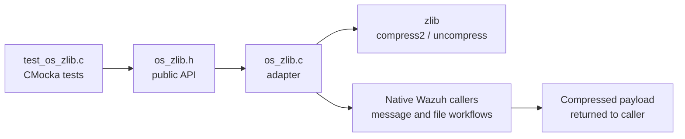
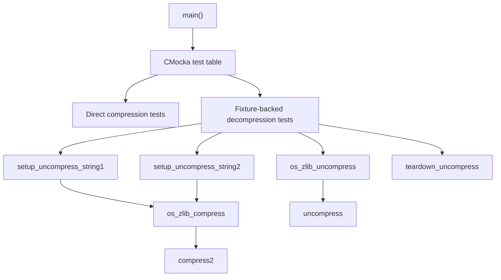
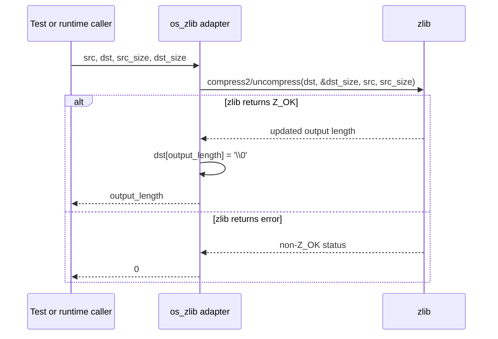
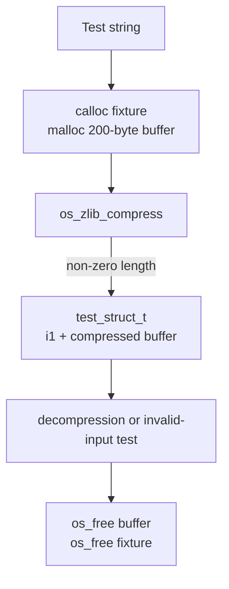
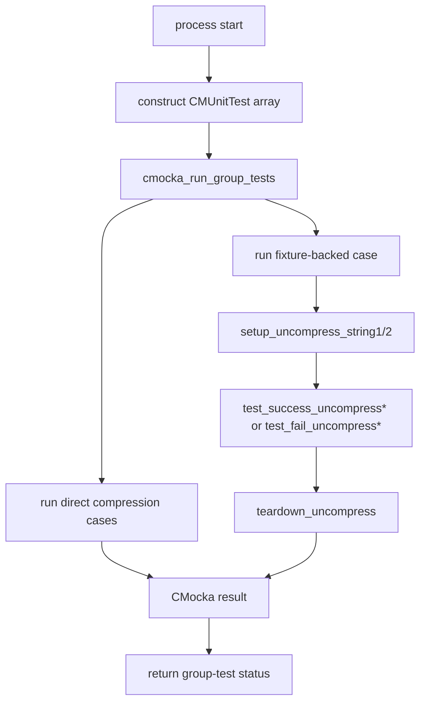
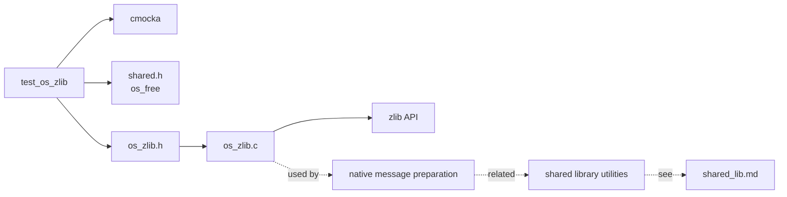

# `test_os_zlib`

`test_os_zlib` is the CMocka unit-test module for Wazuh’s low-level zlib adapter. It verifies that `os_zlib_compress` and `os_zlib_uncompress` correctly round-trip ordinary and whitespace-containing strings, reject invalid pointers and zero-sized buffers, and expose failures through a zero return value.

The test is located at `src/unit_tests/os_zlib/test_os_zlib.c`. The production implementation is `src/os_zlib/os_zlib.c`; the public declarations are provided by `src/os_zlib/os_zlib.h`.

## Purpose and system position

The module validates a shared compression boundary used by native Wazuh components. Compression is used where a payload must be made smaller before another protocol layer handles it; for example, the encrypted-message path compresses its prepared message before padding and encryption. File/package tooling also has related compression concerns; see [compression_archive.md](compression_archive.md) and [shared_lib.md](shared_lib.md) for neighboring infrastructure.



The test module is not itself a runtime compression service. It is a focused verification layer around the adapter’s contract.

## Architecture

### Components

| Component | Responsibility |
|---|---|
| `CMUnitTest` | CMocka test descriptor used to register each case. |
| `main` | Builds the test table and invokes `cmocka_run_group_tests`. |
| `test_struct_t` | Fixture state containing a compressed buffer and its valid compressed length. |
| `setup_uncompress_string1` | Allocates a 200-byte fixture buffer and compresses `"Hello World!"`. |
| `setup_uncompress_string2` | Allocates a 200-byte fixture buffer and compresses the whitespace/control-character string. |
| `teardown_uncompress` | Releases the fixture buffer and fixture object with `os_free`. |
| `test_success_*` | Exercises successful compression and decompression. |
| `test_fail_*` | Exercises invalid source, destination, and size arguments. |
| `os_zlib_compress` | Calls zlib `compress2` at `Z_BEST_COMPRESSION`; NUL-terminates successful output. |
| `os_zlib_uncompress` | Calls zlib `uncompress`; NUL-terminates successful output. |



### Production API contract

Both adapter functions have the shape:

```c
unsigned long int function(
    const char *src,
    char *dst,
    unsigned long int src_size,
    unsigned long int dst_size);
```

Their observable contract, as exercised by this module, is:

1. The source and destination pointers must be usable.
2. The source and destination capacities must be non-zero and sufficient for the requested operation.
3. A successful operation returns the resulting byte count, which is non-zero for the test inputs.
4. Successful output is terminated with `\\0`, allowing the tests to compare it with `assert_string_equal`.
5. Any zlib failure is normalized to `0`.

`dst_size` is passed to zlib by address, so zlib can update it to the actual output length. The adapter then writes the terminator at that returned length. Callers must therefore provide room for both the zlib output and the terminator; the test uses `BUFFER_LENGTH` equal to 200 for both.



## Test data and fixtures

The module defines two inputs:

- `TEST_STRING_1`: `Hello World!`
- `TEST_STRING_2`: `Test hello \n test \t test \r World\n`

The second input intentionally includes newline, tab, carriage-return, and a final newline. It checks that the adapter preserves embedded and trailing characters through compression and decompression rather than only handling a simple printable string.

The fixture object is:

```c
typedef struct test_struct {
    unsigned long int i1; // compressed byte count
    char *buffer;         // compressed bytes
} test_struct_t;
```

The setup functions assert that compression succeeds before handing the fixture to the test. The teardown function assumes the fixture was created, frees both allocations, and returns success.



## Test coverage

### Compression success

- `test_success_compress_string` compresses `TEST_STRING_1` into a stack buffer and requires a non-zero result.
- `test_success_compress_special_string` performs the same check for `TEST_STRING_2`.

These tests validate the basic success path but do not assert a particular compression ratio or byte sequence. That is intentional: compressed representations are implementation details and can vary with zlib versions or settings.

### Compression validation failures

- `test_fail_compress_null_src`: source is `NULL`.
- `test_fail_compress_no_dest`: destination is `NULL`.
- `test_fail_compress_no_dest_size`: destination capacity is zero.

Each case expects `os_zlib_compress` to return `0`.

### Decompression success

- `test_success_uncompress` uses the first setup fixture and requires a non-zero result plus exact equality with `TEST_STRING_1`.
- `test_success_uncompress_special_string` uses the second fixture and requires exact equality with `TEST_STRING_2`.

These are round-trip tests: setup compresses the source, the test decompresses the resulting bytes, and the test compares the reconstructed NUL-terminated string.

### Decompression validation failures

- `test_fail_uncompress_null_src`: compressed source is `NULL`.
- `test_fail_uncompress_null_dst`: destination is `NULL`.
- `test_fail_uncompress_no_src_size`: compressed input length is zero.
- `test_fail_uncompress_no_dest_size`: destination capacity is zero.

All four cases expect a return value of `0`.

```mermaid
flowchart LR
    A["TEST_STRING_1 or TEST_STRING_2"] --> C["compress"]
    C --> B["compressed bytes + length"]
    B --> U["uncompress"]
    U --> R["reconstructed string"]
    R --> E{ "exact string equality?" }
    E -->|yes| Pass["pass"]
    E -->|no| Fail["fail"]
    N["NULL pointer or zero size"] --> V["adapter validation / zlib failure"]
    V --> Z["return 0"]
```

## Test registration and execution flow

`main` registers eleven tests. Five compression tests run without setup/teardown. Six decompression tests use `cmocka_unit_test_setup_teardown`, selecting one of the two fixture builders and the common cleanup routine.



### Isolation characteristics

- Compression success cases use local stack buffers and do not share state.
- Decompression cases receive fresh heap-backed fixtures through CMocka state.
- Fixture setup validates its own prerequisite compression, preventing decompression tests from silently operating on an invalid fixture.
- Fixture teardown is shared, which keeps allocation cleanup consistent across success and failure cases.

## Dependencies and relationships



The test directly depends on the adapter header and shared memory helper. It does not test encryption, networking, archive formats, or the complete message protocol. Those concerns belong to their respective modules and should be linked from their documentation rather than duplicated here.

## Failure semantics and limitations

The test establishes that invalid arguments result in `0`, but it does not distinguish which underlying zlib status caused the failure. It also does not cover:

- compressed data corruption or truncated streams;
- destination buffers that are too small but non-zero;
- very large inputs or integer overflow boundaries;
- binary data containing embedded NUL bytes;
- allocator failures in fixture setup;
- concurrent calls or thread safety;
- exact compressed-byte compatibility across zlib versions.

The string-oriented assertions are appropriate for this module’s current contract because successful adapter output is explicitly NUL-terminated. Binary callers should use the returned length rather than string functions.

## Maintenance guidance

When changing the adapter:

1. Preserve the zero-on-failure convention unless all callers and tests are migrated together.
2. Preserve output-length semantics: the return value is the number of bytes produced before the terminator.
3. Revisit buffer sizing whenever terminator placement or zlib capacity handling changes.
4. Add a binary-data test if the API is expanded beyond NUL-terminated text.
5. Add malformed-input and insufficient-capacity cases when hardening error handling.

For adjacent compression and shared utility behavior, refer to [compression_archive.md](compression_archive.md), [shared_lib.md](shared_lib.md), and [test_os_xml.md](test_os_xml.md) for the repository’s related low-level test documentation patterns.

