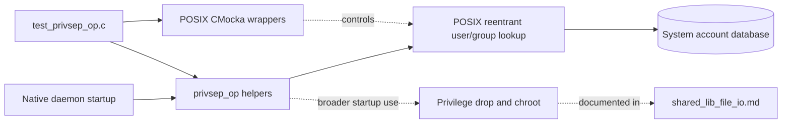
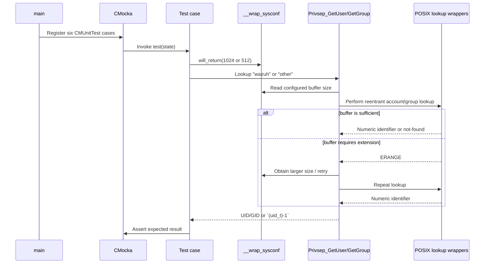
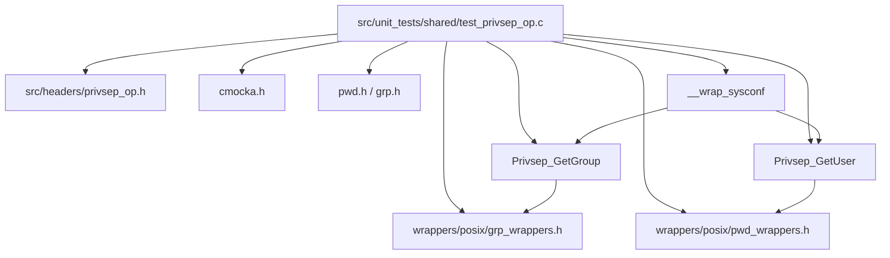

# `test_privsep_op`

`test_privsep_op` is the CMocka unit-test module for Wazuh's shared privilege-separation account lookup helpers. It verifies that `Privsep_GetUser` resolves a user name to its numeric identifier, `Privsep_GetGroup` resolves a group name, both helpers tolerate an initially insufficient lookup buffer, and both return the failure sentinel for an unknown name.

The tests exercise the lookup contract only. Privilege switching, chrooting, and daemon-specific startup behavior are implemented elsewhere; see [shared library file I/O](shared_lib_file_io.md) for the broader `privsep_op.c` context and [shared library](shared_lib.md) for shared-library integration.

## Scope and system position

The module sits at the lowest-level shared-library test boundary. Native daemons use the lookup helpers while validating configured accounts before dropping privileges. This test suite replaces the operating-system account database calls with POSIX wrappers, making the unit tests deterministic.



## Components

| Component | Responsibility |
|---|---|
| `CMUnitTest` | CMocka test registration type used to build the suite. |
| `main` | Registers six tests and executes them with `cmocka_run_group_tests`. |
| `test_GetUser_success` | Verifies that the known user `wazuh` resolves to identifier `1000` with a 1024-byte initial buffer. |
| `test_GetUser_success_extend` | Verifies the same lookup when the wrapper supplies a smaller 512-byte buffer, covering buffer extension/retry behavior. |
| `test_GetUser_failure` | Verifies that the unknown user `other` returns `(uid_t)-1`. |
| `test_GetGroup_success` | Verifies that the known group `wazuh` resolves to identifier `1000` with a 1024-byte initial buffer. |
| `test_GetGroup_success_extend` | Verifies group lookup after starting with a 512-byte buffer. |
| `test_GetGroup_failure` | Verifies that the unknown group `other` returns `(uid_t)-1`. |

The test includes `privsep_op.h` for the public helper declarations, `pwd.h` and `grp.h` for account structures/types, and the POSIX wrapper headers for controlled `getpwnam_r`, `getpwuid_r`, and `getgrnam_r`-related behavior.

## Lookup architecture

The production helpers are expected to use reentrant POSIX lookup routines. A caller supplies a name; the helper allocates a working buffer, performs the lookup, retries with a larger buffer when the result is too large, and returns the numeric identifier or a failure sentinel.

```mermaid
flowchart TD
    Start[Privsep_GetUser(name) or Privsep_GetGroup(name)] --> Buf[Allocate initial lookup buffer]
    Buf --> Lookup[Call reentrant POSIX lookup through wrapper]
    Lookup --> Result{Lookup result}
    Result -->|name found| Id[Return numeric UID/GID]
    Result -->|ERANGE / buffer too small| Grow[Extend buffer]
    Grow --> Lookup
    Result -->|not found or lookup error| Fail[Return (uid_t)-1]
```

The two `*_success_extend` tests are especially important because they distinguish a robust lookup implementation from one that assumes the system's first buffer size is always sufficient. The test controls the initial size through `will_return(__wrap_sysconf, 512)`; the expected identifier remains `1000`, proving that a smaller starting allocation does not change the successful result.

## Test execution flow

`main` creates a static array of six `CMUnitTest` entries. CMocka invokes each test with an unused `state` pointer. Before each lookup, the test programs the `__wrap_sysconf` mock with the initial buffer size expected by the helper.



## Behavioral contract covered

### Successful user lookup

`test_GetUser_success` calls `Privsep_GetUser("wazuh")` after configuring a 1024-byte `sysconf` result and expects `1000`. `test_GetUser_success_extend` repeats the lookup with an initial size of 512 bytes. Together they cover ordinary success and the retry path.

### Failed user lookup

`test_GetUser_failure` calls `Privsep_GetUser("other")` and expects `(uid_t)-1`. This represents an account that cannot be resolved and establishes the failure value callers can check before attempting privilege changes.

### Successful group lookup

`test_GetGroup_success` and `test_GetGroup_success_extend` mirror the user tests for `Privsep_GetGroup("wazuh")`, expecting group identifier `1000` for both initial buffer sizes.

### Failed group lookup

`test_GetGroup_failure` calls `Privsep_GetGroup("other")` and expects `(uid_t)-1`, ensuring an unknown group is not silently converted into a usable identifier.

## Dependencies and test doubles



The wrappers isolate the suite from the host's actual `/etc/passwd` and `/etc/group` contents. They also allow the tests to force the initial buffer sizes used by the implementation. The test does not mock the helper functions themselves; it calls the real `Privsep_GetUser` and `Privsep_GetGroup` implementations.

## Running and interpreting the suite

The test is built as part of Wazuh's native unit-test targets and can be run through the repository's normal CMocka test command or directly from its generated test binary. A passing run requires all six cases:

```text
test_GetUser_success
test_GetUser_success_extend
test_GetUser_failure
test_GetGroup_success
test_GetGroup_success_extend
test_GetGroup_failure
```

Failures usually indicate one of the following:

- the helper no longer resolves names through the expected reentrant lookup path;
- `ERANGE` causes an error instead of a buffer-growth retry;
- the wrapper contract or `sysconf` handling changed;
- unknown names return an ambiguous value instead of `(uid_t)-1`;
- the test fixture's expected `wazuh` identifier no longer matches the controlled wrapper data.

Because the suite uses wrappers, a successful result validates the helper's lookup and error-handling contract, not the correctness of the host operating system's account database.

## Relationship to callers

Several native daemons use these helpers during startup to validate configured users and groups before privilege reduction. The daemon-specific lifecycle documents describe those call sites and should be consulted for operational behavior rather than duplicating it here. In particular, see [remoted lifecycle](remoted_lifecycle.md), [logcollector daemon lifecycle](logcollector_core_daemon_lifecycle.md), [Wazuh DB daemon core](wazuh_db_daemon_core.md), and [OS authentication server daemon](os_auth_server_daemon.md).

