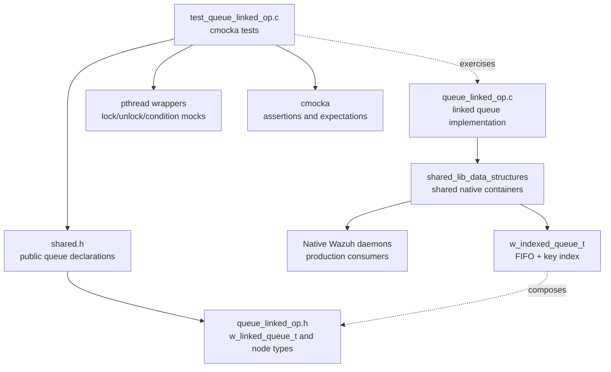
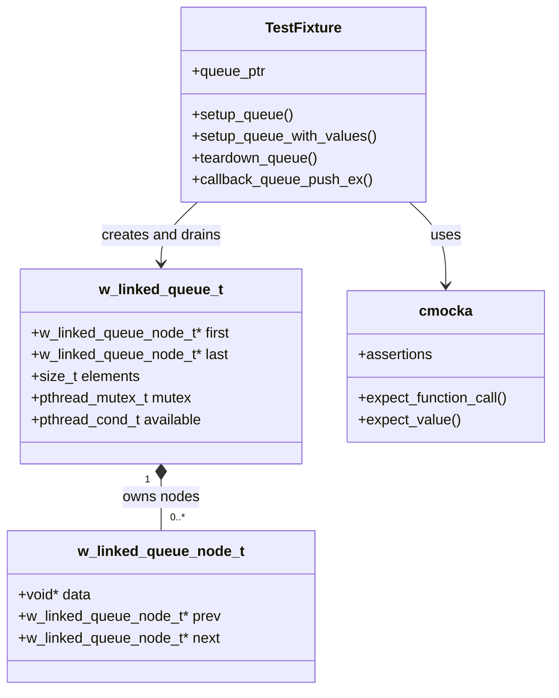
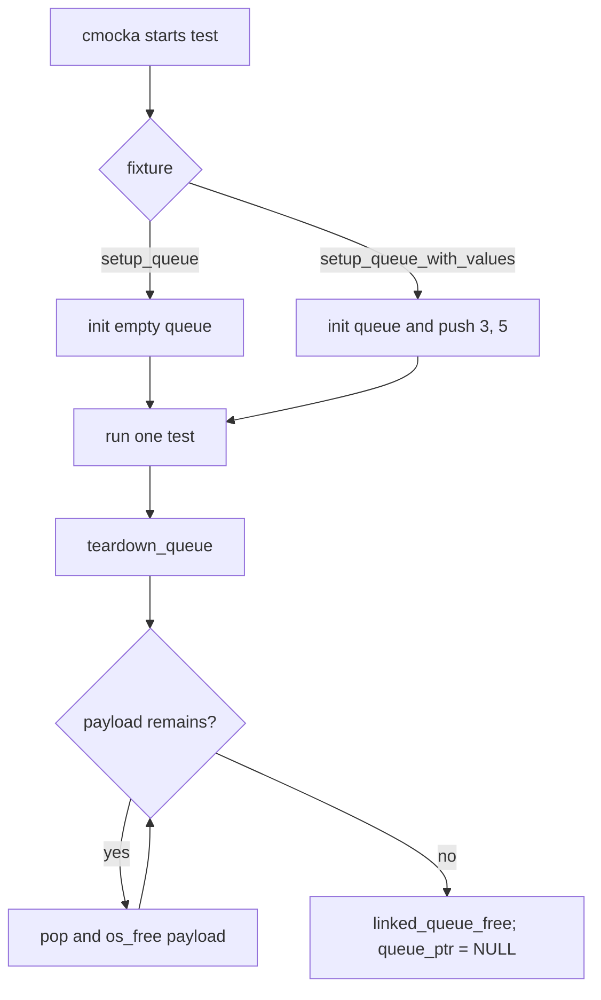
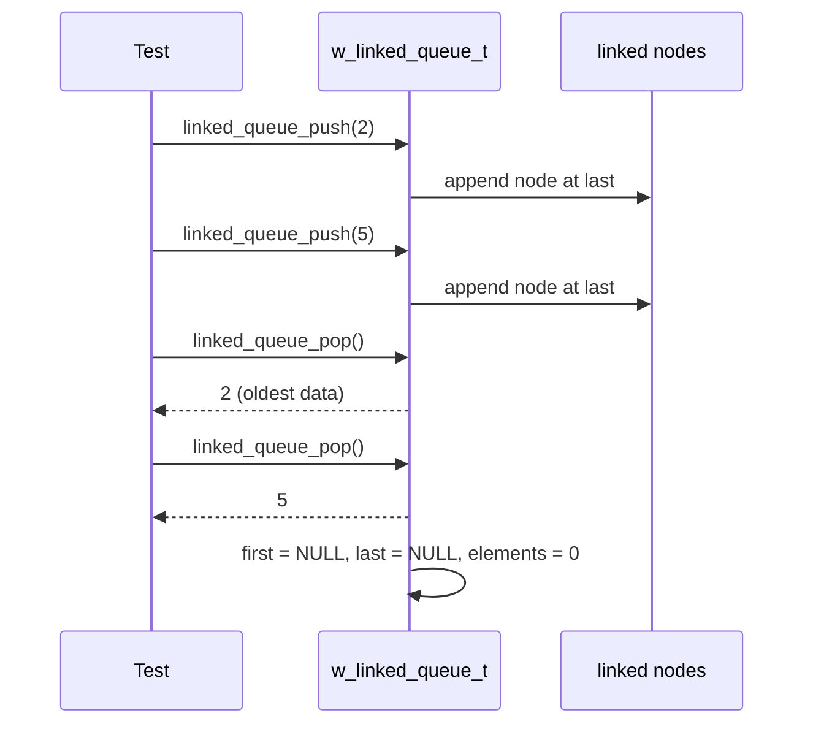
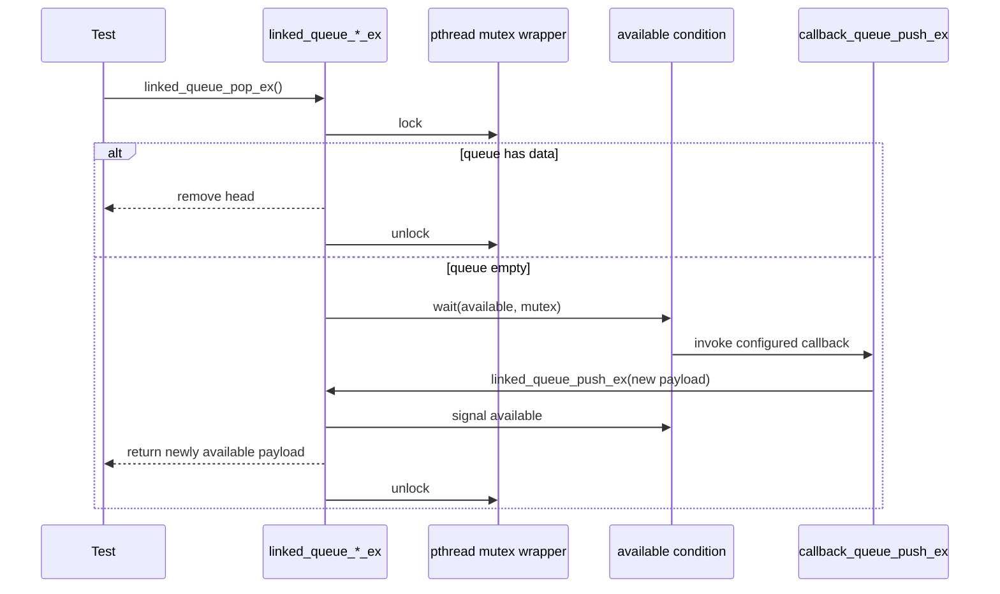
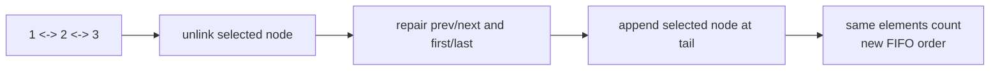
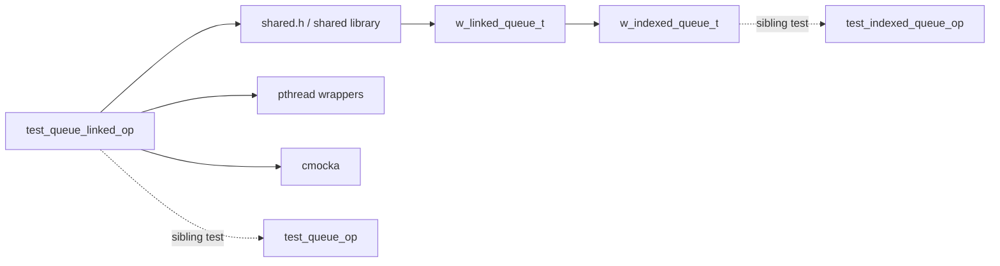

# `test_queue_linked_op` Module

## Introduction

`test_queue_linked_op` is the cmocka unit-test module for Wazuh's native C linked FIFO queue. It validates the public `w_linked_queue_t` API exposed through `shared.h`, including ordinary insertion/removal, mutex-protected producer/consumer operations, empty-queue behavior, and moving an existing node to the queue tail.

The test target covers `src/unit_tests/shared/test_queue_linked_op.c`. The production queue is described in [shared_lib_data_structures.md](shared_lib_data_structures.md); this document focuses on the test fixture, the behavioral contract encoded by the tests, and the dependency boundaries around it.

## System placement

The test belongs to the native shared-library test suite. The queue itself is a reusable low-level primitive used by native daemons and by the higher-level indexed queue; it is not the C++ engine queue described in [Queue.md](Queue.md).

The supplied test includes `../wrappers/posix/pthread_wrappers.h` and uses `shared.h`. Therefore, the test intentionally verifies both queue state transitions and synchronization calls without requiring real blocking threads.

## Responsibilities and scope

The module verifies these properties:

| Area | Behavior under test |
|---|---|
| FIFO insertion | `linked_queue_push` appends data and updates `first`, `last`, and `elements`. |
| FIFO removal | `linked_queue_pop` returns the oldest payload and maintains empty-state pointers. |
| Thread-safe insertion | `linked_queue_push_ex` protects the operation with the queue mutex and signals `available`. |
| Thread-safe removal | `linked_queue_pop_ex` protects removal and waits when the queue is empty. |
| Empty handling | Popping an empty queue returns `NULL`. |
| Node relocation | `linked_queue_unlink_and_push_node` moves a node to the tail while preserving queue size and node ownership. |
| Resource cleanup | Fixtures drain payloads before calling `linked_queue_free`. |

The tests use heap-allocated integers as opaque `void *` payloads. Integer values are only test markers: `3` and `5` establish FIFO order, while `1`, `2`, and `3` make node relocation order visible.

## Component architecture

The queue is a doubly linked list. `first` identifies the dequeue end and `last` identifies the append end. Each push adds a node; each pop removes a node and returns its `data` pointer. The test does not free payloads inside the queue API, so callers remain responsible for freeing returned data.

## Test fixture lifecycle

`setup_queue` creates an empty queue, stores it in cmocka's `state`, and also assigns the file-local `queue_ptr`. The latter is needed by `callback_queue_push_ex`, which is invoked while `linked_queue_pop_ex` is waiting.

`setup_queue_with_values` creates a queue containing two heap integers in the order `3 -> 5`.

`teardown_queue` repeatedly pops and frees every remaining payload, frees the queue, and clears `queue_ptr`. This makes cleanup safe for tests that leave elements queued and avoids leaking the test payloads.

## Behavioral flows

### Ordinary push and pop

`test_linked_queue_push` pushes `2`, then `5`, and checks that the first payload remains `2`, the last payload becomes `5`, and the element count is `2`. `test_linked_pop` removes `3`, then `5`, checking FIFO order and confirming that both `first` and `last` become `NULL` after the final removal.

### Thread-safe push and pop

`test_linked_queue_push_ex` expects one mutex lock/unlock pair and a condition signal for each insertion. It also verifies that the signaled condition is `queue->available`.

`test_linked_pop_ex` expects lock/unlock around each removal. After the queue becomes empty, it configures the pthread wrapper so the condition wait invokes `callback_queue_push_ex`. That callback inserts a payload into the same queue, allowing the blocking pop operation to resume deterministically.

### Node relocation

The three relocation tests create nodes `1`, `2`, and `3`, then call `linked_queue_unlink_and_push_node`:

| Test | Node moved | Expected dequeue order |
|---|---:|---|
| `test_linked_queue_unlink_and_push_mid` | `2` | `1, 3, 2` |
| `test_linked_queue_unlink_and_push_start` | `1` | `2, 3, 1` |
| `test_linked_queue_unlink_and_push_end` | `3` | `1, 2, 3` |

Each test expects a mutex lock/unlock pair, confirms `elements` remains `3`, and frees all returned payloads. The operation changes links, not payload ownership or queue cardinality.

## Test inventory

`main` registers eight cmocka tests with setup/teardown pairs:

1. `test_linked_queue_push`
2. `test_linked_queue_push_ex`
3. `test_linked_pop_empty`
4. `test_linked_pop`
5. `test_linked_pop_ex`
6. `test_linked_queue_unlink_and_push_mid`
7. `test_linked_queue_unlink_and_push_start`
8. `test_linked_queue_unlink_and_push_end`

The test file returns `cmocka_run_group_tests(...)`, so the process exit status represents the complete group result.

## Dependencies and relationships

- [shared_lib_data_structures.md](shared_lib_data_structures.md) documents the production linked queue, its relationship to `w_queue_t`, `rb_tree`, and `w_indexed_queue_t`, and the broader native-daemon consumers.
- [headers_concurrency.md](headers_concurrency.md) documents the queue declarations and concurrency-oriented header grouping.
- [test_indexed_queue_op.md](test_indexed_queue_op.md) covers the composite queue that uses linked-queue nodes as its FIFO layer.
- [test_queue_op.md](test_queue_op.md) covers the separate bounded, array-backed queue. Its blocking and condition-variable tests are related but should not be conflated with this unbounded linked queue.
- `src/unit_tests/wrappers/posix/pthread_wrappers.h` supplies controllable pthread behavior for synchronization assertions and callback-driven wake-up testing.

## Maintenance guidance

When changing linked-queue behavior, preserve the invariants exercised here:

- Empty queue: `first == NULL`, `last == NULL`, and `elements == 0`.
- Non-empty queue: `first` is the next node to pop and `last` is the most recently pushed node.
- Relocation does not change `elements` or free/reallocate the moved payload.
- `_ex` operations perform the expected mutex and condition-variable interactions.
- Queue operations return payload ownership to the caller; tests explicitly call `os_free` on returned integers.

Changes to blocking behavior should update `test_linked_pop_ex` and its pthread-wrapper expectations. Changes to link manipulation should update all three relocation cases, especially the first-node and middle-node boundary conditions.
