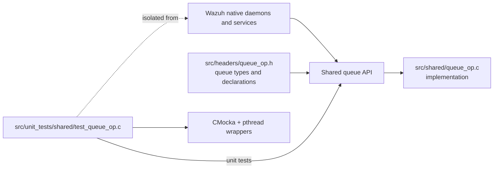
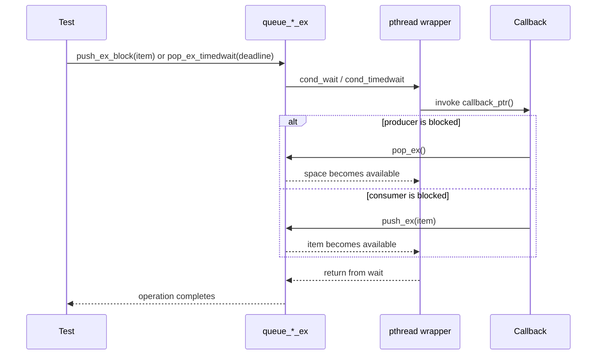
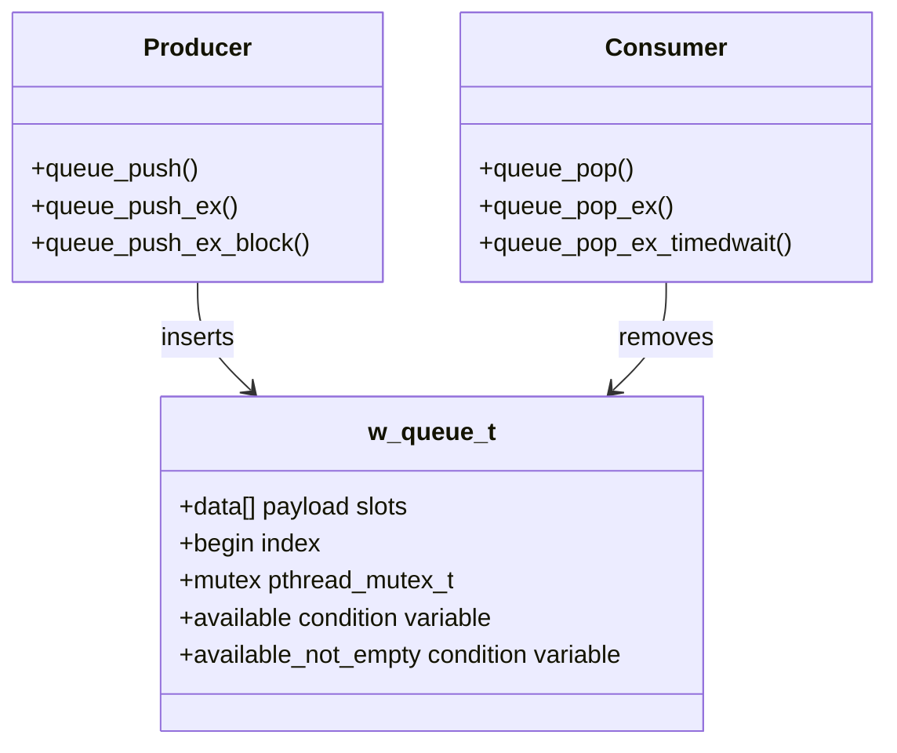
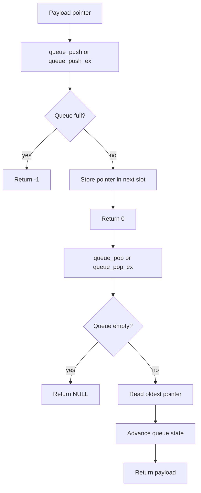
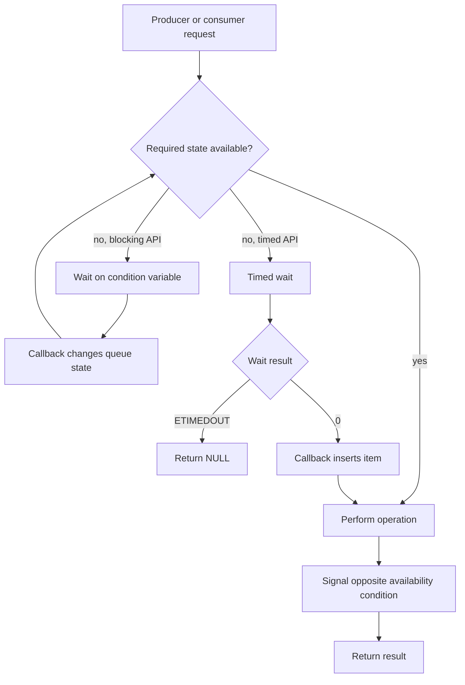
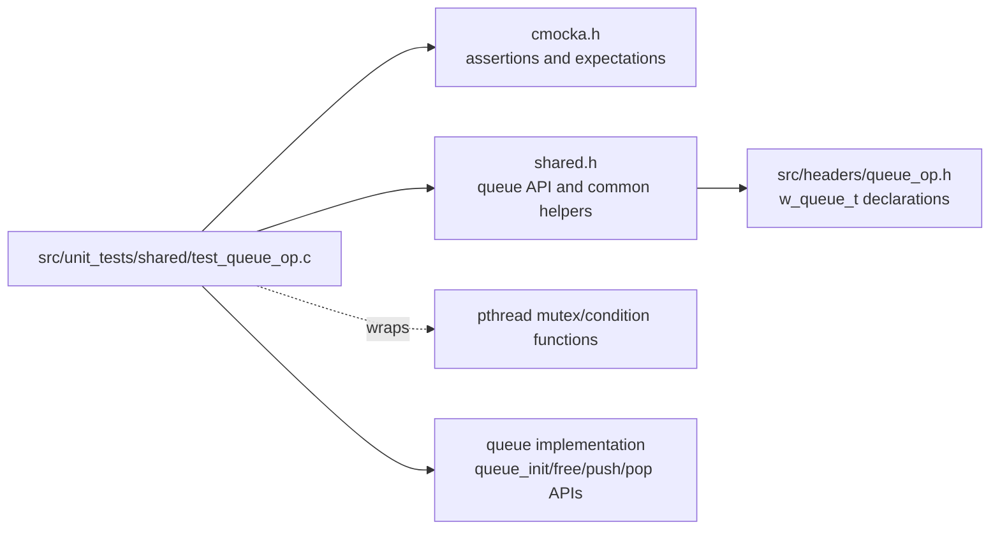

# `test_queue_op` module

`test_queue_op` is the CMocka unit-test module for Wazuh’s shared, bounded queue API. It validates queue occupancy, FIFO insertion/removal, capacity reporting, mutex-protected operations, condition-variable signaling, blocking producers, and timed consumers.

The test target is `src/unit_tests/shared/test_queue_op.c`. The queue implementation and public data structures are supplied through `shared.h`; this document describes the observable contract exercised by the tests rather than duplicating the queue implementation. See [shared library data structures](shared_lib_data_structures.md) for the broader shared-library context and [linked queue tests](test_queue_linked_op.md) for the related linked-queue test strategy.

## Position in the system

The queue is a reusable shared-library primitive used by native Wazuh daemons and services to move work between producers and consumers. `test_queue_op` is isolated from those production consumers: it creates a small queue, replaces selected pthread calls with CMocka wrappers, and verifies queue behavior deterministically.



## Responsibilities

The module verifies these queue behaviors:

| Area | Covered behavior |
| --- | --- |
| Capacity | `queue_full()` and `queue_full_ex()` distinguish available capacity from a full queue. |
| Emptiness | `queue_empty()` reports the empty/non-empty state as the queue indices change. |
| Occupancy | `queue_get_percentage_ex()` reports 0%, 25%, 50%, 75%, and 100% occupancy for the test queue. |
| Non-blocking producer | `queue_push()` and `queue_push_ex()` accept items until capacity and return `-1` when full. |
| Non-blocking consumer | `queue_pop()` returns items in insertion order and returns `NULL` when empty. |
| Synchronized producer | `queue_push_ex()` locks the queue mutex, signals availability, and unlocks. |
| Blocking producer | `queue_push_ex_block()` waits when full, then resumes after a consumer removes an item. |
| Synchronized consumer | `queue_pop_ex()` waits when empty and signals producer/consumer availability after removal or insertion. |
| Timed consumer | `queue_pop_ex_timedwait()` returns `NULL` on `ETIMEDOUT` and resumes successfully when a producer makes an item available. |

## Test architecture

Each test uses the same fixture lifecycle. `setup_queue()` creates a queue with `QUEUE_SIZE == 5`, stores it in CMocka state, and exposes it through `queue_ptr` for callbacks. `teardown_queue()` frees the queue and clears global test state.

```mermaid
flowchart TD
    A[CMocka test registration in main] --> B[setup_queue]
    B --> C[queue_init(5)]
    C --> D[Execute one behavior test]
    D --> E{Queue operation}
    E -->|plain| F[Direct queue state and data assertions]
    E -->|_ex| G[Pthread wrapper expectations]
    E -->|blocking/timed| H[Callback inserts or removes an item]
    F --> I[teardown_queue]
    G --> I
    H --> I
    I --> J[queue_free and reset globals]
```

The test fixture intentionally uses a queue of five slots but fills only four slots for ordinary capacity checks. This reflects the queue’s ring-buffer convention as observed by the tests: one slot is reserved to distinguish full from empty.

## Components

### Fixture and orchestration

- `main()` registers eleven CMocka tests with setup/teardown hooks and runs them with `cmocka_run_group_tests()`.
- `setup_queue()` initializes the queue and publishes its pointer to both CMocka state and the callback helpers.
- `teardown_queue()` releases the queue and resets `callback_ptr` and `queue_ptr`, preventing state leakage between tests.
- `QUEUE_SIZE` fixes the fixture capacity at five; tests derive their expected usable capacity as `QUEUE_SIZE - 1`.

### Callback helpers

The blocking tests need another queue operation to occur while the tested operation is waiting. The pthread wrappers invoke `callback_ptr` if it is set:

- `callback_queue_pop_ex()` removes an item from the queue and releases space for a blocked producer.
- `callback_queue_push_ex()` allocates an integer payload, inserts it with `queue_push_ex()`, and releases data for a blocked consumer.

This creates deterministic producer/consumer interaction without starting additional threads.



### pthread wrappers

The module supplies wrappers for mutex and condition-variable functions expected by the queue implementation:

- `__wrap_pthread_mutex_lock()` and `__wrap_pthread_mutex_unlock()` verify the queue mutex pointer.
- `__wrap_pthread_cond_wait()` verifies condition and mutex pointers, invokes the callback, and returns success.
- `__wrap_pthread_cond_timedwait()` additionally verifies the absolute timeout pointer and returns a CMocka-configured result such as `0` or `ETIMEDOUT`.
- `__wrap_pthread_cond_signal()` verifies the signaled condition variable.

The wrappers do not model real scheduling. They validate synchronization intent and provide controlled wake-up points.

## Queue state and synchronization contract

The tests access the queue’s observable fields directly, including `begin`, `data`, `mutex`, `available`, and `available_not_empty`.



For synchronized operations, the tests establish the following interaction contract:

1. Queue state is protected by the queue mutex for `_ex` operations.
2. A successful insertion signals `available_not_empty` so consumers can proceed.
3. A successful removal signals `available` so producers can proceed.
4. A blocked operation waits on the corresponding condition variable.
5. A timed wait propagates timeout behavior as a `NULL` result when the wait returns `ETIMEDOUT`.

The exact number of lock/unlock calls is asserted in several tests, making accidental omission of synchronization visible.

## Data and control flows

### Non-blocking push/pop flow



`test_queue_push()` and `test_queue_push_ex()` insert integer payloads `0` through `3`, verify that the next insertion fails, then inspect the stored pointers. `test_queue_pop()` and `test_queue_pop_ex()` remove the same values in order and verify `NULL` after exhaustion.

### Blocking and timed flow



`test_queue_push_ex_block()` fills the queue, configures `callback_queue_pop_ex()`, and confirms that a full-queue producer can resume after space is created. `test_queue_pop_ex()` performs the inverse scenario with `callback_queue_push_ex()`. The two timed tests verify both timeout and successful wake-up paths.

## Test-by-test coverage

| Test | Purpose |
| --- | --- |
| `test_queue_full` | Checks plain full detection while advancing `begin`. |
| `test_queue_full_ex` | Checks mutex-protected full detection and lock/unlock usage. |
| `test_queue_empty` | Checks empty detection for initial, advanced, and restored index state. |
| `test_queue_get_percentage_ex` | Checks synchronized occupancy reporting from empty through full and back to empty. |
| `test_queue_push` | Checks non-blocking insertion, usable capacity, failure when full, and stored payload values. |
| `test_queue_push_ex` | Checks synchronized insertion, availability signaling, capacity failure, and FIFO storage. |
| `test_queue_push_ex_block` | Checks producer waiting and resumption when a consumer frees space. |
| `test_queue_pop` | Checks plain FIFO removal and empty return behavior. |
| `test_queue_pop_ex` | Checks synchronized FIFO removal, empty waiting, and wake-up after a producer inserts data. |
| `test_queue_pop_ex_timedwait_timeout` | Checks timed consumer behavior when the condition wait returns `ETIMEDOUT`. |
| `test_queue_pop_ex_timedwait_no_timeout` | Checks timed consumer success when the wait returns `0` and a callback inserts an item. |

## Dependencies



The source directly includes standard headers, CMocka, and `shared.h`. The test also relies on `malloc()`/`os_free()` for payload ownership and on `ETIMEDOUT` for the timed-wait assertion. The pthread symbols are wrapped at link/test time so synchronization can be inspected without nondeterministic thread scheduling.

## Execution model

The executable entry point is `main()`. CMocka runs every registered test with a fresh queue fixture. Tests are independent in intended use; teardown frees queue-owned state and resets the callback globals.

At a project level, this module belongs to the shared-library unit-test family. Related tests cover other queue/data-structure variants, while production modules consume the common queue APIs. See [shared library data structures](shared_lib_data_structures.md) and [indexed queue tests](test_indexed_queue_op.md) for neighboring abstractions.

## Maintenance guidance

When changing queue semantics, update the tests together with the implementation if any of these contracts change:

- usable capacity or full/empty sentinel behavior;
- FIFO ordering or payload ownership;
- condition-variable names or signaling direction;
- whether `_ex` methods lock and unlock around state access;
- timeout return handling;
- queue field layout used by the fixture.

If the queue implementation begins depending on real thread scheduling, these callback-based wrappers may no longer be sufficient; add an integration test with actual producer and consumer threads while retaining these deterministic unit tests for return values and synchronization calls.
