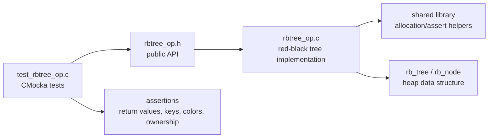
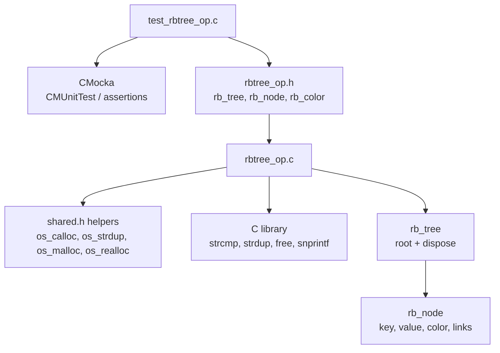
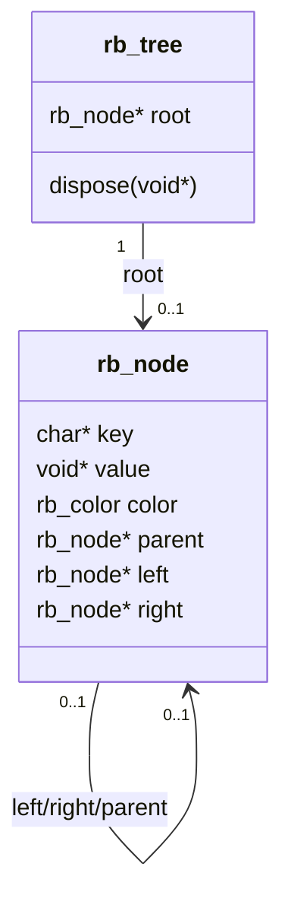
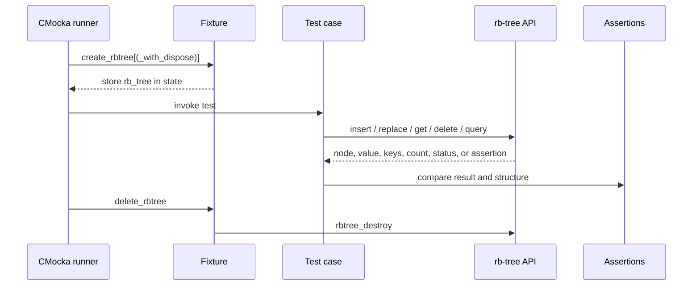
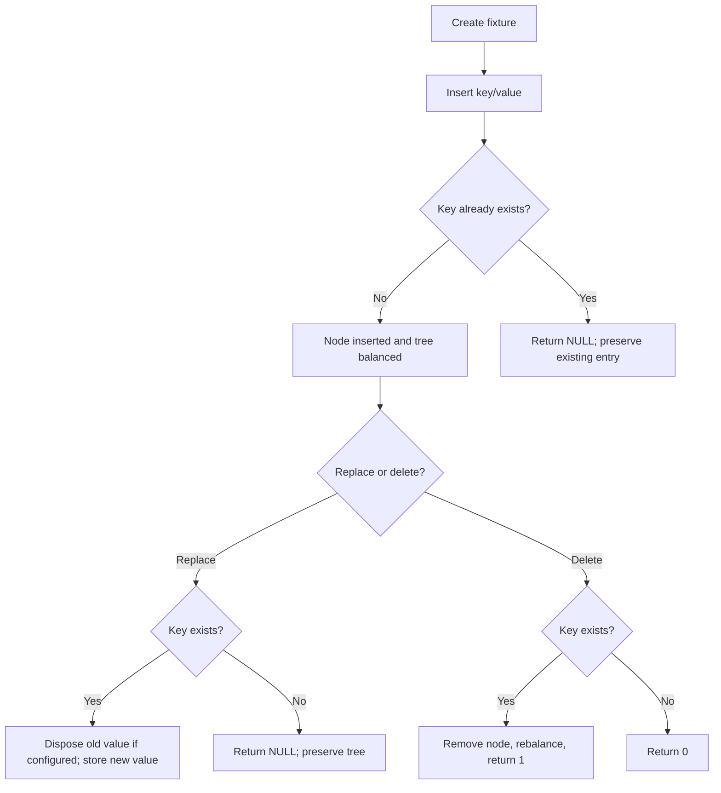
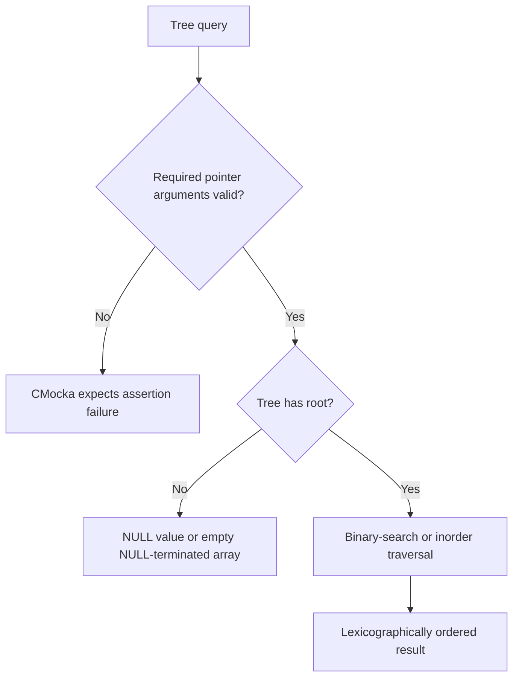

# `test_rbtree_op`

`test_rbtree_op` is the CMocka unit-test module for Wazuh’s shared red-black-tree implementation. It validates the public API declared in `src/headers/rbtree_op.h` and implemented in `src/shared/rbtree_op.c`: creation and destruction, key/value insertion, replacement, lookup, deletion, ordered-key queries, range queries, size/empty state, and red-black black-depth invariants.

The module belongs to the shared-library data-structure test area. The broader data-structure layer is documented in [shared_lib_data_structures.md](shared_lib_data_structures.md); this document concentrates on the red-black-tree fixture and its behavioral contract.

## Scope and role

The test file does not implement a tree or provide production behavior. It creates isolated `rb_tree` instances, invokes the public API, and checks observable results. The production tree is a self-balancing binary search tree ordered by NUL-terminated string keys. Each node stores an opaque `void *` value and an optional tree-level disposal callback.

## Components

### Test lifecycle fixtures

| Component | Responsibility |
| --- | --- |
| `create_rbtree` | Creates an empty tree without a value disposer. Used by query, ordering, invariant, size, and empty-state tests. |
| `create_rbtree_with_dispose` | Creates a tree and registers `free` through `rbtree_set_dispose`. Used when tests insert heap-allocated values and need teardown to reclaim them. |
| `delete_rbtree` | Calls `rbtree_destroy` on the fixture state. Destruction frees duplicated keys and, when configured, stored values. |
| `main` | Registers all CMocka tests with setup/teardown pairs and returns `cmocka_run_group_tests(...)`. |

The fixture choice is intentional: tests that use the same value pointer repeatedly use the no-disposer fixture to avoid double-free; tests that allocate one value per inserted node use the disposer fixture so the tree owns cleanup.

### Production API exercised

| API family | Functions | Contract verified by this module |
| --- | --- | --- |
| Lifecycle | `rbtree_init`, `rbtree_set_dispose`, `rbtree_destroy` | Empty initialization, optional value cleanup, and fixture teardown. |
| Mutation | `rbtree_insert`, `rbtree_replace`, `rbtree_delete` | Successful mutation, duplicate/missing-key behavior, value replacement, and deletion status. |
| Lookup | `rbtree_get` | Existing and missing keys; returned value is the stored pointer. |
| Ordering | `rbtree_minimum`, `rbtree_maximum` | Lexicographic extrema and empty-tree behavior. |
| Enumeration | `rbtree_keys`, `rbtree_range` | NUL-terminated, lexicographically ordered key arrays, inclusive ranges, and out-of-tree bounds. |
| Introspection | `rbtree_black_depth`, `rbtree_size`, `rbtree_empty` | Balance invariant, element count, and empty/non-empty state. |

## Architecture and dependencies

The test module depends directly on CMocka and the red-black-tree header. The implementation depends on Wazuh shared allocation/assertion facilities and standard C string/memory routines. No network, filesystem, database, daemon, or external service is involved.

## Data model and ownership

`rb_tree` contains a `root` pointer and an optional `dispose(void *)` callback. Every inserted key is duplicated by the implementation; callers must not rely on the lifetime of the original key string. Values remain opaque pointers. If a disposer is configured, replacement and deletion destroy the old value, and tree destruction disposes remaining values.

The enumeration APIs return newly allocated arrays. `rbtree_keys` and `rbtree_range` terminate the array with `NULL`; callers must free each returned key and then the array itself. The tests demonstrate this cleanup pattern explicitly.

## Behavioral coverage

### Insertion and replacement

`test_rbtree_insert_success` checks node creation, root placement, key duplication, and pointer identity of the stored value. `test_rbtree_insert_failure` verifies duplicate keys return `NULL` without replacing the existing entry. Null tree and null key inputs are expected assertion failures; a null value is allowed and produces a valid node.

Replacement tests verify that an existing key receives the new value, a missing key returns `NULL` without changing the tree, null tree/key inputs assert, and replacing with `NULL` is valid. With a disposer configured, the production implementation disposes the previous non-null value before storing the replacement.

### Lookup and deletion

Lookup returns the exact stored value pointer for an existing key and `NULL` for a missing key. Null tree and null key inputs are assertion failures.

Deletion returns `1` when a key is removed and `0` when it is absent. The success test inserts three nodes, deletes each one, and confirms subsequent lookup returns `NULL`. Null tree/key inputs assert.

### Ordered queries

The tree compares keys with `strcmp`, so ordering is bytewise lexicographic rather than numeric or locale-aware. The extrema test therefore expects `"-key"` as the minimum and `"a_key"` as the maximum for the supplied sample keys.

`rbtree_keys` is checked for sorted output and null termination. `rbtree_range` is checked as a closed interval `[min, max]`, including all matching keys and accepting bounds that are outside the set of stored keys. Empty trees return an allocated array whose first element is `NULL`; null tree and null bounds assert.

### Balance and introspection

`rbtree_black_depth` returns `0` for an empty tree, a positive black-path depth for a valid tree, and `-1` when paths are inconsistent or the root is red. The failure test deliberately changes the root color to `RB_RED`, exercising the diagnostic path.

`rbtree_size` starts at zero and reaches five after five unique insertions. `rbtree_empty` returns `1` for an empty tree and `0` after insertion. Both APIs assert on a null tree.

## Test execution flow

For expected assertion tests, CMocka’s `expect_assert_failure` captures the intentional contract violation. These cases validate defensive preconditions without terminating the complete test process.

## Test process flows

### Mutation flow

### Query flow

## Test inventory

The source organizes tests into these groups:

- Insertion: success, duplicate failure, null tree, null key, and null value.
- Replacement: success, missing key, null tree, null key, and null value.
- Lookup: success, missing key, null tree, and null key.
- Deletion: success, missing key, null tree, and null key.
- Minimum/maximum: populated, empty, and null tree cases.
- Key enumeration: populated, empty, and null tree cases.
- Range enumeration: normal range, empty tree, bounds outside the tree, null tree, null minimum, and null maximum.
- Black depth: valid tree, invalid/root-red tree, and null tree.
- Size and empty state: populated/empty transitions and null tree cases.

The test suite is registered in `main` with `cmocka_unit_test_setup_teardown`, so every test receives a fresh tree and deterministic cleanup.

## Failure contracts and maintenance notes

- Null tree, null key, and null range-bound inputs are programmer errors represented by assertions.
- Duplicate insertion is a normal operation failure and returns `NULL`; the existing value is not disposed by that failed insertion path.
- Missing replacement returns `NULL`; missing deletion returns `0`.
- A null value is valid both on insertion and replacement.
- Tree keys and returned key arrays are heap-owned by the implementation/caller respectively; tests must preserve the corresponding free responsibilities.
- `rbtree_black_depth` is explicitly test-oriented and should be used as an invariant diagnostic, not as application logic.
- The tests mutate `tree->root->color` to induce an invalid state. This is appropriate for invariant testing but should not be copied into production callers.

## Related documentation

- [shared_lib_data_structures.md](shared_lib_data_structures.md) — shared data-structure library context.
- [test_list_op.md](test_list_op.md) — neighboring CMocka tests for the shared list primitive.
- [test_queue_op.md](test_queue_op.md) — neighboring CMocka tests for queue behavior and defensive contracts.
- [wazuh_db_global.md](wazuh_db_global.md) — the Wazuh DB global-agent area, which includes red-black-tree-backed collection behavior elsewhere in the system.

## Source references

- `src/unit_tests/shared/test_rbtree_op.c`
- `src/headers/rbtree_op.h`
- `src/shared/rbtree_op.c`
