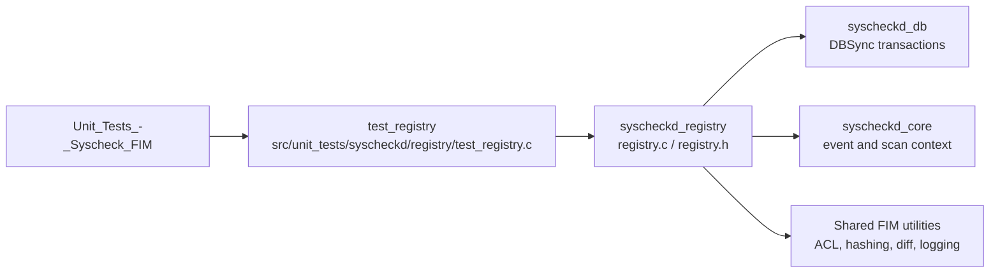
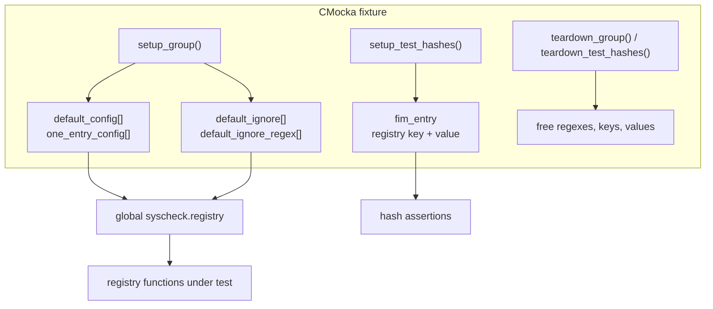
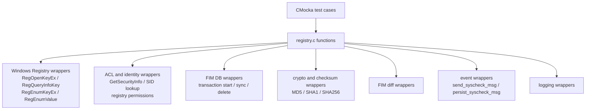
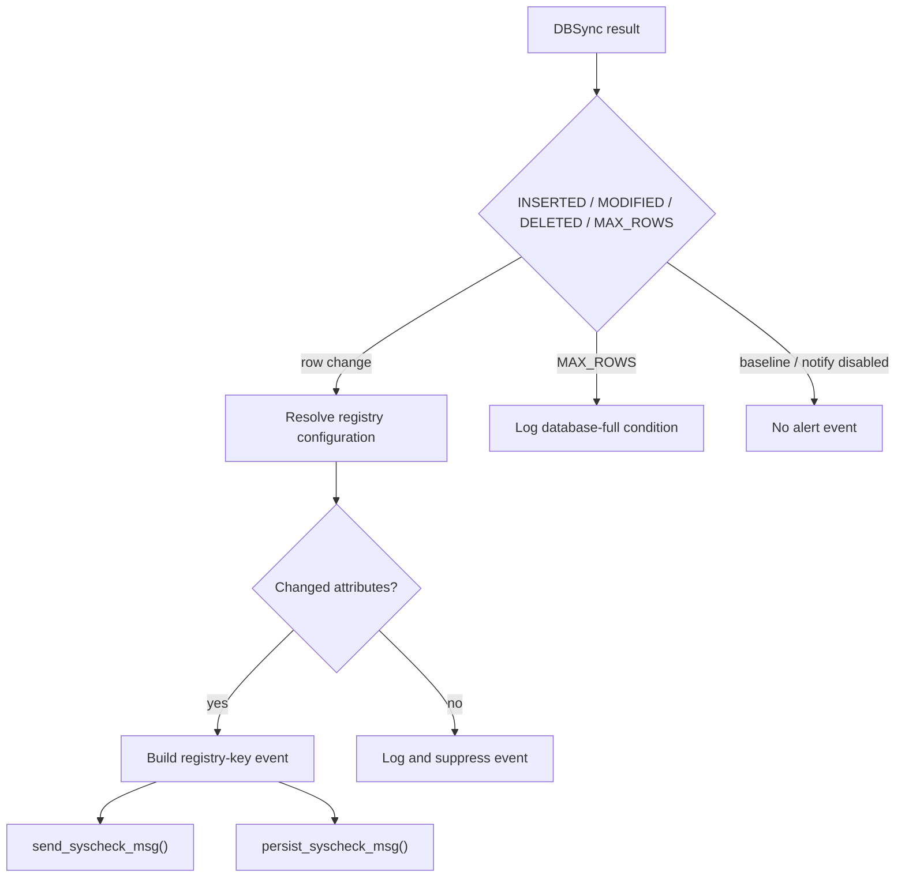
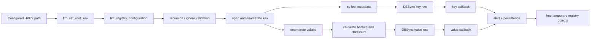

# `test_registry` — Windows Registry FIM Test Suite

## Introduction

`test_registry` is the CMocka unit-test suite for the Windows Registry portion of Wazuh File Integrity Monitoring (FIM). It exercises registry-root parsing, configuration matching, recursion and ignore rules, metadata and content-hash collection, scan orchestration, DBSync transaction callbacks, and cleanup behavior.

The suite tests the registry implementation through controlled Windows API, database, hashing, ACL, and event-persistence wrappers. It therefore validates both successful behavior and failure handling without requiring a live Windows Registry or a populated FIM database.

The production behavior under test is described in [`syscheckd_registry.md`](syscheckd_registry.md). The wider daemon lifecycle and sibling FIM components are documented in [`Syscheck___FIM_Daemon_(C_C++).md`](Syscheck___FIM_Daemon_(C_C++).md).

## Scope and role in the system

The test target belongs to `Unit_Tests_-_Syscheck_FIM` and corresponds to the `test_registry` node in the supplied module tree:



The suite is not an integration test for the complete `syscheckd` daemon. Its boundary is the registry implementation and the direct services it calls. Sibling coverage should be consulted for shared behavior:

- [`test_registry_events.md`](test_registry_events.md), when available, covers registry event-difference and attribute-building helpers.
- [`syscheckd_db.md`](syscheckd_db.md) documents the database/DBSync layer.
- [`syscheckd_file.md`](syscheckd_file.md) documents the analogous filesystem FIM implementation and shared diff concepts.
- [`test_syscheck_op.md`](test_syscheck_op.md) covers shared Windows permission and syscheck utility behavior.

## Architecture of the test fixture

The fixture is organized around one process-wide `syscheck` configuration and per-test CMocka state. `setup_group()` installs the default registry configuration and ignore rules; `teardown_group()` releases compiled ignore regexes and clears global pointers. Hash tests use a separate `fim_entry` fixture so that digest fields can be asserted and freed independently.



### Fixture configuration

`default_config[]` models several 64-bit registry entries:

- a normal key with recursion level `320`;
- a key with recursion disabled (`0`), used to test depth rejection;
- a literal-ignore target;
- an intentionally invalid hive/path;
- a target used to exercise insertion failures.

`one_entry_config[]` isolates tests that need exactly one matching rule. `CHECK_REGISTRY_ALL` enables size, permissions, owner, group, mtime, content hashes, change detection, and type checks. The fixture also compiles the `IgnoreRegex` pattern into `OSMatch` objects.

## Dependencies and mocked boundaries

The production registry code crosses several platform and subsystem boundaries. The test suite replaces those boundaries with wrappers and expectations.



Important included wrapper headers are:

| Boundary | Wrapper purpose |
|---|---|
| Windows Registry APIs | Controls key opening, metadata queries, subkey enumeration, and value enumeration. |
| Windows security APIs | Supplies deterministic owner, group, SID, ACL, and permission data. |
| FIM database | Simulates transaction handles, row synchronization, deleted rows, and full-database conditions. |
| Hashing and diff helpers | Makes digest and change-detection outcomes deterministic. |
| Event and logging functions | Verifies notifications and expected diagnostic paths without invoking production queues. |

This dependency isolation is the main architectural characteristic of the suite: tests assert the registry module’s decisions and calls, while wrappers represent external state.

## Functional test groups

The `main()` function registers 52 CMocka tests in ten logical groups.

### 1. Root-key parsing — `fim_set_root_key()`

Tests cover null output/input pointers, unknown roots, malformed root names, and valid parsing of:

- `HKEY_LOCAL_MACHINE`;
- `HKEY_CLASSES_ROOT`;
- `HKEY_CURRENT_CONFIG`;
- `HKEY_USERS`.

For valid input, the test verifies both the selected `HKEY` handle and the sub-key pointer offset. Invalid input must return `-1` and leave the root handle null where applicable.

### 2. Configuration resolution — `fim_registry_configuration()`

The tests verify that a path below `HKEY_LOCAL_MACHINE\\Software\\Classes\\batfile` resolves to the matching `registry_t`, while a path with the wrong architecture, an unmatched path, or a null key returns no configuration. This protects the architecture-sensitive, prefix-based lookup used by scans and callbacks.

### 3. Recursion and ignore validation

`fim_registry_validate_recursion_level()` is tested for null inputs, an allowed descendant, and a path exceeding a zero recursion limit. `fim_registry_validate_ignore()` is tested for null inputs, an allowed path, a literal ignore entry, and a regular-expression ignore entry. Rejected cases also assert the diagnostic log message.

### 4. Key metadata collection — `fim_registry_get_key_data()`

Using one-entry configuration, each test enables one option at a time and verifies selective population of `fim_registry_key`:

| Option | Asserted output |
|---|---|
| `CHECK_OWNER` | SID/UID and owner name |
| `CHECK_GROUP` | SID/GID and group name |
| `CHECK_PERM` | Permission string and decoded ACL JSON |
| `CHECK_MTIME` | Converted registry last-write timestamp |

The tests also verify that unrelated fields remain null, ensuring option flags do not accidentally collect extra data.

### 5. Value hashing — `fim_registry_calculate_hashes()`

The per-test hash fixture starts with pre-existing checksum data, then enables one hash option. The suite verifies that:

- MD5, SHA-1, and SHA-256 are calculated independently;
- the configured registry value type affects input normalization;
- enabling all registry checks calculates all three hashes;
- no options leave digest fields unchanged/empty;
- the existing value checksum is not overwritten by content-hash calculation.

The tested value types include `REG_EXPAND_SZ`, `REG_MULTI_SZ`, `REG_DWORD`, and an unknown/default type.

### 6. Scan orchestration — `fim_registry_scan()`

These tests model the scan’s external sequence with expectations for registry APIs, transaction calls, logging, and value diffs.

```mermaid
sequenceDiagram
    participant T as Test case
    participant S as fim_registry_scan()
    participant R as WinReg wrappers
    participant D as FIM DB wrappers
    participant C as Transaction callbacks

    T->>S: configure expectations and invoke scan
    S->>D: start key/value transactions
    S->>R: open configured root
    R-->>S: key metadata and subkeys
    S->>R: enumerate values
    S->>D: sync key/value rows
    D-->>C: INSERTED / MODIFIED / error path
    S->>D: delete rows absent from scan
    D-->>C: DELETED rows
    S-->>T: return; expected calls and logs verified
```

Coverage includes:

- baseline generation for a configured key and value;
- a regular scan containing recursion, an invalid configuration, and insertion-failure paths;
- `RegOpenKeyEx` failure;
- `RegQueryInfoKey` failure.

The baseline case specifically exercises transaction start, recursive key enumeration, value enumeration, key/value synchronization, and transaction cleanup. The failure cases ensure scanning logs the error and still performs deletion/transaction cleanup.

### 7. Key transaction callback

`registry_key_transaction_callback()` is tested for baseline/no-notification behavior, empty JSON, missing configuration, inserted rows, modified rows, deleted rows, unchanged modified attributes, and `MAX_ROWS`.



For insert, modify, and delete cases, the suite expects both stateless event generation and stateful persistence. For a modification with no changed fields, it expects suppression. For `MAX_ROWS`, it expects the database-full diagnostic rather than an event.

### 8. Value transaction callback

`registry_value_transaction_callback()` mirrors the key callback tests and additionally covers a modification with a diff string. It verifies that value identity includes path, architecture, and value name, and that a deletion attempts diff cleanup when applicable.

The callback scenarios are:

- baseline/no notification;
- empty JSON and null configuration;
- inserted, modified, modified-with-diff, and deleted values;
- unchanged modified attributes;
- `MAX_ROWS`.

### 9. Memory cleanup — `fim_registry_free_entry()`

The cleanup test constructs a complete registry `fim_entry` with allocated key/value strings and digest fields, invokes the production free routine, and relies on the test process/allocator checks to expose invalid ownership or incomplete cleanup.

## End-to-end behavior represented by the suite

The following process flow shows how the test groups compose into the production behavior they protect.



## Test execution model

`main()` calls `cmocka_run_group_tests(tests, setup_group, teardown_group)`. CMocka runs the group fixture around the suite, while the five hash tests add `setup_test_hashes()` and `teardown_test_hashes()` around their individual cases.

The suite is designed for the project’s native unit-test build. The source includes Windows-specific headers and wrappers, so it is not a portable standalone test that can be compiled meaningfully on a non-Windows target without the project’s compatibility/build configuration.

## Maintenance guidance

When registry production behavior changes:

1. Update the relevant wrapper expectation before changing the assertion, so the test continues to describe the external contract.
2. Add cases beside the matching functional group: root parsing, configuration/filtering, metadata, hashes, scan, key callback, value callback, or cleanup.
3. For new event fields, coordinate with [`test_registry_events.md`](test_registry_events.md) and the stateful inventory path described in [`syscheckd_registry.md`](syscheckd_registry.md).
4. Keep shared database, diff, and Windows utility behavior in their dedicated test suites rather than duplicating those tests here.

## Summary

`test_registry` validates the Windows Registry FIM boundary from configuration parsing through scan synchronization and event emission. Its strongest guarantees are deterministic option handling, architecture/path filtering, safe failure cleanup, correct DBSync result interpretation, and separation of stateless alert events from stateful persistence.
