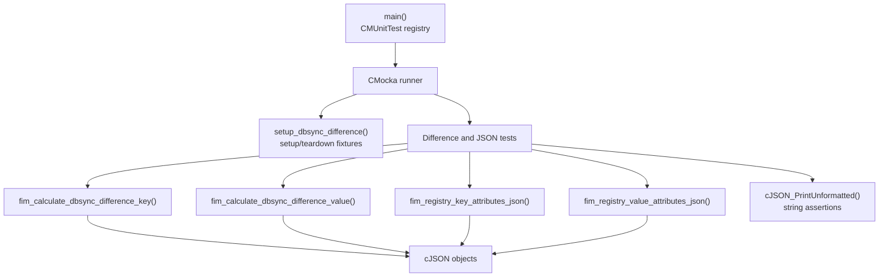
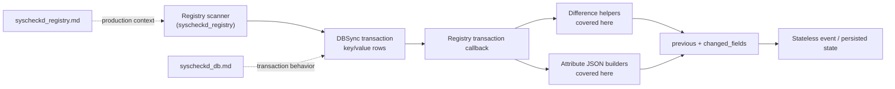
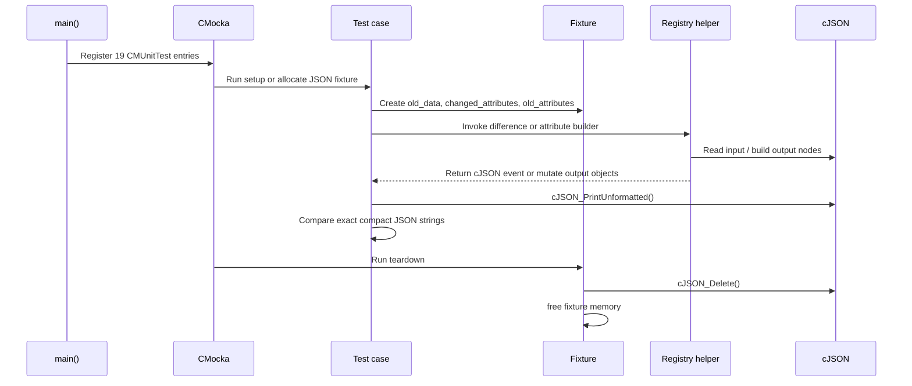
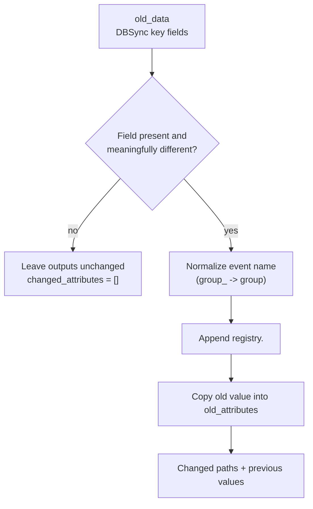
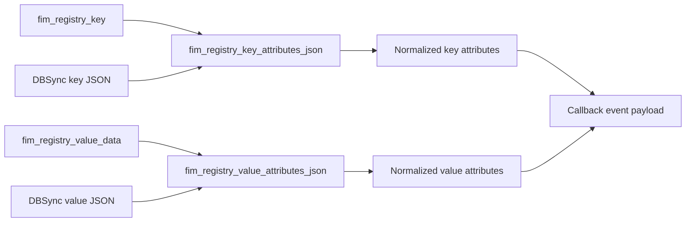
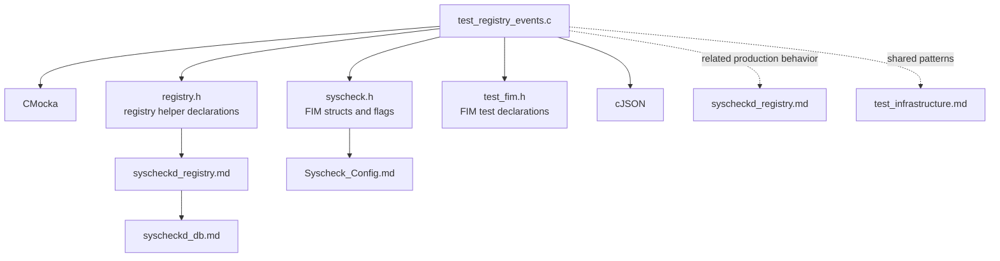

# `test_registry_events` Module

`test_registry_events` is a CMocka unit-test suite for the Windows Registry FIM event helpers in `syscheckd`. It verifies two tightly related behaviors: conversion of registry key/value state into event JSON and calculation of DBSync change metadata (`changed_attributes` plus the previous values). The suite does not scan the Windows Registry or exercise the daemon loop; it supplies representative cJSON objects and registry structures to test the event-building layer in isolation.

Production context is documented in [`syscheckd_registry.md`](syscheckd_registry.md). The surrounding FIM daemon and database responsibilities are described in [`Syscheck___FIM_Daemon_(C_C++).md`](Syscheck___FIM_Daemon_(C_C++).md), [`syscheckd_core.md`](syscheckd_core.md), and [`syscheckd_db.md`](syscheckd_db.md). Common CMocka and wrapper conventions are covered by [`test_infrastructure.md`](test_infrastructure.md).

## 1. Purpose and scope

The suite protects the event contract used by registry transaction callbacks:

- Registry key metadata is emitted with normalized event paths such as `registry.uid`, `registry.owner`, and `registry.permissions`.
- Registry value metadata is emitted under nested paths such as `registry.data.type` and `registry.data.hash.sha256`.
- A changed source field is recorded in `changed_attributes`.
- The old value is retained in the nested `old_attributes` JSON object.
- Unchanged inputs produce an empty changed-attribute array.
- Key and value events use the same output schema whether their source is a live registry entry or a DBSync row.

The test file is located at `src/unit_tests/syscheckd/registry/test_events.c` and belongs to the `Unit_Tests_-_Syscheck_FIM` area. It is a leaf test module under the registry test grouping.

## 2. Architecture

### 2.1 Component relationship



The system under test is implemented by the registry production module and declared through `registry.h`/`syscheck.h`. The test suite owns the input objects and compares serialized output; it does not mock a registry API because no OS interaction is required by these helpers.

### 2.2 Position in the FIM event pipeline



The test suite is therefore concerned with the boundary between a DBSync row and the event payload. Scanning, row synchronization, queue delivery, and persistence are covered by neighboring production and FIM test modules rather than this file.

## 3. Test-owned data structures

### `key_difference_t`

```c
typedef struct key_difference_s {
    cJSON *old_data;
    cJSON *changed_attributes;
    cJSON *old_attributes;
} key_difference_t;
```

This fixture models the three objects passed to the difference helpers:

| Field | Meaning | Test usage |
|---|---|---|
| `old_data` | Prior DBSync row attributes | Populated with one candidate changed field per test |
| `changed_attributes` | Output array of dotted event paths | Expected to contain one path or remain `[]` |
| `old_attributes` | Output object containing prior values | Expected to preserve the event-facing nested schema |

### `json_data_t`

```c
typedef struct json_data_s {
    cJSON *data1;
    cJSON *data2;
} json_data_t;
```

This fixture retains JSON trees for teardown. `data1` is used for a DBSync input in the key/value conversion tests, while `data2` is the generated event object.

### Default registry records

`DEFAULT_REGISTRY_KEY` provides a representative key with permissions, owner/group, UID/GID, modification time, architecture, and checksum. `DEFAULT_REGISTRY_VALUE` provides a representative `REG_SZ` value with size and MD5/SHA1/SHA256 hashes. The records let the JSON-builder tests focus on schema mapping instead of repeatedly constructing production structs.

The `CHECK_REGISTRY_ALL` macro enables size, permissions, ownership, group, mtime, all supported hashes, change tracking, and type checks. The `registry_t configuration` passed to every helper supplies the configured path, architecture, check flags, recursion limit, and optional filters.

## 4. Fixture lifecycle and execution flow



For difference tests, `setup_dbsync_difference` allocates all three cJSON objects. Its teardown deletes them and frees the fixture. JSON-builder tests allocate a `json_data_t`; `teardown_cjson_data` deletes the generated DBSync/event tree retained in `data2` (and the input tree when stored there). The test runner calls `cmocka_run_group_tests` from `main`.

## 5. Difference calculation behavior

### 5.1 Registry key differences

`test_calculate_dbsync_difference_key_*` validates the mapping from source fields to event fields:

| Input field in `old_data` | Expected changed path | Expected previous representation |
|---|---|---|
| `permissions` | `registry.permissions` | `permissions` array containing decoded permission JSON strings |
| `uid` | `registry.uid` | `{ "uid": "..." }` |
| `owner` | `registry.owner` | `{ "owner": "..." }` |
| `gid` | `registry.gid` | `{ "gid": "..." }` |
| `group_` | `registry.group` | `{ "group": "..." }` |
| `mtime` | `registry.mtime` | `{ "mtime": number }` |

The `group_` input is deliberately normalized to the event field `group`. An empty `owner` is treated as no meaningful change, and an empty fixture produces no changes. The permissions case additionally verifies that the old permission string is transformed into the event's array form.



### 5.2 Registry value differences

`test_calculate_dbsync_difference_value_*` covers the value-level mapping:

| Input field | Expected changed path | Nested previous representation |
|---|---|---|
| `size` | `registry.size` | `{ "size": number }` |
| `type` | `registry.data.type` | `{ "data": { "type": "REG_EXPAND_SZ" } }` |
| `hash_md5` | `registry.data.hash.md5` | nested `data.hash.md5` |
| `hash_sha1` | `registry.data.hash.sha1` | nested `data.hash.sha1` |
| `hash_sha256` | `registry.data.hash.sha256` | nested `data.hash.sha256` |

The type test demonstrates conversion from the numeric registry type code to the textual event value. The three hash tests verify the separate hash namespaces and prevent a hash from being reported as a flat registry field.

## 6. Attribute JSON builders

### 6.1 Key attributes

`test_registry_key_attributes_json_entry` supplies a live `fim_registry_key`. The expected event contains:

- `permissions` as an array of serialized ACL entries;
- `uid`, `owner`, `gid`, and `group` as key metadata;
- `mtime` as a numeric timestamp.

`test_registry_key_attributes_json_dbsync` supplies the same logical data in a DBSync-shaped object. It verifies that the builder accepts the database naming convention (`group_`) and emits the same event-facing result as the live-entry path. This is important because callbacks can build events from either the current scan object or a deleted/previous DBSync row.

### 6.2 Value attributes

`test_registry_value_attributes_json_entry` verifies that a live value becomes:

```json
{
  "size": 50,
  "data": {
    "type": "REG_SZ",
    "hash": {
      "md5": "...",
      "sha1": "...",
      "sha256": "..."
    }
  }
}
```

`test_registry_value_attributes_json_dbsync` repeats the assertion with a DBSync row containing numeric `type`, flat `hash_*` fields, and database-only fields such as `architecture`, `checksum`, `value`, and `path`. The builder must select and normalize only the event attributes; database identity and checksum fields are not duplicated into this attributes object.



## 7. Test inventory

The `main` function registers 19 tests: 15 difference tests and four JSON-builder tests.

| Group | Tests | Coverage |
|---|---:|---|
| Key difference | 8 | Permissions, no change, UID, owner, empty owner, GID, group-name normalization, mtime |
| Value difference | 7 | Size, type, MD5, SHA1, SHA256, and no change |
| Key JSON builder | 2 | Live registry entry and DBSync source |
| Value JSON builder | 2 | Live registry entry and DBSync source |

All difference tests use `cmocka_unit_test_setup_teardown`; all builder tests use `cmocka_unit_test_teardown` because they allocate their own JSON fixture in the test body.

## 8. Dependencies and related modules



The suite depends directly on CMocka, cJSON, `syscheck.h`, `registry.h`, and the local FIM test header. It indirectly documents contracts owned by the registry implementation and DBSync event pipeline. The broader registry behavior, transaction callbacks, and production consumers should be read from [`syscheckd_registry.md`](syscheckd_registry.md), rather than duplicated here.

## 9. Maintenance guidance

When a registry event field changes, update this suite in three places where applicable:

1. Add or update a difference test to assert the dotted `changed_attributes` path and the old-value shape.
2. Add or update both live-entry and DBSync-source builder tests so the two input representations remain equivalent.
3. Update the expected compact JSON strings and this module's mapping tables.

Exact string comparisons are intentional: they detect field renames, nesting changes, type rendering changes, and permission-array formatting changes. If event ordering becomes intentionally non-deterministic, assertions should be changed to structural cJSON comparisons rather than weakening the contract silently.

The suite is Windows-oriented because registry types, ACL permissions, architectures, and `HKEY_*` paths are Windows concepts. It remains a unit test and does not validate Windows API enumeration, registry permissions retrieval, DBSync persistence, alert queue delivery, or end-to-end event ingestion; those concerns belong to the production registry module and the wider FIM test suite.
