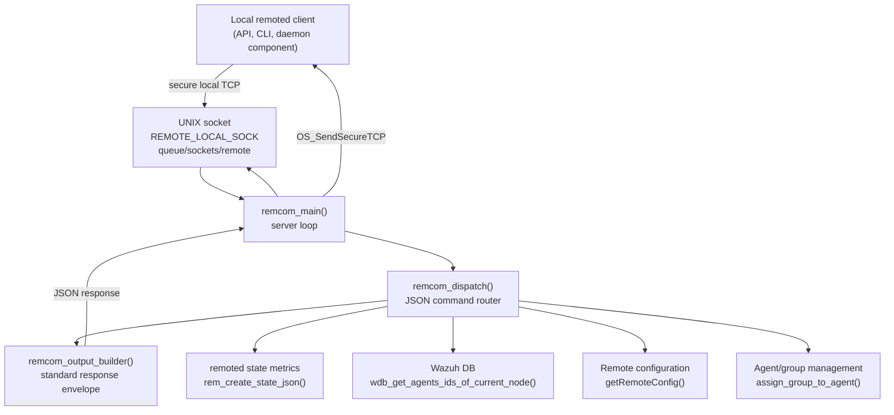
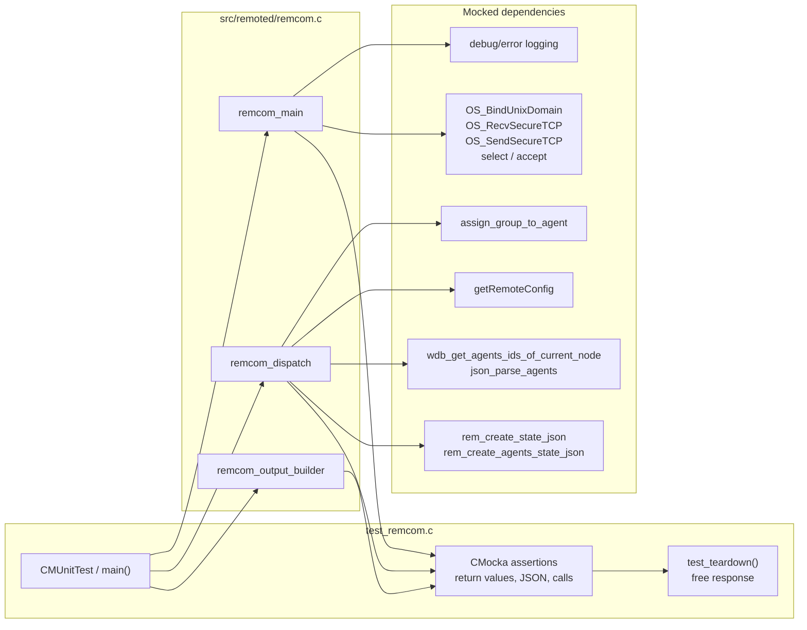
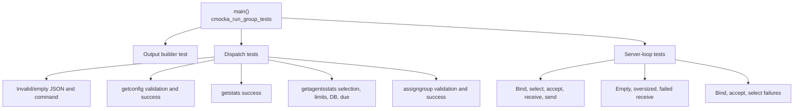

# `test_remcom_remoted`

## Introduction

`test_remcom_remoted` is the CMocka unit-test module for the local control interface of the Wazuh `remoted` daemon. It verifies the request dispatcher and the server loop implemented by `src/remoted/remcom.c`, using `src/unit_tests/remoted/test_remcom.c` as the test entry point.

The module covers three supported local commands:

- `getstats`: return the daemon-wide remoted state snapshot.
- `getagentsstats`: return state for selected active agents or a paginated set of all active agents.
- `assigngroup`: assign an agent to a group using an agent ID and shared-configuration MD5.

It also validates malformed JSON, missing or invalid parameters, unknown commands, socket setup, receive-size limits, empty messages, `select()` behavior, `accept()` failures, and response transmission. The production state model and JSON snapshot builders are documented in [remoted_state_metrics.md](remoted_state_metrics.md); the surrounding daemon and socket subsystems are documented in [remoted.md](remoted.md), [remoted_networking.md](remoted_networking.md), and [remoted_request_protocol.md](remoted_request_protocol.md).

## Position in the system

The tested code is a local, manager-side control plane inside `remoted`. It is distinct from the agent-facing encrypted transport handled by [remoted_secure_connection.md](remoted_secure_connection.md).



## Architecture

The test file exercises two production layers and supplies mocks at their external boundaries.



## Core components

### `remcom_output_builder`

Builds the common response envelope used by every dispatch path:

```json
{"error":0,"message":"ok","data":{}}
```

The data member is a JSON object; when no payload is supplied, the tests expect `{}`. `test_remcom_output_builder` verifies numeric and string values and exact serialized output. The caller owns the returned heap string; the CMocka teardown releases it with `os_free`.

### `remcom_dispatch`

Parses a JSON request and returns the serialized response length while writing a heap-allocated response through `char **output`. The dispatcher is synchronous and has no direct socket responsibility.

```mermaid
flowchart TD
    START[Request string] --> PARSE{Valid JSON?}
    PARSE -->|no| E2[error 2\nInvalid JSON input]
    PARSE -->|yes| COMMAND{command present?}
    COMMAND -->|no| E3[error 3\nEmpty command]
    COMMAND -->|unknown| E4[error 4\nUnrecognized command]
    COMMAND -->|getstats| STATS[rem_create_state_json]
    COMMAND -->|getconfig| PARAMS1{parameters object?}
    PARAMS1 -->|no| E5[error 5\nEmpty parameters]
    PARAMS1 -->|yes| SECTION{section present?}
    SECTION -->|no| E6[error 6\nEmpty section]
    SECTION -->|remote| CONFIG[getRemoteConfig]
    SECTION -->|other| E7[error 7\nUnrecognized/not configured section]
    COMMAND -->|getagentsstats| PARAMS2{parameters object?}
    PARAMS2 -->|no| E5
    PARAMS2 -->|yes| AGENTSEL{agents value}
    AGENTSEL -->|array under limit| PARSEIDS[json_parse_agents]
    AGENTSEL -->|array at/over limit| E11[error 11\nToo many agents]
    AGENTSEL -->|"all" + valid last_id| DB[wdb_get_agents_ids_of_current_node\nactive agents, paginated]
    AGENTSEL -->|invalid| E8[error 8\nInvalid agents parameter]
    AGENTSEL -->|"all" without valid last_id| E10[error 10\nEmpty last id]
    PARSEIDS -->|none| E9[error 9\nError getting agents from DB]
    DB -->|none| E9
    DB -->|limit reached| DUE[error 1\ndue]
    STATS --> OK[error 0\nok]
    CONFIG --> OK
    PARSEIDS -->|IDs| AGENTSTATE[rem_create_agents_state_json]
    DB -->|IDs| AGENTSTATE
    AGENTSTATE --> OK
    OK --> BUILD[remcom_output_builder]
    DUE --> BUILD
    E2 --> BUILD
    E3 --> BUILD
    E4 --> BUILD
    E5 --> BUILD
    E6 --> BUILD
    E7 --> BUILD
    E8 --> BUILD
    E9 --> BUILD
    E10 --> BUILD
    E11 --> BUILD
    BUILD --> RESULT[JSON response + strlen(response)]
```

The dispatcher behavior is organized around the following contracts:

| Command/path | Production dependency | Tested outcomes |
|---|---|---|
| `getstats` | `rem_create_state_json` | Successful state response. |
| `getconfig` | `getRemoteConfig` | Remote section success; missing parameters/section; unknown section. |
| `getagentsstats` with an array | `json_parse_agents`, `rem_create_agents_state_json` | Valid IDs, empty/invalid result, maximum-agent rejection. |
| `getagentsstats` with `"all"` | `wdb_get_agents_ids_of_current_node`, `rem_create_agents_state_json` | Missing `last_id`, DB failure, successful page, `due` when the page is full. |
| `assigngroup` | `assign_group_to_agent` | Valid agent/MD5 and invalid or missing parameters. |
| Any command | `remcom_output_builder` | Stable error code, message, data object, and returned length. |

The error codes directly asserted by the suite are: `1` (`due`), `2` (invalid JSON), `3` (empty command), `4` (unknown command), `5` (empty parameters), `6` (empty section), `7` (unknown section), `8` (invalid agents), `9` (agent lookup failure), `10` (empty last ID), `11` (too many agents), and `12` (invalid agent or MD5).

### `remcom_main`

Creates the local UNIX-domain listening endpoint and services requests in a loop. The expected lifecycle is:

```mermaid
sequenceDiagram
    participant Loop as remcom_main
    participant Local as local client
    participant Select as select()
    participant Accept as accept()
    participant Recv as OS_RecvSecureTCP
    participant Dispatch as remcom_dispatch
    participant Send as OS_SendSecureTCP

    Loop->>Loop: bind REMOTE_LOCAL_SOCK\nSOCK_STREAM, OS_MAXSTR
    Loop->>Select: wait for readable listener
    Select-->>Loop: ready
    Loop->>Accept: accept()
    Accept-->>Loop: peer socket
    Loop->>Recv: receive up to OS_MAXSTR
    alt positive response size
        Recv-->>Loop: JSON + size
        Loop->>Dispatch: parse and dispatch
        Dispatch-->>Loop: response + length
        Loop->>Send: send response to peer
    else zero size
        Recv-->>Loop: empty message
    else OS_MAXLEN
        Recv-->>Loop: oversized message
    else negative/error status
        Recv-->>Loop: receive error
    end
    Loop->>Loop: log and continue/finish
```

The tests establish these server-loop invariants:

- Binding uses `REMOTE_LOCAL_SOCK`, `SOCK_STREAM`, and `OS_MAXSTR`.
- A successful `select()` leads to `accept()`, receive, dispatch, and secure response send.
- A zero-length receive is logged as an empty local message and does not dispatch.
- A maximum-length receive logs `Received message > '4194304'` and does not dispatch.
- Negative receive results distinguish generic receive failure from `OS_SOCKTERR` (message too large).
- An `accept()` failure is logged and the loop can continue to the next event.
- `select()` returning zero causes another wait; `EINTR` is retried.
- A non-`EINTR` `select()` failure is fatal/asserted through the logging path.
- Bind failure logs the socket path and returns without entering request processing.

## Test organization



`CMUnitTest` and `main()` register the cases with CMocka. Dispatch tests use `cmocka_unit_test_teardown`, so every returned response is freed by `test_teardown`; loop tests do not retain a response and therefore use the simpler registration form. `__wrap_accept()` returns a CMocka-programmed descriptor, allowing the test to model both accepted peers and `-1` failures without opening a real socket.

## Dependencies and isolation boundaries

| Boundary | Wrapped or programmed dependency | Purpose in the test |
|---|---|---|
| Local transport | `OS_BindUnixDomain`, `OS_RecvSecureTCP`, `OS_SendSecureTCP` | Control bind, payload, size, and send result. |
| Readiness/acceptance | `select`, `__wrap_accept` | Drive loop branches deterministically. |
| State snapshots | `rem_create_state_json`, `rem_create_agents_state_json` | Avoid real remoted counters and agent-state hash tables. |
| Agent selection | `wdb_get_agents_ids_of_current_node`, `json_parse_agents` | Model DB pagination, empty results, and parsed ID arrays. |
| Configuration | `getRemoteConfig` | Supply or reject the remote configuration section. |
| Group assignment | `assign_group_to_agent` | Verify agent ID and MD5 propagation. |
| Diagnostics | debug/error wrappers | Assert observable behavior on failure paths. |
| Memory lifecycle | `os_free` in `test_teardown` | Release dispatcher response strings. |

The suite therefore tests request interpretation and control-flow contracts, while sibling modules cover the implementation details of the state snapshot, network buffering, secure transport, and Wazuh DB. See [test_netbuffer_remoted.md](test_netbuffer_remoted.md) for lower-level framing tests and [test_manager_remoted_test_infrastructure.md](test_manager_remoted_test_infrastructure.md) for shared remoted-test fixture conventions.

## Data and response contracts

Every dispatcher call returns the byte length of the response string and writes the response through `output`. Successful responses use `error: 0` and `message: "ok"`; error responses preserve the same object shape and use an empty data object. The server loop passes this exact byte length to `OS_SendSecureTCP`, which is asserted in `test_remcom_main`.

For `getagentsstats` with `"all"`, `last_id` is the pagination cursor and `REM_MAX_NUM_AGENTS_STATS` is the page limit. A full page is reported as `due`, signaling that another request should continue from the returned cursor. The test suite also verifies that an empty DB result is an error rather than an empty successful snapshot.

## Maintenance guidance

When changing the local remoted protocol, update the tests and this document together:

1. Add or revise the command branch in the dispatch flow diagram.
2. Preserve the response envelope and explicitly document any new error code.
3. Add a success case and parameter/error cases for new request fields.
4. Update the server-loop tests if receive-size, retry, or socket semantics change.
5. Link to the owning subsystem documentation instead of duplicating state, DB, or network-buffer implementation details.

