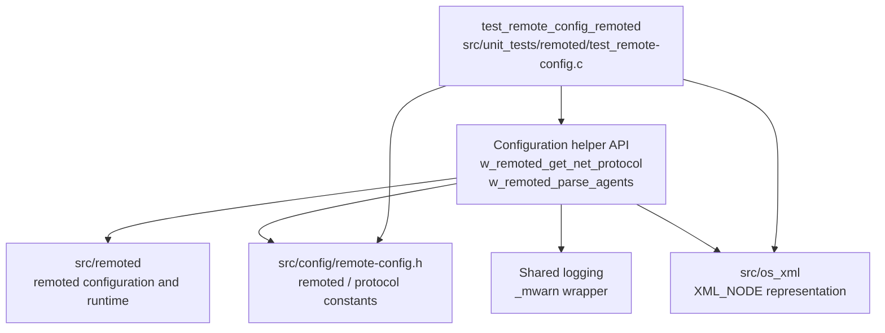
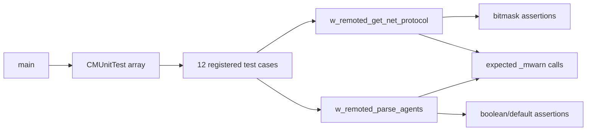
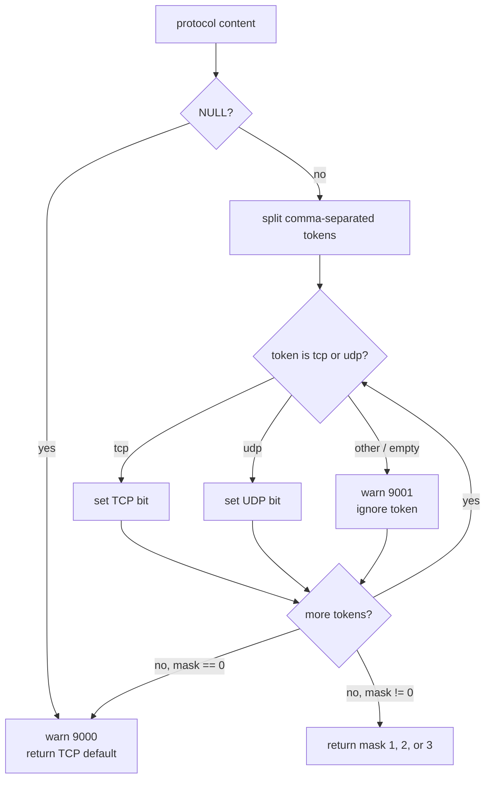
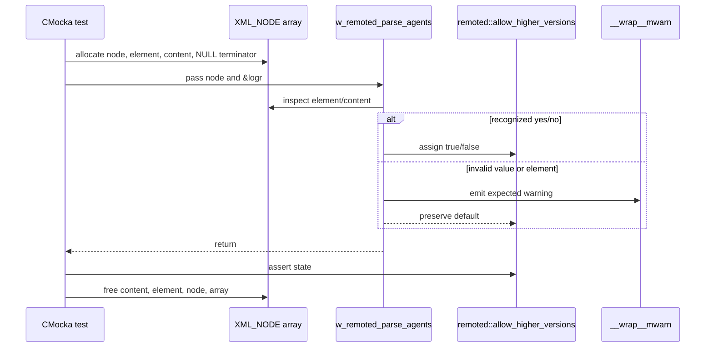
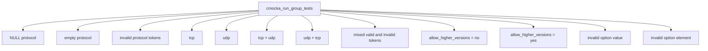

# `test_remote_config_remoted`

## Introduction

`test_remote_config_remoted` is the CMocka unit-test module for the configuration helpers used by Wazuh `remoted`. It exercises two focused behaviors from `src/unit_tests/remoted/test_remote-config.c`:

1. Converting the `<protocol>` value into the remoted TCP/UDP protocol bitmask.
2. Parsing the `<allow_higher_versions>` option under the remoted agent configuration.

The suite tests configuration decisions without starting `wazuh-remoted`, opening sockets, or parsing a real `ossec.conf`. Production structure and runtime consumers are documented in [Remote_Config.md](Remote_Config.md) and [remoted.md](remoted.md); this page documents the test boundary and expected behavior.

## Module position

The test is a leaf under **Unit Tests – Remoted** and targets the configuration portion of the native `remoted` daemon.



### Related documentation

| Reference | Use |
|---|---|
| [Remote_Config.md](Remote_Config.md) | `remoted` configuration structure, constants, loading flow, and runtime consumers. |
| [remoted.md](remoted.md) | Complete native daemon responsibilities and lifecycle. |
| [test_infrastructure.md](test_infrastructure.md) | General CMocka test-harness conventions. |
| [test_manager_remoted_test_infrastructure.md](test_manager_remoted_test_infrastructure.md) | Shared setup conventions for remoted unit tests. |
| [os_xml.md](os_xml.md) | XML node representation used to model parsed configuration entries. |

## Test harness architecture

The test file includes `remoted.h`, shared headers, the common CMocka wrapper header, and debug logging wrappers. Its `main` function creates the test table and calls `cmocka_run_group_tests` without suite setup or teardown callbacks.



There is no shared fixture. Each test creates its own input, and the agent-parser tests explicitly allocate and free a small null-terminated `XML_NODE` array. The global `remoted logr` object is zero-initialized and reused by those tests after its relevant field is reset to the default before each invocation.

## Components

| Component | Role in this module |
|---|---|
| `CMUnitTest` | CMocka test-case descriptor used by the runner. |
| `main` | Registers 12 tests and returns the CMocka group result. |
| `test_w_remoted_get_net_protocol_content_*` | Covers null, empty, invalid, TCP, UDP, and combined protocol values. |
| `test_w_remoted_parse_agents_*` | Covers `yes`, `no`, invalid values, and invalid element names. |
| `XML_NODE` | Minimal synthetic XML node array passed to the agent-option parser. |
| `__wrap__mwarn` | Captures warning messages for ignored values and fallback behavior. |
| `remoted.h` | Supplies the helper declarations and protocol/default constants used by the assertions. |

The source listing supplied for this module contains two additional negative parser cases—`test_w_remoted_parse_agents_invalid_value` and `test_w_remoted_parse_agents_invalid_element`—and registers both in `main`. Therefore the implementation contains 12 registered tests, even though the primary component summary names only the two positive parser cases.

## Protocol parsing contract

`w_remoted_get_net_protocol` accepts a comma-separated string. Recognized tokens are `tcp` and `udp`; the result is a bitmask-style value:

| Input | Expected result | Meaning |
|---|---:|---|
| `tcp` | `1` | TCP only |
| `udp` | `2` | UDP only |
| `tcp,udp` | `3` | TCP and UDP |
| `udp, tcp` | `3` | Whitespace is tolerated around tokens |
| `hello, world` | default (`REMOTED_NET_PROTOCOL_DEFAULT`) | Invalid tokens are ignored; no valid protocol remains |
| `NULL` or empty string | default | Invalid/missing configuration falls back to TCP |
| `hello, tcp, , world, udp` | `3` | Invalid tokens are ignored while valid tokens are retained |



Invalid-token tests assert both observable effects: the helper emits an `(9001)` warning for each rejected token, and an all-invalid input additionally emits `(9000)` before returning the TCP default. Valid-only cases assert the returned value and do not require warning expectations.

## Agent-version option parsing

`w_remoted_parse_agents` receives a null-terminated array of `XML_NODE` pointers and updates `remoted.allow_higher_versions` when it finds the `allow_higher_versions` element.

```mermaid
stateDiagram-v2
    [*] --> Default
    Default --> Disabled: element content = "no"
    Default --> Enabled: element content = "yes"
    Default --> Default: invalid value / invalid element
    Disabled --> Disabled: parse "no"
    Enabled --> Enabled: parse "yes"
    Default: REMOTED_ALLOW_AGENTS_HIGHER_VERSIONS_DEFAULT
    Disabled: allow_higher_versions = false
    Enabled: allow_higher_versions = true
```

The tests verify the following behavior:

| Case | Expected state | Diagnostic |
|---|---|---|
| `allow_higher_versions` / `no` | `false` | none |
| `allow_higher_versions` / `yes` | `true` | none |
| `allow_higher_versions` / `invalid_value` | unchanged default | `(9001)` invalid-value warning |
| `invalid_element` / `no` | unchanged default | `(1230)` invalid-element warning |

The invalid cases are important because they establish a non-destructive parsing rule: malformed input must not silently enable higher-version agents or overwrite the configured default.

## Data flow and ownership



The test owns all synthetic XML allocations. The production parser does not own or free them in this test; cleanup occurs after the assertion in each parser test. This makes allocation mistakes visible and keeps test cases independent.

## Test inventory



| Test | Primary assertion |
|---|---|
| `test_w_remoted_get_net_protocol_content_NULL` | Null input returns the default TCP protocol and warning 9000. |
| `test_w_remoted_get_net_protocol_content_empty` | Empty input is rejected and falls back to TCP. |
| `test_w_remoted_get_net_protocol_content_ignore_values` | All invalid tokens are warned about and ignored. |
| `test_w_remoted_get_net_protocol_content_tcp` | TCP maps to `1`. |
| `test_w_remoted_get_net_protocol_content_udp` | UDP maps to `2`. |
| `test_w_remoted_get_net_protocol_content_tcp_udp` | Both protocols map to `3`. |
| `test_w_remoted_get_net_protocol_content_udp_tcp` | Protocol order does not affect the combined mask. |
| `test_w_remoted_get_net_protocol_content_mix` | Valid tokens survive among invalid and empty tokens. |
| `test_w_remoted_parse_agents_no` | `no` disables higher-version agents. |
| `test_w_remoted_parse_agents_yes` | `yes` enables higher-version agents. |
| `test_w_remoted_parse_agents_invalid_value` | Invalid content warns and preserves the default. |
| `test_w_remoted_parse_agents_invalid_element` | Unknown element warns and preserves the default. |

## Maintenance guidance

This is a unit test, not a full configuration-loading test. It does not validate XML file discovery, `<remote>` block dispatch, listener creation, or runtime protocol handling; those concerns belong to [Remote_Config.md](Remote_Config.md), [remoted.md](remoted.md), and the broader remoted test modules.

When changing the helpers or their constants, update the expected bitmask/default values and warning expectations together. In particular, preserve these regressions guards:

- invalid protocol tokens must not produce a zero/undefined protocol;
- token order must not change the TCP+UDP result;
- invalid `allow_higher_versions` input must preserve the prior/default value;
- invalid configuration must produce the expected diagnostic rather than being silently accepted;
- every synthetic `XML_NODE` allocation must be released by the test.

