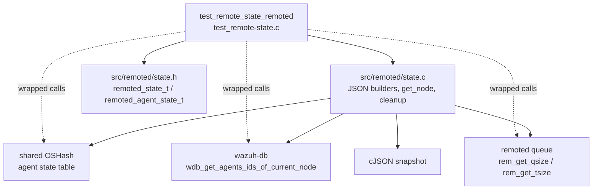
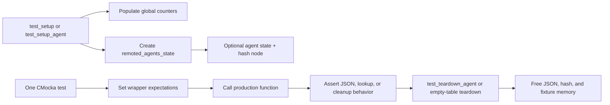
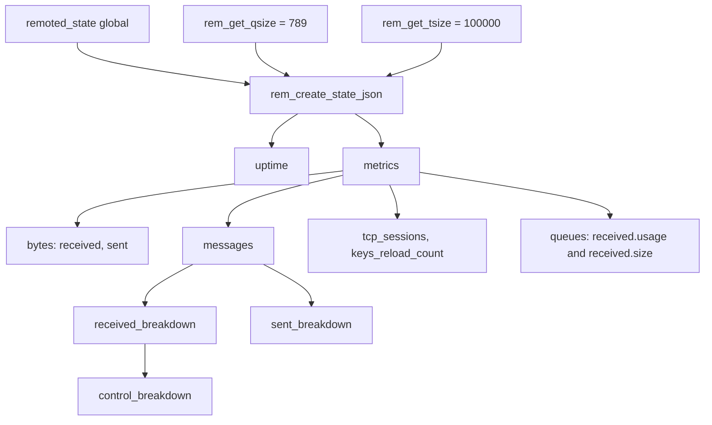
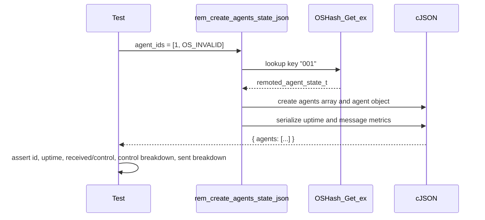
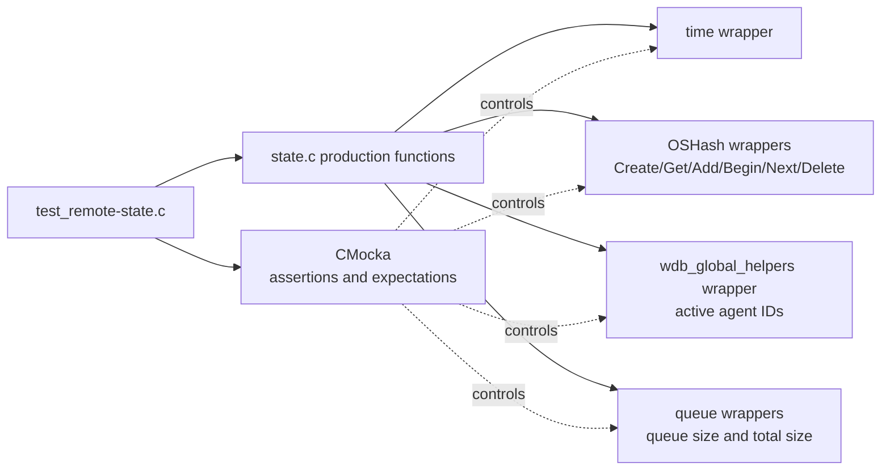
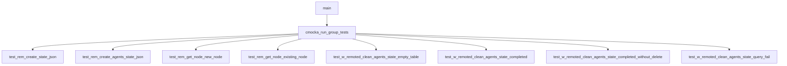

# `test_remote_state_remoted`

## Introduction

`test_remote_state_remoted` is the CMocka unit-test module for the Wazuh `remoted` state and metrics implementation. It tests the JSON snapshot builders, lazy per-agent state creation, and cleanup of stale per-agent entries in `src/unit_tests/remoted/test_remote-state.c`.

The production data model, counter APIs, state-file writer, and daemon integration are documented in [remoted_state_metrics.md](remoted_state_metrics.md). This document describes how this test isolates and verifies those behaviors.

## Module position

The test is part of the **Unit Tests – Remoted** suite and targets the `remoted_state_metrics` component of the native `wazuh-remoted` daemon.



## Responsibilities under test

| Production concern | Verified by |
|---|---|
| Global state is serialized into a nested JSON object | `test_rem_create_state_json` |
| Per-agent counters are serialized under an `agents` array | `test_rem_create_agents_state_json` |
| Missing agent nodes are allocated, initialized, and inserted into the hash | `test_rem_get_node_new_node` |
| Existing agent nodes are returned without creating a replacement | `test_rem_get_node_existing_node` |
| Empty agent-state tables are safe to clean | `test_w_remoted_clean_agents_state_empty_table` |
| Inactive agents are deleted after the active-agent query completes | `test_w_remoted_clean_agents_state_completed` |
| Active agents are retained | `test_w_remoted_clean_agents_state_completed_without_delete` |
| A failed/empty active-agent query does not incorrectly delete the entry | `test_w_remoted_clean_agents_state_query_fail` |

## Test harness architecture

The file uses a small `test_struct_t` fixture containing an agent state, an `OSHashNode`, and the generated JSON object. Global production objects are supplied through the extern declarations `remoted_state` and `remoted_agents_state`.



### Fixtures

* `test_setup` initializes deterministic global counters: uptime `123456789`, TCP sessions `5`, received/sent byte totals, message breakdowns, and key reload count.
* `test_setup_agent` creates agent `001`, fills its receive/control/send counters, and inserts it into the hash table. The fixture also creates a matching `OSHashNode` for iteration tests.
* `test_setup_empty_hash_table` creates the hash table without inserting an agent, exercising empty-table paths.
* The teardown functions delete generated cJSON, release the hash table, and free fixture allocations. Several tests explicitly free the returned or fixture-owned agent state after ownership has transferred.

## Global JSON snapshot

`test_rem_create_state_json` verifies that `rem_create_state_json()` converts the global `remoted_state` and queue measurements into the expected nested cJSON structure.



The assertions cover the complete public shape relevant to this snapshot:

* Root `uptime`.
* `metrics.bytes.received` and `metrics.bytes.sent`.
* `metrics.messages.received_breakdown`: event, control, ping, unknown, dequeued-after, and discarded.
* Nested received control breakdown: request, startup, shutdown, and keepalive.
* `metrics.messages.sent_breakdown`: ack, shared, active-response (`ar`), SCA, request, and discarded.
* `metrics.tcp_sessions` and `metrics.keys_reload_count`.
* `metrics.queues.received.usage` and `metrics.queues.received.size`.

The test therefore checks both presence and value, catching schema regressions as well as counter-mapping errors. Queue functions are wrapped so the snapshot can be tested without a running remoted queue.

## Per-agent JSON snapshot

`test_rem_create_agents_state_json` supplies a terminated integer array of agent IDs (`1`, `OS_INVALID`) and verifies that the agent ID is resolved through `remoted_agents_state` before serialization.



The expected object contains `id = 1`, `uptime = 123456789`, and the fixture values for received events/control messages, request/startup/shutdown/keepalive counters, and sent ACK/shared/AR/SCA/request/discarded counters. The lookup wrapper expectation is important: it proves the builder uses the agent-state hash rather than fabricating values from the ID list.

## Lazy agent-node lookup

`get_node(const char *agent_id)` is tested as a get-or-create operation.

```mermaid
flowchart TD
    CALL[get_node(agent_id)] --> LOOKUP[OSHash_Get_ex]
    LOOKUP --> FOUND{node exists?}
    FOUND -->|yes| RETURN[return existing remoted_agent_state_t]
    FOUND -->|no| TIME[read current time]
    TIME --> ALLOC[allocate and initialize agent state]
    ALLOC --> INSERT[OSHash_Add_ex]
    INSERT --> RETURNNEW[return new node]
```

* `test_rem_get_node_existing_node` expects a lookup hit for `001` and verifies a non-null returned pointer.
* `test_rem_get_node_new_node` expects a lookup miss, a time read, insertion into the hash, and a non-null newly allocated result.

The tests also set `test_mode` around hash setup and insertion. This allows the shared hash wrappers to provide deterministic behavior without invoking the full daemon runtime.

## Stale-agent cleanup

`w_remoted_clean_agents_state(int *sock)` reconciles the in-memory per-agent metrics table with the active agents reported by Wazuh DB.

```mermaid
flowchart TD
    START[w_remoted_clean_agents_state(sock)] --> BEGIN[OSHash_Begin_ex]
    BEGIN --> EMPTY{first node exists?}
    EMPTY -->|no| DONE[return; no deletion]
    EMPTY -->|yes| QUERY[wdb_get_agents_ids_of_current_node\nstatus ACTIVE, last_id 0, limit -1]
    QUERY --> RESULT{active-agent query result}
    RESULT -->|NULL / failure| SAFE[return without deleting stale node]
    RESULT -->|list available| MATCH{current hash key is active?}
    MATCH -->|yes| NEXT[OSHash_Next]
    MATCH -->|no| DELETE[OSHash_Delete_ex]
    DELETE --> NEXT
    NEXT --> MORE{another hash node?}
    MORE -->|yes| MATCH
    MORE -->|no| DONE
```

The cleanup cases are deliberately narrow and deterministic:

| Test | Active-agent result | Expected behavior |
|---|---|---|
| `test_w_remoted_clean_agents_state_empty_table` | `OSHash_Begin_ex` returns `NULL` | Return safely without querying or deleting. |
| `test_w_remoted_clean_agents_state_completed` | Active list is terminated immediately (`OS_INVALID`) | Delete hash key `001`. |
| `test_w_remoted_clean_agents_state_completed_without_delete` | Active list contains agent `1` | Retain the state entry. |
| `test_w_remoted_clean_agents_state_query_fail` | Active-agent pointer is `NULL` | Stop safely; do not delete the entry. |

The tests assert the exact Wazuh DB query parameters: `status = AGENT_CS_ACTIVE`, `last_id = 0`, and `limit = -1`. This documents the cleanup contract and prevents accidental changes to pagination or status filtering.

## Component interaction and mocked boundaries



The included wrappers provide these isolation points:

* `posix/time_wrappers.h`: deterministic current time for uptime fields and newly created nodes.
* `wazuh/remoted/queue_wrappers.h`: deterministic queue usage and capacity values.
* `wazuh/shared/hash_op_wrappers.h`: controlled hash creation, lookup, insertion, iteration, and deletion.
* `wazuh/shared/cluster_utils_wrappers.h`: test-mode/runtime helpers used by the remoted fixture.
* `wazuh/wazuh_db/wdb_global_helpers_wrappers.h`: controlled active-agent lookup for stale-state cleanup.

## Test registration and execution

`main` registers eight CMocka tests and runs them with `cmocka_run_group_tests`:



Each test is independent through setup/teardown callbacks. The module does not start `wazuh-remoted`, open real sockets, access a real Wazuh DB, or test the periodic state-file thread. Those integration responsibilities belong to the production module and neighboring tests documented in [remoted_state_metrics.md](remoted_state_metrics.md), [remoted_request_protocol.md](remoted_request_protocol.md), and [test_netbuffer_remoted.md](test_netbuffer_remoted.md).

## Maintenance notes

When changing the state JSON schema, update both snapshot tests and this document’s field inventory. When changing agent cleanup, preserve the distinction between an empty active-agent result and a failed query: the test suite expects the latter to be non-destructive. When changing hash ownership or allocation, review the explicit frees in `test_teardown_agent`, `test_teardown_empty_hash_table`, and the two `get_node` tests.

