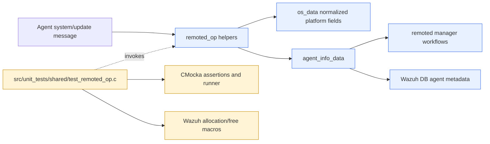
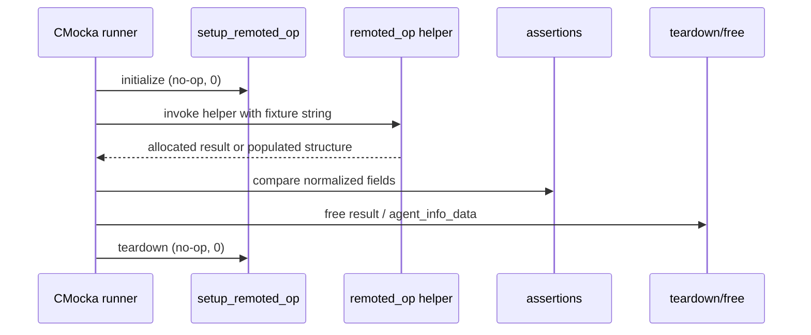
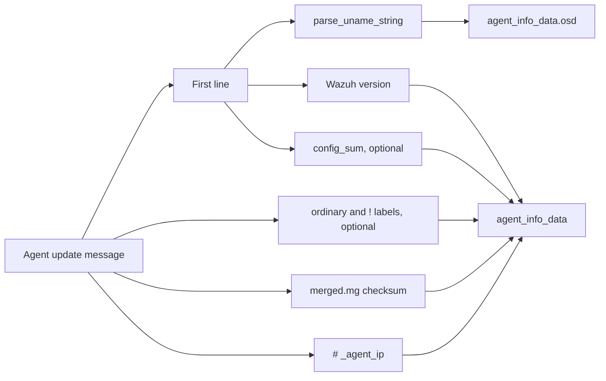
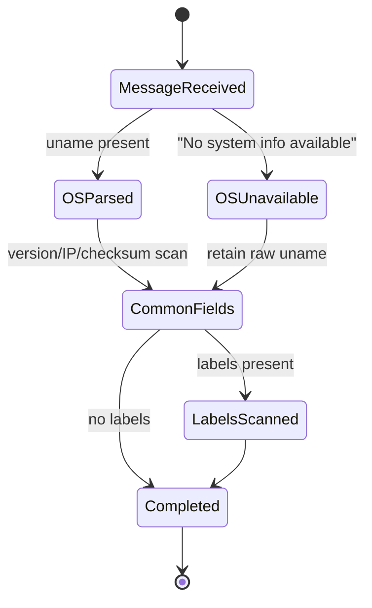

# `test_remoted_op` module

`test_remoted_op` is the CMocka unit-test suite for the remoted-operation helpers in Wazuh's shared library. It verifies that agent system-information messages are converted into normalized operating-system metadata, architecture values are extracted correctly, and complete agent update messages populate `agent_info_data` consistently.

The suite tests parsing behavior in isolation. It does not start the remoted daemon, open sockets, access Wazuh DB, or exercise agent-to-manager transport. For daemon behavior, see [remoted.md](remoted.md) and its focused documents such as [remoted_group_management.md](remoted_group_management.md), [remoted_secure_connection.md](remoted_secure_connection.md), and [remoted_state_metrics.md](remoted_state_metrics.md).

## Position in the system

The production helpers under test belong to the shared remoted-operation layer. They consume strings produced by agent/manager communication and prepare data later used by remoted and Wazuh DB code. The test target supplies CMocka assertions and common Wazuh allocation/free helpers, while the actual parser implementation is provided by `remoted_op.h` and its corresponding implementation.



## Responsibilities

The file covers three related responsibilities:

| Area | Production helper | What the tests establish |
|---|---|---|
| Architecture extraction | `get_os_arch` | The final architecture token is returned for x86, SPARC, IA64, AIX, and ARM variants. |
| OS string normalization | `parse_uname_string` | Linux, macOS, and Windows formats are split into name, version, codename, platform, architecture, and preserved raw uname fields. |
| Agent update decoding | `parse_agent_update_msg` | Version, OS metadata, configuration checksum, merged checksum, labels, and agent IP are extracted; selected missing fields remain safely null or use the available token. |

## Test fixture and execution

`setup_remoted_op` and `teardown_remoted_op` both return `0` and do not initialize shared state. Every test is registered with `cmocka_unit_test_setup_teardown`, so the lifecycle is still explicit and can be expanded if the production helpers later acquire global dependencies.

`main` builds one static `CMUnitTest` array and passes it to `cmocka_run_group_tests`. The suite contains 23 tests:

- 9 `get_os_arch` tests.
- 4 `parse_uname_string` tests.
- 10 `parse_agent_update_msg` tests.

The tests allocate parser outputs with `os_strdup`/`os_calloc`, assert fields, and release nested data with `wdb_free_agent_info_data` or explicit `os_free` calls. This makes ownership part of the tested usage contract: callers own returned strings and must release the resulting structures through the matching Wazuh cleanup routine.



## `get_os_arch` coverage

`get_os_arch` is tested with uname-like strings whose fifth pipe-delimited field is the architecture. The expected result is an independently allocated string equal to that field:

| Test | Input architecture | Expected output |
|---|---|---|
| `test_get_os_arch_x86_64` | `x86_64` | `x86_64` |
| `test_get_os_arch_i386` | `i386` | `i386` |
| `test_get_os_arch_i686` | `i686` | `i686` |
| `test_get_os_arch_sparc` | `sparc` | `sparc` |
| `test_get_os_arch_amd64` | `amd64` | `amd64` |
| `test_get_os_arch_ia64` | `ia64` | `ia64` |
| `test_get_os_arch_AIX` | `AIX` | `AIX` |
| `test_get_os_arch_armv6` | `armv6` | `armv6` |
| `test_get_os_arch_armv7` | `armv7` | `armv7` |

The tests intentionally include both synonymous 64-bit spellings (`x86_64` and `amd64`) and less common architectures. They verify extraction rather than canonicalization: the spelling supplied in the message is preserved.

## `parse_uname_string` behavior

The helper accepts either the structured Unix form or the Windows form and populates an `os_data` object. It also mutates the input buffer in the expected way by removing the detailed bracketed release suffix from the retained `os_uname` value.

```mermaid
flowchart TD
    Input[uname string] --> Detect{format?}
    Detect -->|Windows [Ver: ...]| Win[Extract display name and version]
    Detect -->|Unix fields + [OS|platform: release]| Unix[Extract OS identity and architecture]
    Win --> Fields[Populate os_data]
    Unix --> Fields
    Fields --> Raw[Preserve normalized os_uname]
```

### Windows cases

`test_parse_uname_string_windows1` covers Windows 10 Enterprise and expects:

- `os_name`: `Microsoft Windows 10 Enterprise`
- `os_major`, `os_minor`, `os_build`: `10`, `0`, `14393`
- `os_version`: `10.0.14393`
- `os_platform`: `windows`
- `os_codename` and `os_arch`: null
- `os_uname`: the display name without the `[Ver: ...]` suffix

`test_parse_uname_string_windows2` covers Windows Server 2019 with a dotted build (`17763.1935`). The dotted build is retained and combined into `10.0.17763.1935`, demonstrating that the parser does not truncate the Windows build component.

### Unix cases

The Linux case produces `Debian GNU/Linux`, platform `debian`, major version `10`, codename `buster`, version `10`, and architecture `x86_64`. The macOS case produces `Mac OS X`, platform `darwin`, version `10.15.6`, codename `Catalina`, and architecture `x86_64`. Fields not represented by the release data, such as Linux minor/build or macOS build, are expected to remain null.

## `parse_agent_update_msg` behavior

The update-message parser combines multiple line-oriented records:

1. The first line contains uname data followed by `- Wazuh <version>` and an optional configuration checksum after `/`.
2. The next checksum line identifies the merged agent-group file and ends with `merged.mg`.
3. Optional label lines can appear before the merged checksum.
4. A `#"_agent_ip":...` line supplies the agent IP.



### Valid platform messages

The Debian, Ubuntu, Arch Linux, Solaris, macOS, and Windows tests verify platform-specific normalization while also checking the common fields `version`, `config_sum`, `merged_sum`, and `agent_ip`. Important distinctions include:

- Ubuntu preserves `20.04 LTS` as the version and `Focal Fossa` as the codename.
- Arch Linux has an empty release value, so `os_version` is an empty string while major/minor/build/codename are null.
- Solaris uses `i86pc` as its architecture and `sunos` as its platform.
- Windows has no architecture in the message format, so `os_arch` is null.

### Optional and missing data

The negative/edge cases document tolerant parsing rather than failure:

- `test_parse_agent_update_msg_missing_uname` uses `No system info available`; parsing succeeds, the raw uname is preserved, and all normalized OS fields are null.
- `test_parse_agent_update_msg_missing_config_sum` leaves `config_sum` null while still extracting the merged checksum and IP.
- `test_parse_agent_update_msg_missing_merged_sum` supplies `x merged.mg`; the available token `x` becomes `merged_sum`, showing that this test validates fallback token handling rather than rejection.
- `test_parse_agent_update_msg_ok_labels` verifies that ordinary labels and exclamation-prefixed hidden labels are collected as one newline-separated `labels` string, without changing OS or checksum parsing.



## Dependencies and boundaries

The direct source-level dependencies visible from the test are intentionally small:

- `shared.h` supplies common Wazuh types/macros and cleanup support.
- `remoted_op.h` supplies the production declarations under test.
- CMocka supplies `CMUnitTest`, registration macros, and assertions.
- The included directory/debug wrapper headers are part of the shared unit-test build environment; this file does not configure mocks directly.

The suite is therefore best understood as a focused contract test for shared remoted parsing. It complements, rather than duplicates, the broader shared-library and daemon tests documented in [shared_lib.md](shared_lib.md), [shared_lib_string_validation.md](shared_lib_string_validation.md), [test_remcom_remoted.md](test_remcom_remoted.md), and [test_remote_state_remoted.md](test_remote_state_remoted.md).

## Maintenance guidance

When changing the message format or OS normalization rules, update the representative platform cases and the missing-field cases together. In particular, preserve assertions for null versus empty values, because the suite distinguishes “field absent” from “field present but empty.” Any new allocated output should also receive an explicit cleanup assertion path, following the existing `os_free` and `wdb_free_agent_info_data` patterns.

