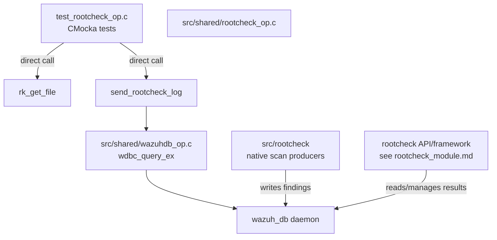
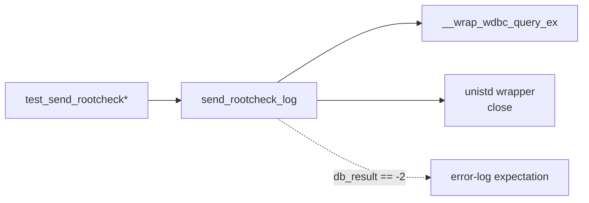
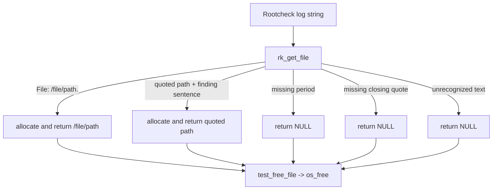
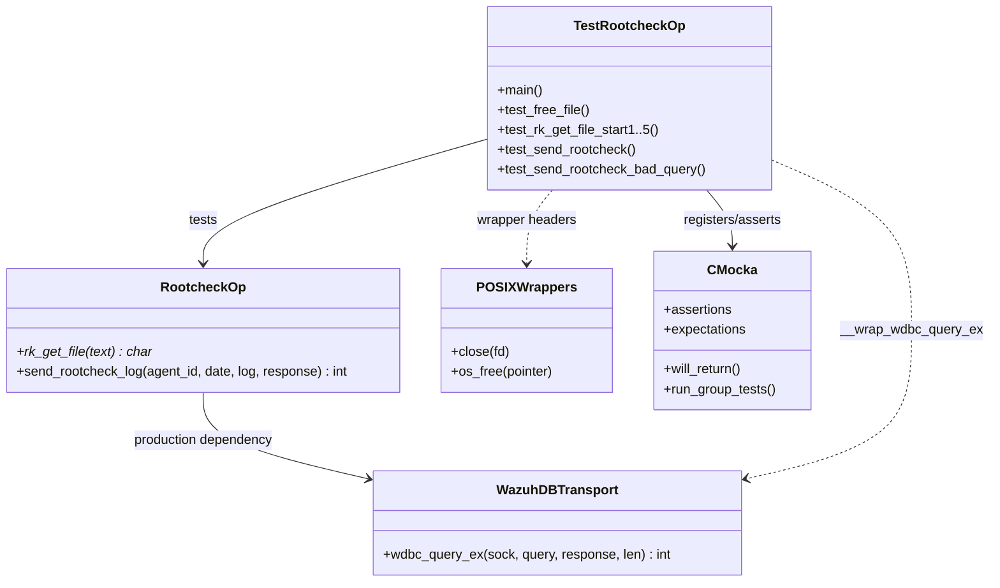
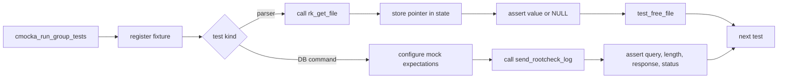

# `test_rootcheck_op` Module

## Introduction

`test_rootcheck_op` is the CMocka unit-test module for shared rootcheck operations in `src/unit_tests/shared/test_rootcheck_op.c`. It verifies two independent behaviors:

- extraction of a file path from rootcheck finding text through `rk_get_file()`;
- construction and submission of a `rootcheck save` command through `send_rootcheck_log()` and `wdbc_query_ex()`.

The tests do not execute a rootcheck scan. Scanning, API exposure, framework queries, and persistence are documented in [rootcheck_module.md](rootcheck_module.md). This module isolates shared-library parsing and Wazuh DB command integration using mocks.

## Scope and position in the system

The test belongs to the shared-library test suite and sits below the native rootcheck daemon and the Wazuh DB service. Its production dependencies are the shared rootcheck implementation and the Wazuh DB query transport.



The test substitutes the external boundary rather than contacting `wazuh-db`:



## Components

### Test entry point: `main`

`main()` creates a static `CMUnitTest` array and runs it with `cmocka_run_group_tests()`. Five parser tests register `test_free_file` as teardown; the two DB transport tests run without a teardown callback.

The suite is intentionally small and table-driven at the CMocka registration level:

| Registered test | Production function | Expected result |
|---|---|---|
| `test_rk_get_file_start1` | `rk_get_file` | Extract `/file/path` from `File: /file/path.` |
| `test_rk_get_file_start2` | `rk_get_file` | Reject a `File:` line without the terminating period |
| `test_rk_get_file_start3` | `rk_get_file` | Extract a quoted path from a finding sentence |
| `test_rk_get_file_start4` | `rk_get_file` | Reject an unterminated quoted path |
| `test_rk_get_file_start5` | `rk_get_file` | Return `NULL` for unrelated text |
| `test_send_rootcheck_bad_query` | `send_rootcheck_log` | Preserve DB error response and return `-2` |
| `test_send_rootcheck` | `send_rootcheck_log` | Preserve success response and return `0` |

### `test_free_file`

This teardown receives the parser result through CMocka's `state` pointer and releases it with `os_free()`. It is used for every `rk_get_file` test, including cases where the expected result is `NULL`; the shared allocator is expected to tolerate that value.

### `rk_get_file` tests

The five parser tests define the accepted rootcheck log shapes and the negative cases:



Observed contract from the assertions:

- `File: /file/path.` returns the path without the trailing period.
- A plain `File: /file/path` does not match.
- A quoted path is accepted when the quote is closed and followed by the finding text.
- An unclosed quote and unrelated text return `NULL`.
- Successful results are heap-owned by the caller and must be released.

The test names use the historical `start1`–`start5` suffixes; they describe parser cases rather than separate production entry points.

### `send_rootcheck_log` tests

Both transport tests use the same inputs:

```text
agent_id = "015"
date     = 10552
log      = "Test query log"
```

The expected command is:

```text
agent 015 rootcheck save 10552 Test query log
```

`send_rootcheck_log()` is expected to pass that command and an output capacity of `OS_SIZE_6144` to `wdbc_query_ex()`. The mocked DB function writes the configured response into the caller-provided response buffer and returns the configured status.

```mermaid
sequenceDiagram
    participant Test as CMocka test
    participant S as send_rootcheck_log
    participant DB as __wrap_wdbc_query_ex
    participant Log as __wrap__merror

    Test->>S: agent_id, date, log, response
    S->>S: format "agent 015 rootcheck save 10552 Test query log"
    S->>DB: socket=-1, query, response, len=OS_SIZE_6144
    DB-->>S: response text + status
    S->>S: close returned socket
    alt status == -2
        S->>Log: "Bad load query: '<query>'."
    end
    S-->>Test: status; response remains available
```

The success case configures `"ok Message"` and status `0`, then asserts both the return code and response. The failure case configures `"error Message"` and status `-2`, and additionally asserts that the formatted error message is emitted.

## Dependency and mocking model



The source includes:

- `shared.h`, which supplies the production declarations and shared definitions;
- `wdb_wrappers.h`, which provides the mocked `wdbc_query_ex` boundary and logging expectations;
- `unistd_wrappers.h`, which isolates POSIX calls used by the production function;
- CMocka and standard headers required for test fixtures and assertions.

The wrapper is important for determinism: the test validates query construction and result propagation without requiring a live socket, a running database daemon, or a populated agent database.

## Execution and lifecycle



For parser tests, the result pointer is assigned to `*state` before the assertion so the teardown can release it regardless of assertion outcome. For DB tests, the response buffer is stack-allocated and initialized to an empty string; the mock populates it as part of the expectation setup.

## Test coverage and maintenance guidance

The suite covers:

- valid unquoted and quoted path extraction;
- malformed path delimiters and unrelated input;
- exact DB command formatting, including agent ID, timestamp, and log text;
- fixed response-buffer capacity;
- success response propagation;
- error response propagation and logging for the `-2` transport result;
- cleanup of parser-owned memory.

It does not cover command-string escaping, oversized agent/log inputs, `close()` failures, allocation failures, or real Wazuh DB behavior. Those concerns belong in additional shared-library tests or integration tests around [wazuh_db.md](wazuh_db.md).

When extending this module, preserve the existing separation:

1. parser tests should assert both the extracted value and ownership cleanup;
2. transport tests should assert the complete query string and response capacity;
3. DB and logging behavior should remain mocked so the test stays a unit test;
4. API/framework behavior should be documented and tested through [rootcheck_module.md](rootcheck_module.md), not duplicated here.

## Related documentation

- [rootcheck_module.md](rootcheck_module.md) — API, framework, core query, native daemon integration, and rootcheck data model.
- [framework_core_communication.md](framework_core_communication.md) — shared socket and Wazuh DB communication abstractions.
- [wazuh_db.md](wazuh_db.md) — Wazuh DB command parsing and rootcheck persistence.
- [shared_lib_networking.md](shared_lib_networking.md) — shared networking and transport helpers used by Wazuh DB operations.
