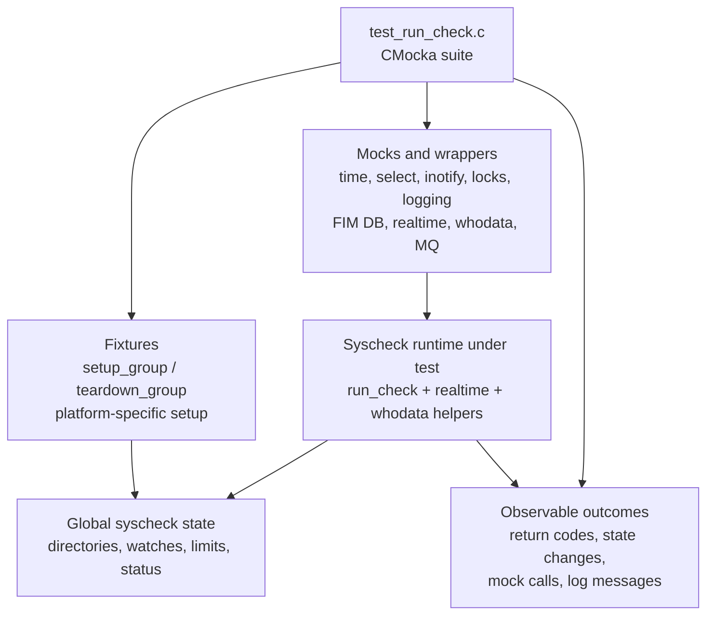
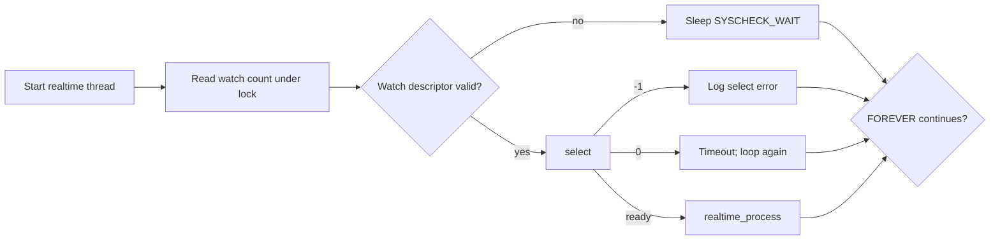
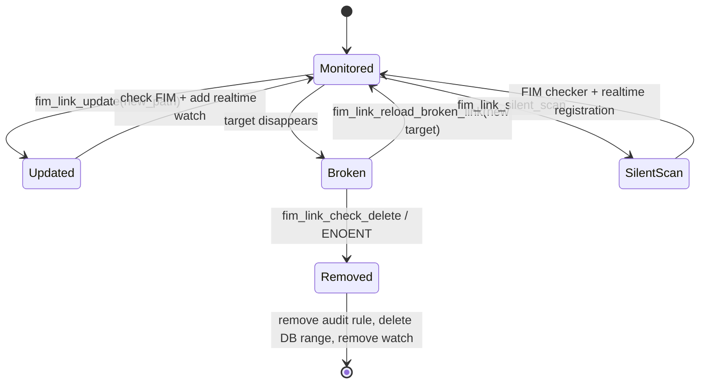
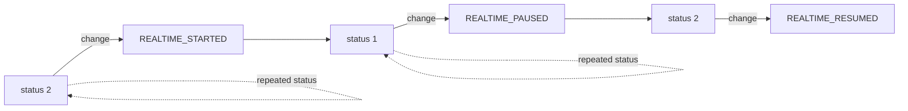
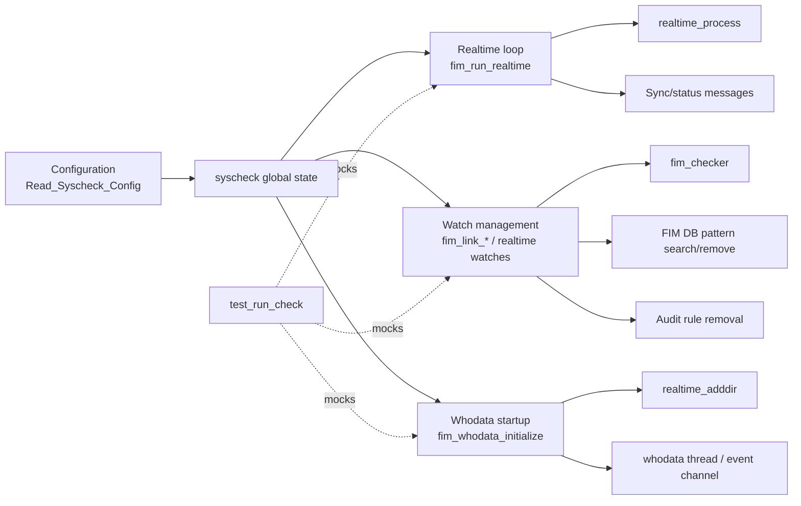
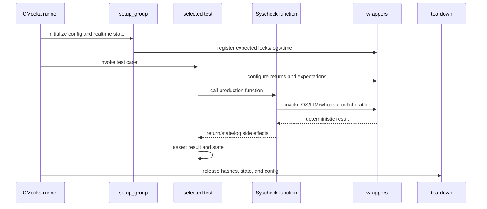

# `test_run_check` module

`test_run_check` is the CMocka unit-test suite for the Syscheck/FIM runtime-control layer. It validates the logic that starts and services real-time monitoring, handles symbolic-link changes, initializes Windows “whodata” monitoring, applies file-rate limits, reports runtime state, and maps Windows thread priorities. The suite tests control-flow decisions through mocks rather than exercising a live filesystem watcher, audit subsystem, or message queue.

The implementation under test belongs to the Syscheck daemon. For daemon lifecycle, scan-engine, and realtime implementation context, see [syscheckd_core](syscheckd_core.md). Shared test setup and wrapper conventions are described in [test_infrastructure](test_infrastructure.md). Database behavior is covered separately by [syscheckd_db](syscheckd_db.md), while Windows whodata internals are documented in [syscheckd_whodata](syscheckd_whodata.md).

## Location and build variants

| Item | Value |
| --- | --- |
| Test source | `src/unit_tests/syscheckd/test_run_check.c` |
| Test framework | CMocka (`cmocka_unit_test`, `cmocka_run_group_tests`) |
| Main production area | `src/syscheckd/src/run_check.c` and related realtime/whodata code |
| Primary state | Global `syscheck`, especially `syscheck.realtime`, `max_files_per_second`, and `process_priority` |
| POSIX/Linux build | Tests `select()`-driven realtime processing and symbolic-link maintenance |
| Windows agent build | Tests Windows event waiting, thread priority, and whodata startup |
| Windows whodata build | Tests whodata-to-realtime mode transitions and event-channel startup |

The source is compiled conditionally. `TEST_WINAGENT` selects Windows-specific behavior; otherwise the POSIX branch is compiled. `WIN_WHODATA` changes the registered test group to focus exclusively on whodata/event-channel behavior. Consequently, the exact test count depends on compiler definitions and platform support.

## Architecture

The suite is intentionally boundary-oriented: production functions are called directly, while operating-system and daemon collaborators are replaced by wrappers. Assertions cover both returned values and side effects such as watch registration, database pattern searches, audit-rule removal, log messages, and lock usage.

## Component responsibilities

### Test runner and registration

`main()` builds one of three test collections:

1. The normal collection includes status logging, FPS limiting, and either POSIX or Windows realtime tests.
2. With `TEST_WINAGENT`, it adds Windows priority tests and uses Windows synchronization/watcher behavior.
3. With `WIN_WHODATA`, it registers the whodata initialization and mode-transition tests instead of the normal collection.

Each collection runs with `setup_group` and `teardown_group`. Individual tests that mutate symbolic-link configuration or rate-limit state use their own setup/teardown pair.

### Shared fixture lifecycle

`setup_group()` loads `test_syscheck.conf` through `Read_Syscheck_Config`, configures deterministic random values, allocates `syscheck.realtime`, and creates its watch hash. The POSIX path inserts a sample hash entry and supplies deterministic time values. The Windows path prepares expected lock operations and configuration diagnostics.

`teardown_group()` frees the realtime watch table, releases realtime state, and calls `Free_Syscheck`. Windows additionally releases platform-specific realtime data and models the expected read/write lock sequence.

`setup_symbolic_links()` and `teardown_symbolic_links()` replace a configured directory with a controlled `/link` → `/folder` relationship and toggle `REALTIME_ACTIVE`. `setup_tmp_file()` adds a minimal `fim_tmp_file` used by link-range deletion tests. `setup_max_fps()` and `teardown_max_fps()` isolate the global maximum-files-per-second setting. Windows-only `setup_hash()` and `teardown_hash()` populate and clean per-directory realtime data.

### Wrapper and mock boundary

The test includes wrappers for:

- time and loop control: `__wrap_time`, `__wrap_FOREVER`, `__wrap_select`, sleep/wait functions;
- synchronization and diagnostics: pthread locks, debug/error/info logging;
- filesystem/watch operations: `lstat`, inotify watch removal, realtime directory registration;
- FIM operations: database pattern searches, FIM checks, audit-rule removal;
- Windows whodata operations: audit restoration, `run_whodata_scan`, event-channel thread creation, wait handles, and thread priority;
- messaging: `expect_w_send_sync_msg` and `SendMSGPredicated` expectations.

These dependencies correspond to the wrapper families listed in the module tree: `run_check_wrappers`, `run_realtime_wrappers`, `create_db_wrappers`, `fim_db_wrappers`, and `win_whodata_wrappers`.

## Functional coverage

### Realtime loop

The POSIX `fim_run_realtime()` tests exercise the first loop iteration and the transition after a timeout:

The tests verify invalid descriptors, `select()` errors, timeout followed by processing, locking around watch-count inspection, and termination of the loop through the mocked `FOREVER` condition. The Windows equivalent waits on the realtime event with `WaitForSingleObjectEx`, handles `WAIT_FAILED`, `WAIT_IO_COMPLETION`, sleeping, and re-registering configured directories.

### Symbolic-link maintenance (POSIX)

The `fim_link_*` tests cover the lifecycle of a monitored symbolic link:

Coverage includes successful updates, duplicate-link rejection, `lstat()` failure, `ENOENT`, deletion of realtime watches, removal of database entries below a link path, silent rescans, and reloading an already monitored or newly repaired link. Assertions verify that the configured `directory_t` path and `symbolic_links` fields are preserved or cleared as appropriate.

### File-rate limiting

`test_check_max_fps_no_sleep` verifies that processing continues when the elapsed interval permits more work. `test_check_max_fps_sleep` sets `files_read` to the configured limit and verifies the “maximum FPS reached” diagnostic when the limit is hit. The tests isolate global `last_time`, `files_read`, and `syscheck.max_files_per_second` through the time wrapper.

### Runtime status logging

`test_log_realtime_status` checks state-change logging and suppression of duplicate transitions. The expected progression is:

### Windows priority mapping

The Windows tests map configured numeric priorities to native thread priorities:

| `syscheck.process_priority` | Native priority expected |
| ---: | --- |
| `-10` | `THREAD_PRIORITY_HIGHEST` |
| `-8` | `THREAD_PRIORITY_ABOVE_NORMAL` |
| `0` | `THREAD_PRIORITY_NORMAL` |
| `2` | `THREAD_PRIORITY_BELOW_NORMAL` |
| `7` | `THREAD_PRIORITY_LOWEST` |
| `20` | `THREAD_PRIORITY_IDLE` |

An additional failure test verifies that `set_priority_windows_thread()` logs the operating-system error returned by `GetLastError` when priority application fails.

### Windows whodata initialization and mode changes

`fim_whodata_initialize()` expands configured environment-variable paths, lowercases them, registers them with `realtime_adddir`, starts the whodata scan, and creates the worker thread. Successful startup returns `0`. A failed policy setup returns `-1`, logs the fallback to realtime mode, and restores audit state.

`set_whodata_mode_changes()` covers directories changing from whodata to realtime monitoring. It verifies per-directory registration, the `whodata` flag passed to `realtime_adddir`, success/error diagnostics, and continued processing when one directory cannot be registered.

## Dependency and interaction view

The test suite depends conceptually on, but does not duplicate, the implementation details in the following areas:

- [syscheckd_core](syscheckd_core.md): daemon lifecycle, FIM scan scheduling, and realtime engine ownership.
- [syscheckd_whodata](syscheckd_whodata.md): audit/event-channel whodata implementation.
- [syscheckd_db](syscheckd_db.md): persistence and FIM database operations.
- [test_infrastructure](test_infrastructure.md): common CMocka fixtures and wrapper behavior.

## Test execution flow

## Maintenance guidance

When changing realtime or whodata control flow, update the branch-specific test registration and its wrapper expectations together. In particular:

- preserve lock expectations when adding state access;
- keep time, loop, and wait calls deterministic rather than relying on wall-clock behavior;
- update symbolic-link assertions whenever `directory_t.path` or `directory_t.symbolic_links` ownership changes;
- add tests for both successful and failed watch/audit operations;
- compile each relevant variant because POSIX, Windows agent, and Windows whodata branches do not exercise the same functions.

The provided source and module tree show a few naming differences between the declared component inventory and the excerpted file (for example, some inventory names use shortened or alternate test names). The authoritative test set is the `main()` registration for the active build configuration.
