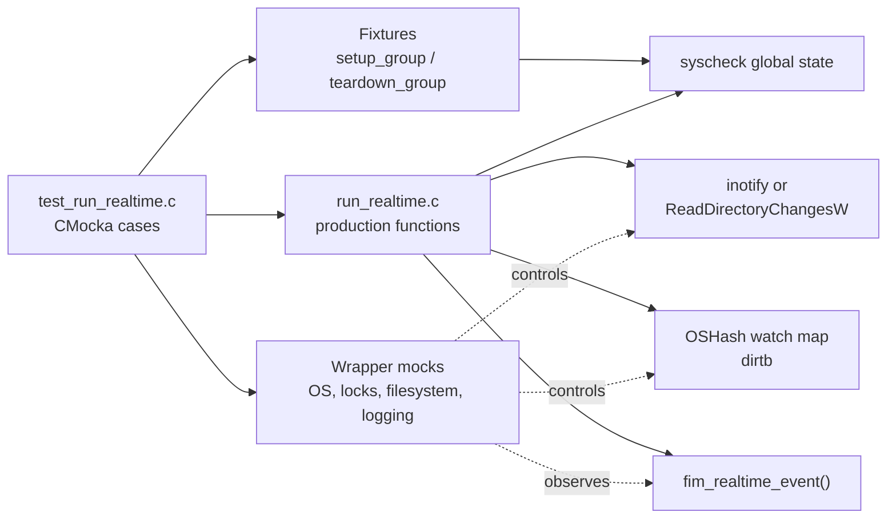
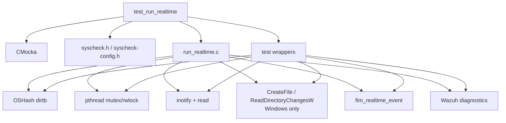
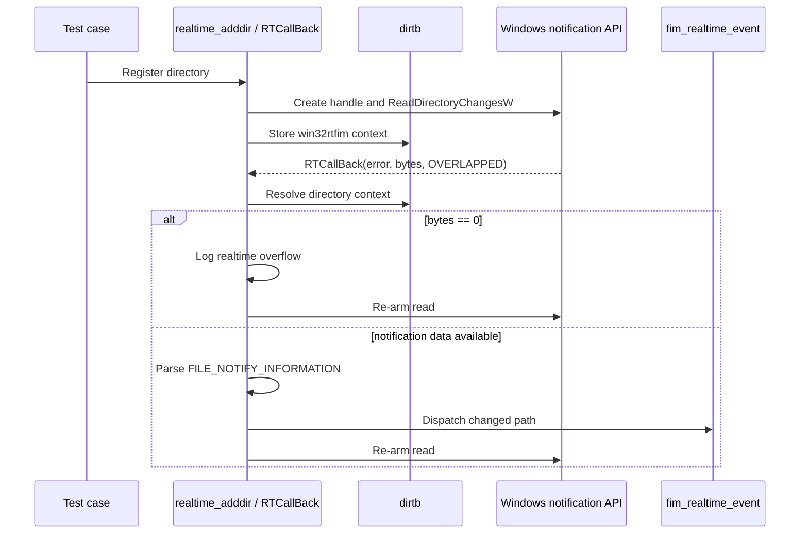
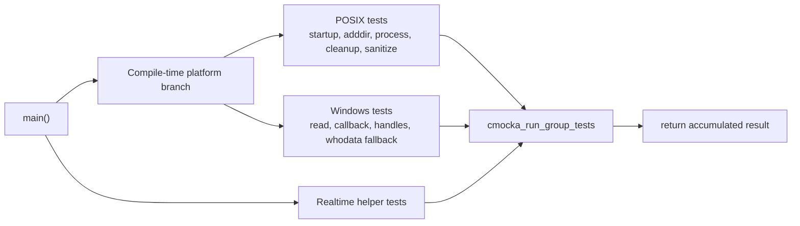

# `test_run_realtime`

## Introduction

`test_run_realtime` is the CMocka unit-test module for the Syscheck/FIM realtime-watch implementation. Its source is `src/unit_tests/syscheckd/test_run_realtime.c`. The suite does not monitor a real directory or run a live `syscheckd`; it drives the production realtime functions with controlled hash tables, filesystem events, OS-call wrappers, locks, and logging expectations.

The module validates watch lifecycle, event decoding, watch-map maintenance, queue-overflow reporting, and Windows asynchronous callback behavior. The implementation being tested is documented in [syscheckd_core_realtime](syscheckd_core_realtime.md). Broader FIM event handling and scan recovery are covered by [fim_realtime_whodata_tests](fim_realtime_whodata_tests.md), while shared hash-table and platform-wrapper behavior is documented by [headers_data_structures](headers_data_structures.md) and the relevant shared-library modules.

## Scope and system position

| Item | Description |
| --- | --- |
| Test source | `src/unit_tests/syscheckd/test_run_realtime.c` |
| Test framework | CMocka (`CMUnitTest`, `cmocka_run_group_tests`) |
| Production boundary | `src/syscheckd/src/run_realtime.c` |
| Global state | `syscheck.realtime`, including the watch map and overflow flag |
| POSIX backend | `inotify` initialization, watches, event reads, and watch repair |
| Windows backend | `ReadDirectoryChangesW`, `OVERLAPPED`, directory handles, and `RTCallBack` |
| External behavior | FIM event dispatch, lock ordering, diagnostics, and resource cleanup |

The build selects platform-specific cases with `TEST_SERVER`, `TEST_AGENT`, `TEST_WINAGENT`, and `WIN_WHODATA`. POSIX builds test the inotify path; Windows builds test the directory-change callback path and Windows whodata fallbacks. The suite intentionally mocks platform APIs, so it verifies deterministic control flow rather than kernel delivery.

## Architecture



The suite has three logical layers:

1. **Lifecycle and fixtures** initialize Syscheck configuration and allocate `syscheck.realtime`.
2. **Realtime operations** exercise startup, directory registration, event processing, deletion cleanup, and watch-map sanitation.
3. **Helper state** verifies queue-overflow getters/setters and watch-count diagnostics.

## Component relationships and dependencies



The most important dependency is the `dirtb` hash table. On POSIX, the key is an inotify watch descriptor converted to a string and the value is the monitored directory. On Windows, the key is the directory path and the value is a `win32rtfim` context. The test fixtures provide both forms through the shared hash-map helpers.

The wrapper set also models:

- `inotify_init`, `inotify_add_watch`, `inotify_rm_watch`, `read`, and Windows directory notifications;
- `OSHash_Create`, lookup, insertion, update, deletion, iteration, and element counts;
- pthread lock acquisition and release, including expected ordering;
- filesystem existence/type checks and UTF-8 Windows file handles;
- FIM event dispatch, whodata ACL setup, and configuration lookup;
- error, warning, debug, and event-log emission.

## Test fixtures and isolation

### Common group fixture

`setup_group` loads `test_syscheck.conf`, initializes the global Syscheck configuration, allocates `syscheck.realtime`, and switches `test_mode` on after setup. It also establishes broad expectations for the locks used by configuration initialization. `teardown_group` disables test mode and calls `Free_Syscheck`, again asserting the expected lock interactions.

The fixture makes every test independent of the host machine. Paths such as `/etc/folder`, `/media/some/path`, `C:\\a\\path`, and `C:\\a\\file` are test data; no corresponding real filesystem object is required.

### Specialized fixtures

| Fixture | Purpose |
| --- | --- |
| `setup_realtime_start` | Supplies a fake `OSHash` and temporarily removes `syscheck.realtime` to test allocation and startup failures. |
| `setup_OSHash` | Creates a mock hash table, installs `free` as the value destructor, and attaches it to `dirtb`. |
| `setup_inotify_event` | Allocates a buffer-sized `struct inotify_event` and a hash table for event-processing cases. |
| `setup_realtime_process` | Combines an inotify event with an `OSHashNode` for move-self/subdirectory cleanup. |
| `setup_sanitize_watch_map` | Creates a real mock hash table populated by individual sanitation tests. |
| `setup_RTCallBack` | Allocates a Windows `win32rtfim` context for callback tests. |

Teardown functions free synthetic nodes, event buffers, hash tables, Windows paths, and temporary realtime state. Tests that intentionally switch `test_mode` do so around direct calls to the real hash implementation so they can seed or inspect state without bypassing the production path being tested.

## POSIX realtime flow

```mermaid
flowchart TD
    A["realtime_start()"] --> B["Create dirtb hash"]
    B --> C{ "inotify initialized?" }
    C -- no --> E["Log initialization failure\nreturn -1"]
    C -- yes --> D["Store inotify fd"]
    D --> R["realtime_adddir(path, config)"]
    R --> W["inotify_add_watch"]
    W --> Q{ "watch result" }
    Q -- ENOSPC --> N["Log watch-limit failure\nreturn 1"]
    Q -- other error --> X["Log generic failure\nreturn 1"]
    Q -- success --> H["Insert or update dirtb"]
    H --> L["realtime_process()"]
    L --> I["read inotify buffer"]
    I --> DEDUP["Resolve path and deduplicate"]
    DEDUP --> F["fim_realtime_event(path)"]
    DEDUP --> DEL{ "delete/move-self?" }
    DEL -- yes --> CLEAN["delete_subdirectories_watches()\nremove watch entry"]
    DEL -- no --> F
```

### Startup and directory registration

`test_realtime_start_success` verifies that the hash table and inotify descriptor are installed. `test_realtime_start_failure_hash` covers allocation failure and the associated error message. `test_realtime_start_failure_inotify` covers failure to initialize inotify.

`realtime_adddir` is tested for:

- an unavailable realtime backend;
- watch exhaustion (`errno == ENOSPC`);
- generic watch-registration failure;
- insertion of a new watch;
- duplicate watch detection;
- updating an existing watch; and
- hash insertion/update failure, including the critical out-of-memory assertion.

The expected lock calls are part of the contract. The tests therefore detect accidental changes to synchronization around `dirtb` and global realtime state.

### Event processing

`realtime_process` reads a buffer of `inotify_event` records and resolves each event against the directory stored in `dirtb`. The test cases cover zero-length names, names with a trailing separator, duplicate path diagnostics, deletion, and self-move cleanup. Resolved paths are collected through the mocked red-black-tree key list and dispatched to `fim_realtime_event` under the expected read lock.

The overflow case uses `wd = -1` and the inotify queue-overflow mask. It verifies both the warning and the event sent through `send_log_msg`, then checks that `syscheck.realtime->queue_overflow` becomes true. A failed read produces `FIM_ERROR_REALTIME_READ_BUFFER` without crashing the test process.

### Subdirectory watch cleanup

`delete_subdirectories_watches` iterates the watch map and removes entries whose paths are descendants of the deleted or moved directory. The cases cover a null file descriptor, an empty hash, unrelated paths, and successful descendant deletion. This prevents stale descriptors from continuing to generate events after a directory hierarchy changes.

## Watch-map sanitation and recovery

```mermaid
flowchart TD
    S["realtime_sanitize_watch_map()"] --> I["Iterate dirtb under locks"]
    I --> C["Resolve configured path"]
    C --> D{ "directory still configured?" }
    D -- no --> RM["inotify_rm_watch\nremove hash entry"]
    D -- yes --> A["Re-add watch"]
    A --> R{ "new watch descriptor" }
    R -- same --> K["Keep entry"]
    R -- ENOENT --> RM2["Remove missing directory"]
    R -- ENOSPC --> L["Keep entry and log capacity error"]
    R -- other error --> G["Keep entry and log generic error"]
    R -- changed --> U["Re-key dirtb\nupdate collision if needed"]
```

The sanitation tests model the reconciliation needed after queue overflow, directory removal, configuration changes, or descriptor reuse. They cover:

- an empty map and a disconnected inotify descriptor;
- an entry with no current configuration;
- a missing directory (`ENOENT`);
- watch-limit exhaustion (`ENOSPC`);
- a generic inotify error;
- an unchanged descriptor;
- a newly assigned descriptor;
- failure while re-keying a new descriptor; and
- a new descriptor that collides with an existing directory entry.

The expected postconditions are important: removed paths disappear from `dirtb`, descriptor changes preserve the monitored path, and recoverable errors do not incorrectly discard valid entries.

## Windows realtime flow



Windows cases verify both normal realtime monitoring and whodata fallback behavior:

- `realtime_win32read` succeeds or reports failure to read a directory;
- `free_win32rtfim_data` is safe for null and fully populated contexts;
- `RTCallBack` logs OS errors, handles an empty watch lookup, reports zero-byte overflow, and dispatches an acquired file change;
- nonexistent paths are rejected and switched away from realtime mode;
- whodata directory and file registration succeeds when SACL setup succeeds;
- SACL setup failure falls back to realtime monitoring; and
- realtime mode is rejected for files, returning to scheduled monitoring.

The duplicate-entry cases also check Windows-specific handle ownership: an existing directory can be accepted, a vanished directory can close an open handle, and a closed or invalid handle can be removed safely.

## Helper API tests

The helper group runs independently of the main platform group:

| Function | Verification |
| --- | --- |
| `fim_realtime_get_queue_overflow` | Reads false and true values while holding the realtime mutex. |
| `fim_realtime_set_queue_overflow` | Updates the flag under the mutex. |
| `fim_realtime_print_watches` | Reads the hash element count and emits the formatted watch-count diagnostic. |

These helpers are used by the scheduled-scan/recovery path; the complete interaction with FIM scans is documented in [fim_realtime_whodata_tests](fim_realtime_whodata_tests.md).

## Test registration and execution

`main` constructs a platform-dependent `tests` array and a shared `realtime_helper_tests` array. The main group is executed with `setup_group` and `teardown_group`; specialized cases add their own fixture setup and teardown. The helper group runs without group fixtures because it installs a temporary `rtfim` object inside each test.

The resulting execution model is:



The module is normally built through the Syscheckd unit-test target. A failure generally means one of the following contracts changed: a lock is acquired in a different order, a wrapper-visible OS call was added or removed, a watch-map transition changed, an error branch returns a different status, or a diagnostic string was updated.

## Coverage matrix

| Production area | Representative tests | Main contract |
| --- | --- | --- |
| `realtime_start` | `test_realtime_start_success`, `test_realtime_start_failure_hash`, `test_realtime_start_failure_inotify` | Allocate state and initialize the platform watcher, or fail cleanly. |
| POSIX `realtime_adddir` | `test_realtime_adddir_realtime_add`, `..._realtime_update`, `..._watch_max_reached_failure` | Register, insert/update, and classify watch errors. |
| POSIX `realtime_process` | `test_realtime_process_len`, `..._delete`, `..._move_self`, `..._overflow` | Decode events, deduplicate paths, clean watches, and report overflow. |
| `delete_subdirectories_watches` | `..._deletes`, `..._not_same_name` | Remove only descendant watches. |
| `realtime_sanitize_watch_map` | `test_realtime_sanitize_watch_map_*` | Repair descriptors and remove invalid/configuration-stale entries. |
| Windows read/callback | `test_realtime_win32read_*`, `test_RTCallBack_*` | Handle asynchronous reads, errors, empty results, and changed paths. |
| Windows registration | `test_realtime_adddir_*` | Manage handles, limits, duplicate entries, whodata, and file fallback. |
| Realtime helpers | `test_fim_realtime_*` | Protect and expose overflow/watch-count state. |

## Maintenance guidance

Update this test module when changing:

- the `rtfim` or `win32rtfim` state layout;
- the key/value convention used by `dirtb`;
- inotify masks, error classification, or queue-overflow handling;
- Windows callback parsing, handle status, or re-arming behavior;
- lock ordering around the watch map;
- the return values used for fallback to scheduled or whodata monitoring; or
- diagnostic messages asserted by CMocka expectations.

Keep end-to-end watcher behavior outside this suite. Kernel notification delivery, FIM database persistence, and full scan recovery belong to the production and neighboring test modules linked above. This file should remain focused on the realtime engine's observable interactions and platform-specific state transitions.
