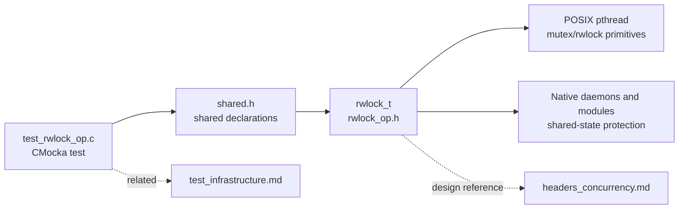
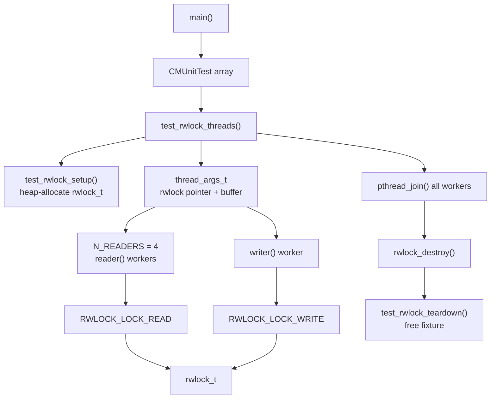
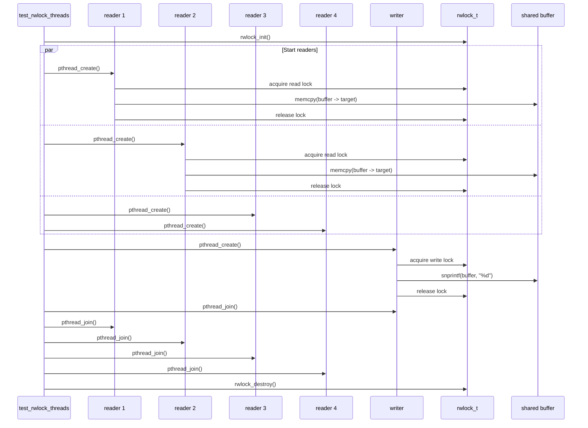
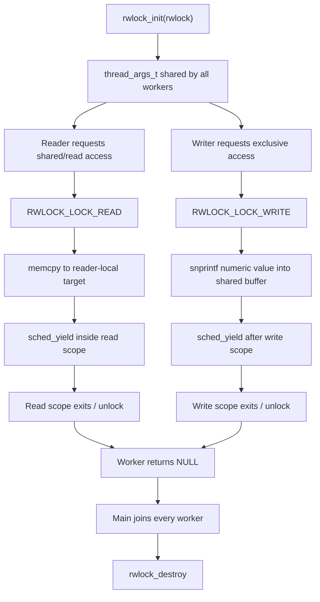
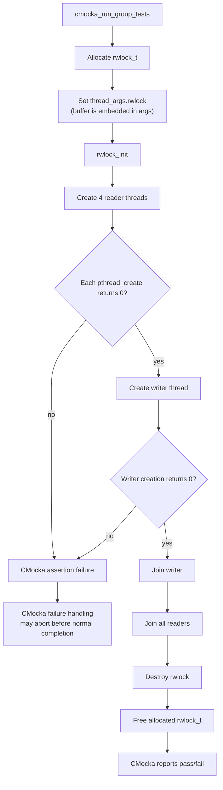

# `test_rwlock_op`

`test_rwlock_op` is a CMocka stress test for Wazuh's shared read/write-lock abstraction. It creates four concurrent readers and one writer, repeatedly protects access to a shared 64-byte buffer with the `RWLOCK_LOCK_READ` and `RWLOCK_LOCK_WRITE` macros, and verifies that all pthreads can be created, joined, and shut down around a correctly initialized `rwlock_t`.

The test validates lock lifecycle and concurrent access coordination; it does not validate the internal implementation of `rwlock_t` or the buffer's textual contents. Those reusable primitive details are documented in [headers_concurrency](headers_concurrency.md), while common CMocka wrapper and fixture conventions are covered by [test infrastructure](test_infrastructure.md).

## Scope and system position

| Item | Value |
|---|---|
| Test source | `src/unit_tests/shared/test_rwlock_op.c` |
| Test framework | CMocka (`CMUnitTest`) |
| Production abstraction | `rwlock_t` and `rwlock_*` operations from `rwlock_op.h`, included through `shared.h` |
| Threading API | POSIX `pthread_create`, `pthread_join`, and scheduler yielding |
| Test entry point | `main` |
| Test case | `test_rwlock_threads` |

The module sits below native Wazuh daemons and services that use read/write locking for shared state. Examples include logcollector state and remoted key-management paths; see [logcollector core threading](logcollector_core_threading.md) and [remoted networking](remoted_networking.md) for production consumers. This page intentionally avoids repeating their locking policies.

## Architecture

The test has three layers: the CMocka runner and fixture, the worker-thread scenario, and the shared lock abstraction. `thread_args_t` is the only test-specific data structure. It carries a pointer to the fixture-owned lock and the shared buffer into every worker.

### Components

| Component | Responsibility | Important details |
|---|---|---|
| `CMUnitTest` | Describes the executable test case | The suite registers one test with setup and teardown callbacks. |
| `test_rwlock_setup` | Allocates fixture state | Allocates `sizeof(rwlock_t)` and stores it in CMocka's `state`. It does not initialize the lock. |
| `test_rwlock_threads` | Coordinates the scenario | Initializes the lock, starts five pthreads, joins them, and destroys the lock. |
| `thread_args_t` | Shared worker arguments | Contains `rwlock_t *rwlock` and `char buffer[BUFFER_LEN]`. The instance lives on the test stack and remains valid until all joins complete. |
| `reader` | Exercises shared access | Performs `READ_CYCLES` read-locked copies from the shared buffer and calls `sched_yield()` inside the protected region. |
| `writer` | Exercises exclusive access | Performs `WRITE_CYCLES` write-locked `snprintf` operations and yields after each write. |
| `test_rwlock_teardown` | Releases fixture memory | Frees the allocation made by setup after the lock has been destroyed. |

## Concurrency model

The workload is intentionally read-heavy: four readers perform 10,000 iterations each, while one writer performs 1,000 iterations. The lock must allow concurrent readers but exclude readers while the writer updates the buffer.

The `RWLOCK_LOCK_*` forms are scoped macros: each receives the lock pointer and a block of protected work. The reader's local `target` buffer is deliberately private to that thread. The writer's `snprintf` is bounded by `BUFFER_LEN`, so the shared operation exercises synchronization without intentionally introducing an unbounded write.

## Data flow

No data is returned from the worker functions. The observable result is synchronization safety plus successful thread lifecycle operations. In particular, the test does not assert that readers observe a particular number; it uses the copy operation and scheduling points to create contention around the shared buffer.

## Execution flow

## Test lifecycle and invariants

1. CMocka invokes `test_rwlock_setup`; `state` points to a heap-allocated `rwlock_t`.
2. `test_rwlock_threads` obtains the pointer with `*(rwlock_t **)state` and initializes it exactly once.
3. A stack-local `thread_args_t` is passed by address to every worker. It remains alive until the writer and all readers have been joined.
4. Every successful worker creation is followed by a matching join.
5. The lock is destroyed only after all workers have returned.
6. CMocka invokes teardown, which frees the lock allocation.

The central safety invariant is that every access to `thread_args.buffer` occurs inside the appropriate read or write lock scope. The reader's `target` is thread-local, so it requires no additional synchronization.

## Coverage and limitations

Covered behavior includes:

- Allocation and release of the lock fixture.
- Explicit initialization and destruction of `rwlock_t`.
- Concurrent read-side access from four threads.
- Exclusive write-side access from one thread.
- Repeated lock acquisition under contention.
- Successful creation and joining of all pthreads.

The test does not directly cover lock initialization failure, destruction failure, recursive locking, writer fairness, reader starvation, cancellation, timeout behavior, process fork interactions, or the exact internal fields of `rwlock_t`. It also does not validate the value copied by readers. Those concerns belong in the primitive's implementation-level tests and broader concurrency documentation.

One implementation detail is worth preserving when maintaining the test: `thread_args.buffer` is not explicitly initialized before the first reader can run. That is acceptable for this test because the reader only checks that a bounded copy can execute under the read lock; the test is not a content-validation test. If content assertions are added later, initialize the buffer before creating readers.

The test assigns the return value of pthread functions to `errno` before asserting it is zero. POSIX pthread functions return an error number directly rather than requiring `errno`; changing this convention would make diagnostics more precise, but should be done consistently with neighboring tests and the project test style.

## Related documentation

- [headers concurrency primitives](headers_concurrency.md) — `rwlock_t` API and shared synchronization primitives.
- [shared library data structures](shared_lib_data_structures.md) — higher-level containers that rely on pthread synchronization.
- [unit-test infrastructure](test_infrastructure.md) — CMocka fixtures, wrappers, and test organization.
- [logcollector core threading](logcollector_core_threading.md) — production read/write-lock usage in worker threads.
- [remoted networking](remoted_networking.md) — production key-management locking and concurrent network paths.
