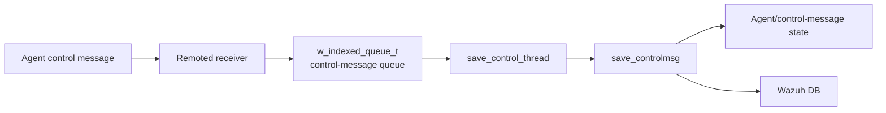
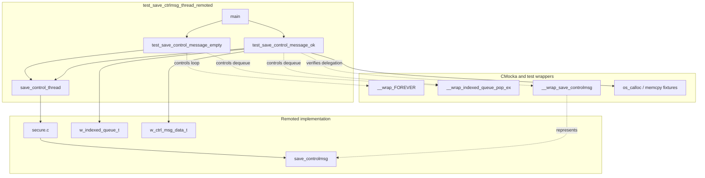
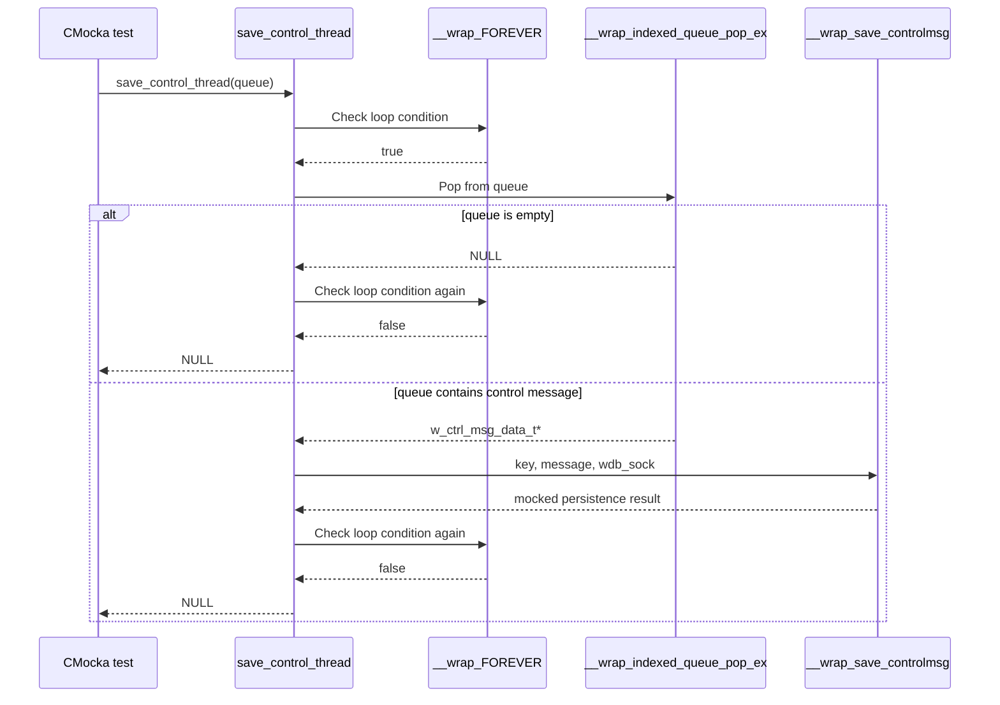
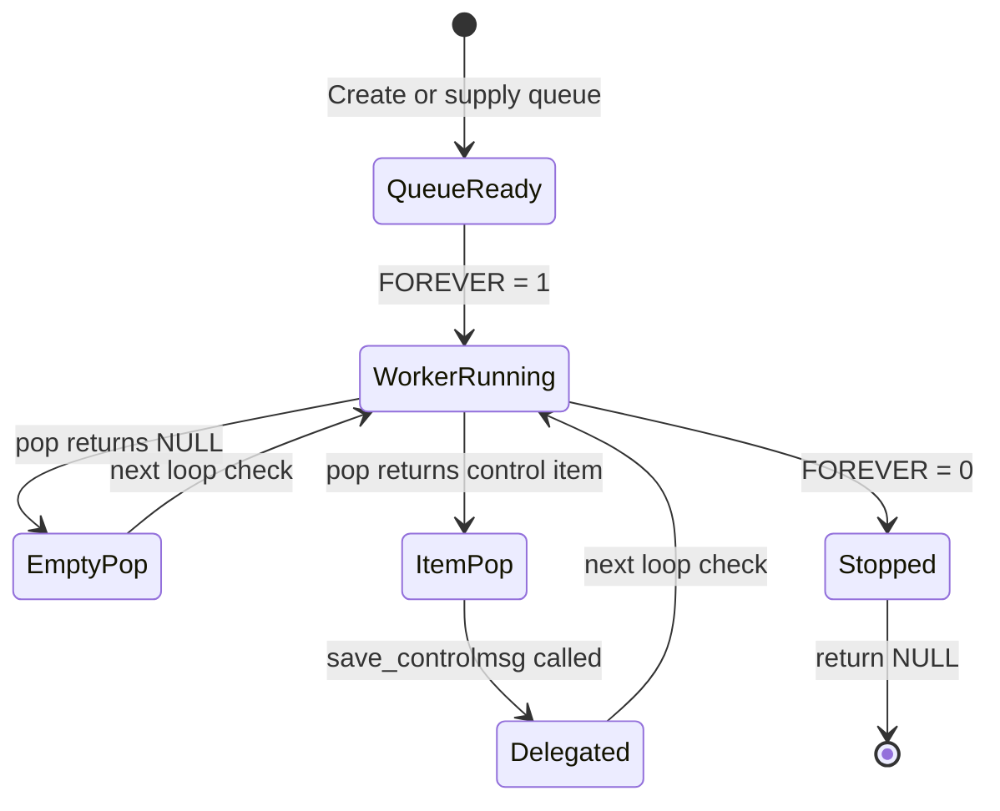

# `test_save_ctrlmsg_thread_remoted`

## Introduction

`test_save_ctrlmsg_thread_remoted` is the CMocka unit-test module for the remoted control-message persistence worker, `save_control_thread`. The worker consumes control-message records from an indexed queue and delegates each record to the remoted manager's `save_controlmsg` routine.

The test isolates the worker from real remoted sockets, agent state, and database storage. It verifies the two essential scheduling behaviors: an empty queue causes the worker to stop cleanly, while a queued control message is forwarded with its key and message payload intact.

The broader control-message persistence behavior is documented in [save_controlmsg_tests](save_controlmsg_tests.md). Daemon-level context is available in [remoted](remoted.md), and queue primitives are covered by [framework_core_communication_queue](framework_core_communication_queue.md).

## Scope and role in the system

The module tests a narrow boundary inside the remoted daemon. Network-facing code places work onto a queue; the worker removes work and invokes the persistence path; the persistence path updates Wazuh state as described by the neighboring manager tests.



This test does not validate wire parsing, encryption, queue implementation details, or Wazuh DB SQL behavior. Those responsibilities belong to the remoted networking, secure-message, queue, and manager test modules.

## Components

| Component | Role | Evidence in the test |
|---|---|---|
| `CMUnitTest` | CMocka test registration and execution model | `cmocka_unit_test(...)` entries in `main` |
| `main` | Registers and runs the two test cases | `cmocka_run_group_tests` |
| `test_save_control_message_empty` | Verifies empty-queue termination | Mocks one loop iteration, a null pop result, and a second loop check |
| `test_save_control_message_ok` | Verifies dequeue-and-forward behavior | Creates a queue record and asserts `save_controlmsg` arguments |
| `save_control_thread` | System under test | Declared in the test and implemented through the included remoted secure implementation |
| `w_indexed_queue_t` | Queue carrying control-message work | Initialized with capacity `10`, populated with key `"001"` |
| `w_ctrl_msg_data_t` | Work item containing the agent key and message text | Allocated with a `key` and `"test message"` payload |
| `save_controlmsg` | Persistence/delegation operation | Wrapped by `__wrap_save_controlmsg` and checked with CMocka expectations |

## Architecture and dependencies



The test includes `../../remoted/secure.c` directly. This makes the worker's production implementation part of the test translation unit while allowing external calls to be replaced by wrappers. The approach gives branch-level coverage without starting the remoted daemon.

## Data flow

```mermaid
flowchart TD
    Start[save_control_thread(queue)] --> Loop{FOREVER()}
    Loop -->|false| Return[Return NULL]
    Loop -->|true| Pop[indexed_queue_pop_ex(queue)]
    Pop --> Empty{Item returned?}
    Empty -->|no| Loop
    Empty -->|yes| Cast[Interpret item as w_ctrl_msg_data_t]
    Cast --> Extract[Read key and message]
    Extract --> Persist[save_controlmsg(key, message, wdb_sock)]
    Persist --> Loop
```

The exact worker loop contract exposed by the tests is:

1. Evaluate the loop-control function `FOREVER`.
2. Pop a control-message item from the supplied indexed queue.
3. If the pop returns no item, continue until the loop-control function stops the worker.
4. For a valid item, pass its `key` and `message` to `save_controlmsg`, together with the worker's database socket context.
5. Return `NULL` when the loop ends.

The test does not assert a return value from `save_controlmsg`; its contract is interaction-based. The important observable is that the exact allocated pointers are forwarded.

## Component interaction



## Test cases

### `test_save_control_message_empty`

This case passes the sentinel queue pointer `0x1` to the worker. The wrappers model one active loop iteration and return a null linked-queue item from `indexed_queue_pop_ex`. The test also asserts that the same queue pointer is supplied to the pop operation. A subsequent `FOREVER` result of `0` terminates the worker, and `assert_null` verifies the expected thread-function return.

This is a termination and empty-input test. It confirms that an empty queue does not cause a call to `save_controlmsg` and that the worker exits cleanly when its loop condition changes.

### `test_save_control_message_ok`

This case creates a real indexed queue with capacity `10`, allocates a `w_ctrl_msg_data_t`, allocates its `key`, and stores the null-terminated message `"test message"`. The item is inserted using queue key `"001"`.

The mocked dequeue returns the exact control-message pointer. The test then requires:

- `save_controlmsg` receives the exact `key` pointer;
- `save_controlmsg` receives the exact `message` pointer;
- the database socket argument is present, without constraining its opaque value;
- the worker returns `NULL` after the loop is stopped;
- the queue is released with `indexed_queue_free`.

This case validates the worker's handoff contract, not the contents of the message after persistence. The latter is covered by [save_controlmsg_tests](save_controlmsg_tests.md).

## Test process flow



## Isolation and mocking strategy

The test uses CMocka's `will_return`, `expect_value`, `expect_any`, and assertions to control and observe the worker:

- `__wrap_FOREVER` makes the normally unbounded worker deterministic.
- `__wrap_indexed_queue_pop_ex` controls whether work is available and verifies the queue identity.
- `__wrap_save_controlmsg` prevents database persistence and checks pointer forwarding.
- `indexed_queue_init`, `indexed_queue_push`, and `indexed_queue_free` exercise the queue fixture lifecycle in the successful case.
- `os_calloc` and `memcpy` create a minimal but valid control-message payload.

Because the worker is run synchronously as a normal function, no OS thread is created. The module therefore tests worker logic deterministically while avoiding timing races.

## Relationship to adjacent modules

- [save_controlmsg_tests](save_controlmsg_tests.md) documents the downstream `save_controlmsg` branches: startup, shutdown, pending data, group lookup, parsing, and Wazuh DB failures.
- [remoted_secure_connection](remoted_secure_connection.md) covers secure remoted message handling that can produce control-message work.
- [remoted_networking](remoted_networking.md) covers socket and transport behavior before work reaches the queue.
- [framework_core_communication_queue](framework_core_communication_queue.md) documents shared queue concepts; this module only verifies its worker-facing pop contract.
- [test_manager_remoted_test_infrastructure](test_manager_remoted_test_infrastructure.md) documents common remoted test setup and wrapper conventions.

## Maintenance guidance

Update this document when the worker's queue contract changes, especially if it:

- changes the loop termination mechanism;
- consumes a different queue type or key format;
- changes the `w_ctrl_msg_data_t` ownership model;
- adds filtering, batching, retry, or acknowledgement behavior;
- changes the arguments passed to `save_controlmsg`;
- begins running asynchronously in the test harness.

If persistence semantics change without changing the worker handoff, update [save_controlmsg_tests](save_controlmsg_tests.md) instead of duplicating those details here.
