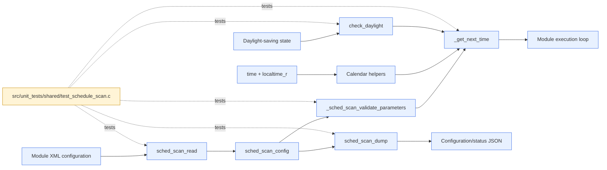
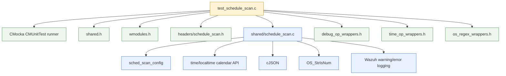
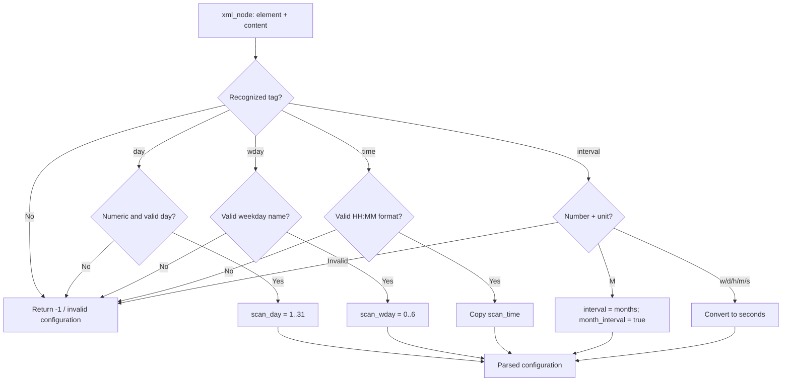
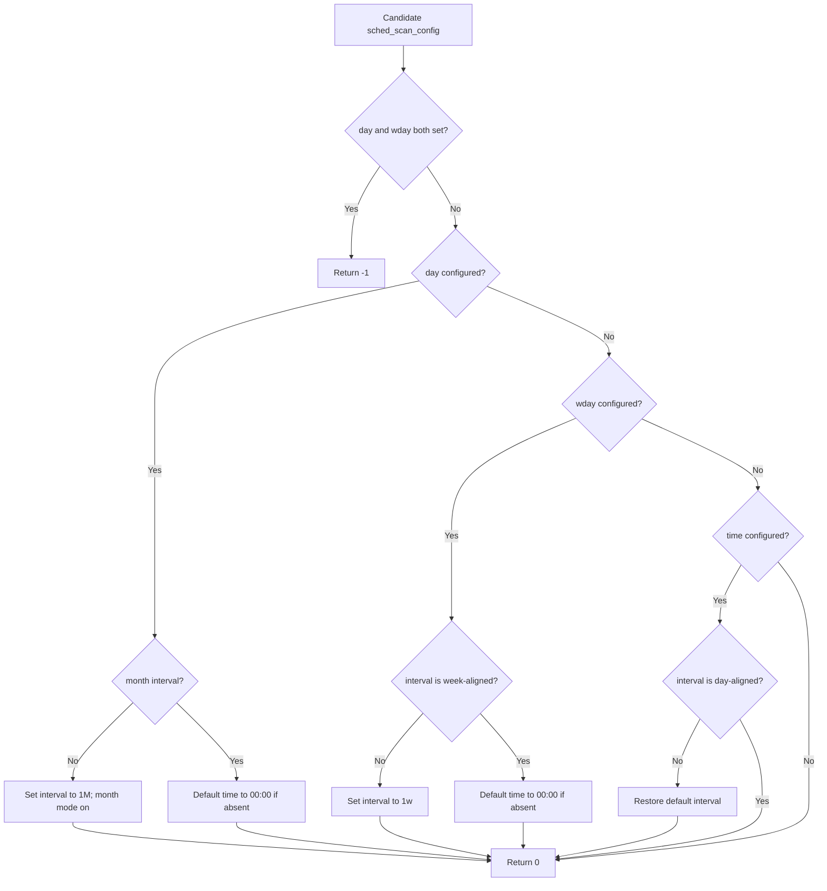
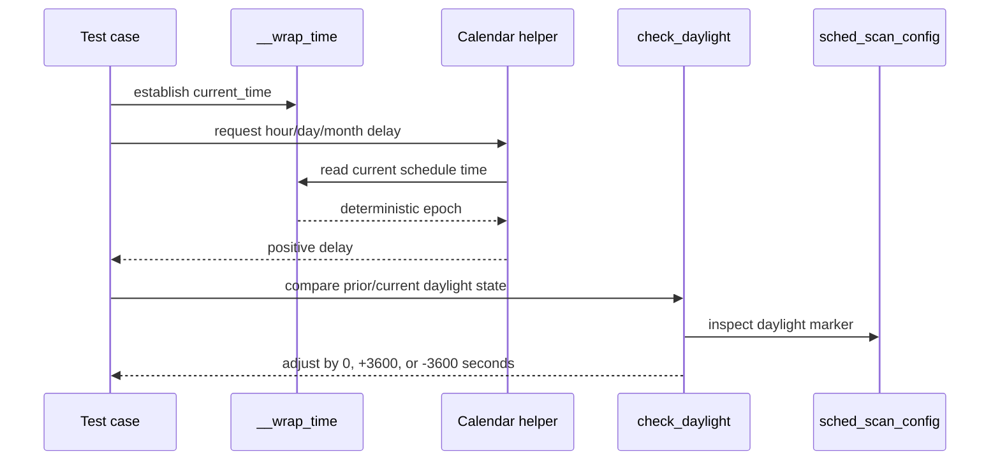
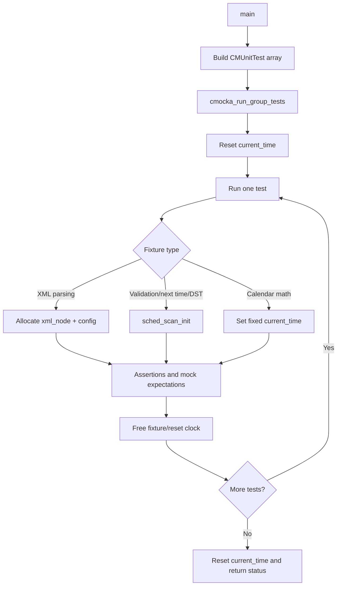

# `test_schedule_scan` module

`test_schedule_scan` is the CMocka unit-test suite for Wazuh's shared scan-scheduling implementation. It verifies schedule-tag recognition, XML-style schedule parsing, default initialization, cross-field validation, next-run calculation, JSON serialization, daylight-saving adjustments, and calendar arithmetic.

The test target is not a scheduler daemon. It does not launch scans or wait for real schedules; instead, it calls the scheduling helpers directly with deterministic configuration objects and a controllable clock. The production scheduling implementation is documented in [shared_lib_system_utils_config_scheduling.md](shared_lib_system_utils_config_scheduling.md).

## Position in the system

The scheduling code is shared infrastructure used by Wazuh modules that execute periodically or at a calendar-based time. A module reads schedule nodes, validates the resulting `sched_scan_config`, calculates a delay or absolute next-run time, and may expose the normalized configuration as JSON.



## Responsibilities and public behavior

| Area | Functions exercised | Contract covered |
|---|---|---|
| Tag recognition | `is_sched_tag` | Accepts `interval`, `day`, `wday`, and `time`; rejects unknown tags. |
| Configuration lifecycle | `sched_scan_init`, `sched_scan_free` | Establishes defaults and releases optional `scan_time` storage. |
| Configuration parsing | `sched_scan_read` | Parses day-of-month, weekday, time, and interval values from XML nodes; rejects malformed values. |
| Cross-field validation | `_sched_scan_validate_parameters` | Prevents incompatible `day`/`wday` combinations and normalizes required interval/time units. |
| Next execution | `_get_next_time` | Selects month-day, weekday, time-of-day, or plain interval scheduling. |
| Serialization | `sched_scan_dump` | Emits normalized interval/day/weekday/time fields as cJSON. |
| DST handling | `check_daylight` | Adds or subtracts one hour when the daylight state changes. |
| Calendar arithmetic | `get_time_to_hour`, `get_time_to_day`, `get_time_to_month_day` | Computes positive delays across hours, days, weeks, month boundaries, and multi-month intervals. |

## Component relationships

The test file includes `shared.h` and `wmodules.h`, which provide the shared types and module-facing declarations. The concrete production functions and `sched_scan_config` are supplied by `shared/schedule_scan.c` and `headers/schedule_scan.h` in the product build.



The suite deliberately tests the implementation through its normal C interface. Internal symbols `_get_next_time` and `_sched_scan_validate_parameters` are declared with `extern` so that their behavior can be verified without changing production visibility.

## Configuration model and parsing flow

`sched_scan_config` is initialized with no weekday, no explicit month day, no explicit time, the default module interval (`WM_DEF_INTERVAL`), no month-interval mode, and no previously calculated next-run timestamp. Parsing then updates only the field represented by the current XML node.



Covered valid interval conversions include `2M`, `5w`, `2d`, `1h`, `25m`, and `100s`. The month unit is intentionally retained as a month count because calendar months are not a fixed number of seconds. Week, day, hour, minute, and second values are converted to seconds.

Invalid input tests cover a non-numeric day (`abc`), an out-of-range day (`123`), an unknown weekday, an invalid time (`aa:40`), and an invalid interval (`three seconds`). The suite also verifies that production logging receives the relevant warning/error messages through the debug and regex wrappers.

## Validation and normalization

Validation establishes a coherent schedule before the module asks for its next execution time:



The validation tests establish three normalization rules: a `day` schedule requires a month interval, a `wday` schedule requires a week interval, and a time-of-day schedule requires a day-aligned interval. Setting both `day` and `wday` is rejected as incompatible.

## Next-run selection and data flow

`_get_next_time` chooses one scheduling mode based on the populated configuration. The resulting value is a delay for interval mode or the calculated future timestamp/delay represented by the corresponding calendar helper in the tested interface.

```mermaid
flowchart LR
    Config[sched_scan_config] --> Mode{Scheduling mode}
    Mode -->|month_interval + scan_day| Month[get_time_to_month_day]
    Mode -->|scan_wday| Week[get_time_to_day]
    Mode -->|scan_time| Hour[get_time_to_hour]
    Mode -->|otherwise| Interval[interval seconds]
    Clock[Mocked current_time / time()] --> Month
    Clock --> Week
    Clock --> Hour
    Month --> Result[next scheduled run]
    Week --> Result
    Hour --> Result
    Interval --> Result
    Result --> State[next_scheduled_scan_time]
```

The suite verifies all four branches: a two-month day schedule, a weekday schedule, a daily time-of-day schedule, and a one-hour interval schedule. The interval test also sets `next_scheduled_scan_time` to the current time to verify repeat calculations remain stable after a prior scan.

## Calendar and daylight behavior

The calendar helpers are tested against a fixed `current_time` (`1591189200`) and nearby timestamps. This prevents wall-clock drift from changing expected results while still exercising local-time conversion.



Coverage includes same and different weekdays, dates before and after the current weekday, first-time versus subsequent calculations, same-month and next-month dates, and 8- or 13-month intervals. `check_daylight` is verified for unknown initial state, unchanged state, and both transition directions.

## JSON output

`test_sched_scan_dump_day` verifies a day schedule is rendered as:

```json
{"interval":86400,"day":3,"time":"08:00"}
```

`test_sched_scan_dump_wday` iterates through all seven weekday values and checks their lowercase names (`sunday` through `saturday`). Serialization is therefore a normalized representation of the configuration, not a copy of the original XML text.

## Test lifecycle and execution

`main` registers 44 tests and runs them with `cmocka_run_group_tests`, using `setup_group` and `teardown_group` to reset the shared `current_time` variable.



Parsing fixtures allocate one `xml_node*` slot and one `sched_scan_config`. The teardown frees node element/content strings, node storage, the node array, and optional `scan_time`. Validation fixtures call `sched_scan_init` and later `sched_scan_free`. Calendar tests use setup/teardown to set and clear the fixed clock.

## Dependencies and boundaries

- **CMocka:** assertions, test registration, setup/teardown, and group execution.
- **Wazuh shared headers:** `shared.h`, `wmodules.h`, and the scheduling declarations/types.
- **Production scheduling code:** `shared/schedule_scan.c` and `headers/schedule_scan.h`.
- **Mocked interfaces:** `__wrap_time`, `OS_StrIsNum`, and debug logging wrappers make clock, numeric validation, and diagnostics observable.
- **cJSON and libc time APIs:** used by production serialization and calendar calculations.

The suite does not test module-specific scheduling loops, XML document traversal beyond a single prepared node, persistent configuration, thread behavior, or actual scan execution. Those concerns belong to the consuming module documentation; shared scheduling semantics are linked above rather than duplicated here.
