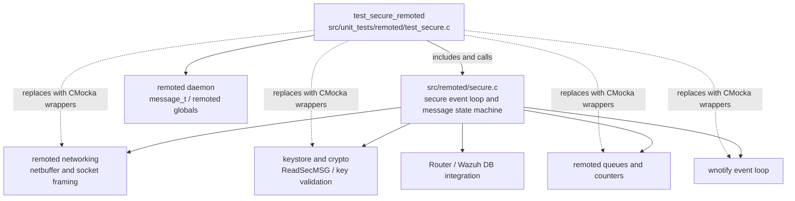
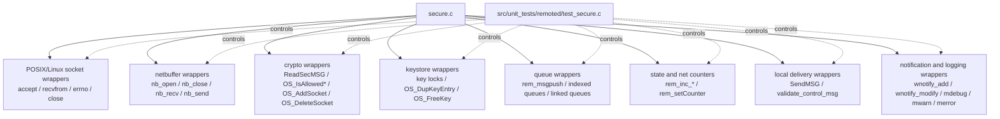
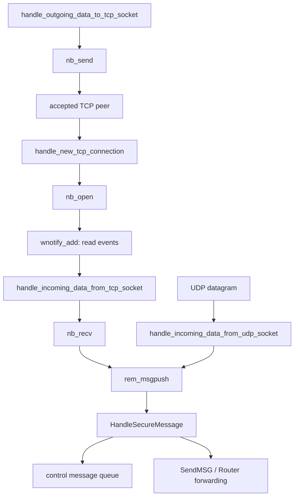
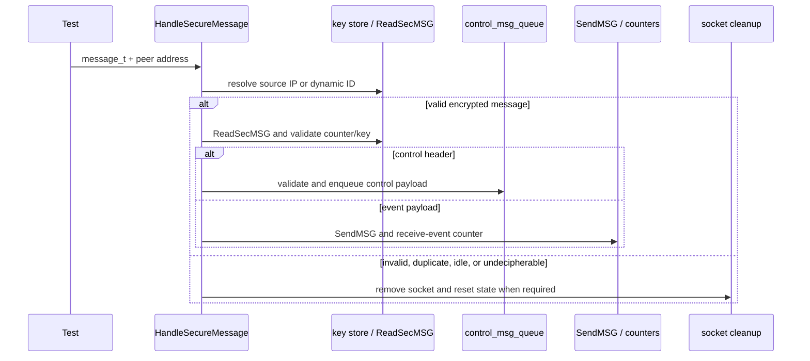
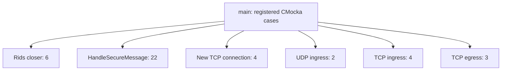

# `test_secure_remoted`

## Introduction

`test_secure_remoted` is the CMocka unit-test module for the secure transport path of Wazuh `remoted`. It includes `src/remoted/secure.c` directly and verifies connection acceptance, TCP/UDP receive handling, outgoing TCP handling, secure-message authentication/decryption dispatch, duplicate or idle socket management, control-message queuing, and the background rids-file closer.

The suite is deliberately isolated from real sockets, agent keys, notification loops, Wazuh DB, Router, and filesystem state. Those production responsibilities are described in [remoted_secure_connection.md](remoted_secure_connection.md); this document explains how `test_secure_remoted` specifies and observes them.

## Module position

The test is a child of the remoted unit-test collection and targets the `remoted_secure_connection` production component.



Related documentation:

| Reference | Scope |
|---|---|
| [remoted_secure_connection.md](remoted_secure_connection.md) | Production secure-message state machine, threads, control queue, and Router forwarding. |
| [remoted_networking.md](remoted_networking.md) | TCP buffering, framing, and low-level send/receive contracts consumed here. |
| [remoted_lifecycle.md](remoted_lifecycle.md) | Process startup and the hand-off to `HandleSecure`. |
| [test_netbuffer_remoted.md](test_netbuffer_remoted.md) | Focused tests for the buffered TCP layer used by the secure handlers. |
| [test_manager_remoted_test_infrastructure.md](test_manager_remoted_test_infrastructure.md) | Shared CMocka conventions and remoted test setup patterns. |
| [remoted_state_metrics.md](remoted_state_metrics.md) | Counters observed through `rem_*` wrapper calls. |

## Test harness architecture

The source includes `secure.c` rather than linking only against a compiled object. This exposes the functions under test while allowing the test translation unit to replace external calls through linker wrappers and local wrapper definitions.

```mermaid
flowchart LR
    MAIN[main()] --> REGISTER[CMUnitTest table]
    REGISTER --> CASE[one test case]
    CASE --> SETUP[optional setup fixture]
    SETUP --> GLOBALS[synthetic globals:\nkeys / logr / notify / agent hash]
    CASE --> SECURE[secure.c function]
    SECURE --> WRAPS[CMocka wrappers\nI/O, crypto, locks, queues, counters, logs]
    WRAPS --> ASSERT[expectations and state assertions]
    ASSERT --> TEARDOWN[optional teardown fixture]
```

### Fixtures and shared state

| Fixture or helper | Purpose |
|---|---|
| `setup_config` / `teardown_config` | Enables test mode and creates `keys.opened_fp_queue`, used by `close_fp_main`. |
| `setup_new_tcp` / `teardown_new_tcp` | Enables test mode and allocates the global `notify` object with a synthetic descriptor. |
| `setup_remoted_configuration` / `teardown_remoted_configuration` | Creates a synthetic agent (`001`, `focal`, `192.168.33.20`) and initializes remoted/router globals for configuration-dependent paths. |
| `test_agent_info` | Minimal test-owned agent record used only by the configuration fixture. |
| `__wrap_time` | Makes idle and rids-closing decisions deterministic. |
| `__wrap_key_lock_read`, `__wrap_key_lock_write`, `__wrap_key_unlock` | Observe keystore lock ordering. |
| `__wrap_w_mutex_lock`, `__wrap_w_mutex_unlock` | Replace mutex operations while checking the mutex pointer. |
| `__wrap_close` | Controls final descriptor close results. |
| `main` | Registers the CMocka cases and calls `cmocka_run_group_tests`. |

Most tests construct `message_t`, `sockaddr_in`, `keyentry`, and `w_indexed_queue_t` values locally. The real production key store and notification subsystem are therefore represented by small, explicit test states rather than a running daemon.

## Dependency and mock boundaries



The included wrapper headers cover the observable boundaries:

- Linux sockets and POSIX close/stat/unistd behavior.
- `secure.c`'s keystore and message-crypto operations.
- TCP netbuffer operations and UDP message injection.
- Remoted message queues, linked queues, indexed control queues, counters, and state metrics.
- `SendMSG`, control-message validation, Router providers, and Wazuh DB metadata calls where required by the included production translation unit.
- Logging, hashes, mutexes, and notification registration.

The wrapper expectations are not incidental plumbing: they define lock ordering, cleanup ownership, socket lifecycle, and the distinction between an event that is forwarded immediately and a control message that is queued.

## Data-flow coverage

### Network ingress and egress



The network-handler cases verify the following outcomes:

| Function | Tested behavior |
|---|---|
| `handle_new_tcp_connection` | Successful `accept`, `nb_open`, TCP counter increment, read-event registration, and cleanup when `wnotify_add` fails. Both generic and `ECONNABORTED` accept failures are logged. |
| `handle_incoming_data_from_udp_socket` | A zero-byte read is ignored; a successful datagram is pushed with `USING_UDP_NO_CLIENT_SOCKET` and contributes to receive-byte metrics. |
| `handle_incoming_data_from_tcp_socket` | Successful reads update counters; EOF, timeout, and oversized frames close the peer and reset its bookkeeping. |
| `handle_outgoing_data_to_tcp_socket` | Successful sends update counters; `EAGAIN` is retained as a temporary condition; `EPIPE` closes the peer and resets its counter. |

Socket cleanup consistently exercises the production close path: delete the key-store socket association, close the netbuffer, decrement the TCP count, reset the per-fd counter, and log the disconnection.

### Secure-message processing



`HandleSecureMessage` cases cover:

1. **Address-family rejection** — unsupported families (`AF_UNSPEC`, `AF_NETLINK`, `AF_UNIX`, `AF_X25`, and an unknown numeric family) produce the appropriate error and increment the unknown-message metric.
2. **Invalid or empty messages** — dynamic-ID/IP lookup, warning generation, socket deletion, and unknown-message accounting are verified.
3. **Control messages** — startup and shutdown payloads are decrypted, validated, duplicated into `w_ctrl_msg_data_t`, and inserted into the indexed control queue. The tests assert the retained agent ID, key ID, socket, and payload.
4. **Health-check/request messages** — a valid `#!-req` payload is processed directly and is not queued; malformed request validation produces a warning and no queued message.
5. **Message freshness** — a new message updates the socket/key association, while an old counter is ignored without dispatch.
6. **Connection overtaking** — a message arriving on a different socket detects that the agent key is already in use. If the configured timeout has elapsed, the old socket is closed; if overtaking is disabled or not yet eligible, the new message is rejected.
7. **Idle socket decryption** — valid traffic can replace an idle socket; empty or undecipherable traffic closes both the incoming and stale sockets as appropriate.
8. **Ordinary events** — valid non-control payloads are sent to the local analysis queue and counted as received events; payloads that are not control messages are logged as unrecognized.

## Rids-file closer

`close_fp_main` periodically scans `keys.opened_fp_queue` for key entries whose `updating_time` is older than `logr.rids_closing_time`. It closes and removes expired file handles while retaining recent entries and entries without a file pointer.

```mermaid
flowchart TD
    START[close_fp_main(keys)] --> SLEEP[sleep(rids_closing_time)]
    SLEEP --> LOCK[key_lock_write]
    LOCK --> HEAD{queue has first entry?}
    HEAD -->|no| LOG0[log queue size 0]
    HEAD -->|yes| AGE[compare time() - updating_time]
    AGE -->|not expired| KEEP[retain entry and continue]
    AGE -->|expired with fp| POP[remove entry and fclose(fp)]
    AGE -->|expired without fp| POP2[remove entry without fclose]
    KEEP --> NEXT[next queue entry]
    POP --> NEXT
    POP2 --> NEXT
    LOG0 --> UNLOCK[key_unlock]
    NEXT --> HEAD
    UNLOCK --> END[return in test invocation]
```

The six fixture-backed tests cover an empty queue, a recent entry, one expired entry, two expired entries, an expired entry followed by a recent entry, and an expired entry with `fp == NULL`. Expectations also verify the single write-lock region and the configured sleep interval.

## Test inventory



| Area | Representative cases | Main contract |
|---|---|---|
| Rids closer | `test_close_fp_main_queue_empty`, `test_close_fp_main_close_first_queue_2_close_2` | Expiration scan, file closure, queue removal, lock and timing behavior. |
| Secure dispatch | `test_HandleSecureMessage_shutdown_message`, `test_HandleSecureMessage_HC_req_message`, `test_HandleSecureMessage_invalid_HC_req_message` | Decryption, validation, direct handling versus control queue insertion. |
| Socket arbitration | `test_HandleSecureMessage_close_idle_sock`, `test_HandleSecureMessage_different_sock`, `test_HandleSecureMessage_close_same_sock` | Idle replacement, duplicate-key rejection, and same-socket event forwarding. |
| Failure handling | `test_HandleSecureMessage_invalid_message`, `test_HandleSecureMessage_close_idle_sock_decrypt_fail` | Error logging, cleanup, counters, and unknown-message accounting. |
| TCP lifecycle | `test_handle_new_tcp_connection_success`, `test_handle_new_tcp_connection_wnotify_fail` | Accept, netbuffer initialization, event registration, and rollback. |
| TCP ingress | `test_handle_incoming_data_from_tcp_socket_success`, `test_handle_incoming_data_from_tcp_socket_too_big_message` | Read-byte accounting and close-on-EOF/error/oversize. |
| UDP ingress | `test_handle_incoming_data_from_udp_socket_success` | Datagram enqueue and receive accounting. |
| TCP egress | `test_handle_outgoing_data_to_tcp_socket_success`, `..._EAGAIN`, `..._EPIPE` | Send accounting, retryable errors, and close-on-broken-pipe. |

The source also contains helper-driven variants for invalid address families and request/control-message outcomes. The exact registered list in `main` is the authoritative inventory for the current build; when adding a new test, register it there and update this table.

## Execution and maintenance notes

This is a unit suite and does not require a running manager, agent, authd service, Router, Wazuh DB, epoll instance, or real network peer. CMocka controls return values and validates call order at the integration boundaries.

When changing `src/remoted/secure.c`, preserve or deliberately revise these invariants:

- Key-store read/write locks are acquired and released on every path.
- Invalid, stale, duplicate, and idle connections update socket state and counters consistently.
- A successful control message owns a duplicated key and queued payload; the test frees both through the same ownership path as production.
- Event messages are forwarded, while control messages are validated and queued.
- TCP framing errors, EOF, `EAGAIN`, and `EPIPE` remain distinguishable.
- Failure during notification registration rolls back the newly accepted socket.
- The rids closer removes only entries that are expired and safely handles `fp == NULL`.

The strongest regression signal is usually the wrapper expectation sequence, not only the final assertion. Changes to lock placement, cleanup order, metric calls, or message ownership should update the corresponding expectations and related documentation together.
