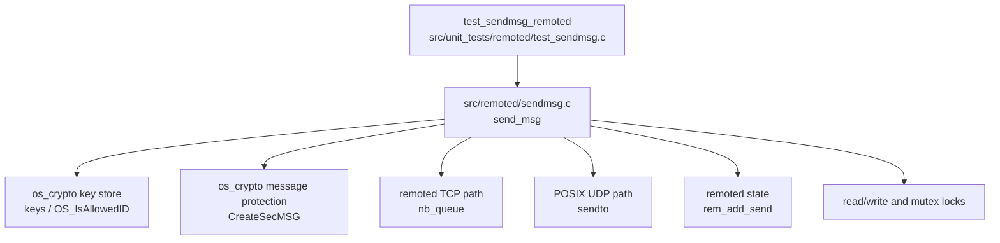
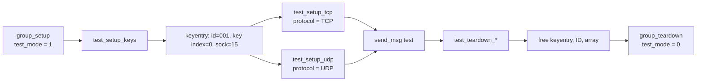
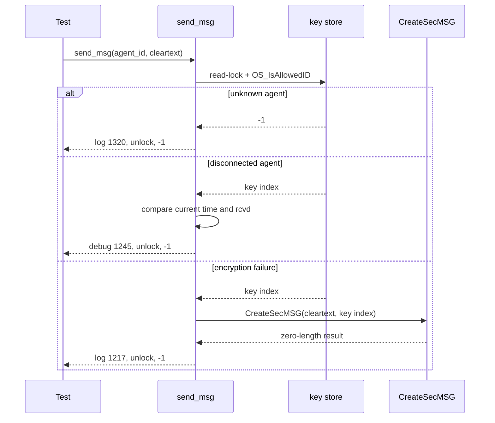
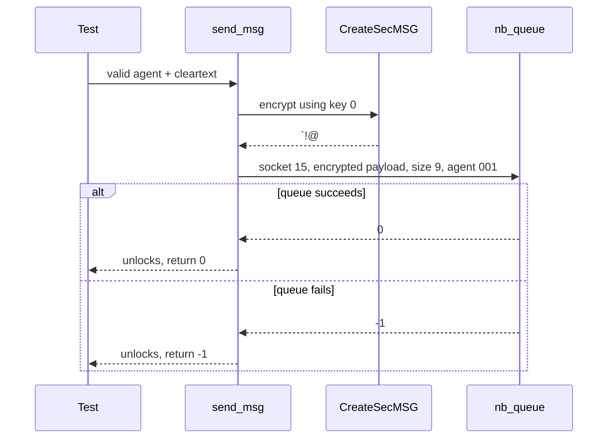
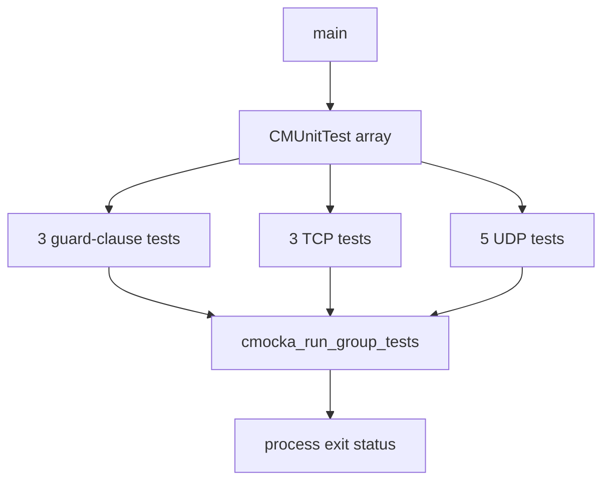

# `test_sendmsg_remoted`

## Introduction

`test_sendmsg_remoted` is the CMocka unit-test module for the outbound message path in Wazuh `remoted`. It exercises `send_msg` from `src/remoted/sendmsg.c` using synthetic agent key entries and wrapped cryptographic, socket, synchronization, logging, and time dependencies.

The suite verifies that a message is rejected when the agent is invalid or disconnected, encrypted before transmission, queued correctly for TCP, sent correctly for UDP, and reported consistently when transport or encryption fails. It does not require a running manager, a real agent, or a live network connection.

## Module position

The test is part of **Unit Tests – Remoted** and targets the `remoted_networking` and `remoted_secure_connection` concerns of the native `remoted` daemon. The production daemon lifecycle is described in [remoted_lifecycle.md](remoted_lifecycle.md); this document focuses on the outbound send operation.



### Related documentation

| Reference | Relevance |
|---|---|
| [remoted.md](remoted.md) | Parent daemon responsibilities and sibling modules. |
| [remoted_lifecycle.md](remoted_lifecycle.md) | Listener process model and shared remoted state. |
| [remoted_networking.md](remoted_networking.md) | TCP buffering and network primitives used after `send_msg`. |
| [remoted_secure_connection.md](remoted_secure_connection.md) | Secure agent protocol and callers that can initiate outbound messages. |
| [os_crypto.md](os_crypto.md) | Key storage and encrypted-message helpers. |
| [test_netbuffer_remoted.md](test_netbuffer_remoted.md) | Detailed tests for the TCP queue consumed by `send_msg`. |

## Responsibilities under test

At a high level, `send_msg(agent_id, msg, msg_length)` performs the following sequence:

1. Acquire the key-store read lock.
2. Resolve and validate the agent ID with `OS_IsAllowedID`.
3. Reject agents that have exceeded the configured disconnection interval.
4. Encrypt the clear-text message with `CreateSecMSG` and the resolved key index.
5. Serialize access to the agent socket with the pthread mutex.
6. Dispatch encrypted bytes through the configured TCP or UDP transport.
7. Update send counters where applicable, release locks, and return `0` or `-1`.

```mermaid
flowchart TD
    A[send_msg(agent_id, msg, length)] --> B[read-lock key store]
    B --> C{OS_IsAllowedID}
    C -->|invalid| CERR[log agent not found\nunlock\nreturn -1]
    C -->|key index| D{agent disconnected?}
    D -->|yes| DERR[debug log\nunlock\nreturn -1]
    D -->|no| E[CreateSecMSG]
    E -->|size <= 0| EERR[log encryption error\nunlock\nreturn -1]
    E -->|encrypted payload| F[lock agent socket mutex]
    F --> G{network protocol}
    G -->|TCP| H{socket >= 0?}
    H -->|no| HERR[debug log\nunlock\nreturn -1]
    H -->|yes| I[nb_queue]
    G -->|UDP| J[sendto]
    I --> K{queue result}
    K -->|0| OK[unlock mutex and key store\nreturn 0]
    K -->|negative| TERR[unlock\nreturn -1]
    J --> L{bytes == encrypted size?}
    L -->|yes| M[rem_add_send]
    M --> OK
    L -->|no| UERR[map errno and log\nreturn -1]
```

The exact queue framing and TCP buffering contract is intentionally delegated to [test_netbuffer_remoted.md](test_netbuffer_remoted.md). This module verifies that `send_msg` selects that path and passes the encrypted payload and agent identity correctly.

## Test harness and fixtures

`group_setup` enables global `test_mode`; `group_teardown` disables it. Each test creates a minimal `keys.keyentries` array containing one agent:

| Fixture value | Meaning |
|---|---|
| Agent ID `001` | Valid synthetic agent identifier. |
| Key index `0` | Returned by `OS_IsAllowedID`. |
| `rcvd = 10` | Last-received timestamp used by disconnect logic. |
| Socket `15` | Synthetic connected descriptor for TCP/UDP expectations. |
| TCP/UDP protocol | Set by `test_setup_tcp` or `test_setup_udp`. |
| `agents_disconnection_time` | Set per test to enable or disable stale-agent rejection. |

The key entry and its ID are released by the corresponding teardown function. TCP and UDP tests share the key fixture but select different transport implementations.



## Mocked boundaries

The test isolates `send_msg` by replacing its external effects with CMocka wrappers.

| Boundary | Wrapper role |
|---|---|
| Key validation | `__wrap_OS_IsAllowedID` returns a key index or failure. |
| Encryption | `__wrap_CreateSecMSG` returns encrypted bytes and their size. |
| Time | `__wrap_time` controls stale-agent evaluation. |
| Synchronization | pthread read/write and mutex wrappers verify lock ordering. |
| TCP | `__wrap_nb_queue` validates socket, payload, size, and agent ID. |
| UDP | `__wrap_sendto` controls complete, short, and failed sends. |
| Metrics | `__wrap_rem_add_send` verifies successful UDP byte accounting. |
| Diagnostics | debug, warning, and error wrappers verify operational messages. |

The tests therefore specify both functional results and important side-effect contracts: validation happens under the key-store lock, encryption precedes transport, the socket mutex surrounds transmission, and locks are released on every tested exit path.

## Guard-clause behavior

The first three tests cover failures before transport selection.



### `test_send_msg_invalid_agent`

Passes agent ID `555`. `OS_IsAllowedID` returns `-1`, so no encryption or socket operation is attempted. The test expects error `(1320): Agent '555' not found.` and a return value of `-1`.

### `test_send_msg_disconnected_agent`

Uses agent `001`, `rcvd = 10`, current time `1000`, and a disconnection interval of `300`. The stale-agent check rejects the send, logs `(1245): Sending message to disconnected agent '001'.`, and returns `-1`.

### `test_send_msg_encryption_error`

Makes the agent valid and connected but returns a zero-size encrypted message from `CreateSecMSG`. Transport is skipped, `(1217): Error creating encrypted message.` is expected, and the function returns `-1`.

## TCP behavior

TCP messages are passed to `nb_queue`, which owns the buffered/framed write operation. A successful call returns `0`; a queue failure returns `-1`. A closed socket is rejected before `nb_queue` is called.



| Test | Setup | Expected behavior |
|---|---|---|
| `test_send_msg_tcp_ok` | Open socket `15`; `nb_queue` returns `0` | Encrypted payload is queued and `send_msg` returns `0`. |
| `test_send_msg_tcp_err` | `nb_queue` returns `-1` | Queue failure propagates as `-1`. |
| `test_send_msg_tcp_err_closed_socket` | Socket is changed to `-1` | No queue call occurs; debug message `Send operation cancelled due to closed socket.` and `-1`. |

## UDP behavior

UDP sends call `sendto` directly with the encrypted payload. A complete send increments remoted send metrics. A short or failed send returns `-1` and maps selected `errno` values to operator-facing diagnostics.

```mermaid
flowchart TD
    A[encrypted UDP payload] --> B[sendto(socket 15)]
    B --> C{returned bytes == payload size?}
    C -->|yes| D[rem_add_send(bytes)]
    D --> E[return 0]
    C -->|no| F{errno}
    F -->|ECONNRESET| G[debug: agent may have disconnected]
    F -->|EAGAIN| H[warning: agent is not responding]
    F -->|other| I[error: strerror(errno)]
    F -->|errno 0 / short send| J[warning: not delivered completely]
    G --> K[unlock and return -1]
    H --> K
    I --> K
    J --> K
```

| Test | Simulated result | Expected diagnostic/result |
|---|---|---|
| `test_send_msg_udp_ok` | `sendto` returns full encrypted size | `rem_add_send` receives the byte count; return `0`. |
| `test_send_msg_udp_error` | Returns `0`, `errno = 0` | Warning that the message was not delivered completely; `-1`. |
| `test_send_msg_udp_error_connection_reset` | Returns `0`, `errno = ECONNRESET` | Debug that the agent may have disconnected; `-1`. |
| `test_send_msg_udp_error_agent_not_responding` | Returns `0`, `errno = EAGAIN` | Warning that the agent is not responding; `-1`. |
| `test_send_msg_udp_error_generic` | Returns `0`, `errno = EACCES` | Error containing `Permission denied`; `-1`. |

The test source also defines the UDP error branches explicitly even though the abbreviated module-tree component list names only `test_send_msg_udp_ok`.

## Test registration and execution flow

`main` registers 11 setup/teardown tests and executes them as one CMocka group. The tests are organized into guard clauses, TCP, and UDP categories.



## Test inventory

| Test | Transport | Main contract | Result |
|---|---|---|---|
| `test_send_msg_invalid_agent` | None | Reject unknown ID | `-1` |
| `test_send_msg_disconnected_agent` | None | Reject stale agent | `-1` |
| `test_send_msg_encryption_error` | None | Reject failed encryption | `-1` |
| `test_send_msg_tcp_ok` | TCP | Queue encrypted payload | `0` |
| `test_send_msg_tcp_err` | TCP | Propagate queue failure | `-1` |
| `test_send_msg_tcp_err_closed_socket` | TCP | Avoid closed descriptor | `-1` |
| `test_send_msg_udp_ok` | UDP | Send and count bytes | `0` |
| `test_send_msg_udp_error` | UDP | Detect short send | `-1` |
| `test_send_msg_udp_error_connection_reset` | UDP | Diagnose disconnect | `-1` |
| `test_send_msg_udp_error_agent_not_responding` | UDP | Diagnose `EAGAIN` | `-1` |
| `test_send_msg_udp_error_generic` | UDP | Diagnose generic socket error | `-1` |

## Maintenance guidance

This is a focused unit suite. Its CMocka expectations are part of the behavioral contract, especially lock ordering, encryption-before-send, transport selection, error classification, and metric updates.

When changing `src/remoted/sendmsg.c`, update this module if any of the following changes:

- The key lookup or stale-agent policy changes.
- Encryption is performed differently or accepts a different key identifier.
- TCP framing/queue calls change; coordinate with [test_netbuffer_remoted.md](test_netbuffer_remoted.md).
- UDP short-write or `errno` handling changes.
- Lock acquisition/release ordering changes.
- Remoted send counters or diagnostic messages change.

The suite intentionally uses a fixed socket (`15`) and deterministic encrypted payload (`!@#123abc`) so failures identify contract changes rather than environmental network behavior.
