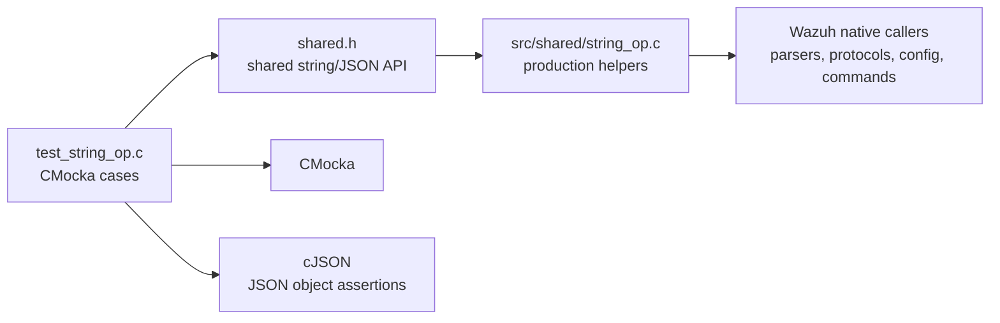
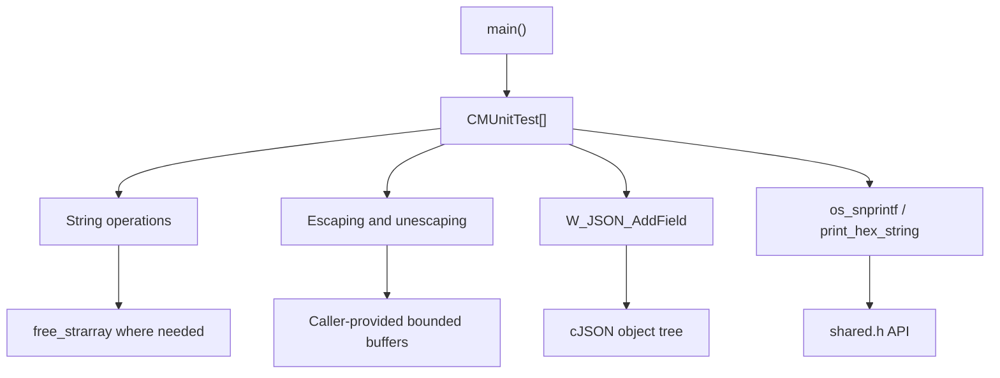
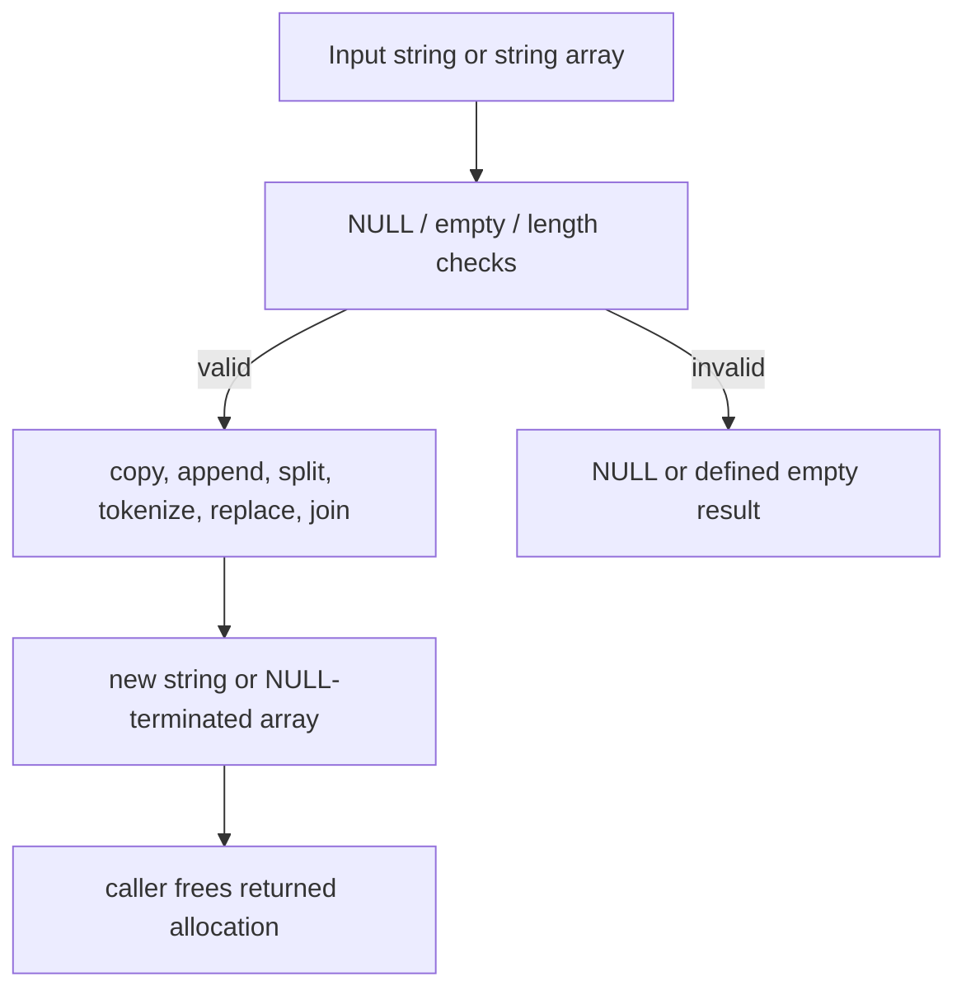
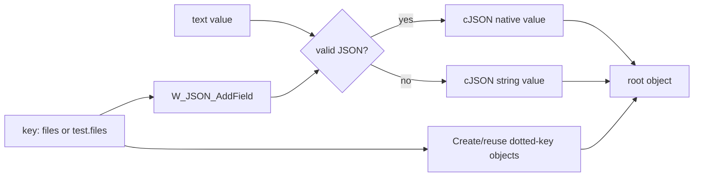
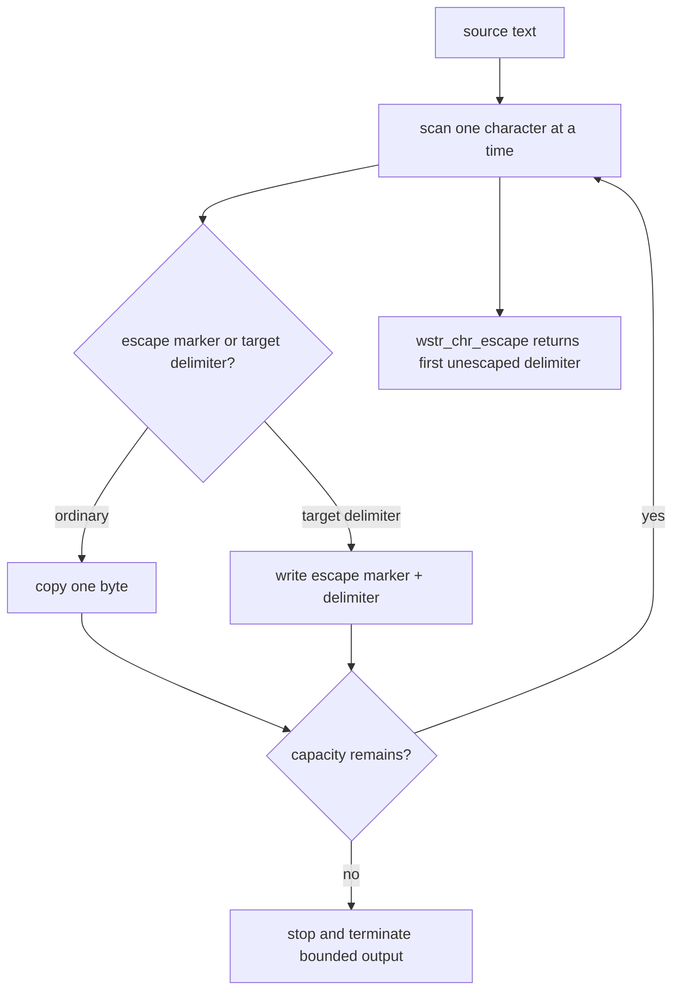
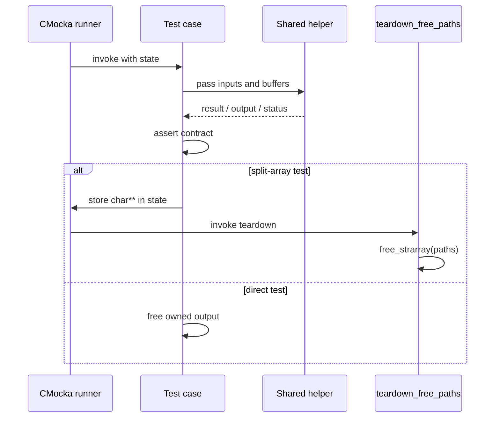
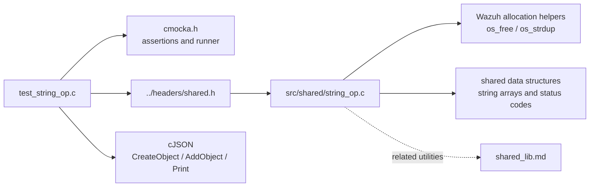

# `test_string_op`

`test_string_op` is the CMocka unit-test module for Wazuh’s shared string, escaping, formatting, and lightweight JSON helpers. It validates normal behavior, boundary handling, invalid-pointer behavior, truncation, idempotent escaping, and heap ownership for functions exposed through `shared.h`.

The test source is [`src/unit_tests/shared/test_string_op.c`](src/unit_tests/shared/test_string_op.c). Its principal production boundary is `src/shared/string_op.c`, classified in the module tree as `shared_lib_string_validation`. Broader shared-library ownership and conventions are documented in [shared_lib.md](shared_lib.md).

## Purpose and system position

The module protects low-level text transformations used throughout native Wazuh components. These helpers sit below parsers, configuration readers, command construction, JSON serialization, and agent/manager protocols. A defect here can alter payload structure, introduce shell metacharacters, lose delimiters, or leak memory across many higher-level modules.

This is a verification module, not a runtime service: `main` registers independent CMocka cases and returns the result of `cmocka_run_group_tests`.

## Architecture

### Components

| Component | Responsibility |
|---|---|
| `CMUnitTest` | CMocka’s test descriptor type used to build the registration table. |
| `main` | Registers all cases, attaches teardown to split-array cases, runs the group, and returns its status. |
| `teardown_free_paths` | Releases `char **` arrays returned by `w_string_split` using `free_strarray`. |
| String transformation cases | Cover lowercasing, bounded duplication, concatenation, substring removal, tokenization, splitting, replacement, and list joining. |
| Escaping cases | Cover JSON escaping/unescaping, shell escaping, escaped-delimiter scanning, and generic delimiter escape/unescape. |
| JSON cases | Verify `W_JSON_AddField` creates nested objects, parses valid JSON values, and preserves invalid/non-JSON values as strings. |
| Formatting/encoding cases | Verify bounded `os_snprintf` and ASCII-to-hex conversion. |
| Shared production layer | Provides the functions declared through `shared.h`; implementation details are outside this test file. |

## Functional coverage

### Basic string operations

The suite verifies:

- `w_tolower_str`: `NULL` returns `NULL`, an empty string remains empty, and uppercase input is converted to lowercase.
- `w_remove_substr`: a missing substring pointer is rejected; removal works at the beginning, middle, and end of a string.
- `w_strndup`: `NULL` input is rejected; lengths shorter than, equal to, or greater than the source are handled; zero length returns an empty allocation.
- `w_strcat`: concatenation works when the destination is `NULL` and when it already contains text.
- `w_strarray_append`: dynamically builds a NULL-terminated array while retaining the supplied string pointers.
- `w_strtok`: handles empty input, an unquoted token, quoted tokens, escaped quotes, escaped backslashes, and whitespace.
- `w_string_split`: handles `NULL` source/delimiter, ordinary delimiter splitting, and a maximum array size.
- `w_strcat_list`: returns `NULL` for `NULL` or empty lists and joins one or many elements with a caller-selected separator.
- `strarray_size`: returns zero for `NULL` and empty arrays and counts a NULL-terminated array correctly.

### Variable replacement

`wstr_replace` is tested with `$file`, `$home`, `$$`, and empty replacement values. The cases establish that it:

- replaces every matching occurrence;
- supports multiple sequential replacements;
- does not replace a non-matching variable;
- distinguishes contained names such as `$file_new` from `$file` when the longer token is replaced first;
- preserves surrounding dollar signs according to the helper’s literal replacement semantics.

The tests repeatedly free the previous subject after receiving the replacement result. This documents an important ownership pattern: replacement returns a separately managed string rather than requiring callers to mutate the original buffer in place.

### JSON field insertion

`W_JSON_AddField` is tested against a cJSON object for five input categories:

1. A simple valid JSON array becomes a JSON array value.
2. A dotted key such as `test.files` creates the required parent object when absent.
3. The same dotted key works when the parent object already exists.
4. Malformed JSON is retained as a JSON string rather than causing field insertion to fail.
5. A timestamp-like bracketed value is also retained as a string.

### JSON escaping

`wstr_escape_json` and `wstr_unescape_json` cover backspace, tab, newline, form feed, carriage return, quotes, and backslashes. The paired tests assert the exact round-trip representation, including a trailing backslash. They verify transformation of JSON text; they do not validate a complete JSON document.

### Shell escaping

`os_shell_escape` is exercised against shell-sensitive characters including quotes, whitespace, semicolon, command substitution, redirection, pipes, comments, glob characters, braces, ampersand, dollar, exclamation mark, colon, and parentheses.

The cases establish three safety properties:

- unescaped metacharacters receive a backslash;
- already escaped characters are not escaped again;
- applying the function twice produces the same result as applying it once.

Backslash-specific cases distinguish a literal backslash from an escape marker and check that tabs are escaped. These are behavioral safety tests; they do not replace an end-to-end shell execution test.

### Generic delimiter escaping

`wstr_escape`, `wstr_unescape`, and `wstr_chr_escape` provide delimiter-aware processing used for Wazuh’s escaped string formats. The suite checks:

- `NULL` source and destination rejection using `OS_INVALID`;
- no-op behavior when the delimiter is absent;
- escaping colons, at-signs, and other selected delimiters;
- escaped backslashes and trailing escape markers;
- locating only unescaped delimiters;
- exact output lengths returned by the bounded functions;
- truncation before writing past the destination capacity.

The overflow cases deliberately place delimiters at the buffer boundary, including repeated delimiters and an escape marker in the final position. The expected result is always a terminated prefix that fits in the destination.

### Formatting and hexadecimal encoding

`os_snprintf` is tested for short output, long output, and multiple format parameters. The long case expects the warning that output may be truncated while still returning the would-be formatted length (`snprintf`-style behavior).

`print_hex_string` is tested for complete conversion, partial source conversion, destination capacity exactly matching the required output, a destination that cannot hold the final byte, and `NULL` source/destination. Successful conversions return `OS_SUCCESS`; invalid pointers return `OS_INVALID`.

## Test lifecycle and process flow

Most cases use only local stack buffers or heap allocations they free directly. The four `w_string_split` cases attach `teardown_free_paths` through `cmocka_unit_test_teardown`; each test stores its returned array in CMocka state so teardown can release it uniformly.

`main` groups tests by behavior in the registration table: lowercasing, formatting, substring removal, JSON insertion, duplication, concatenation, tokenization, splitting, escaping, replacement, list joining, shell escaping, array sizing, generic escaping/unescaping, delimiter search, and hexadecimal conversion.

## Dependencies and relationships

The test does not directly exercise higher-level consumers. It should be read alongside [shared_lib.md](shared_lib.md) for shared-library scope and, where relevant, [test_json_op.md](test_json_op.md) for file-oriented JSON helpers. The JSON insertion cases use cJSON as an observable representation, while the escaping cases validate the shared helper contract independently of parsers or protocol handlers.

## Behavioral contracts captured by the suite

| Area | Expected behavior |
|---|---|
| Invalid pointers | Functions return `NULL`, `OS_INVALID`, or the documented safe result instead of dereferencing invalid input. |
| Bounded output | Escape and formatting functions respect destination capacity and produce a usable terminated prefix. |
| Idempotence | Shell escaping does not add duplicate escapes to already escaped input. |
| JSON fallback | Valid JSON text is inserted as native JSON; malformed or timestamp-like text remains a string. |
| NULL termination | Returned string arrays end with a `NULL` pointer; string outputs are suitable for C string assertions. |
| Ownership | Heap results are released with the matching Wazuh or libc cleanup helper used by the test. |
| Length reporting | Bounded transformations return the number of output bytes written or the expected `snprintf`-style required length. |

## Coverage boundaries

The module is intentionally unit-level. It does not establish:

- thread safety or reentrancy;
- behavior for arbitrary binary data containing embedded NUL bytes;
- allocator-failure recovery in every helper;
- locale-specific case conversion beyond the tested ASCII uppercase input;
- complete shell-command safety after a command is executed;
- complete JSON parsing or schema validation;
- performance characteristics for very large strings or arrays.

Changes to `src/shared/string_op.c`, `shared.h`, allocation conventions, or cJSON field construction should update this test module when they alter any contract above. Higher-level regressions should be covered by the owning module’s tests rather than added here.
