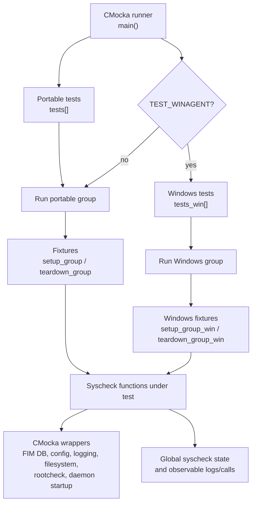
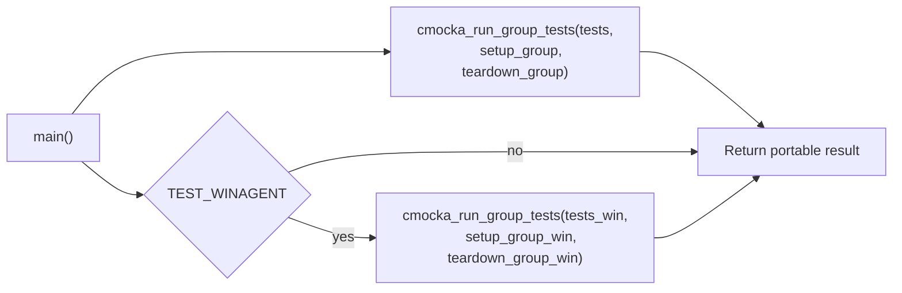
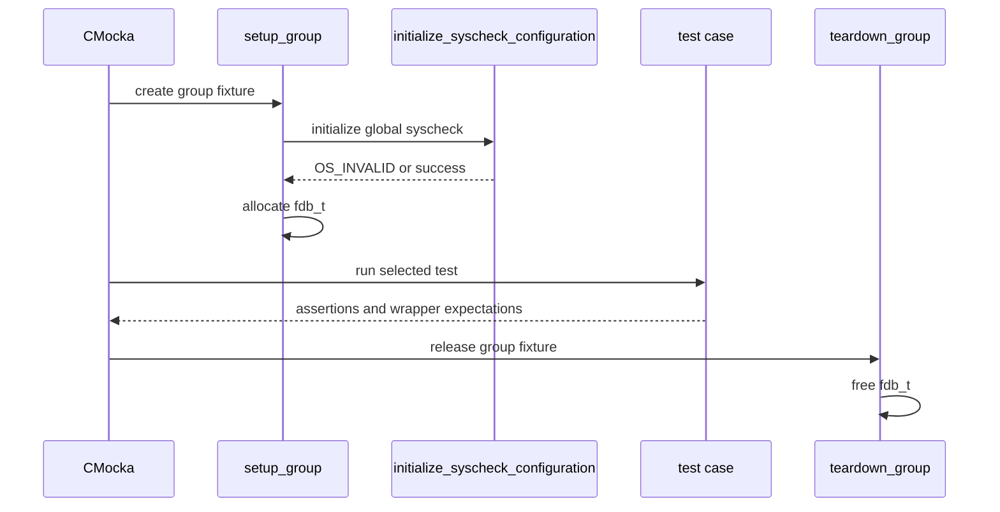
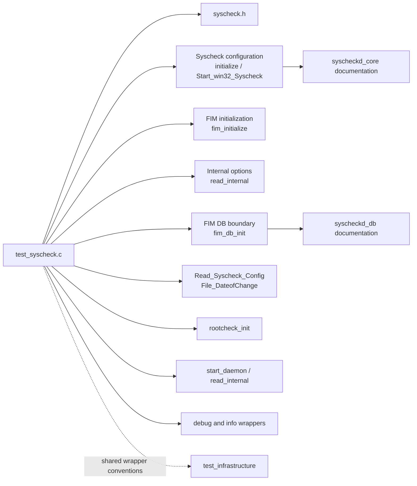
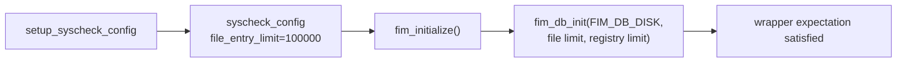
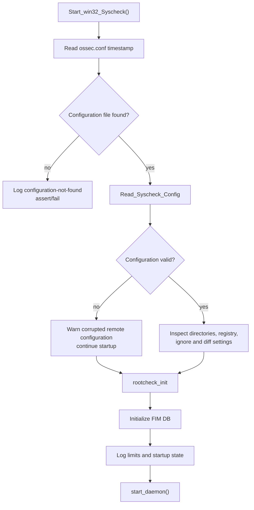
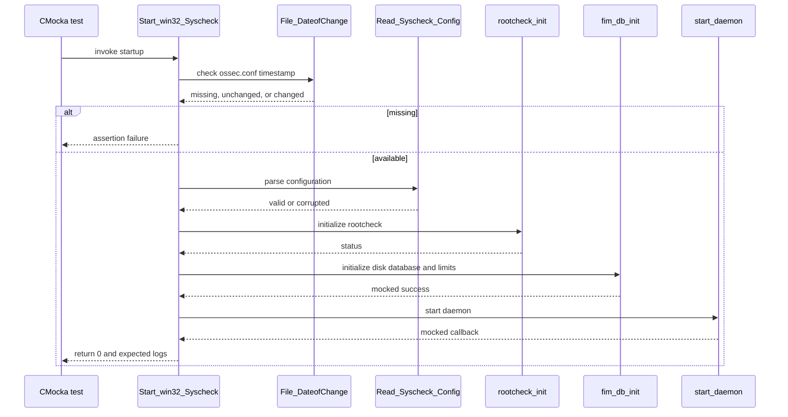

# `test_syscheck` module

`test_syscheck` is the CMocka unit-test suite for the Syscheck/FIM daemon entry points and initialization helpers. It verifies that FIM database initialization, internal-option loading, and—when compiled for a Windows agent—`Start_win32_Syscheck()` respond correctly to configuration, startup, disabled-monitoring, registry, and whodata conditions.

The suite tests orchestration and observable side effects rather than scanning a real filesystem. The production daemon and scan-engine responsibilities are documented in [syscheckd_core](syscheckd_core.md), [syscheckd_core_lifecycle](syscheckd_core_lifecycle.md), and [syscheckd_core_scan_engine](syscheckd_core_scan_engine.md). Related FIM database behavior is covered by [syscheckd_db](syscheckd_db.md) and [wazuh_db_fim_syscollector](wazuh_db_fim_syscollector.md); lower-level shared Syscheck utilities are covered by [test_syscheck_op](test_syscheck_op.md).

## Location and build variants

| Item | Value |
| --- | --- |
| Test source | `src/unit_tests/syscheckd/test_syscheck.c` |
| Framework | CMocka (`cmocka_unit_test`, `cmocka_run_group_tests`) |
| Production surface | `src/syscheckd/src/main.c`, FIM initialization, configuration, and database helpers |
| Global state | `syscheck` and its `syscheck_config`/`fdb_t` state |
| Default build | FIM initialization and `read_internal()` tests |
| `TEST_WINAGENT` build | Adds Windows startup tests and Windows-specific fixtures |

The exact test set is conditional. `TEST_WINAGENT` enables `Start_win32_Syscheck()` and its configuration/startup scenarios; the default build registers only the portable tests in `tests[]`.

## Purpose and scope

The suite protects three boundaries:

1. `fim_initialize()` must initialize the FIM database with the configured file and, on Windows, registry limits.
2. `read_internal(debug_level)` must consume internal configuration values in normal and debug modes.
3. `Start_win32_Syscheck()` must handle missing or corrupted configuration, disabled monitoring, configured directories and registry entries, ignore rules, diff exclusions, and active whodata monitoring.

It does not validate the complete directory traversal algorithm, realtime event loop, audit parser, or database SQL implementation. Those concerns are covered by [syscheckd_core_scan_engine](syscheckd_core_scan_engine.md), [test_run_realtime](test_run_realtime.md), [syscheckd_whodata_audit](syscheckd_whodata_audit.md), [syscheckd_whodata](syscheckd_whodata.md), and [syscheckd_db](syscheckd_db.md).

## Test architecture

The test code calls production functions directly and replaces external collaborators with linker wrappers. This makes failure paths deterministic and lets each test assert both return values and interactions.

## Component responsibilities

### Test runner: `main()`

`main()` registers two collections:

- `tests[]`: `test_fim_initialize`, `test_read_internal`, and `test_read_internal_debug`.
- `tests_win[]`, only under `TEST_WINAGENT`: six Windows startup scenarios.

The portable collection runs with `setup_group` and `teardown_group`. The Windows collection uses `setup_group_win` and `teardown_group_win`, because it owns an `OSList` of monitored directories rather than the portable FIM database fixture.

### Portable fixture lifecycle

`setup_group()` calls `initialize_syscheck_configuration(&syscheck)`. On success it allocates an empty `fdb_t` and stores it in CMocka state. `teardown_group()` releases that `fdb_t`.

`setup_syscheck_config()` creates a `syscheck_config` with a file-entry limit of `100000`; Windows builds also set the registry-entry limit to `100000`. The fixture is used by `test_fim_initialize` and by the corrupted-configuration Windows test. Its teardown releases the configuration object.

### Windows directory fixture

Under `TEST_WINAGENT`, `setup_group_win()` creates `syscheck.directories`. `teardown_group_win()` walks the list, frees each `directory_t` with `free_directory`, and destroys the list. The Windows startup tests insert directories using `fim_create_directory()` and remove them after each scenario.

## Dependency relationships

The included wrapper headers are:

| Wrapper family | Role in this suite |
| --- | --- |
| `debug_op_wrappers.h` | Captures expected informational, warning, error, and assertion-related diagnostics. |
| `fs_op_wrappers.h` | Controls `File_DateofChange()` and internal integer configuration values. |
| `validate_op_wrappers.h` | Supplies deterministic `getDefine_Int` results. |
| `syscheckd/create_db_wrappers.h` | Replaces FIM initialization, directory creation, and startup-adjacent operations. |
| `syscheckd/fim_db_wrappers.h` | Verifies the database initialization mode and limits. |

The Windows branch additionally supplies wrappers for pthread locks and startup functions. These dependencies are mocked at the boundary; the suite does not open `ossec.conf`, create a real FIM database, start a daemon, or initialize native Windows auditing.

## Functional coverage

### FIM database initialization: `test_fim_initialize`

The test receives the fixture-created `syscheck_config`, expects `fim_db_init` to be called with `FIM_DB_DISK`, and invokes `fim_initialize()`.

Expected arguments are:

| Build | File limit | Registry limit |
| --- | ---: | ---: |
| POSIX/default | `100000` | `0` |
| Windows agent | `100000` | `100000` |

This test protects the translation from configuration limits to the FIM database layer. It does not test database table creation or persistence; see [syscheckd_db_core](syscheckd_db_core.md) and [wazuh_db_fim_syscollector](wazuh_db_fim_syscollector.md).

### Internal-option loading: `test_read_internal` and `test_read_internal_debug`

Both tests configure `__wrap_getDefine_Int` to return `1` for every lookup and call `read_internal()` with a different debug level:

- `test_read_internal` uses `debug_level == 0`.
- `test_read_internal_debug` uses `debug_level == 1`.

The tests ensure both entry paths can read internal options without depending on a real configuration file or installation. They intentionally assert the call path rather than individual option values, because option ownership and constants belong to the production Syscheck implementation.

### Windows startup: `Start_win32_Syscheck()`

The Windows tests model the startup sequence shown below.

#### Missing configuration

`test_Start_win32_Syscheck_no_config_file` makes `File_DateofChange("ossec.conf")` return `-1`. It expects the configuration-not-found diagnostic and verifies that startup triggers the expected assertion failure.

#### Corrupted configuration

`test_Start_win32_Syscheck_corrupted_config_file` returns a valid file timestamp but makes `Read_Syscheck_Config` return `-1`. It expects the corruption warning, allows `rootcheck_init` to continue, verifies FIM DB initialization with both limits, and expects `start_daemon()`.

#### Disabled Syscheck

`test_Start_win32_Syscheck_syscheck_disabled_1` and `_2` cover disabled monitoring with no usable directory configuration. Both expect:

- the “no directory provided” message;
- the “File integrity monitoring disabled” message;
- successful rootcheck initialization;
- FIM file-size and disk-quota limit diagnostics;
- a `Started (pid: ...)` message; and
- a call to `start_daemon()`.

The two cases differ in how the global directory and registry state is prepared, protecting both null-state and empty-state handling.

#### Directory, registry, ignore, and no-diff configuration

`test_Start_win32_Syscheck_dirs_and_registry` creates one monitored directory (`c:\\dir1`) and one registry entry (`Entry1`). It also configures:

- a file ignore entry (`dir1`);
- an ignore regular expression (`^regex$`);
- a registry ignore entry (`Entry1`); and
- a no-diff file entry (`Diff`).

The test verifies the corresponding monitoring and ignore messages, the FIM DB initialization call, startup logging, and daemon start. Lock wrapper expectations ensure startup accesses shared Syscheck lists using the expected read/write synchronization boundaries.

#### Active whodata monitoring

`test_Start_win32_Syscheck_whodata_active` creates a directory with `WHODATA_ACTIVE` and an unlimited diff/file-size setting. It verifies that the startup log includes the `whodata` option, the database is initialized, limits are reported, and the daemon starts successfully. Native Windows whodata policy setup is outside this test and is covered by [syscheckd_whodata](syscheckd_whodata.md) and [syscheckd_whodata_audit](syscheckd_whodata_audit.md).

## Observable contracts

The suite establishes the following contracts for maintainers:

- FIM initialization receives platform-appropriate database limits.
- Missing configuration is a fatal startup condition represented by an assertion failure in this test environment.
- A readable but corrupted configuration emits a warning and continues through the remaining startup path.
- Disabled monitoring is reported explicitly rather than silently skipping startup.
- Directory, registry, ignore, regex-ignore, no-diff, and whodata settings are reflected in startup logs.
- Startup must initialize the FIM DB before calling `start_daemon()`.
- Internal configuration reads are deterministic through `getDefine_Int`; tests must not depend on host installation state.
- Windows shared-state access must preserve the expected lock protocol.

## Process and data-flow summary

## Maintenance guidance

When changing Syscheck startup or initialization:

- update the wrapper expectation whenever FIM DB arguments, logging, or startup ordering changes;
- compile both default and `TEST_WINAGENT` variants, since the Windows collection is conditionally absent otherwise;
- preserve fixture ownership of `fdb_t`, `syscheck_config`, and `syscheck.directories`;
- add paired success and failure tests for configuration parsing and database initialization;
- keep native filesystem, Windows registry, and daemon startup calls mocked; integration behavior belongs in the daemon-level tests;
- update links to [syscheckd_core](syscheckd_core.md), [syscheckd_db](syscheckd_db.md), or [test_infrastructure](test_infrastructure.md) when ownership moves.

## Source map

| Concern | Test components | Related documentation |
| --- | --- | --- |
| Test registration and result aggregation | `main`, `CMUnitTest` | [test_infrastructure](test_infrastructure.md) |
| Portable group setup | `setup_group`, `teardown_group` | [syscheckd_core_lifecycle](syscheckd_core_lifecycle.md) |
| Configuration fixture | `setup_syscheck_config`, `teardown_syscheck_config` | [Syscheck configuration](Syscheck_Config.md) |
| FIM DB initialization | `test_fim_initialize` | [syscheckd_db](syscheckd_db.md), [wazuh_db_fim_syscollector](wazuh_db_fim_syscollector.md) |
| Internal options | `test_read_internal`, `test_read_internal_debug` | [framework_core_utils](framework_core_utils.md) |
| Windows startup | `test_Start_win32_Syscheck_*` | [win32_agent_runtime](win32_agent_runtime.md), [syscheckd_core](syscheckd_core.md) |
| Windows whodata semantics | `test_Start_win32_Syscheck_whodata_active` | [syscheckd_whodata](syscheckd_whodata.md), [syscheckd_whodata_audit](syscheckd_whodata_audit.md) |
