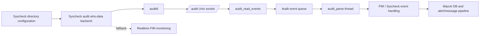
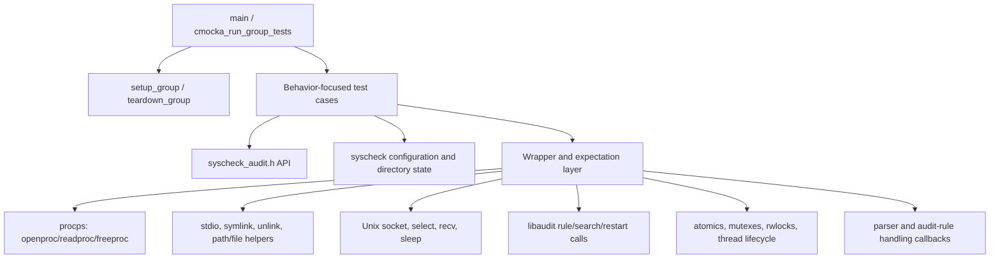
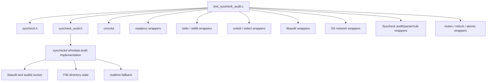
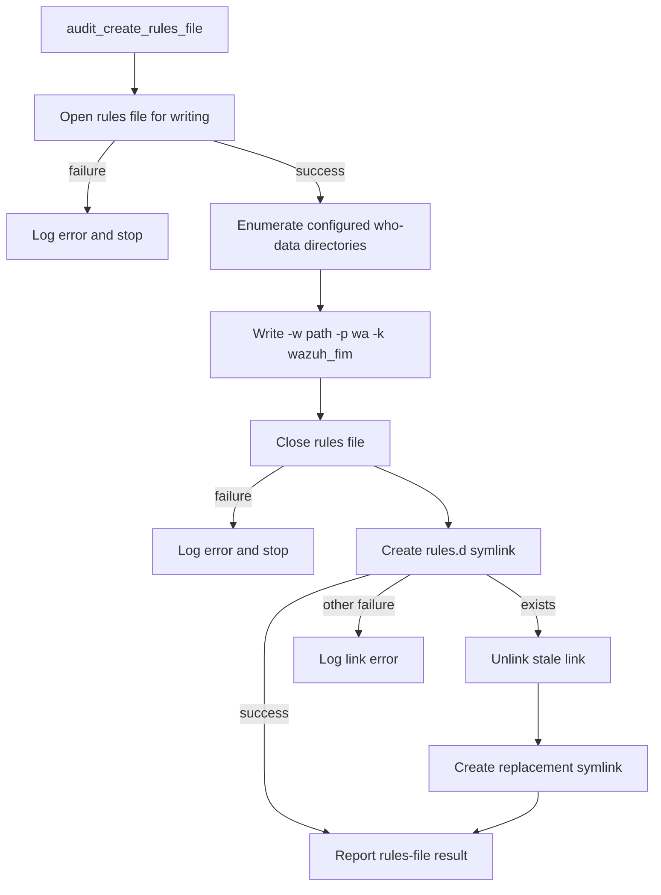
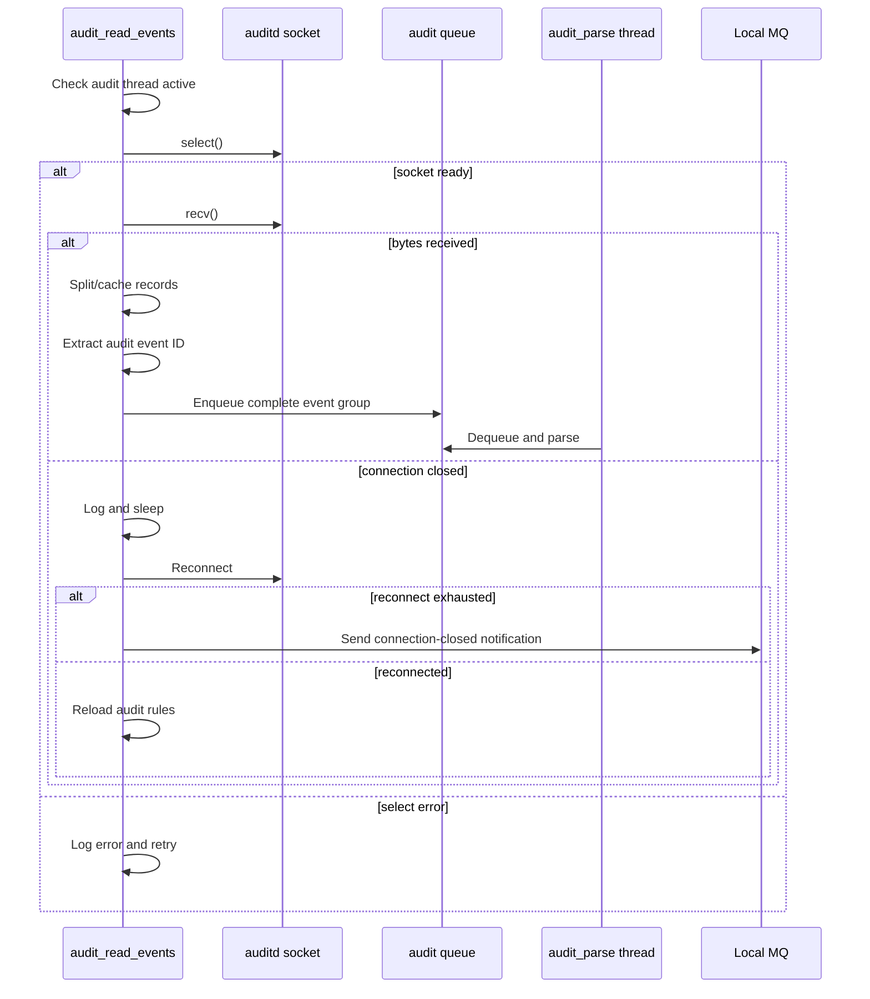
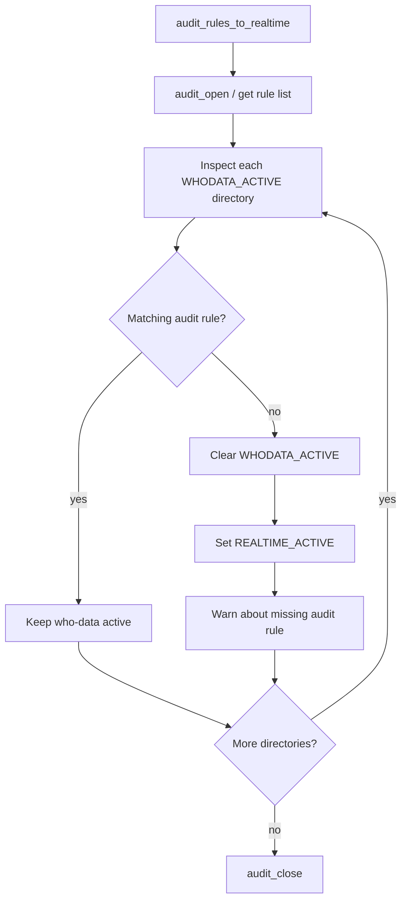

# `test_syscheck_audit`

`test_syscheck_audit` is the CMocka unit-test suite for Wazuh Syscheck’s Linux auditd who-data backend. It validates auditd discovery and socket setup, audit plugin/rules-file management, audit event ingestion and event-ID extraction, parser-thread dispatch, and fallback from who-data monitoring to realtime FIM monitoring.

The suite exercises production code through mocks rather than requiring a running auditd service. Its primary source is [`src/unit_tests/syscheckd/whodata/test_syscheck_audit.c`], while implementation details are owned by [`syscheckd_whodata_audit.md`] and the broader [`syscheckd_whodata.md`].

## Position in the system

The test targets the audit-based portion of Syscheck/FIM. Syscheck monitors configured paths; when who-data is enabled, auditd records the process and user responsible for file activity. The audit backend receives records over auditd’s Unix socket, groups related records by audit event ID, and forwards parsed events to the FIM pipeline.



Related responsibilities are intentionally not repeated here:

- [`syscheckd_core.md`] — daemon lifecycle and central Syscheck orchestration.
- [`syscheckd_core_scan_engine.md`] — scheduled scanning and FIM change detection.
- [`syscheckd_core_realtime.md`] — realtime watch management and event processing.
- [`syscheckd_whodata_audit.md`] — production auditd who-data implementation.
- [`test_audit_parse.md`] — audit record parsing and filtering behavior.
- [`test_audit_rule_handling.md`] — audit rule creation, reload, and removal.
- [`test_audit_healthcheck.md`] — audit health-check behavior.

## Test architecture

The suite is a CMocka executable. `main()` registers tests and runs them with the shared `setup_group()` and `teardown_group()` fixtures. Tests use linker-wrapped functions to isolate filesystem, process, socket, queue, synchronization, logging, crypto, and audit-library behavior.



### Fixture state

`setup_group()` enables `test_mode`, initializes the atomic mutexes used by audit threads, and creates a small audit queue. `teardown_group()` clears and frees the global `syscheck` configuration and disables test mode.

Directory-oriented tests use `setup_syscheck_dir_links()` to create two configured who-data directories (`/test0` and `/test1`) with a custom audit key. The corresponding teardown frees each `directory_t` and destroys the list. `teardown_rules_to_realtime()` additionally frees the realtime directory table used by fallback tests.

The `__wrap_recv()` helper makes socket reads deterministic: CMocka supplies the requested byte count and source buffer, and the wrapper copies only the amount accepted by the test’s simulated `recv()` result.

## Component and dependency map



The suite’s direct production boundaries are:

| Boundary | What is isolated | Representative tests |
| --- | --- | --- |
| Process inspection | Detecting an `auditd` process through procps | `test_check_auditd_enabled_*` |
| Unix socket | Connecting to and reconnecting to the auditd socket | `test_init_auditd_socket_*`, `test_audit_read_events_select_success_recv_error_*` |
| Audit plugin configuration | Audit 2/3 directory detection, checksum validation, file generation, symlink repair, restart policy | `test_set_auditd_config_*` |
| Rules file | Rendering configured directories and installing `audit_rules_wazuh.rules` | `test_audit_create_rules_file_*` |
| Event stream | `select()`, `recv()`, partial lines, missing IDs, oversized events, closed connections | `test_audit_read_events_*` |
| Parser dispatch | Queue lock/unlock and invocation of `audit_parse()` | `test_audit_parse_thread` |
| Rule reconciliation | Disabling who-data and enabling realtime when audit rules are absent | `test_audit_rules_to_realtime*` |

## Functional behavior covered

### auditd discovery and socket initialization

`test_check_auditd_enabled_*` models process-table enumeration. A process named `auditd` returns success; failure to open procps or failure to read a process returns `-1`.

`test_init_auditd_socket_success` verifies that the audit socket helper returns the descriptor from `OS_ConnectUnixDomain`. The failure case verifies error logging and a `-1` result.

### Audit plugin configuration

`set_auditd_config()` supports both common auditd plugin layouts:

- Audit 3: `/etc/audit/plugins.d` and `af_wazuh.conf`.
- Audit 2: `/etc/audisp/plugins.d` and `af_wazuh.conf`.

The tests establish these decisions by mocking `IsDir`, `abspath`, `OS_SHA1_Str`, `OS_SHA1_File`, and `IsSocket`. They cover:

- recognized Audit 2 and Audit 3 installations;
- unsupported or unknown audit layout;
- an existing valid plugin and socket;
- missing audit socket, with and without restart enabled;
- missing or tampered plugin configuration;
- writing or closing the generated configuration failing;
- symlink creation succeeding;
- an existing symlink being removed and recreated;
- unlink or second symlink creation failing;
- restarting auditd after a modified configuration.

The expected return values distinguish successful setup (`0`), a required operator restart (`1`), propagated auditd restart status, and hard failures (`-1`).

### Audit rules file generation

`audit_create_rules_file()` writes one audit watch rule for each configured who-data directory. For the fixture directories, the rendered lines are:

```text
-w /test0 -p wa -k wazuh_fim
-w /test1 -p wa -k wazuh_fim
```

The file is written to `etc/audit_rules_wazuh.rules` and linked to `/etc/audit/rules.d/audit_rules_wazuh.rules`. Tests cover open and close failures, successful writes, an existing link, link replacement, unlink failure, and generic link failure. The success path also verifies the immutable-mode informational message indicating that rules may be loaded on the next reboot.



### Event ID extraction and stream reading

`audit_get_id()` extracts the identifier between `audit(` and `)` from an audit message. The tests verify a normal value (`1571145421.379:659`) and malformed input where either delimiter is absent.

`audit_read_events()` is tested as a select/receive loop. Covered conditions include:

- `select()` failure and retry delay;
- complete multi-record audit messages;
- records without a trailing newline, preserving partial input behavior;
- messages without a usable audit ID and the associated warning;
- oversized cached events being discarded;
- `recv()` returning zero, treating the connection as closed;
- reconnect attempts after a closed socket;
- exhausting reconnect attempts and sending an audit connection-closed message through the local MQ;
- successful reconnection followed by audit-rule reload;
- queue-full behavior when records accumulate faster than parsing.



### Parser thread

`test_audit_parse_thread` initializes the parser-thread active flag, verifies synchronization around the queue, expects one call to `audit_parse()`, and then terminates the thread through the mocked atomic state. Parsing semantics themselves are documented in [`test_audit_parse.md`].

### Fallback from who-data to realtime

`audit_rules_to_realtime()` checks whether every configured who-data directory has a matching audit rule. The tests cover all rules missing and each directory independently missing its rule. A directory without a matching audit rule loses `WHODATA_ACTIVE` and gains `REALTIME_ACTIVE`; directories with valid rules remain unchanged.



## Test execution and isolation

Tests are grouped by behavior but run in one CMocka process:

1. The global fixture initializes shared synchronization and queue state.
2. Individual tests install CMocka expectations for their external calls.
3. Optional per-test fixtures allocate an audit socket placeholder or Syscheck directory list.
4. The production function under test runs against the mocked boundary.
5. CMocka checks return values, log messages, calls, arguments, and state transitions.
6. Per-test teardown frees allocated state; group teardown clears the global Syscheck configuration.

The suite deliberately avoids real filesystem mutation, process enumeration, auditd sockets, libaudit calls, and worker-thread execution. This makes error paths deterministic, including failures that are difficult to reproduce against a live operating system.

## Maintenance guidance

When changing the audit backend, update the corresponding test family together with the implementation:

- socket protocol or retry behavior → `test_audit_read_events_*`;
- auditd plugin paths or file content → `test_set_auditd_config_*`;
- rules-file format or link location → `test_audit_create_rules_file_*`;
- event-ID syntax or record framing → `test_audit_get_id` and stream tests;
- queue/parser lifecycle → `test_audit_parse_thread` and [`test_audit_parse.md`];
- missing-rule fallback → `test_audit_rules_to_realtime*` and [`test_audit_rule_handling.md`].

Pay particular attention to global flags (`restart_audit`, active-thread atomics), queue ownership, and cleanup ordering. The fixture uses shared Syscheck state, so a new test should either use the existing setup/teardown helpers or explicitly restore every global it changes.

## Scope limitations

This module tests the auditd integration boundary; it does not validate the complete FIM scan algorithm, Windows who-data implementation, eBPF backend, or audit message parsing rules in depth. Those concerns belong to [`test_fim_scan.md`], [`test_win_whodata.md`], [`test_syscheck_ebpf.md`], and [`test_audit_parse.md`] where available.
