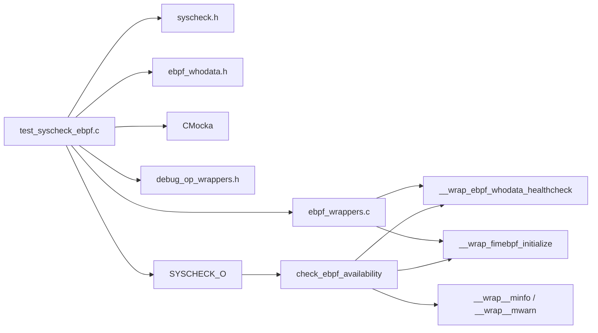
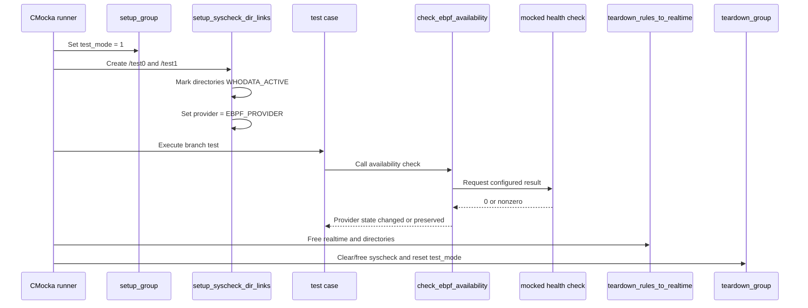
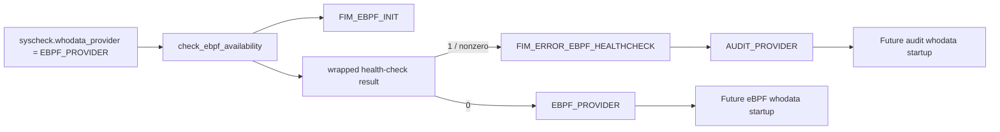
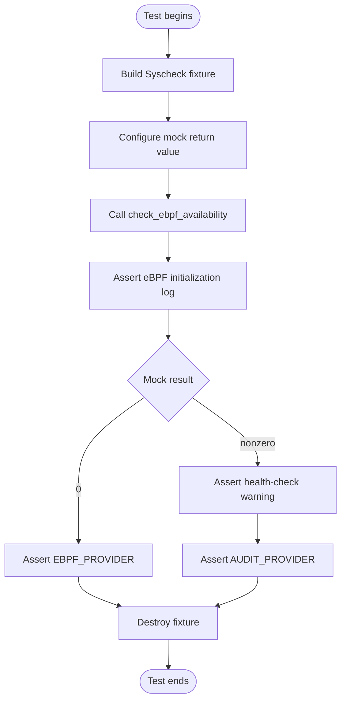

# `test_syscheck_ebpf`

`test_syscheck_ebpf` is a CMocka unit-test module for the Linux Syscheck/File Integrity Monitoring (FIM) eBPF whodata availability decision. It verifies that Syscheck keeps the configured eBPF provider when the health check succeeds and falls back to the audit provider when the check fails.

The test does not exercise kernel probes, libbpf loading, ring-buffer polling, or real filesystem events. Those responsibilities belong to the eBPF implementation documented by the `syscheckd_ebpf` components. This module isolates the Syscheck startup policy at `check_ebpf_availability()`.

Related documentation: [test_syscheck.md](test_syscheck.md), [test_run_check.md](test_run_check.md), [test_syscheck_audit.md](test_syscheck_audit.md), and [syscheckd_ebpf.md](syscheckd_ebpf.md).

## Scope and responsibility

The module covers one startup decision:

1. Initialize the eBPF whodata integration.
2. Invoke `ebpf_whodata_healthcheck()`.
3. Preserve `syscheck.whodata_provider == EBPF_PROVIDER` when the result is `0`.
4. Set `syscheck.whodata_provider = AUDIT_PROVIDER` when the result is nonzero.

At runtime, this decision is reached from the Syscheck daemon startup path when whodata is enabled and eBPF is the selected provider. If the provider is changed to audit, the surrounding daemon startup code subsequently initializes the audit event path. See [test_syscheck_audit.md](test_syscheck_audit.md) for audit-specific behavior.

## Architecture

```mermaid
flowchart TD
    Main[syscheckd main startup] --> Gate{whodata enabled
and provider is eBPF?}
    Gate -->|No| Continue[Continue normal startup]
    Gate -->|Yes| Decision[check_ebpf_availability()]
    Decision --> Init[fimebpf_initialize(...)]
    Init --> Health[ebpf_whodata_healthcheck()]
    Health -->|0| Keep[Keep EBPF_PROVIDER]
    Health -->|nonzero| Fallback[Set AUDIT_PROVIDER]
    Fallback --> Audit[audit_init() path]
```

The production function is implemented in `src/syscheckd/src/syscheck.c`. It logs `FIM_EBPF_INIT`, initializes the eBPF bridge, and interprets the health-check return value. The low-level health check is implemented in `src/syscheckd/src/ebpf/src/ebpf_whodata.cpp`; it validates the kernel/libbpf setup and confirms delivery of a synthetic health-check filesystem event.

## Components

| Component | Role |
|---|---|
| `test_syscheck_ebpf.c::main` | Registers the two CMocka tests and runs them with group setup/teardown. |
| `setup_group` | Enables `test_mode`, allowing the Syscheck test environment to run without daemon side effects. |
| `setup_syscheck_dir_links` | Creates two whodata-enabled directories, allocates `syscheck.directories`, and selects `EBPF_PROVIDER`. |
| `test_check_ebpf_availability_false` | Supplies health-check result `0` and asserts that eBPF remains selected. |
| `test_check_ebpf_availability_true` | Supplies health-check result `1` and asserts fallback to `AUDIT_PROVIDER`; it also expects the warning log. |
| `teardown_rules_to_realtime` | Releases `syscheck.realtime` and directory fixtures. |
| `teardown_syscheck_dir_links` | Frees each `directory_t` and destroys the directory list. |
| `teardown_group` | Clears and frees global Syscheck state, then disables `test_mode`. |
| `__wrap_ebpf_whodata_healthcheck` | CMocka mock returning the test-provided integer. |
| `__wrap_fimebpf_initialize` | Link-time replacement for eBPF initialization; intentionally performs no work. |

## Dependency relationships



The CMake target links `SYSCHECK_O`, the FIM database dependency, and test dependencies. Linker wrapping redirects `fimebpf_initialize`, `ebpf_whodata_healthcheck`, and selected logging functions to test doubles. Consequently, the test is deterministic and does not require a supported kernel, loaded BPF object, dynamic libbpf symbols, or auditd.

## Test fixture lifecycle



`setup_syscheck_dir_links` is shared by both tests. The directory list is important because it gives the global Syscheck configuration a realistic whodata-enabled shape, even though the availability function itself only changes the provider field. The teardown order prevents directory objects from leaking through `OSList`.

## Data flow and branch behavior



The test names use the health-check mock result rather than a conventional success/failure name: `test_check_ebpf_availability_false` returns `0`, while `test_check_ebpf_availability_true` returns `1`. In the production contract, `0` means healthy and nonzero means unavailable or unhealthy.

## Test cases

### `test_check_ebpf_availability_false`

This case configures `__wrap_ebpf_whodata_healthcheck` to return `0` and expects the initialization log. After the call, it requires:

- `syscheck.whodata_provider == EBPF_PROVIDER`.
- The provider is not `AUDIT_PROVIDER`.

This verifies that a healthy eBPF installation does not cause an unnecessary fallback.

### `test_check_ebpf_availability_true`

This case configures the mock to return `1` and expects both the initialization message and `FIM_ERROR_EBPF_HEALTHCHECK`. After the call, it requires:

- `syscheck.whodata_provider != EBPF_PROVIDER`.
- `syscheck.whodata_provider == AUDIT_PROVIDER`.

This verifies the safety fallback used when eBPF cannot be trusted at startup.

## Process flow under test



## Build and execution

The test target is declared in `src/unit_tests/syscheckd/whodata/CMakeLists.txt` as `test_syscheck_ebpf`. Its link flags wrap:

- `fimebpf_initialize`
- `ebpf_whodata_healthcheck`
- selected logging functions used by the assertions

It is registered with CTest under the name `test_syscheck_ebpf`. A normal project build followed by the unit-test target or CTest invocation runs both cases.

## Maintenance notes

- Keep the mocked return-value contract aligned with `check_ebpf_availability()`: zero is healthy; nonzero triggers audit fallback.
- If provider selection gains additional states, extend both fixture initialization and post-call assertions.
- If `check_ebpf_availability()` begins depending on directory contents, queue size, or initialization arguments, update the eBPF wrapper and fixture accordingly.
- Changes to low-level eBPF loading, kernel probes, or health-check event generation belong in the eBPF implementation tests, not this policy-focused unit test.
- Changes to audit startup or whodata event processing should be covered by [test_syscheck_audit.md](test_syscheck_audit.md) and the broader Syscheck tests.

