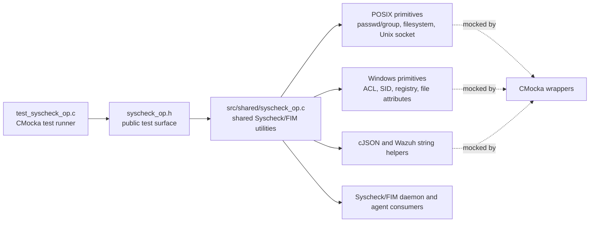
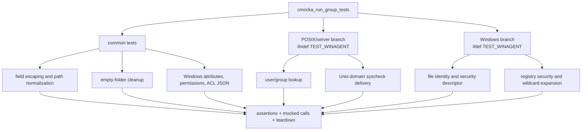
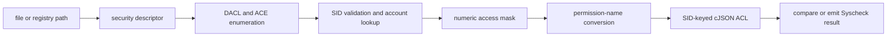
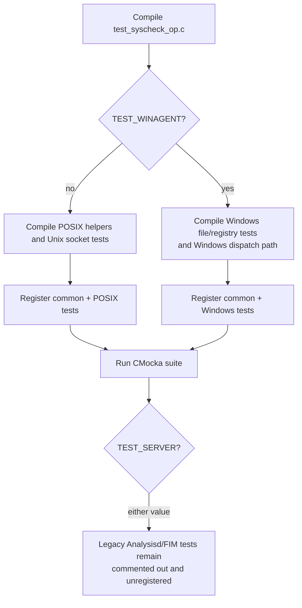
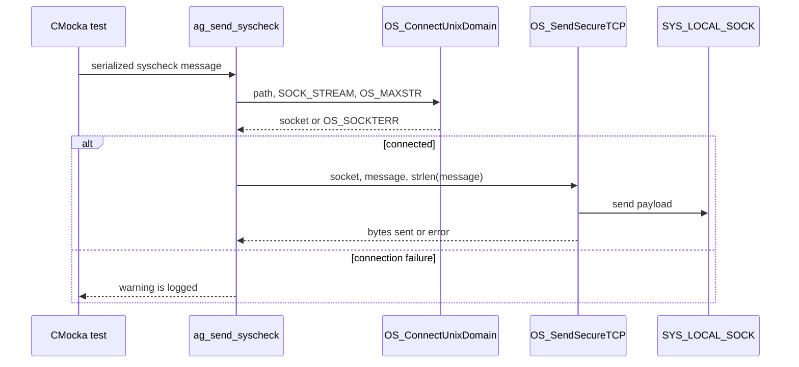
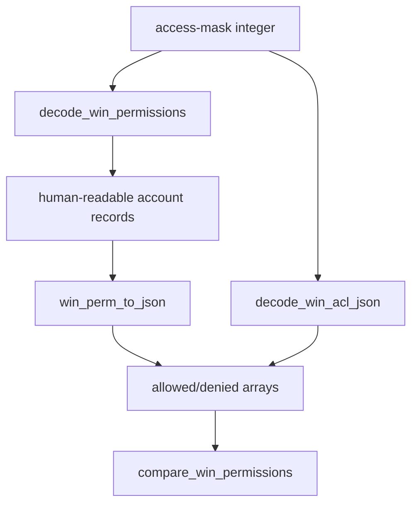

# `test_syscheck_op` module

`test_syscheck_op` is the CMocka unit-test suite for the shared Syscheck/FIM utility layer. It validates portable path and field handling, agent-to-manager message transport, identity lookup, and Windows file/registry security normalization. The suite tests the observable contract of `src/shared/syscheck_op.c` through `src/headers/syscheck_op.h`; it does not exercise a complete FIM scan.

For the owning library, see [shared library](shared_lib.md). For the daemon and scan lifecycle that consume these utilities, see [syscheckd core](syscheckd_core.md).

## Position in the system

The test target belongs to the shared-library unit-test area. The production utility code is reused by the Syscheck/FIM daemon, agent-side code, and platform adapters. Test doubles isolate that utility layer from sockets, cJSON allocation, operating-system identity APIs, and Windows security APIs.

The suite is deliberately lower-level than the daemon tests. It verifies conversions and error behavior at the boundary where platform-native values become Wazuh-compatible strings, JSON, or local-socket messages. End-to-end scan behavior belongs to the Syscheck/FIM tests and documentation rather than this target.

## Test architecture

`main` constructs one `CMUnitTest` array and calls `cmocka_run_group_tests`. Most tests use no global fixture; tests that allocate strings or cJSON trees register teardown functions explicitly. Wrapped functions are configured with `expect_*` and `will_return` calls, allowing the test to assert both return values and interactions such as socket paths, message lengths, and error logs.

### Fixtures and isolation

- String-returning tests use teardown helpers so allocated results are released even when an error path is tested.
- cJSON tests use a cJSON teardown and frequently substitute real cJSON constructors behind wrapped symbols. This makes allocation-failure cases deterministic.
- Syscheck decode/build fixtures hold `sk_sum_t` and serialized message buffers. Their legacy tests are currently inside a block comment and are not registered.
- Windows registry-group fixtures hold the returned group name and SID and are initialized and freed around each test.
- Assertions are part of the contract: several NULL arguments are expected to trigger `expect_assert_failure`, rather than returning an ordinary error.

## Functional coverage

### Portable field, path, and directory behavior

`escape_syscheck_field` escapes separators and punctuation used by the Syscheck wire format. Its inverse, `unescape_syscheck_field`, is compiled for non-Windows-agent builds and converts escaped spaces, exclamation marks, and colons back to their literal values. NULL and empty inputs are covered.

`normalize_path` normalizes separators for the target platform. Tests distinguish Windows-style conversion from the Linux-directory case and verify the NULL assertion. `remove_empty_folders` walks upward through trailing directory components, removes empty folders recursively, stops at a non-empty directory, and reports removal failures. The tests cover relative and absolute paths, trailing separators, NULL input, non-empty directories, and mocked `rmdir_ex` failures.

### POSIX identity and transport behavior

On non-Windows-agent builds, `get_user` and `get_group` wrap reentrant passwd/group lookups. Tests cover successful resolution, missing records, system errors, buffer-size decisions, and the corresponding debug messages.

`ag_send_syscheck` sends a serialized message to `SYS_LOCAL_SOCK` using a Unix stream socket and `OS_SendSecureTCP`. The suite verifies the exact socket type, maximum message size, message length, connection failure, and send failure. On Windows-agent builds the same logical operation is represented by `syscom_dispatch`, which is tested through the alternate branch.

### Windows attribute and permission representations

`decode_win_attributes` maps Windows `FILE_ATTRIBUTE_*` flags to a stable comma-separated list. Tests cover no flags, a subset, and all supported flags, including ordering.

`decode_win_permissions` parses compact records of the form `|account,access-type,bitmask`. It emits human-readable account records and expands the bitmask into permission names. Coverage includes allowed and denied access, multiple accounts, zero and incomplete masks, malformed delimiters, missing account/type, output-buffer limits, and empty input.

`attrs_to_json` converts comma-separated attributes into a cJSON array. `decode_win_acl_json` converts numeric `allowed` and `denied` fields in SID-keyed ACL objects into arrays of permission names while preserving unrelated fields. `compare_win_permissions` compares ACL objects, including NULL-vs-NULL equality, missing allowed/denied arrays, different SID sets, and differing permission arrays.

`win_perm_to_json` performs the reverse presentation conversion: text such as `account (allowed): read_data|...` becomes an array of account objects with `name`, `allowed`, and/or `denied` arrays. Repeated records for one account are merged. Malformed fragments are skipped with diagnostics; allocation, split, and fragmented-input behavior is explicitly tested.

### Windows file and registry security

The Windows-only tests model the native security pipeline:

`get_file_user` obtains a file handle, extracts the owner SID, converts it to text, and resolves the account/domain. `w_get_account_info` covers the two-pass `LookupAccountSid` buffer protocol. `w_get_file_permissions` covers security-descriptor sizing, DACL retrieval, ACL information, ACE iteration, invalid ACE types, and partial failures. `w_get_file_attrs` and `w_directory_exists` cover successful attributes, inaccessible paths, non-directories, and NULL paths.

Registry tests cover owner/group lookup, key security retrieval, DACL and ACE enumeration, modification time, root-hive selection, subkey extraction, wildcard state, listing child keys, and wildcard expansion. They verify that native failures are returned or logged without leaking partially constructed JSON.

## Build-time process flow

The same source is compiled into different test targets. The common tests are always registered; platform-specific tests are selected by preprocessor symbols.

The `TEST_SERVER` section documents an older serialized FIM-summary test set (`sk_decode_sum`, `sk_decode_extradata`, `sk_fill_event`, `sk_build_sum`, and `sk_sum_clean`). Although guarded by `TEST_SERVER`, the tests are currently disabled by a block comment and should not be counted as active coverage.

## Representative data flows

### POSIX message delivery

### Windows ACL normalization

These are related representations, not duplicate implementations: compact masks are expanded for logs and API-facing JSON, while the comparison helper checks the normalized ACL structure used by change detection.

## Error-handling contract

The tests establish several distinct failure styles:

- Invalid programmer inputs may assert, especially NULL output/input pointers.
- Operating-system lookup or transport failures return NULL, an error code, or an empty result according to the helper being tested, and emit a Wazuh diagnostic.
- cJSON allocation failures must not produce a partially trusted result; tests expect NULL or an unchanged object.
- Windows ACL enumeration tolerates an individual bad ACE in some paths, preserving the surrounding ACL and logging the failed item.
- Bounded string builders return failure when the destination is too small and must not write beyond the supplied buffer.

Maintainers changing `syscheck_op.c` should update the corresponding success, malformed-input, allocation-failure, and platform-branch tests together. Changes to the daemon scan lifecycle should be covered in [syscheckd core](syscheckd_core.md), while generic shared-library behavior belongs in [shared library](shared_lib.md).

## Source map

| Concern | Primary source | Test area |
|---|---|---|
| Field escaping and path cleanup | `src/shared/syscheck_op.c` | escaping, normalization, empty-folder tests |
| POSIX identity and delivery | `src/shared/syscheck_op.c` | `get_user`, `get_group`, `ag_send_syscheck` |
| Windows attributes and ACL conversion | `src/shared/syscheck_op.c` | attribute, mask, JSON, comparison tests |
| Windows file and registry security | `src/shared/syscheck_op.c` | `TEST_WINAGENT` tests |
| Public declarations and constants | `src/headers/syscheck_op.h` | all groups |
| Scan and event consumers | `src/syscheckd/` | linked daemon documentation |

