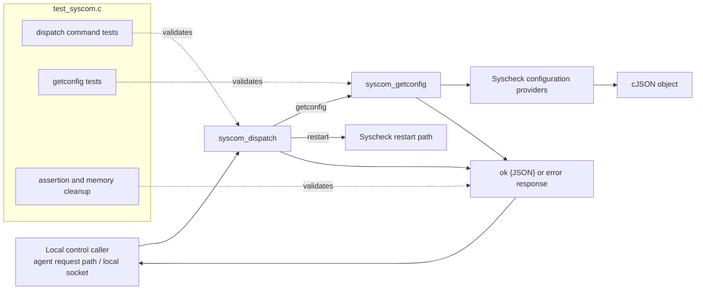
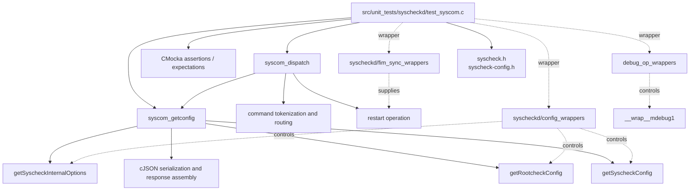
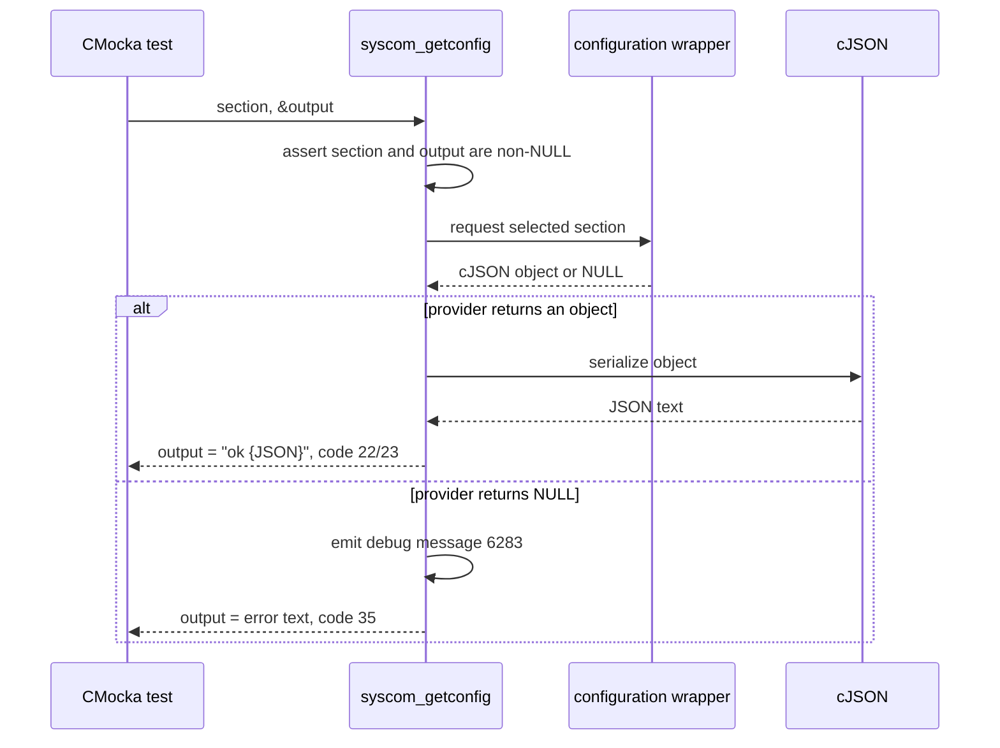
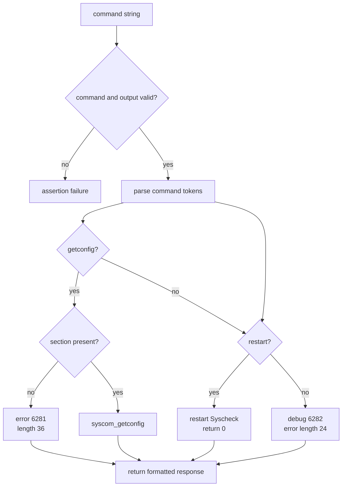

# `test_syscom` module

`test_syscom` is the CMocka unit-test suite for the Syscheck daemon's local command interface. It verifies the two public command handlers exposed by `syscheckd`: `syscom_dispatch`, which parses a textual control command, and `syscom_getconfig`, which returns selected Syscheck configuration as a text response.

The suite is intentionally narrow: it does not test filesystem scanning, realtime watches, whodata, or FIM persistence. Those responsibilities are covered by the broader [Syscheck/FIM tests](test_syscheck.md) and [run-check tests](test_run_check.md). The tests exercise the boundary between a local control request and the Syscheck configuration/restart operations.

## Scope and system position

The module belongs to `Unit_Tests_-_Syscheck_FIM` and targets the native `syscheckd` component. In the running system, a control request can arrive through the agent's local request path and be routed to `syscom_dispatch`; on Unix, the same logical operation is associated with the Syscheck local socket, while Windows can invoke the dispatcher in-process. See [client agent native requests](client_agent_native_requests.md) for the shared routing model and [Syscheck FIM documentation](test_syscheck.md) for the daemon's scanning responsibilities.

## Components

### `syscom_dispatch`

`syscom_dispatch(command, output)` is the command parser and router. Based on the tested contract, it recognizes both daemon-prefixed and manager-style forms:

| Input | Meaning | Expected result |
| --- | --- | --- |
| `syscheck getconfig <section>` | Agent/Syscheck form of configuration lookup | Delegates to `syscom_getconfig` |
| `getconfig <section>` | Manager-compatible configuration lookup | Delegates to `syscom_getconfig` |
| `syscheck restart` | Restart Syscheck | Return code `0` |
| `restart` | Manager-compatible restart | Return code `0` |
| `syscheck getconfig` | Missing section argument | `err SYSCOM getconfig needs arguments`, length `36` |
| Any other command, such as `invalid` | Unsupported command | `err Unrecognized command`, length `24` |

The dispatcher writes a newly allocated response string through `output`. Tests that receive a string register `delete_string` as a CMocka teardown, establishing that ownership of the returned buffer belongs to the caller after dispatch returns.

### `syscom_getconfig`

`syscom_getconfig(section, output)` accepts one of the supported section names and serializes the configuration object returned by the corresponding provider:

| Section | Provider mocked by the suite | Success code | Success response shape |
| --- | --- | ---: | --- |
| `syscheck` | `getSyscheckConfig` | `22` | `ok {"test":"syscheck"}` |
| `rootcheck` | `getRootcheckConfig` | `23` | `ok {"test":"rootcheck"}` |
| `internal` | `getSyscheckInternalOptions` | `22` | `ok {"test":"internal"}` |

If a provider returns `NULL`, the function logs a debug diagnostic and returns the common failure response `err Could not get requested section` with length `35`. A `NULL` section or `NULL` output is rejected through an assertion.

The JSON values in the tests are synthetic cJSON objects. This isolates response formatting from the actual configuration parser, which is documented with the configuration components [Syscheck configuration](Syscheck_Config.md), [Rootcheck configuration](Rootcheck_Config.md), and [Global configuration](Global_Config_Core.md).

## Architecture and dependencies

The test file includes the Syscheck public header and configuration definitions, then replaces selected dependencies with wrappers. The wrapper layer supplies deterministic cJSON values, `NULL` failures, and expected logging calls.

Important dependency boundaries are:

- `syscheck.h` provides the Syscheck command/configuration API under test.
- `syscheck-config.h` supplies configuration types and declarations used by the daemon implementation.
- `config_wrappers.h` mocks the three configuration providers.
- `fim_sync_wrappers.h` isolates restart/synchronization-related behavior.
- `debug_op_wrappers.h` captures expected debug messages without writing real daemon logs.
- CMocka owns test registration, assertions, expected calls, and teardown execution.

## Data and response flow

### Configuration lookup

The response is a compact, space-delimited protocol value: a status token (`ok` or `err`) followed by a human-readable payload. The JSON object is embedded directly in the success response rather than returned as a separately framed value.

### Command dispatch

The two accepted command spellings are deliberately covered separately: `syscheck ...` represents the agent-facing form, while the unprefixed form represents manager-compatible dispatch. The tests therefore protect compatibility in addition to basic parsing.

## Test organization

The suite registers 16 CMocka tests in `main`:

| Area | Tests | What is verified |
| --- | ---: | --- |
| Dispatch: configuration | 3 | Agent and manager command forms, plus missing arguments |
| Dispatch: restart | 2 | Agent and manager restart forms return success |
| Dispatch: invalid input | 3 | Unknown command and both null-pointer preconditions |
| Direct configuration: `syscheck` | 2 | Serialization success and provider failure |
| Direct configuration: `rootcheck` | 2 | Serialization success and provider failure |
| Direct configuration: `internal` | 2 | Serialization success and provider failure |
| Direct configuration: preconditions | 2 | Null section and null output assertions |
| **Total** | **16** | |

### Dispatch tests

- `test_syscom_dispatch_getconfig_agent` verifies `syscheck getconfig args`. The section is intentionally unsupported in the fixture, so the test checks the standard error response and debug message.
- `test_syscom_dispatch_getconfig_manager` repeats the same behavior for `getconfig args`, ensuring the unprefixed route is equivalent.
- `test_syscom_dispatch_getconfig_noargs` verifies the distinct missing-argument diagnostic `(6281)`.
- `test_syscom_dispatch_restart_agent` and `test_syscom_dispatch_restart_manager` verify both restart spellings and only assert the success return code; no response buffer is consumed.
- `test_syscom_dispatch_getconfig_unrecognized` verifies `(6282)`, the exact error text, and return length for an unknown command.
- `test_syscom_dispatch_null_command` and `test_syscom_dispatch_null_output` verify defensive assertions using `expect_assert_failure`.

### Direct configuration tests

For each supported section, the success test creates a cJSON object, configures the wrapper with `will_return`, invokes `syscom_getconfig`, and checks the exact serialized response and byte count. The failure test configures the wrapper to return `NULL`, expects debug message `(6283)`, and checks the common error response.

### Memory lifecycle

`delete_string` is used as teardown for tests that assign `output` to CMocka state. It casts the state back to `char *`, calls `free`, and returns zero. This covers both success and error response buffers and prevents the test suite from hiding ownership regressions behind leaks.

## Error and diagnostic contract

The suite treats response text, return lengths, and diagnostics as part of the observable interface:

| Condition | Diagnostic | Response | Length |
| --- | --- | --- | ---: |
| Missing `getconfig` section | `(6281): SYSCOM getconfig needs arguments.` | `err SYSCOM getconfig needs arguments` | `36` |
| Configuration provider failure | `(6283): At SYSCOM getconfig: Could not get '<section>' section.` | `err Could not get requested section` | `35` |
| Unknown command | `(6282): SYSCOM Unrecognized command '<command>'` | `err Unrecognized command` | `24` |
| Valid restart | none asserted | no error response required | `0` |
| Invalid pointer precondition | C assertion | no normal response | process/test assertion path |

Exact strings matter because callers may use the returned length when writing to a socket or another IPC channel. The tests consequently assert both the NUL-terminated string content and the reported length.

## Execution and maintenance notes

The test binary is a CMocka group containing no global setup or teardown callbacks. Each test is independent and supplies its own wrapper expectations. Tests that allocate an output buffer use `cmocka_unit_test_teardown`; tests that only verify a return code use the simpler registration macro.

When extending the command protocol:

1. Add a dispatch test for each accepted spelling.
2. Assert the response text and returned size, not only the status.
3. Add failure coverage for missing arguments and provider failures.
4. Add or update wrapper expectations for any new configuration provider or diagnostic.
5. Use a teardown whenever the command handler returns allocated output.

For changes that affect actual Syscheck behavior, pair this suite with the broader [Syscheck daemon tests](test_syscheck.md), [run-check tests](test_run_check.md), [Syscheck operation tests](test_syscheck_op.md), and configuration documentation rather than expanding `test_syscom` beyond the control interface.

## Source references

- Test implementation: `src/unit_tests/syscheckd/test_syscom.c`
- Syscheck public API: `src/syscheckd/include/syscheck.h`
- Syscheck configuration definitions: `src/config/syscheck-config.h`
- Test wrappers: `src/unit_tests/wrappers/wazuh/syscheckd/config_wrappers.h`, `fim_sync_wrappers.h`, and `src/unit_tests/wrappers/wazuh/shared/debug_op_wrappers.h`
- Related module documentation: [test_syscheck.md](test_syscheck.md), [test_run_check.md](test_run_check.md), [test_syscheck_op.md](test_syscheck_op.md), and [client_agent_native_requests.md](client_agent_native_requests.md)
