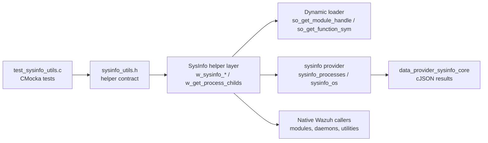
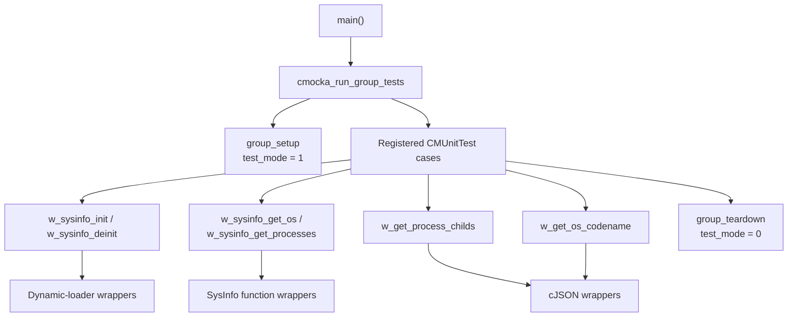
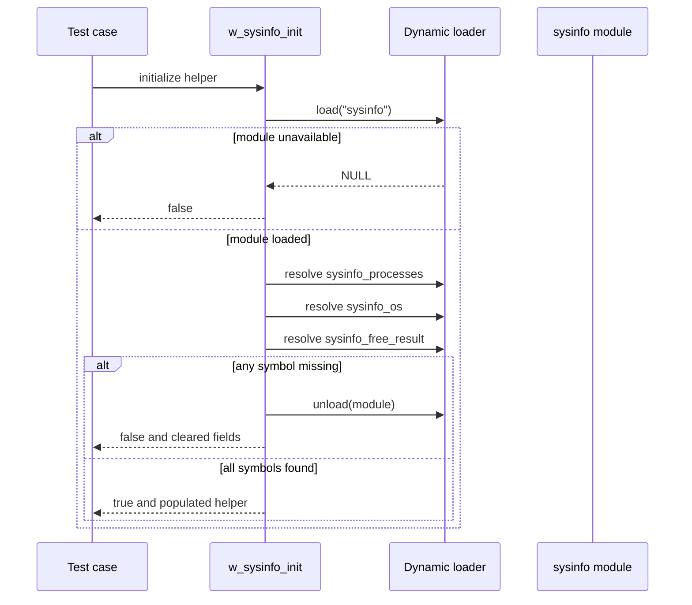
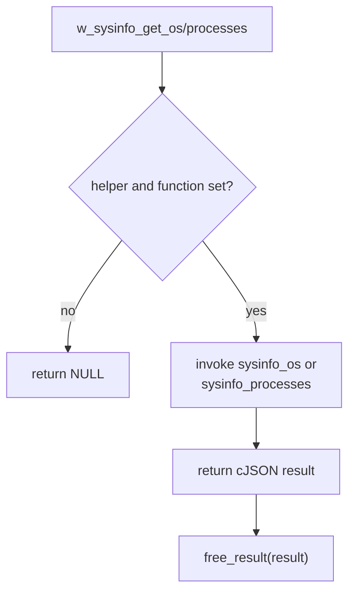
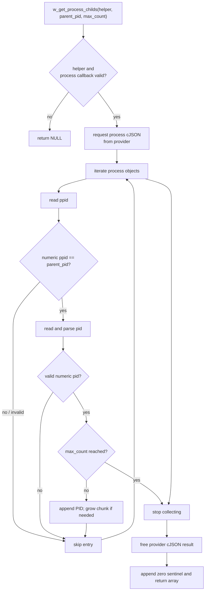
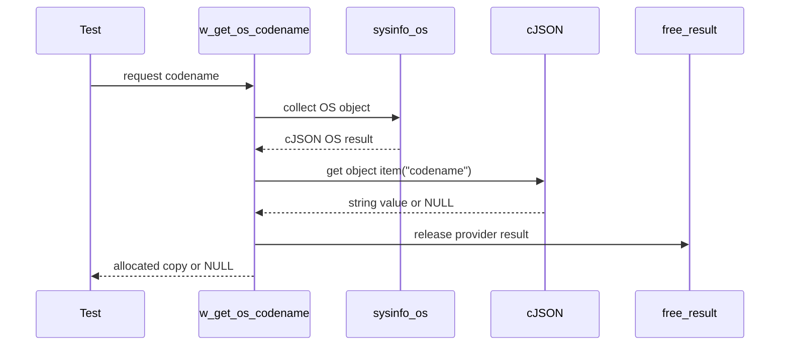
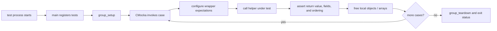
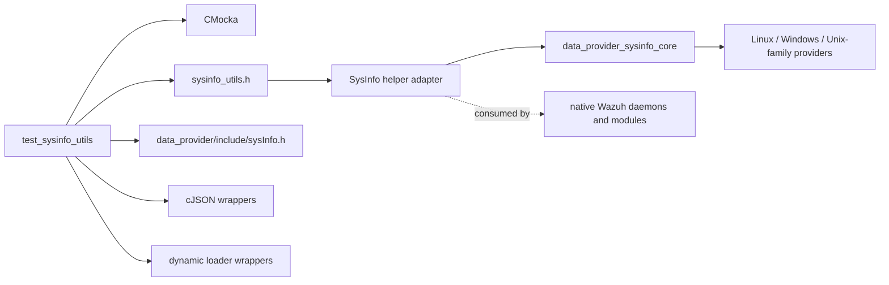

# `test_sysinfo_utils`

`test_sysinfo_utils` is the CMocka unit-test module for Wazuh's C-side system-information helper layer. It validates the lifecycle of `w_sysinfo_helpers_t`, forwarding of OS and process queries through dynamically loaded SysInfo entry points, extraction of an OS codename, and conversion of a SysInfo process list into a terminated array of child PIDs.

The test suite is located at `src/unit_tests/shared/test_sysinfo_utils.c`. The production contract is declared by `src/headers/sysinfo_utils.h`; the dynamically loaded provider is the C API exposed by the [data provider SysInfo core](data_provider_sysinfo_core.md). This document focuses on the test boundary and its expected behavior. Platform-specific inventory collection is documented in [data_provider_sysinfo_core.md](data_provider_sysinfo_core.md) and its linked submodules.

## Purpose and system position

The helper layer is an adapter between native C Wazuh code and the C++/C SysInfo provider. It loads the `sysinfo` module, resolves a small set of function symbols, invokes those symbols, and releases returned cJSON data through the provider's free callback. The tests isolate this adapter from the host operating system by mocking dynamic loading, cJSON access, and provider functions.

The module is a focused unit-test leaf under the shared-library tests. It is adjacent to broader system-information consumers such as the [syscollector module](syscollector_module.md), but it does not test inventory persistence, synchronization, or indexing.

## Architecture

### Components

| Component | Responsibility |
|---|---|
| `CMUnitTest` | CMocka descriptors used to register each test case. |
| `group_setup` / `group_teardown` | Enable and restore Wazuh test mode around the suite. |
| `main` | Registers the test table and returns the CMocka group status. |
| `w_sysinfo_helpers_t` | Holds the loaded module handle, resolved process/OS functions, and provider result-free function. |
| `w_sysinfo_init` | Loads `sysinfo` and resolves `sysinfo_processes`, `sysinfo_os`, and `sysinfo_free_result`. |
| `w_sysinfo_deinit` | Releases the loaded module and clears helper fields. |
| `w_sysinfo_get_processes` / `w_sysinfo_get_os` | Validate helper state and forward requests to the provider. |
| `w_get_process_childs` | Filters provider process JSON by `ppid`, parses child `pid` values, and returns a zero-terminated PID array. |
| `w_get_os_codename` | Retrieves the provider OS object, reads its `codename` field, and returns a copied string. |
| Dynamic-loader and cJSON wrappers | Replace host-dependent behavior with scripted CMocka expectations. |

## Initialization and teardown contract

`w_sysinfo_init` is tested as an all-or-nothing symbol-resolution pipeline. It first requests the module named `sysinfo`, then resolves the process function, OS function, and result-free function. If any stage fails, the module is unloaded and the helper structure is cleared; the function returns `false`. A fully resolved helper retains the mocked handles and returns `true`.

`w_sysinfo_deinit(NULL)` is rejected. For a valid helper, deinitialization calls the unload seam, clears `module`, `processes`, `os`, and `free_result`, and reports success. The tests therefore establish that callers can safely inspect a deinitialized structure and that partial initialization does not leave a usable-looking handle behind.

## Provider forwarding

`w_sysinfo_get_processes` and `w_sysinfo_get_os` are deliberately thin wrappers. They return `NULL` when the helper itself or the requested function pointer is missing. On success, they return the cJSON pointer and status supplied by the mocked provider call. Ownership remains with the provider result lifecycle; callers are expected to use `free_result` when finished.

The provider's platform collection behavior—OS parsing, process enumeration, and cJSON conversion—is covered by [data_provider_sysinfo_core.md](data_provider_sysinfo_core.md). This suite only verifies the adapter's null checks and forwarding behavior.

## Child-process extraction

`w_get_process_childs` obtains one process-list cJSON document, walks its entries, and selects entries whose numeric `ppid` equals the requested parent PID. For each match it reads a numeric or string PID, converts it to `pid_t`, appends it to a dynamically grown array, and terminates the array with `0`.

The tests cover both invalid-input and allocation paths:

- null helper or null process callback returns `NULL`;
- empty process lists and no matching children return no result;
- missing or non-numeric `ppid`/`pid` fields are rejected;
- a mismatched parent is skipped;
- the first matching child allocates a new chunk;
- subsequent matches reuse the allocated chunk;
- the result is zero-terminated;
- `max_count` limits collection, while the zero sentinel remains present;
- a process list larger than the initial allocation exercises chunk growth.

The supplied test cases also exercise a process list with more children than the normal initial chunk, confirming that the returned array preserves encounter order (`100`, `200`, …) and remains terminated. The exact chunk size is an implementation detail and should not be treated as API behavior.

## OS codename extraction

`w_get_os_codename` calls the OS provider, looks up the `codename` property, obtains its string value, and returns an allocated copy. A null helper, provider failure, absent property, or absent string value produces `NULL`. The successful case returns the expected copied string and the test frees it explicitly.

## Test organization and execution

The suite has no per-test fixture state beyond local cJSON objects and helper structures. CMocka `expect_*` and `will_return` calls script every external result. Provider cJSON objects are released with the provider free callback inside the production path, while test-created cJSON objects and returned PID arrays are cleaned up by the test.

## Dependencies and boundaries

This module does not validate platform-specific system calls, package databases, network enumeration, database persistence, or inventory indexing. Follow the references below for those responsibilities:

- [data_provider_sysinfo_core.md](data_provider_sysinfo_core.md) — SysInfo C API bridge and platform implementations.
- [shared_lib.md](shared_lib.md) — common native shared-library infrastructure.
- [syscollector_module.md](syscollector_module.md) — inventory collection and synchronization consumers.
- [data_provider_testtool.md](data_provider_testtool.md) — manual SysInfo provider test tooling, where available.

## Coverage limits

The tests provide strong branch coverage for helper validation, loader failure cleanup, cJSON field failures, PID parsing, result ownership, and bounded collection. They do not establish:

- correctness of the real dynamic library path or ABI on each supported platform;
- correctness of the provider's process or OS data collection;
- behavior with malformed top-level JSON, duplicate fields, or embedded NUL strings;
- allocator failure during every possible reallocation;
- PID overflow beyond the platform's `pid_t` range;
- concurrency or repeated initialization from multiple threads.

Those concerns require provider-level, platform integration, or system tests in addition to this deterministic unit suite.
