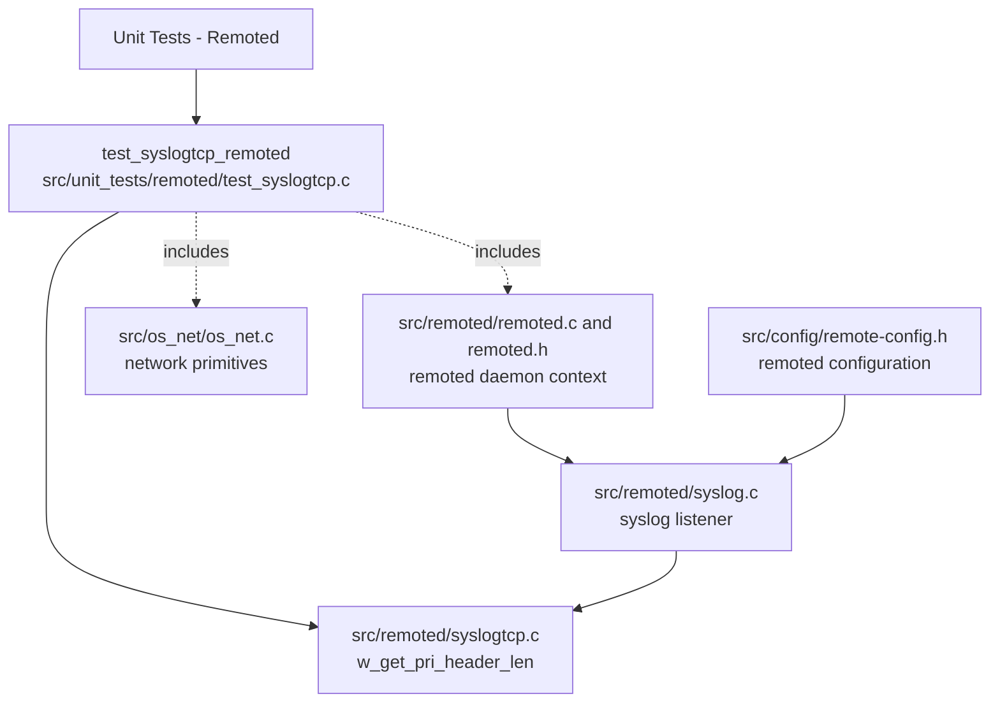
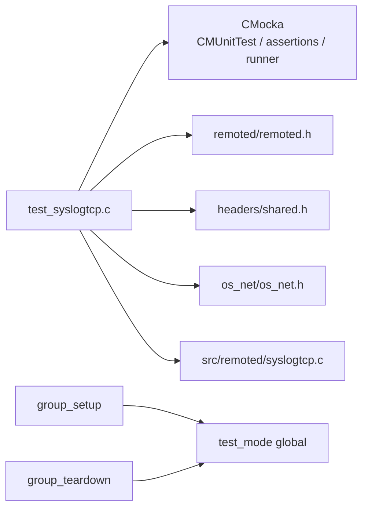
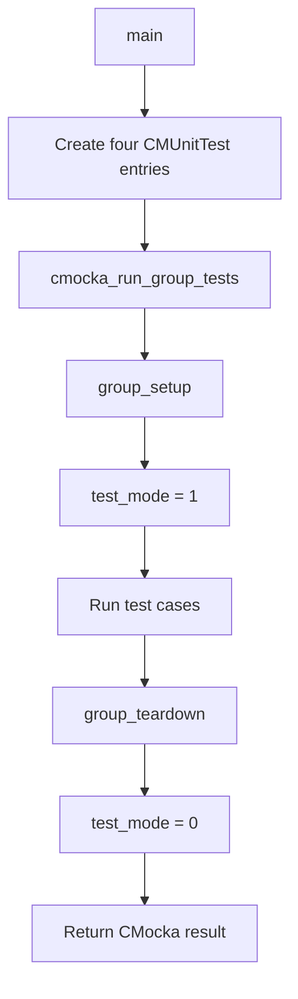
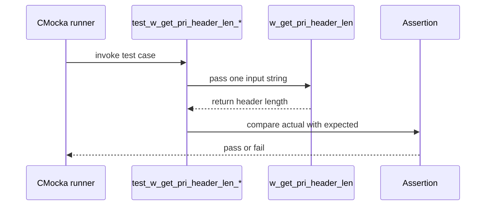
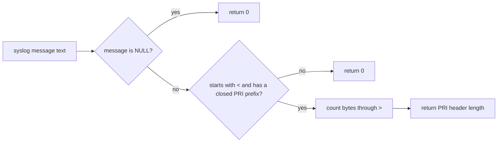
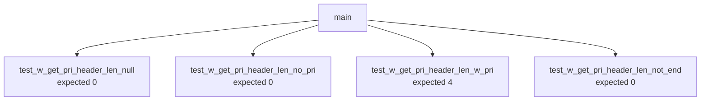
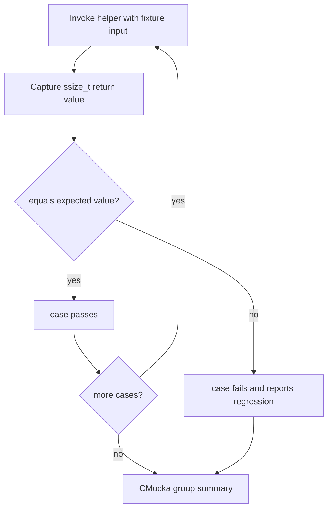

# `test_syslogtcp_remoted`

## Introduction

`test_syslogtcp_remoted` is the CMocka unit-test module for the syslog-over-TCP parsing helper used by Wazuh `remoted`. Its scope is deliberately narrow: it verifies `w_get_pri_header_len`, the function that identifies the length of a leading syslog PRI header such as `<18>`.

The test does not open a socket or exercise the complete remoted event loop. It validates the helper’s boundary behavior in isolation, using four representative inputs: a null pointer, a message without a PRI header, a valid PRI header, and an unterminated header-like prefix.

## Module position

The test is part of the **Unit Tests – Remoted** collection and targets the `remoted_syslog_listener` component of the native remoted daemon.

### Related documentation

| Reference | Relationship |
|---|---|
| [remoted_syslog_listener.md](remoted_syslog_listener.md) | Production syslog listener responsibilities and its place in remoted networking. |
| [remoted.md](remoted.md) | Overall native `remoted` daemon lifecycle and subsystem relationships. |
| [Remote_Config.md](Remote_Config.md) | Configuration structures that control remote listeners and protocols. |
| [shared_lib_networking.md](shared_lib_networking.md) | Shared networking primitives used by remoted. |
| [test_infrastructure.md](test_infrastructure.md) | Common unit-test conventions, wrappers, and CMocka infrastructure. |

## Architecture and dependencies

The test has one production behavior under test and two header-level dependencies. `remoted.h` and `shared.h` provide shared declarations/types, while `os_net.h` supplies the networking context included by the test translation unit. The test itself does not define or mock network operations because `w_get_pri_header_len` is a pure string-inspection helper.

The dependency boundary is intentionally small:

| Dependency | Role in this module |
|---|---|
| `cmocka.h` | Supplies `CMUnitTest`, `cmocka_unit_test`, group execution, and assertions. |
| `../../remoted/remoted.h` | Remoted declarations and shared daemon context included by the test. |
| `../../headers/shared.h` | Common Wazuh declarations included by the test. |
| `../../os_net/os_net.h` | Shared network declarations included by the test. |
| `w_get_pri_header_len` | Production helper declared locally with a forward declaration and linked from `syslogtcp.c`. |

## Test harness lifecycle

The group setup and teardown functions manage only the global test-mode flag. They do not allocate sockets, initialize a listener, or construct a syslog message object.

`state` is accepted by the CMocka callbacks but is not used. This makes the fixture suitable for a stateless helper test while preserving the standard group-test interface used throughout the remoted unit-test suite.

## Component interaction

Each test calls the same helper directly and compares its return value with an expected header length. No wrapper calls or external side effects are expected.

The production helper is expected to inspect only the beginning of the supplied string:

1. A null pointer is invalid and produces length `0`.
2. A normal message without `<...>` at offset zero produces length `0`.
3. A complete PRI header includes the opening bracket, numeric value, and closing bracket. For `<18>test log`, the length is `4`.
4. A prefix without the closing bracket is not a valid PRI header. For `<18 test log`, the length is `0`.

## Data flow and parsing contract

The helper’s output is a length, not the parsed priority value. The tests therefore establish a framing/offset contract for callers: a caller can use a nonzero result to identify the number of leading bytes occupied by the PRI header, while a zero result means that no complete leading PRI header was recognized.

The test does not specify whether a broader syslog parser subsequently validates the numeric range or parses the remaining message body. Those responsibilities belong to the production syslog listener and are covered by [remoted_syslog_listener.md](remoted_syslog_listener.md).

## Test inventory

| Test | Input | Expected return | Contract |
|---|---|---:|---|
| `test_w_get_pri_header_len_null` | `NULL` | `0` | Safely handles a null message pointer. |
| `test_w_get_pri_header_len_no_pri` | `test log` | `0` | Does not treat ordinary text as a PRI header. |
| `test_w_get_pri_header_len_w_pri` | `<18>test log` | `4` | Recognizes and counts a complete leading PRI header. |
| `test_w_get_pri_header_len_not_end` | `<18 test log` | `0` | Rejects an incomplete/unterminated PRI prefix. |

## Process flow and failure interpretation

A failure usually indicates one of these regressions:

- null input is dereferenced or classified as a valid header;
- ordinary messages are incorrectly treated as PRI-prefixed;
- the returned length excludes or includes the wrong delimiter bytes;
- an incomplete `<PRI`-style prefix is accepted;
- the test registration or group runner no longer executes all four cases.

## Maintenance guidance

When changing `w_get_pri_header_len`, preserve the distinction between a complete header and a header-like prefix. Add focused cases here if the accepted grammar changes, such as additional delimiter rules or numeric-format rules. Keep broader socket, framing, listener, and configuration behavior in the production documentation referenced above rather than duplicating it in this unit-test document.

The test is self-contained and should not require a live TCP endpoint, an initialized remoted daemon, an agent, or external configuration. Its only mutable shared state is `test_mode`, which must be restored by `group_teardown` so later remoted tests are not affected.
