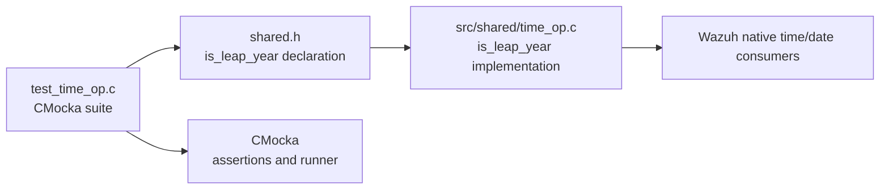
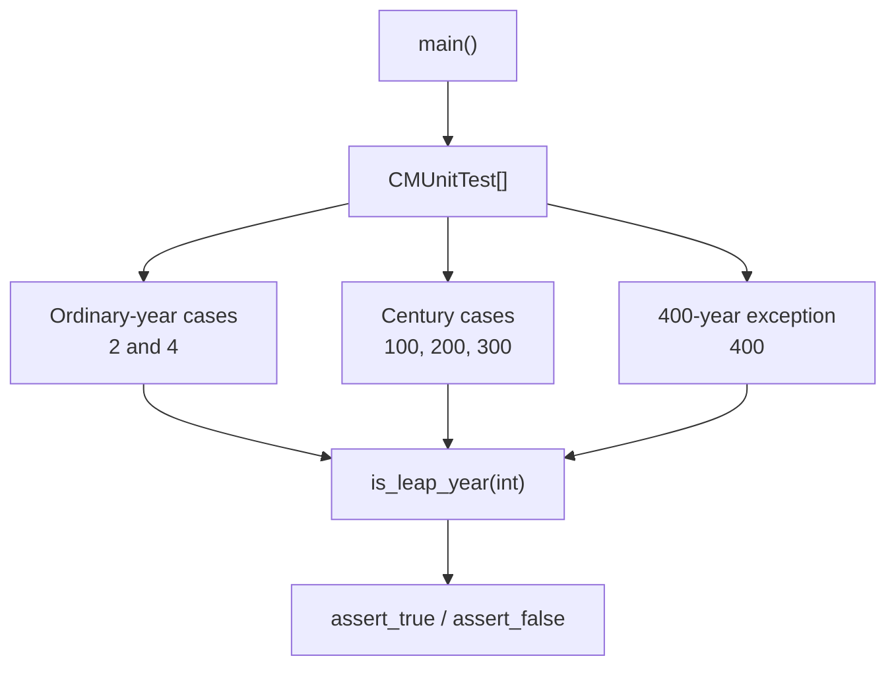
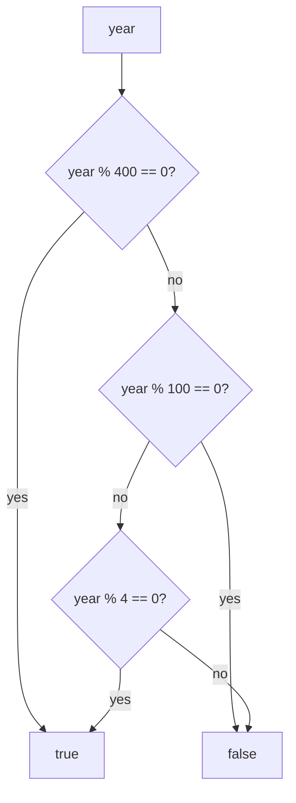
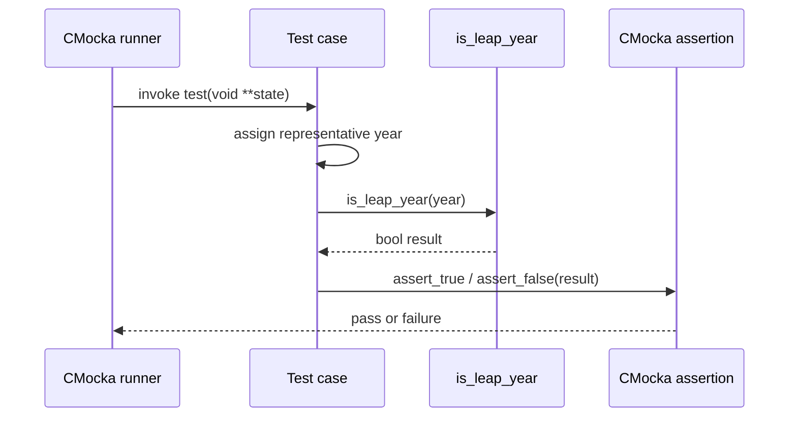
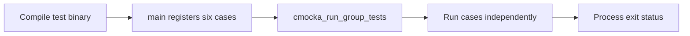
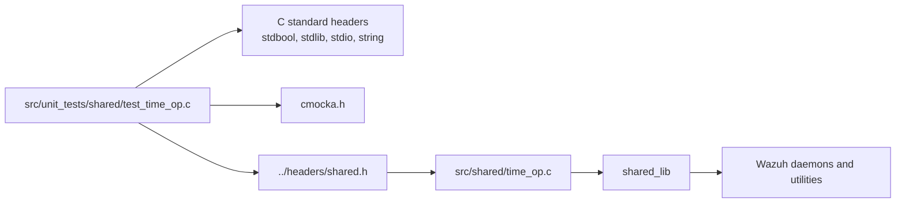

# `test_time_op`

`test_time_op` is a CMocka unit-test module for the shared Wazuh time utility `is_leap_year`. It verifies the Gregorian leap-year rule with ordinary years, non-leap century years, and the 400-year exception.

The test source is [`src/unit_tests/shared/test_time_op.c`](src/unit_tests/shared/test_time_op.c). The production helper is exposed through `shared.h` and belongs to the shared native library, documented broadly in [shared_lib.md](shared_lib.md).

## Purpose and system position

The module protects a small foundational predicate used by date and time logic. It is a verification artifact rather than a runtime service: `main` registers six independent tests and returns the result of `cmocka_run_group_tests`.



## Architecture

| Component | Responsibility |
|---|---|
| `CMUnitTest` | CMocka test-descriptor type used to build the registration table. |
| `main` | Creates the test array, registers each case, runs the group, and returns its status. |
| `test_is_leap_year_two` | Confirms a non-divisible-by-four year is not a leap year. |
| `test_is_leap_year_four` | Confirms a normal year divisible by four is a leap year. |
| `test_is_leap_year_one_hundred` | Confirms century year 100 is not a leap year. |
| `test_is_leap_year_two_hundred` | Confirms century year 200 is not a leap year. |
| `test_is_leap_year_three_hundred` | Confirms century year 300 is not a leap year. |
| `test_is_leap_year_four_hundred` | Confirms century year 400 is a leap year. |



## Functional contract

The tests define the expected predicate as:

```text
is_leap_year(year) ==
    (year divisible by 400) OR
    (year divisible by 4 AND not divisible by 100)
```

Equivalent decision flow:



The selected inputs provide decision coverage for each important branch:

| Input | Expected result | Rule exercised |
|---:|:---:|---|
| `2` | `false` | Not divisible by four. |
| `4` | `true` | Divisible by four and not a century. |
| `100` | `false` | Divisible by 100 but not 400. |
| `200` | `false` | Same century-year exclusion. |
| `300` | `false` | Same century-year exclusion. |
| `400` | `true` | Divisible by 400; century exception applies. |

## Test execution flow

Each test ignores the CMocka state pointer, calls the production predicate with a stack-local integer, and immediately asserts the Boolean result. There are no setup or teardown callbacks, mocks, files, sockets, heap allocations, or shared mutable fixtures.



The registration order in `main` is:

1. `test_is_leap_year_two`
2. `test_is_leap_year_four`
3. `test_is_leap_year_one_hundred`
4. `test_is_leap_year_two_hundred`
5. `test_is_leap_year_three_hundred`
6. `test_is_leap_year_four_hundred`



## Dependencies and relationships



The suite tests only the public behavior of `is_leap_year`; it does not duplicate the implementation or validate higher-level date formatting. For the shared library’s ownership, common headers, and consumers, see [shared_lib.md](shared_lib.md). Related time-dependent tests and utilities should be read through their own module documentation rather than folded into this narrow predicate suite.

## Coverage boundaries

This module does not test:

- date parsing, formatting, time zones, or daylight-saving behavior;
- negative years, integer overflow, or the full integer domain;
- performance, thread safety, or reentrancy;
- integration with schedulers, databases, or network protocols;
- the internal implementation mechanism used by `is_leap_year`.

Its value is precise branch-level regression protection for leap-year classification, especially the commonly mishandled century rule.
