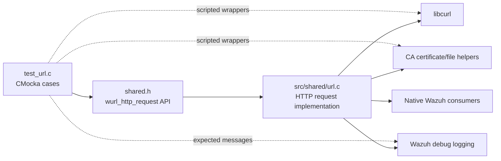
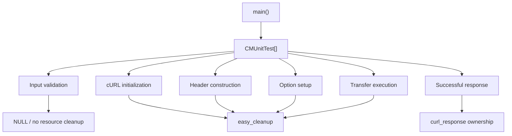
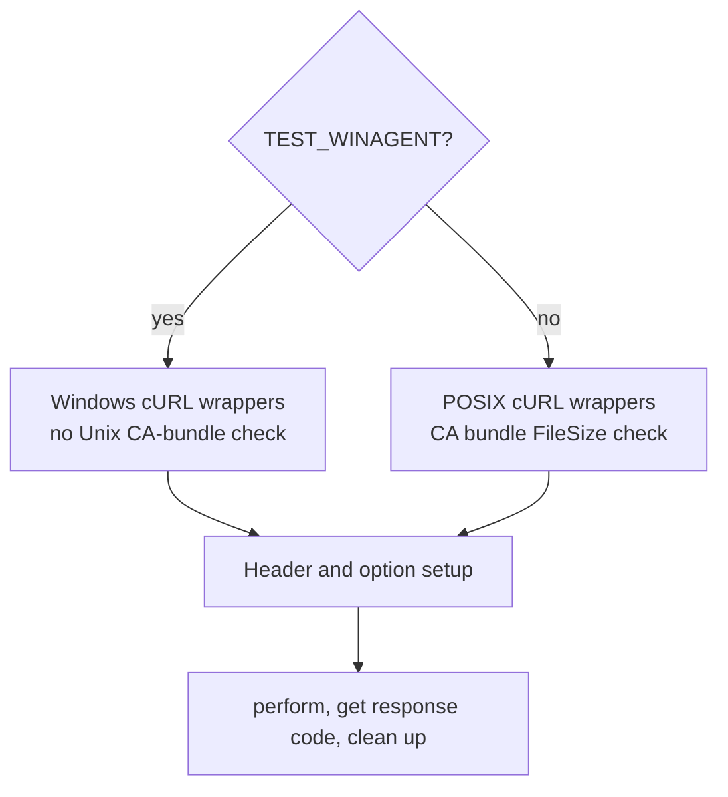
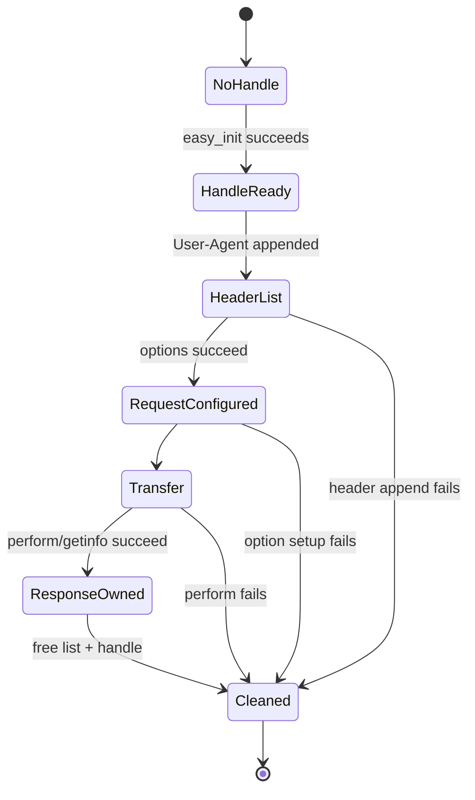

# `test_url`

`test_url` is the CMocka unit-test module for Wazuh’s shared HTTP/HTTPS request helper, `wurl_http_request`. It verifies request setup, custom headers, optional authentication and payloads, timeout handling, cURL failures, response-code retrieval, cleanup, and diagnostic logging.

The test source is [`src/unit_tests/shared/test_url.c`](src/unit_tests/shared/test_url.c). The production boundary is `src/shared/url.c`, which belongs to the shared networking layer described in [shared_lib_networking.md](shared_lib_networking.md) and [shared_lib.md](shared_lib.md).

## Purpose and system position

This module tests a low-level outbound HTTP client used by native Wazuh components. It is not an HTTP server and does not perform live network traffic: all cURL, filesystem, and logging interactions are scripted through wrappers. Higher-level consumers—such as cloud integrations, content downloaders, and update workflows—depend on the shared URL contract rather than on this test module directly.



## Architecture

| Component | Responsibility |
|---|---|
| `group_setup` | Enables `test_mode` so shared wrappers use deterministic test behavior. |
| `group_teardown` | Restores `test_mode` to its normal value. |
| `main` | Registers nine CMocka cases and runs them as one group. |
| `wurl_http_request` | Function under test; builds a cURL request, executes it, collects headers/body, and returns `curl_response` or `NULL`. |
| cURL wrappers | Script `easy_init`, `easy_setopt`, `slist_append`, `easy_perform`, `easy_getinfo`, and cleanup calls. |
| File wrapper | On non-Windows paths, models the CA bundle check for `/etc/ssl/certs/ca-certificates.crt`. |
| Logging wrapper | Verifies the expected debug message for each rejected or failed path. |

The `curl_slist` component represents the linked list used for the default User-Agent and caller-supplied headers. It is an external cURL type, not a Wazuh-owned service component.



## Request lifecycle

The tested request pipeline is:

1. Reject an undefined URL and log `url not defined`.
2. Initialize a cURL handle; reject initialization failure.
3. Configure the custom request method and, on non-Windows builds, validate the CA certificate file.
4. Append the default `User-Agent: curl/7.58.0` header.
5. Append each caller-provided header, if present.
6. Configure the write callback, response storage, HTTP headers, header callback, header storage, and URL.
7. Optionally configure `CURLOPT_USERPWD`, `CURLOPT_POSTFIELDS`, and `CURLOPT_TIMEOUT`.
8. Call `curl_easy_perform`.
9. On success, obtain `CURLINFO_RESPONSE_CODE` and return an allocated `curl_response`.
10. On every initialized-handle failure path, free the header list and clean up the cURL handle.

```mermaid
sequenceDiagram
    participant T as Test case
    participant U as wurl_http_request
    participant C as cURL wrappers
    participant F as File wrapper
    participant L as Debug logger

    T->>U: URL, headers, payload, timeout, credentials
    U->>C: easy_init()
    alt URL missing or init fails
        U->>L: log diagnostic
        U-->>T: NULL
    else initialized
        U->>C: easy_setopt(CUSTOMREQUEST)
        U->>F: FileSize(CA bundle) [non-Windows]
        U->>C: slist_append(User-Agent)
        U->>C: slist_append(custom headers)
        U->>C: easy_setopt(write/header/URL options)
        opt payload, credentials, timeout
        U->>C: easy_perform()
        alt transfer failure
            U->>L: log cURL error string
            U->>C: slist_free_all + easy_cleanup
            U-->>T: NULL
        else success
            U->>C: easy_getinfo(RESPONSE_CODE)
            U->>C: slist_free_all + easy_cleanup
            U-->>T: curl_response*
        end
    end
```

## Test coverage

### Input and initialization failures

- `test_wurl_http_request_url_null` passes a null URL and expects no response plus `url not defined`.
- `test_wurl_http_request_init_failure` scripts a null cURL handle and expects `curl initialization failure`.

These cases establish that invalid input is rejected before response allocation and that a failed initialization does not attempt invalid handle cleanup.

### Header construction

- `test_wurl_http_request_headers_list_null` verifies failure when the default User-Agent cannot be appended.
- `test_wurl_http_request_headers_tmp_null` verifies failure when a caller header cannot be appended after the default header was created.

The latter also verifies that the partially built list is released. The test uses `Content-Type: application/x-www-form-urlencoded` as a representative custom header.

### Transfer failures

The three `curl_easy_perform` failure cases use the same request pipeline with different inputs:

| Test | Additional input | Scripted result | Expected diagnostic |
|---|---|---|---|
| `test_wurl_http_request_curl_easy_perform_fail_with_headers` | Custom content-type header | cURL code `9` | `curl_easy_perform() failed: Access denied to remote resource` |
| `test_wurl_http_request_curl_easy_perform_fail_with_payload` | `payload test` | cURL code `9` | Same transfer failure diagnostic |
| `test_wurl_http_request_curl_easy_perform_fail_timeout` | Payload and timeout `1L` | cURL code `28` | `curl_easy_perform() failed: Timeout was reached` |

All three assert that the header list and cURL handle are cleaned up and that the function returns `NULL`.

### Option setup failure

`test_wurl_http_request_curl_easy_setopt_fail` makes `CURLOPT_POSTFIELDS` return cURL code `49`. It expects `Parameter setup error at CURL`, verifies cleanup, and confirms that setup failure is reported before transfer execution.

### Successful request

`test_wurl_http_request_success` supplies:

- URL `http://test.com`;
- payload `payload test`;
- credentials `wazuh:wazuh`;
- a zero timeout;
- no custom caller header.

The test expects successful setup, `CURLOPT_USERPWD`, `CURLOPT_POSTFIELDS`, `curl_easy_perform == CURLE_OK`, and successful `CURLINFO_RESPONSE_CODE` retrieval. It then frees `response->header`, `response->body`, and the response itself, documenting the caller-owned response contract.

## Platform-specific behavior

Every cURL expectation has a `TEST_WINAGENT` branch. Windows tests use the Windows wrapper names and do not perform the Unix CA-bundle `FileSize` expectation. Non-Windows tests additionally expect `/etc/ssl/certs/ca-certificates.crt` to be checked before request execution.



## Resource ownership and cleanup

The implementation owns temporary cURL resources during the request. The test suite verifies that initialized handles are paired with `curl_easy_cleanup` and that constructed header lists are paired with `curl_slist_free_all`, including partial-header failures. A successful call transfers the returned `curl_response` to the caller; the test explicitly frees its header, body, and enclosing structure.



## Dependencies and references

The test depends on CMocka, `shared.h`, common test wrappers, and the Wazuh file-operation wrapper. The production helper depends on libcurl, Wazuh logging, response-buffer callbacks, and platform-specific certificate handling.

For broader context, see:

- [shared_lib_networking.md](shared_lib_networking.md) — shared URL, socket, IPC, and networking responsibilities.
- [shared_lib.md](shared_lib.md) — shared-library architecture and its native-daemon consumers.
- [test_url.md](test_url.md) — this module’s focused test contract.

## Coverage boundaries

This suite does not validate DNS, TLS negotiation, actual remote servers, redirect policy, body-size truncation behavior, malformed server responses, concurrent requests, or real certificate contents. Those concerns require integration tests around the shared URL helper and its higher-level consumers.
